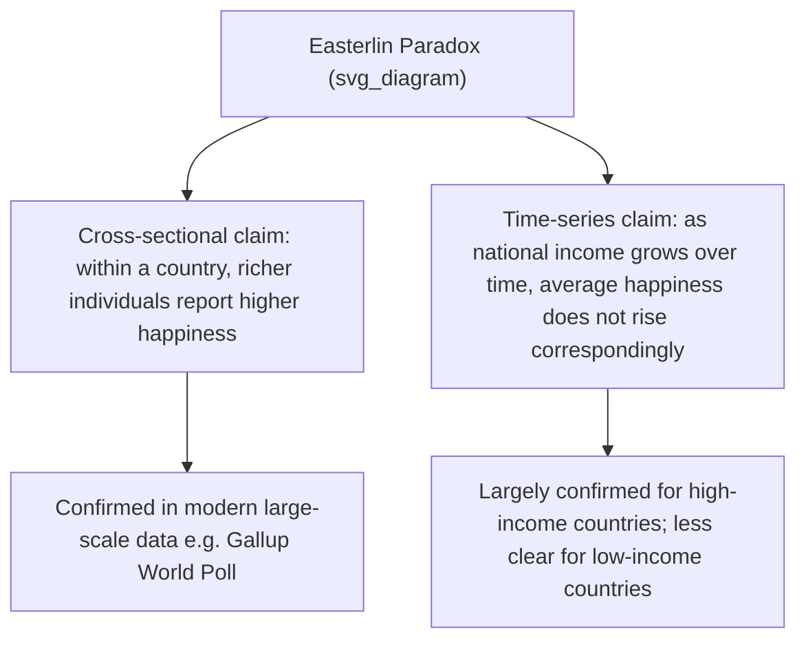
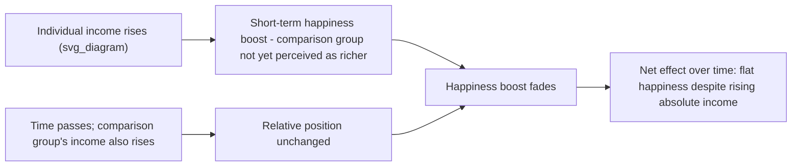

## The Economics of Happiness and the Easterlin Paradox

### Definition and Core Concept

**Happiness economics** is the interdisciplinary field studying the relationship between economic variables (income, employment, inequality, economic growth) and subjective wellbeing, using survey-based happiness and life-satisfaction data as an outcome variable alongside or instead of traditional economic indicators like GDP. The **Easterlin paradox**, its foundational and most debated finding, was formulated in 1974 by Richard Easterlin, then a professor of economics at the University of Pennsylvania and the first economist to study happiness data.

### The Core Paradox Stated

**Key Points:**

- The Easterlin paradox states that, at a point in time, happiness varies directly with income both among and within nations; but over time, happiness does not trend upward as income continues to grow — while people on higher incomes are typically happier than their lower-income counterparts at a given point in time, higher incomes don't produce greater happiness over time.
- More formally, the paradox holds that at a point in time happiness varies directly with income, both among and within nations, but over time the long-term growth rates of happiness and income are not significantly related.
- It is the contradiction between the point-of-time (cross-sectional) findings and the time-series (longitudinal, national-growth) findings that constitutes the paradox: there is a correlation at a fixed point in time, but no corresponding trend across time as national income grows.

### The Two Component Claims

This paradox is best understood as two distinct empirical claims that must both hold for the paradox to exist:

**Key Points:**

1. **Within-country, cross-sectional claim:** Richer individuals within a given country report higher levels of subjective wellbeing than poorer individuals in that same country, at a given point in time. Contemporary large-scale analysis confirms this component: globally, doubling an individual's household income is estimated to be associated with an increase of approximately 0.3 points on a 0-10 life-satisfaction scale within each country, an effect that is similar in rich and poor countries and observed across genders and income levels.
2. **Time-series, national-growth claim:** As countries become wealthier over time (rising GDP per capita), their populations do not necessarily report correspondingly higher average happiness. This aligns with long-term observations in affluent nations like the United States, West Germany, and Australia, where substantial economic growth has not been accompanied by a corresponding rise in average happiness.

### Illustration of the Paradox Structure

### The Leading Explanation: Social Comparison and Relative Income

**Key Points:**

- The principal reason proposed for the contradiction is social comparison: at a point in time, those with higher income are happier because they are comparing their income to that of others who are less fortunate, and conversely for those with lower income.
- Over time, however, as incomes rise throughout the population, the incomes of one's comparison group rise along with one's own income, vitiating the otherwise positive effect of own-income growth on happiness — everyone's relative position stays roughly the same even as absolute income rises for all.
- One explanation frames this in perceptual terms: one's happiness depends on a comparison between their income and their perceptions of the average standard of living. If everyone's income increases, the increased income gives a short boost to happiness because people do not immediately realize that the average standard of living has also risen; sometime later, they realize the average has risen too, and the happiness boost from their own increased income disappears.
- Richard Easterlin argued that life satisfaction does rise with average incomes but only up to a point, after which the marginal gain in happiness declines (diminishing returns); one of his conclusions was that a person's relative income, not merely absolute income, weighs heavily on people's minds.
- Related theoretical work models this using relative income terms in the utility function, where income is evaluated relative to others (social comparison) or relative to oneself in the past (habituation/adaptation) — both mechanisms independently predicting the observed pattern of positive cross-sectional but flat longitudinal income-happiness relationships.

### The Fallacy of Composition

**Key Points:**

- The paradox is frequently framed as a classic example of the logical fallacy of composition: in all societies, more money for the individual typically means more individual happiness; however, raising the incomes of all does not increase the happiness of all — what is true for the individual is not true for society as a whole.
- This framing has direct policy implications: Easterlin has argued that his analysis of time trends in subjective wellbeing undermines the view that a focus on economic growth is in society's best interest, motivating arguments (e.g., from economist Richard Layard) for explicit government policy aimed at maximizing subjective wellbeing rather than GDP growth alone — directly connecting to the national wellbeing frameworks (GNH, OECD Better Life Index, New Zealand's Wellbeing Budget) covered earlier in this chapter.

### Illustration of the Relative-Income Mechanism

### Empirical Debates and Critiques

**Key Points:**

- The paradox has been contested by several researchers. In a widely cited 2008 paper, Betsey Stevenson and Justin Wolfers argued that richer countries are in fact happier and that wealthier people are, on average, happier — challenging the strength or universality of Easterlin's original time-series finding.
- More recent large-scale analysis (drawing on Gallup World Poll data from over 150 countries between 2009 and 2019) has sought to reconcile these positions by distinguishing between country income levels: for lower-income countries, higher national income is associated with greater average happiness even after accounting for social factors, with income appearing to play a more direct role in enhancing happiness as well as an indirect role via improved social wellbeing.
- For high-income countries, however, this same analysis found no significant correlation between a country's income growth and growth in happiness during the 2009-2019 period, largely supporting the original Easterlin time-series claim specifically for affluent nations.
- Separately, evidence on long-run effects of exogenous wealth shocks (e.g., research on long-run effects of lottery wealth on psychological wellbeing) provides a quasi-experimental angle on this debate, since lottery winnings function similarly to the natural-experiment designs discussed under distinguishing correlational from causal claims earlier in this course, offering causal-inference leverage that purely observational income-happiness correlations cannot provide.
- The overall contemporary synthesis suggests the relationship between money and happiness is multifaceted: while individual income can contribute meaningfully to personal wellbeing, at the national level — especially in affluent societies — factors beyond mere economic expansion are vital for fostering a happier population, whereas for lower-income nations, economic growth continues to be an indispensable tool for improving human wellbeing.

### Methodological Considerations

**Key Points:**

- This literature relies heavily on large cross-national survey datasets (e.g., the Gallup World Poll, asking respondents to evaluate their wellbeing on a 0-10 scale where 10 represents the best possible life), making it directly subject to the cross-cultural measurement-validity concerns discussed earlier in this chapter — self-reported life-satisfaction scales may not have equivalent psychometric properties or comparison-group referents across highly divergent cultural and economic contexts.
- The paradox's core empirical structure — a positive cross-sectional relationship coexisting with a flat or weak longitudinal relationship — is itself a useful illustration of the correlational-versus-causal and temporal-precedence concepts covered earlier in this course: point-in-time correlation and long-run trend correlation are logically and statistically distinct claims, and evidence for one does not by itself establish or refute the other.
- Critics of the paradox have sometimes mistakenly presented the positive cross-sectional relation, or short-term time fluctuations, as contradicting the long-term time-series finding, when in fact both patterns are argued to be compatible components of the same underlying relative-income mechanism — illustrating the importance of precisely specifying which empirical claim (cross-sectional vs. longitudinal) a given piece of evidence actually bears on.

### Policy Relevance

**Key Points:**

- The Easterlin paradox provides one of the central economic-empirical justifications for the national wellbeing frameworks discussed earlier in this chapter (Gross National Happiness, OECD Better Life Index, New Zealand's Wellbeing Budget): if GDP growth alone does not reliably raise average national happiness, this motivates measuring and targeting wellbeing directly rather than relying on economic growth as a proxy for societal flourishing.
- There is now widespread agreement in applied policy economics that living standards cannot be assessed purely with reference to changes in real disposable income per person, with a wider range of measures — including reported life satisfaction and happiness — now included in published wellbeing statistics in several countries.
- This debate has practical salience during periods of economic stagnation or austerity: for example, UK wellbeing-policy discussions have become more prominent during periods when the economy struggled to achieve growth momentum despite historically low interest rates, with commentators noting that changes in measured wellbeing may also reflect factors such as fiscal austerity and tax changes independent of headline GDP figures.

### Example

**Example:**

Consider two workers in the same country: one earning $40,000 and one earning $80,000 annually. At a single point in time, the higher earner is likely to report somewhat higher life satisfaction, consistent with the confirmed cross-sectional component of the paradox (approximately a 0.3-point increase in life satisfaction, on a 0-10 scale, associated with each doubling of household income). Now consider that same country's average income doubling over the next twenty years, with both workers' incomes doubling proportionally along with everyone else's. Under the Easterlin paradox's time-series component, average national happiness after this doubling would not be expected to rise correspondingly, because each worker's *relative* income position, and thus their primary basis for social comparison, has remained essentially unchanged even though their absolute purchasing power has increased substantially.

### Related Topics

- Distinguishing correlational claims from causal claims about happiness
- Gross National Happiness and other national well-being frameworks
- Set-point theory and hedonic adaptation
- Publication bias and effect-size inflation in intervention research (relevant to happiness-economics literature evaluation)
- Cross-cultural conceptions of happiness and the good life
- Relative deprivation and social comparison theory
- Income inequality and subjective well-being
- Natural experiments and instrumental variable methods in social science (e.g., lottery-winnings studies)