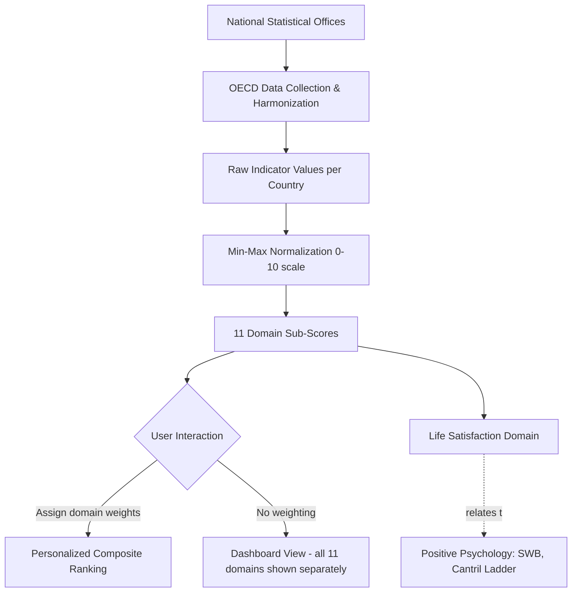

## National Well-Being Indices and the OECD Better Life Index

### Overview

National well-being indices are composite or multi-dimensional measurement frameworks designed to assess quality of life beyond Gross Domestic Product (GDP). They emerged from the recognition that GDP measures market production but was never designed to capture welfare, sustainability, distribution, or subjective experience. The OECD Better Life Index (BLI) is the most widely cited example of this movement, alongside related frameworks such as the Human Development Index (HDI), the World Happiness Report rankings, Bhutan's Gross National Happiness (GNH) Index, and the Social Progress Index (SPI).

This topic sits at the intersection of positive psychology and public policy: it operationalizes constructs like life satisfaction, positive/negative affect, and eudaimonic flourishing at a population scale, allowing governments to treat well-being as a measurable policy target rather than an assumed byproduct of economic growth.

### Historical and Conceptual Background

**Key Points**

- **The GDP critique**: Simon Kuznets, who helped develop national income accounting in the 1930s, warned that GDP should not be equated with welfare. GDP counts all monetized production regardless of whether it improves lives (e.g., disaster cleanup, cigarette sales, prison construction all add to GDP) and excludes non-market value (unpaid caregiving, ecosystem services, leisure).
- **The Stiglitz-Sen-Fitoussi Commission (2008–2009)**: Commissioned by French President Nicolas Sarkozy, this report by economists Joseph Stiglitz, Amartya Sen, and Jean-Paul Fitoussi formally argued for shifting measurement emphasis "from measuring economic production to measuring people's well-being." It proposed three pillars: (1) classical GDP issues, (2) quality of life, and (3) sustainability.
- **OECD's response**: The OECD launched the "Better Life Initiative" in 2011, producing the Better Life Index as an interactive public tool alongside the biennial *How's Life?* report series.
- **Bhutan's GNH (1970s onward)**: Predates the OECD effort conceptually; Bhutan constitutionally prioritizes Gross National Happiness over GDP, structured around four pillars (sustainable development, cultural preservation, environmental conservation, good governance) and nine domains.

### The OECD Better Life Index: Structure

The BLI comprises **11 topics**, each built from one or more underlying indicators, standardized and equally weighted by default (though the public tool allows users to re-weight dimensions according to personal values).

| Domain | Representative Indicators |
| --- | --- |
| Housing | Dwellings without basic facilities, housing expenditure, rooms per person |
| Income | Household net adjusted disposable income, household net wealth |
| Jobs | Employment rate, long-term unemployment rate, personal earnings, job security |
| Community | Quality of social support network |
| Education | Educational attainment, student skills (PISA scores), years in education |
| Environment | Air pollution (PM2.5), water quality |
| Civic Engagement | Stakeholder engagement in rule-making, voter turnout |
| Health | Self-reported health status, life expectancy |
| Life Satisfaction | Self-reported life satisfaction (0–10 Cantril-type scale) |
| Safety | Homicide rate, feeling of safety walking alone at night |
| Work-Life Balance | Employees working very long hours, time devoted to leisure and personal care |

**Note on Life Satisfaction as a subdomain**: This is the direct link to positive psychology measurement — it uses a single-item evaluative well-being question, conceptually related to the Cantril Ladder and Diener's Satisfaction with Life Scale (SWLS), though the BLI itself uses a simplified single-item version rather than the full 5-item SWLS.

### Measurement Architecture (Technical Detail)

**Data normalization process**:

1. Raw indicators are collected from OECD member/partner country statistical agencies.
2. Each indicator is normalized to a 0–10 scale using min-max normalization:

$$x_{normalized} = \frac{x_i - x_{min}}{x_{max} - x_{min}} \times 10$$

3. Normalized indicators within a domain are averaged (typically unweighted, sometimes indicator-specific weights) to produce a domain sub-score.
4. Domain scores are NOT combined into a single composite index by default — this is a deliberate design choice. Users interactively assign weights (0–5) to each of the 11 domains via a slider interface, generating a personalized ranking rather than an official single "winner" country ranking. [Inference: this differs from indices like HDI, which do publish one aggregate scalar per country; the BLI's dashboard/non-aggregation approach reflects the Stiglitz-Sen-Fitoussi Commission's caution against forcing incommensurable dimensions into one number.]

**Why no default aggregate score?**

- Avoids arbitrary weighting assumptions imposed by the measurer rather than the citizen.
- Preserves multidimensionality — a country strong in income but weak in work-life balance shouldn't be masked by averaging.
- Encourages public engagement and value pluralism (different people/policymakers can weight domains differently).

### Comparison with Other National Well-Being Frameworks

| Index | Publisher | Aggregation | Includes Subjective Well-Being? | Scope |
| --- | --- | --- | --- | --- |
| OECD Better Life Index | OECD | User-weighted, no default composite | Yes (life satisfaction) | ~40 countries (OECD + partners) |
| Human Development Index (HDI) | UNDP | Fixed composite (geometric mean) | No | ~190 countries |
| World Happiness Report | UN Sustainable Development Solutions Network | Single composite (Cantril Ladder regression) | Yes (primary metric) | ~150 countries |
| Gross National Happiness Index | Bhutan (Centre for Bhutan Studies) | Weighted composite, sufficiency-based | Yes (psychological well-being domain) | Bhutan only |
| Social Progress Index | Social Progress Imperative | Fixed composite, three dimensions | No (uses opportunity/basic needs proxies) | ~170 countries |
| Genuine Progress Indicator (GPI) | Various national/regional bodies | Monetary-adjusted single figure | No | Country/region-specific |

**Key structural distinction**: The World Happiness Report uses a **Cantril Ladder** ("imagine a ladder with steps numbered 0 to 10... where would you personally stand?") as its primary dependent variable, then explains cross-country variance using six factors (GDP per capita, social support, healthy life expectancy, freedom, generosity, absence of corruption) via regression — these are *explanatory* variables, not directly summed into the score. The BLI, by contrast, treats life satisfaction as merely one of 11 *co-equal* domains rather than the target variable being explained.

### Positive Psychology Linkages

**Key Points**

- **Subjective well-being (SWB) tripartite model** (Diener): life satisfaction (cognitive-evaluative), positive affect, and negative affect. National indices like the BLI and WHR primarily capture the cognitive-evaluative component; they largely omit affect balance and eudaimonic measures (meaning, purpose, autonomy — Ryff's Psychological Well-Being dimensions).
- **Eudaimonic gap**: [Inference] Critics from positive psychology (e.g., scholars building on Seligman's PERMA model) note that most national indices underrepresent "Meaning" and "Accomplishment" pillars in favor of easily quantifiable socioeconomic proxies (income, jobs, housing).
- **Easterlin Paradox relevance**: National income indices historically showed that within-country happiness does not rise proportionally with GDP growth over time, despite cross-sectional correlations between wealth and happiness existing. This paradox was a major justification for developing alternative indices in the first place.
- **Hedonic adaptation at the population level**: Aggregate life satisfaction scores can mask hedonic adaptation — populations adjusting to circumstances (e.g., disability, political change) — a core positive psychology finding about individual well-being that has population-level policy implications (e.g., resilience-building vs. purely resource-based policy interventions).

### Illustration: Data Flow Architecture (svg_diagram)

### Practical Example: Interpreting a Country Profile

**Example**

Suppose Country X shows on the BLI dashboard:

- Income: 6.5/10
- Jobs: 7.2/10
- Life Satisfaction: 8.1/10
- Work-Life Balance: 4.0/10
- Environment: 3.5/10

A policymaker using an equal-weighting approach might compute a naive mean:

$$\bar{x} = \frac{6.5+7.2+8.1+4.0+3.5}{5} = 5.86$$

But a citizen who personally values work-life balance and environment more heavily (assigning weights of 5 each vs. 1 for others) would compute a weighted average that surfaces the country's actual weaknesses rather than washing them out — demonstrating why the BLI intentionally resists a single official ranking. This exercise mirrors positive-psychology practice of not reducing multidimensional flourishing (PERMA, Ryff's six factors) to one scalar "happiness score."

### Applications in Policy

**Key Points**

- **Budgeting for well-being**: New Zealand's "Wellbeing Budget" (2019 onward) explicitly required government agencies to justify spending against well-being domains rather than GDP-growth targets alone. [Unverified: subsequent budget cycles may have altered or partially reversed this framework; policy commitments are subject to change with new governments.]
- **UK Measuring National Well-being Programme** (ONS, since 2010): produces a national well-being dashboard with domains resembling BLI, plus a four-item subjective well-being module (life satisfaction, worthwhile, happiness yesterday, anxiety yesterday) embedded in the Annual Population Survey.
- **UAE's Ministry of Happiness and Wellbeing** (established 2016): institutionalizes well-being tracking at cabinet level. [Inference: institutional durability and independent measurement rigor of such ministries vary and are difficult to externally verify.]
- **EU's Beyond GDP initiative**: parallel European effort feeding into Eurostat's quality-of-life indicators.

### Limitations and Critiques

**Key Points**

- **Country coverage gap**: The BLI covers primarily OECD members and a handful of partner countries (~40 total), excluding most of the Global South — limiting its use as a truly global comparative tool (unlike HDI or WHR).
- **Equal-weighting default may mask policy priorities**: treating all 11 domains as equally important by default is itself a value judgment, even if user-adjustable.
- **Self-report bias in life satisfaction data**: cultural response styles (e.g., tendency toward extreme vs. moderate responses) can bias cross-national comparisons of subjective items — a well-documented methodological concern in cross-cultural psychology research.
- **Static snapshot vs. sustainability**: Critics note the BLI is largely a present-state snapshot; it incorporates limited intertemporal/sustainability weighting compared to frameworks like Genuine Progress Indicator or Inclusive Wealth Index, which explicitly deduct natural capital depletion.
- **Data lag**: Indicators are often 1–3 years old at publication due to survey and reporting cycles, limiting responsiveness to rapid social change. [Inference: exact lag varies by indicator and country statistical capacity.]

### Related Topics

- Subjective Well-Being (SWB) measurement: Diener's tripartite model and the Satisfaction with Life Scale (SWLS)
- The Cantril Self-Anchoring Ladder and its use in the World Happiness Report
- Easterlin Paradox and income-happiness relationships
- PERMA model (Seligman) vs. hedonic/eudaimonic measurement frameworks in national indices
- Gross National Happiness (Bhutan): four pillars and nine domains in depth
- Genuine Progress Indicator (GPI) and Inclusive Wealth Index as sustainability-adjusted alternatives
- New Zealand's Wellbeing Budget and Living Standards Framework
- Cross-cultural response bias in subjective well-being surveys
- The Stiglitz-Sen-Fitoussi Commission report (2009) in full
- Ryff's Psychological Well-Being Scale and its absence from most national indices