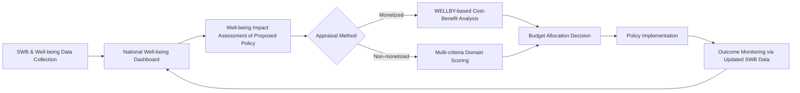

## Well-Being-Informed Public Policy

### Overview

Well-being-informed public policy (also called "well-being policy," "wellbeing economics," or the "Beyond GDP" policy movement) refers to the systematic use of well-being metrics — subjective well-being (SWB), quality-of-life indicators, and capability measures — as inputs into government decision-making, budgeting, and program evaluation, rather than relying solely on GDP growth or narrow cost-benefit metrics. It represents the applied, governmental extension of positive psychology and welfare economics research into legislative and administrative practice.

### Conceptual Foundations

**Key Points**

- **From measurement to action**: National well-being indices (BLI, WHR, HDI, etc.) answer "how are we doing?" Well-being-informed policy answers "what should we do about it?" — it is the decision-theoretic layer built on top of measurement frameworks.
- **Welfare economics roots**: Draws on utilitarian social welfare functions, but modern well-being policy typically substitutes revealed preference/income proxies with directly measured experienced or evaluative well-being (Kahneman & Krueger's work on hedonic/experience measurement; Diener's SWB tripartite model).
- **Capability approach (Sen, Nussbaum)**: An alternative philosophical foundation emphasizing what people are actually able to *do and be* (capabilities and functionings) rather than subjective satisfaction alone — influential in the Human Development Index and in policy frameworks that resist purely hedonic metrics.
- **Libertarian paternalism / nudge theory** (Thaler & Sunstein): A parallel policy tradition using behavioral economics insights (loss aversion, present bias, default effects) to design "choice architecture" that improves welfare without restricting options — heavily adopted by well-being-oriented policy units (e.g., UK's Behavioural Insights Team, "Nudge Unit").

### Policy Mechanisms: How Well-Being Data Enters Government Decision-Making

| Mechanism | Description | Example |
| --- | --- | --- |
| Well-being budgeting | Government spending justified/allocated against well-being domain targets, not just GDP/fiscal metrics | New Zealand Wellbeing Budget (2019–) |
| Well-being impact assessment | Ex-ante analysis of how proposed legislation affects well-being domains, analogous to environmental impact assessments | UK Green Book supplementary wellbeing guidance |
| National well-being dashboards | Standing statistical infrastructure tracking domains over time, informing but not binding policy | UK ONS Measuring National Well-being Programme; OECD *How's Life?* |
| Subjective well-being cost-benefit analysis (WELLBY) | Monetizing or standardizing well-being gains/losses from policy using a common unit | UK Treasury's WELLBY (WELLbeing-adjusted Life Year) approach |
| Institutional mandates | Dedicated ministries/units with authority to advise or approve legislation via a well-being lens | UAE Ministry of Happiness and Wellbeing; Wales' Well-being of Future Generations Act |

### The WELLBY: A Technical Cost-Benefit Framework

The **WELLBY (WELLbeing-adjusted Life Year)** is the most methodologically developed tool for integrating SWB into standard economic policy appraisal, formally adopted in the UK Treasury's *Green Book* supplementary guidance (2021).

**Definition**: A WELLBY equals one point of life satisfaction (on a 0–10 scale) for one person for one year. It is structurally modeled after the QALY (Quality-Adjusted Life Year) used in health economics.

$$\text{WELLBYs} = \Delta LS \times N \times T$$

Where:

- $\Delta LS$ = change in life satisfaction score (0–10 scale)
- $N$ = number of people affected
- $T$ = duration in years

**Monetization step**: To compare against monetary costs in standard cost-benefit analysis, a monetary value per WELLBY is applied (UK Treasury has used approximately £13,000–£15,000 per WELLBY, derived from the value of a life-year implied by public spending decisions elsewhere in government). [Unverified: exact published monetary values are periodically revised by Treasury guidance updates; consult current *Green Book* supplementary guidance for the live figure.]

**Worked Example**

**Example**

A local government considers funding a community mental health program costing £2,000,000/year, expected to raise life satisfaction by 0.3 points for 5,000 residents, sustained for 4 years.

$$\text{WELLBYs} = 0.3 \times 5{,}000 \times 4 = 6{,}000 \text{ WELLBYs}$$

At an illustrative monetary value of £13,000/WELLBY:

$$\text{Monetized benefit} = 6{,}000 \times £13{,}000 = £78{,}000{,}000$$

Compared against a total program cost of £8,000,000 (£2M × 4 years), the benefit-cost ratio is:

$$\frac{£78{,}000{,}000}{£8{,}000{,}000} \approx 9.75$$

This suggests strong value-for-money — the kind of output policymakers use alongside (not necessarily instead of) traditional fiscal cost-benefit analysis.

### Institutional Case Studies

**Key Points**

- **New Zealand's Wellbeing Budget (2019)**: Required Treasury to assess all new spending bids against the Living Standards Framework — four capitals (financial/physical, natural, human, social) and 12 wellbeing domains. Budget priorities in the initial cycle focused on mental health, child wellbeing, indigenous (Māori and Pasifika) outcomes, and productivity transition. [Unverified: subsequent government administrations may have modified or deprioritized specific mechanisms; verify against current New Zealand Treasury publications for present-day status.]
- **Wales' Well-being of Future Generations Act (2015)**: A binding legal framework requiring all public bodies to act in accordance with sustainable development principles and seven well-being goals (e.g., a prosperous Wales, a resilient Wales, a Wales of cohesive communities). Notable for being statutory (legally enforceable) rather than advisory, and for creating a "Future Generations Commissioner" watchdog role.
- **UK ONS Measuring National Well-being Programme + Green Book integration**: Combines a long-running statistical dashboard (since 2010) with formal Treasury appraisal guidance (WELLBY method, adopted 2021), forming one of the more technically mature well-being-to-policy pipelines globally.
- **Bhutan's GNH policy screening tool**: All draft government policies undergo a GNH Policy Screening Tool assessment across GNH's nine domains before approval — an early and durable example of institutionalized well-being gatekeeping.
- **OECD's role**: Functions as a knowledge-broker and standard-setter rather than a policy enforcer — publishing *How's Life?* biennially and coordinating well-being metric harmonization across member states, but implementation remains at national discretion.

### Positive Psychology Linkages

**Key Points**

- **PERMA at scale**: Seligman's PERMA model (Positive emotion, Engagement, Relationships, Meaning, Accomplishment) has influenced "third wave" well-being policy discussions that argue GDP-adjacent and even life-satisfaction-only metrics under-capture meaning and engagement; some scholars advocate supplementing WELLBY-style CBA with eudaimonic indicators. [Inference: this remains a more theoretical/academic critique than an implemented policy standard as of the most recent literature.]
- **Positive institutions**: Positive psychology's "positive institutions" pillar (alongside positive traits and positive experiences, per Seligman & Csikszentmihalyi's original framing) provides the conceptual bridge justifying why *institutions themselves* (not just individuals) are legitimate targets for well-being-oriented design.
- **Resilience and policy design**: Community-level resilience research (e.g., post-disaster recovery, protective factors against adversity) increasingly informs policy areas like housing, urban planning, and social safety nets — treating resilience as a policy-buildable capacity rather than a fixed trait.
- **Adaptation and policy blind spots**: Hedonic adaptation research warns policymakers that self-reported life satisfaction may under-detect chronic but adapted-to harms (e.g., long-term unemployment, chronic pollution exposure) — a caution increasingly built into policy guidance to avoid over-relying on SWB snapshots alone.

### Illustration: Well-Being Policy Pipeline (svg_diagram)

### Methodological Challenges

**Key Points**

- **Causal attribution difficulty**: Life satisfaction changes are multiply determined (economic conditions, health, life events, social relationships); isolating a policy's specific causal contribution requires rigorous designs (randomized controlled trials, difference-in-differences, natural experiments) that are often infeasible at national policy scale.
- **Interpersonal comparability of SWB**: Aggregating individual life satisfaction scores assumes comparability across people and cultures — a contested assumption in psychometrics given known cross-cultural response-style differences.
- **Political risk of quantification**: Reducing complex trade-offs (e.g., civil liberties vs. safety, growth vs. environment) to a single monetized WELLBY figure risks oversimplifying value-laden political choices as if they were purely technical optimization problems.
- **Short-termism vs. long-term well-being**: Electoral cycles (2–5 years) may misalign with policies whose well-being benefits (e.g., early childhood investment) manifest over decades — a structural tension for well-being budgeting.
- **Discount rate selection**: When benefits span years (as in the WELLBY formula above), the choice of social discount rate materially changes monetized benefit estimates, and there is no universal consensus rate. [Inference: discount rate conventions differ by country and are periodically revised by finance ministries.]

### Next Steps

- WELLBY methodology in depth: derivation, monetary valuation debates, and comparison to QALY in health economics
- New Zealand's Living Standards Framework: four capitals model in detail
- Wales' Well-being of Future Generations Act: legal enforcement mechanisms and the Future Generations Commissioner role
- Nudge theory and behavioral public policy units (UK Behavioural Insights Team, OECD BASIC toolkit)
- Capability approach (Sen & Nussbaum) as an alternative to hedonic/SWB-based policy metrics
- Randomized controlled trials and quasi-experimental methods for well-being policy evaluation
- Cross-national comparison of well-being budgeting adoption and institutional durability
- Discounting and intergenerational equity in well-being cost-benefit analysis