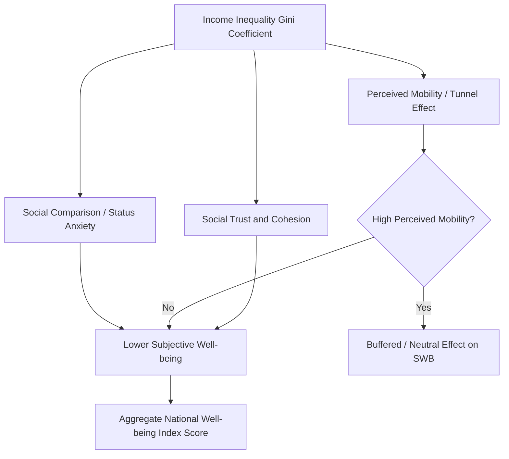

## Income, Inequality, and Subjective Well-Being

### Overview

This topic examines the empirical relationship between economic resources — both absolute income and its distribution across a population — and subjective well-being (SWB). It synthesizes decades of research spanning economics and positive psychology, addressing three core questions: (1) Does more income make individuals happier? (2) Does national economic growth make societies happier? (3) Does income *inequality*, independent of absolute income levels, affect well-being? The findings are often counterintuitive and have directly shaped the well-being-informed policy movement covered elsewhere in this chapter.

### The Income–Happiness Relationship: Individual Level

**Key Points**

- **Positive but concave relationship**: Cross-sectional studies consistently find that higher income correlates with higher life satisfaction, but the relationship shows diminishing marginal returns — each additional dollar buys progressively less additional well-being.
- **Log-linear functional form**: The relationship between income and life satisfaction is typically better modeled as log-linear than linear:

$$LS_i = \beta_0 + \beta_1 \ln(Income_i) + \varepsilon_i$$

This implies that *doubling* income produces a roughly constant increase in life satisfaction, rather than a fixed dollar increase producing a fixed happiness increase. [Inference: the precise functional form and coefficient estimates vary across datasets, countries, and survey waves; this is a well-supported general pattern rather than a fixed universal constant.]

- **The Kahneman-Deaton (2010) satiation finding**: This influential study using U.S. Gallup data distinguished two components of well-being: emotional/experienced well-being (day-to-day mood, e.g., measured via the Day Reconstruction Method) and life evaluation (Cantril Ladder-style overall judgment). It reported that emotional well-being showed diminishing returns and little further improvement above an income threshold (commonly cited as ~$75,000/year in 2008-2010 U.S. dollars), while life evaluation continued rising with income without clear satiation. [Unverified: this specific threshold is dataset- and era-specific, sensitive to inflation and cost-of-living adjustments, and later research has produced mixed replications — treat the dollar figure as illustrative rather than a fixed universal constant.]
- **Killingsworth (2021) re-analysis**: Using large-scale real-time experience-sampling smartphone data, this study found that experienced well-being continued rising with income beyond $75,000 for most people, with no clear satiation point — contradicting the earlier Kahneman-Deaton finding.
- **Killingsworth, Kahneman & Mellers (2023) adversarial collaboration**: The two research teams jointly reanalyzed the conflicting findings and reconciled them: for the majority of people, well-being rises steadily with income with no satiation; however, for an "unhappy minority" (roughly the bottom 15-20% of well-being distribution, largely those experiencing significant life adversity such as heartbreak, bereavement, or illness), well-being does plateau or even worsen further above a certain income, suggesting money cannot fully buy relief from severe negative circumstances beyond a point. This adversarial collaboration is considered a methodological model for resolving conflicting psychological findings.

### The Income–Happiness Relationship: National/Aggregate Level

**Key Points**

- **The Easterlin Paradox** (Richard Easterlin, 1974): The foundational puzzle in this literature. Cross-sectionally, richer countries report higher average life satisfaction than poorer countries, and within a country, richer individuals report higher satisfaction than poorer individuals at a point in time. However, over time, as countries' GDP per capita grows substantially, average national life satisfaction does not rise proportionally — and in some cases stays flat or even declines. This is the paradox: cross-sectional and longitudinal patterns diverge.
- **Proposed explanations for the paradox**:
  - **Relative income / social comparison theory**: Well-being depends on income relative to a reference group (neighbors, peers, one's own past income) rather than absolute income; if everyone's income rises together, relative position — and thus reported satisfaction — may not improve.
  - **Hedonic adaptation / hedonic treadmill**: People adapt to improved material circumstances over time, with well-being reverting toward a baseline (though the "set point" is now understood to be more malleable than early hedonic treadmill theory suggested).
  - **Rising aspirations**: Economic growth may raise material aspirations as fast as it raises actual consumption, offsetting net well-being gains.
- **Stevenson & Wolfers (2008) critique**: Using more extensive cross-country panel data, this research challenged the Easterlin Paradox, arguing that with better data and longer time series, there IS a robust positive relationship between GDP growth and life satisfaction growth both within and across countries — reigniting active debate that continues in the literature. [Unverified: this remains a genuinely contested empirical question rather than settled consensus; different datasets, countries, and time periods yield different conclusions, and this is an area of ongoing methodological debate rather than a resolved fact.]

### Income Inequality and Well-Being

This is analytically distinct from the income-level question above: it asks whether the *distribution* of income (holding average income constant) independently affects well-being.

| Mechanism | Direction of Effect | Underlying Logic |
| --- | --- | --- |
| Social comparison / status anxiety | Inequality reduces well-being | Wider income gaps intensify upward social comparisons, increasing status anxiety across the distribution (Wilkinson & Pickett's *The Spirit Level* thesis) |
| Perceived fairness / tunnel effect | Inequality can increase well-being (short-term) | Hirschman's "tunnel effect": observing others' rising income can signal future opportunity for oneself, temporarily boosting optimism, especially in growing economies |
| Trust and social cohesion | Inequality reduces well-being | Higher inequality is associated with lower generalized social trust, weaker community bonds, and reduced social capital — all established correlates of SWB |
| Reduced public goods provision | Inequality reduces well-being | Greater inequality is associated in some research with reduced political support for redistributive public goods (health, education) that benefit average well-being |
| Meritocracy/mobility beliefs | Moderates the effect | Perceived (even if not actual) social mobility can buffer the negative well-being effects of inequality — "the American Dream" effect on tolerance for inequality |

**Key empirical findings**:

- **Wilkinson & Pickett (*The Spirit Level*, 2009)**: Argued that more unequal societies (measured via Gini coefficient) show worse outcomes not just in well-being but across a wide range of social indicators (mental illness, trust, life expectancy, obesity, educational performance), even after controlling for absolute income levels. [Unverified/contested: this work has faced significant methodological criticism regarding causality, country selection, and statistical robustness; it remains an influential but disputed thesis rather than settled consensus.]
- **Cross-national SWB and Gini coefficient studies**: Findings are mixed and depend heavily on region, time period, and whether perceived vs. actual inequality is measured. Some studies find inequality's negative well-being effect is stronger in societies with low perceived social mobility or low institutional trust, consistent with a moderation effect rather than a universal main effect.
- **Perceived vs. actual inequality**: A growing body of research emphasizes that people are often poor estimators of actual income distribution in their society, and *perceived* inequality/fairness may matter more for SWB than statistically measured inequality (e.g., Gini coefficient).

### Gini Coefficient: Technical Note

The **Gini coefficient** is the standard measure of income inequality used in this literature, ranging from 0 (perfect equality) to 1 (perfect inequality).

$$G = \frac{\sum_{i=1}^{n}\sum_{j=1}^{n} |x_i - x_j|}{2n^2\bar{x}}$$

Where $x_i$ and $x_j$ are incomes of individuals $i$ and $j$, $n$ is the population size, and $\bar{x}$ is mean income. Geometrically, it corresponds to the area between the Lorenz curve (cumulative share of income vs. cumulative share of population) and the line of perfect equality, divided by the total area under the equality line.

### Illustration: Competing Mechanisms Linking Inequality to Well-Being (svg_diagram)

### Practical Example: Interpreting a Policy Trade-off

**Example**

Consider two hypothetical countries with identical mean income ($50,000):

- Country A: Gini = 0.25 (relatively equal distribution)
- Country B: Gini = 0.45 (relatively unequal distribution)

If relative-income/social-comparison mechanisms dominate, Country A's population would be predicted to report higher average life satisfaction despite identical mean income, because fewer citizens experience large negative status comparisons. A policymaker relying only on GDP per capita (identical in both countries) would miss this predicted well-being gap entirely — illustrating why inequality metrics are increasingly paired with, not replaced by, income-level metrics in well-being-informed policy analysis (see the related chapter item on well-being-informed public policy).

### Positive Psychology Linkages

**Key Points**

- **Materialism and well-being**: Positive psychology research (e.g., Tim Kasser's work on materialistic values) finds that individuals who prioritize extrinsic goals (wealth, status, image) over intrinsic goals (personal growth, relationships, community) tend to report lower well-being — relevant context for why absolute income gains don't translate one-to-one into happiness gains.
- **Hedonic adaptation as the psychological mechanism**: The hedonic treadmill concept, central to positive psychology's understanding of well-being set-points, provides the micro-level psychological mechanism underlying the macro-level Easterlin Paradox.
- **Social comparison theory (Festinger)**: A foundational social psychology theory directly underlying the inequality-SWB literature's "relative income" explanation — people evaluate their own standing by comparing to reference groups rather than in absolute terms.
- **Basic needs vs. flourishing distinction**: Consistent with Maslow's hierarchy and Self-Determination Theory (Deci & Ryan), income appears most strongly related to well-being at lower absolute levels (meeting basic needs: food, shelter, safety) and progressively less related once needs are met, redirecting attention toward autonomy, competence, and relatedness as drivers of further well-being gains.

### Limitations and Open Debates

**Key Points**

- **Causality vs. correlation**: Much of this literature is correlational; reverse causality is plausible (e.g., happier/healthier individuals may earn more, rather than income causing happiness) and is addressed unevenly across studies via panel data and natural experiments (e.g., lottery winner studies).
- **Cultural moderators**: The strength and even direction of income-SWB and inequality-SWB relationships vary by cultural context (individualist vs. collectivist societies, differing norms around wealth display and comparison).
- **Measurement**: Self-reported life satisfaction and experienced well-being are measured differently across studies (single-item Cantril Ladder vs. Day Reconstruction Method vs. Experience Sampling Method), and conclusions about "satiation points" are sensitive to which measure is used, as demonstrated by the Kahneman-Deaton/Killingsworth disagreement.
- **Absolute vs. relative income disentanglement**: Empirically separating absolute income effects from relative/positional income effects requires specific study designs (e.g., comparing otherwise-identical individuals with different local reference-group incomes) and remains methodologically challenging.

### Related Topics

- The Easterlin Paradox: full derivation, critiques, and the Stevenson-Wolfers rebuttal
- Kahneman-Deaton (2010) vs. Killingsworth (2021) vs. Killingsworth-Kahneman-Mellers (2023) adversarial collaboration in depth
- Hedonic adaptation and the hedonic treadmill (Brickman & Campbell)
- Social comparison theory (Festinger) and positional goods
- The Spirit Level thesis (Wilkinson & Pickett) and its methodological critiques
- Self-Determination Theory (Deci & Ryan): autonomy, competence, relatedness as well-being drivers beyond income
- Materialism and well-being (Kasser's work on extrinsic vs. intrinsic values)
- WELLBY-based cost-benefit analysis applied to redistributive tax policy
- Cross-cultural moderators of the income-happiness relationship