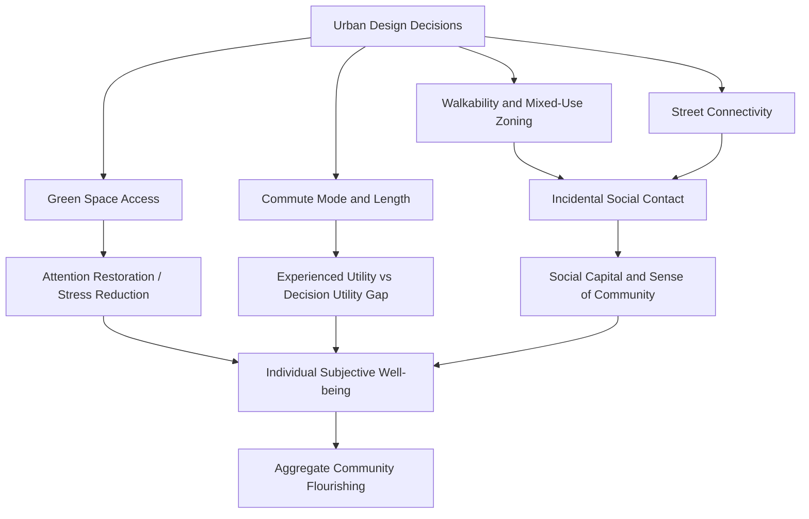

## Community Design, Urban Planning, and Flourishing

### Overview

This topic examines how the physical and spatial design of communities — housing typology, street layout, green space distribution, mixed-use zoning, and transportation infrastructure — causally influences human flourishing. It bridges environmental psychology, urban planning theory, and positive psychology, treating the built environment not as a neutral backdrop but as an active determinant of social connection, physical activity, stress levels, and subjective well-being at population scale.

### Conceptual Foundations

**Key Points**

- **Environmental psychology roots**: The field draws on the premise that physical environments shape behavior and affect through both direct sensory/physiological pathways (noise, air quality, natural light) and indirect social pathways (opportunities for incidental social contact, perceived safety).
- **Jan Gehl's "Life Between Buildings" framework**: Danish urban designer Jan Gehl's influential distinction between necessary activities (commuting, errands — occur regardless of environmental quality), optional activities (walking for pleasure, sitting outside — occur only in high-quality environments), and social activities (which depend on the first two happening in shared space) provides a foundational planning heuristic: good public space design increases optional activities, which in turn generates social activities and community cohesion.
- **Social capital theory (Putnam)**: Robert Putnam's concept of social capital (networks, norms, and trust that facilitate cooperation) is frequently operationalized in urban planning research as an outcome variable affected by neighborhood design — e.g., cul-de-sac suburban layouts vs. gridded, walkable layouts show different social capital outcomes in comparative studies.
- **Third places (Oldenburg)**: Ray Oldenburg's concept of "third places" (neither home nor work — cafes, parks, community centers, libraries) as essential infrastructure for informal public social life and community-level well-being; a recurring design target in flourishing-oriented urban planning.
- **Broken windows and defensible space theory**: Older but still influential theories (Newman's "defensible space," Wilson & Kelling's "broken windows") linking physical environment cues (disorder, sightlines, ownership signals) to perceived safety and, downstream, well-being and community engagement. [Unverified/contested: broken windows theory specifically has faced substantial empirical and ethical criticism, particularly regarding its use to justify aggressive policing; its relevance here is limited to environmental design cues rather than policing practice.]

### Key Design Domains and Their Well-Being Mechanisms

| Design Domain | Mechanism | Well-Being Outcome |
| --- | --- | --- |
| Green space access | Attention Restoration Theory (Kaplan & Kaplan); stress reduction via reduced cortisol/sympathetic activation | Reduced stress, improved mood, cognitive restoration |
| Walkability / mixed-use zoning | Increases incidental physical activity and casual social encounters | Higher physical health, increased social capital, reduced isolation |
| Housing density (moderate) | Enables local amenity viability (shops, transit) while preserving privacy | Associated with higher walkability-linked well-being, but excessive density linked to crowding stress |
| Commute length/mode | Long car commutes associated with the "commuting paradox" | Reduced life satisfaction, particularly for solo car commuters vs. active/transit commuters |
| Street connectivity | Grid layouts vs. cul-de-sacs affect walking behavior and social contact frequency | Higher connectivity associated with more walking and higher perceived community cohesion |
| Noise and air quality | Direct physiological stress pathways | Chronic noise/air pollution exposure linked to elevated cortisol, cardiovascular stress, reduced SWB |
| Third places / public space quality | Informal social infrastructure supporting "weak tie" relationships | Increased social connectedness, sense of community belonging |
| Mixed-income housing design | Reduces spatial concentration of disadvantage | Mixed evidence; can reduce stigma and improve access to opportunity, but implementation quality matters heavily |

### Attention Restoration Theory (Technical Detail)

Kaplan & Kaplan's **Attention Restoration Theory (ART)** is among the most empirically grounded mechanisms in this literature, positing that natural environments restore depleted directed attention (a finite cognitive resource depleted by sustained focus/urban stimuli) through four properties:

1. **Being away**: Psychological or physical distance from routine demands
2. **Extent**: A sense of a coherent, richly connected environment ("a whole other world")
3. **Fascination**: Effortless, involuntary attention (clouds, water, foliage) that doesn't compete with directed attention resources
4. **Compatibility**: Fit between the environment and one's purposes/inclinations

**Example**

A worker who spends a lunch break in a park with tree cover, water features, and minimal traffic noise experiences restoration of directed attention capacity, plausibly increasing afternoon productivity and reducing irritability — versus a worker eating at their desk under fluorescent lighting near a busy road, who receives no restorative input and shows continued attentional fatigue. Multiple field and lab studies support this general directional effect, though effect sizes vary by exposure duration, environment quality, and individual differences. [Inference: specific dose-response relationships (how much green space exposure produces how much restoration) are still an active area of research rather than a fixed established parameter.]

### The Commuting Paradox

**Key Points**

- **Definition**: Despite people generally choosing commutes based on a rational trade-off (accepting longer commutes for cheaper housing, better schools, or higher pay), longer commutes — especially by car — are robustly associated with lower life satisfaction and higher stress, a mismatch between decision-utility (what people choose) and experienced utility (what actually makes them happy), a distinction central to Kahneman's behavioral economics work.
- **Mode matters**: Active commuting (walking, cycling) and public transit commuting show substantially better well-being outcomes than solo car commuting of equivalent duration, plausibly due to physical activity benefits, reduced driving stress, and opportunities for incidental social contact or restorative "in-between" time.
- **Adaptation limits**: Unlike many life circumstances subject to hedonic adaptation, commuting stress shows relatively limited adaptation over time — people do not fully adjust to long commutes the way they might adjust to, say, a modest pay cut, making commute length a comparatively durable well-being cost.

### Case Studies and Applied Frameworks

**Key Points**

- **New Urbanism**: A planning movement (Congress for the New Urbanism, 1990s onward) advocating walkable neighborhoods, mixed-use development, and traditional grid street patterns explicitly to rebuild social capital eroded by post-war car-dependent suburban sprawl. Seaside, Florida and Kentlands, Maryland are frequently cited early exemplars. [Inference: New Urbanism's actual social capital outcomes relative to conventional suburban development remain debated in the planning literature, with some critics noting confounding factors like income and self-selection into these communities.]
- **15-Minute City concept** (Carlos Moreno): A planning framework proposing that residents should be able to meet most daily needs (work, shopping, healthcare, education, leisure) within a 15-minute walk or bike ride from home, explicitly framed around well-being, reduced car dependency, and community connection. Adopted as a stated planning goal by cities including Paris (under Mayor Anne Hidalgo) and referenced in Melbourne's 20-minute neighbourhood strategy. [Unverified: the concept has also become a subject of political controversy and misinformation in some contexts (e.g., conspiracy theories misrepresenting it as a mobility restriction policy); its well-being evidence base and political reception should be treated as distinct issues.]
- **Biophilic design**: An architectural and planning approach explicitly incorporating natural elements (living walls, water features, natural materials, daylighting) into buildings and streetscapes based on Attention Restoration Theory and related evolutionary preference research (Wilson's biophilia hypothesis).
- **Vision Zero and traffic calming**: Urban safety initiatives (originating in Sweden, 1997) reducing vehicle speeds and redesigning intersections, with secondary well-being benefits via increased perceived safety for pedestrians/cyclists, which in turn increases walkability-linked social and physical activity.

### Illustration: Pathways from Urban Design to Flourishing (svg_diagram)

### Positive Psychology Linkages

**Key Points**

- **Relatedness (Self-Determination Theory)**: Deci & Ryan's relatedness need — one of three basic psychological needs alongside autonomy and competence — is directly served or undermined by community design choices that enable or inhibit casual social contact and belonging.
- **PERMA's "Relationships" and "Engagement" pillars**: Seligman's PERMA model connects directly to urban design through the "R" (relationships — facilitated by third places and walkable social infrastructure) and "E" (engagement — facilitated by environments supporting flow-conducive activity, e.g., accessible recreational and cultural infrastructure).
- **Sense of community (McMillan & Chavis)**: A well-established psychological construct (membership, influence, integration/fulfillment of needs, shared emotional connection) frequently used as a validated outcome measure in urban design and flourishing research, providing a more granular alternative to generic life-satisfaction measures for this specific topic.
- **Positive institutions**: Community design operationalizes positive psychology's "positive institutions" pillar at the infrastructural level — treating parks, libraries, and public squares as designed inputs to collective flourishing rather than incidental amenities.

### Methodological Challenges

**Key Points**

- **Residential self-selection**: People who value walkability or green space may choose to live in neighborhoods offering these features, confounding correlational studies between neighborhood design and well-being outcomes; researchers attempt to address this via natural experiments (e.g., studying people who move due to job relocation rather than neighborhood preference) and longitudinal designs.
- **Scale mismatch**: Effects observed at the individual/block level (e.g., street trees) do not always aggregate predictably to city-level well-being metrics, given the many confounding factors operating at larger scales (economic conditions, governance quality).
- **Measuring "flourishing" vs. simple SWB**: Much of the urban design literature uses life satisfaction or mental health proxies rather than more comprehensive eudaimonic flourishing measures (e.g., Ryff's Psychological Well-Being Scale, PERMA-Profiler), creating a gap between available urban planning evidence and the broader positive psychology construct of flourishing.
- **Equity and displacement risk**: Well-being-improving interventions (e.g., new parks, walkability upgrades) can trigger property value increases and displacement of lower-income residents ("green gentrification"), a documented unintended consequence requiring explicit policy safeguards (e.g., affordable housing mandates paired with green infrastructure investment).

### Related Topics

- Attention Restoration Theory (Kaplan & Kaplan) and biophilia hypothesis (E.O. Wilson) in depth
- The 15-Minute City model: implementation case studies and critiques
- Social capital theory (Putnam) and its measurement in neighborhood studies
- Sense of Community Index (McMillan & Chavis) as an outcome measure
- Green gentrification and equity trade-offs in flourishing-oriented urban design
- Self-Determination Theory: relatedness, autonomy, and competence in environmental design
- Vision Zero and traffic-calming policy as well-being infrastructure
- The commuting paradox: decision utility vs. experienced utility (Kahneman)
- New Urbanism vs. conventional suburban development: comparative well-being evidence