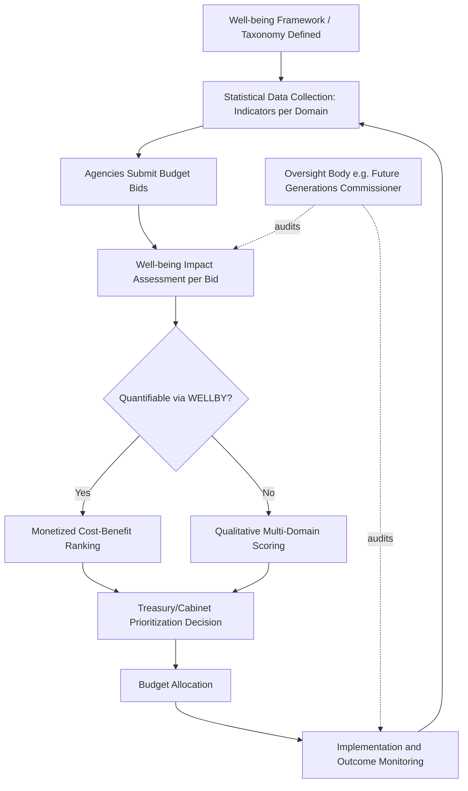

## Well-Being Budgeting and Government Well-Being Frameworks

### Overview

Well-being budgeting refers to the formal integration of well-being metrics into the fiscal budgeting process itself — requiring government agencies to justify, prioritize, or evaluate spending against well-being outcomes rather than (or in addition to) conventional fiscal and GDP-growth criteria. It is the most institutionally binding form of well-being-informed public policy, moving from advisory dashboards to operational budget mechanics. This topic provides a deeper technical treatment of the specific frameworks, legal architectures, and comparative institutional designs that implement well-being budgeting in practice.

### Distinguishing Well-Being Budgeting from Related Concepts

**Key Points**

- **Well-being budgeting vs. well-being measurement**: Measurement (e.g., the OECD Better Life Index, national statistical dashboards) is descriptive infrastructure; well-being budgeting is the *prescriptive* use of that infrastructure to allocate actual public funds.
- **Well-being budgeting vs. well-being impact assessment**: Impact assessment evaluates a single proposed policy or law; budgeting operates at the level of the entire fiscal cycle, requiring competing spending bids across all government departments to be ranked or justified using a shared well-being framework.
- **Participatory budgeting distinction**: Not to be confused with participatory budgeting (citizens directly allocating a discrete pool of funds) — well-being budgeting is typically a top-down analytical requirement embedded in central government Treasury/Finance Ministry processes, though some frameworks incorporate citizen well-being surveys as inputs.

### Core Architectural Components of a Well-Being Budgeting System

| Component | Function | Example Institution |
| --- | --- | --- |
| Well-being framework/taxonomy | Defines the domains and indicators against which spending is assessed | New Zealand's Living Standards Framework (12 domains, 4 capitals) |
| Statistical infrastructure | Ongoing data collection feeding the framework | Stats NZ wellbeing indicators; UK ONS Measuring National Well-being Programme |
| Legal/procedural mandate | Formal requirement compelling agencies to use the framework | UK Green Book supplementary wellbeing guidance; Wales' Well-being of Future Generations Act (statutory) |
| Appraisal/valuation method | Technical method for comparing well-being gains against costs | WELLBY (WELLbeing-adjusted Life Year) monetization |
| Oversight/accountability body | Independent body reviewing compliance and reporting | Wales' Future Generations Commissioner; New Zealand's Treasury reporting requirements |
| Budget bid process integration | The operational mechanism where framework meets money | New Zealand's requirement that all new spending bids include a wellbeing assessment |

### New Zealand's Living Standards Framework (LSF): Technical Structure

The LSF, developed by New Zealand Treasury, underpins the country's Wellbeing Budget process and is among the most fully specified government well-being frameworks globally.

**The Four Capitals model**: LSF conceptualizes national wellbeing as dependent on the stocks of four capitals, drawing explicitly on sustainability economics:

1. **Financial and physical capital**: Produced/financial assets (infrastructure, equipment, financial assets)
2. **Natural capital**: Natural resources and ecosystems (land, water, minerals, biodiversity)
3. **Human capital**: Skills, knowledge, physical/mental health of the population
4. **Social capital**: Norms, trust, and institutions that support cooperation

**Design logic**: Current wellbeing (measured via 12 domains including health, jobs, income, environment, safety, and cultural identity/belonging) is treated as a *flow* generated by these four capital *stocks*. A budget decision that boosts current wellbeing by depleting natural capital (e.g., approving extractive industry expansion) is flagged as potentially reducing *future* wellbeing — explicitly building intergenerational sustainability into the appraisal logic, addressing a limitation of simpler current-state dashboards like the OECD Better Life Index.

**Budget bid requirement**: [Unverified: specific procedural requirements are subject to revision by successive New Zealand governments; the general architecture described here reflects the framework as established in 2019, but current implementation details should be verified against current New Zealand Treasury guidance.] Agencies submitting new spending proposals were required to demonstrate impact across relevant LSF domains, and Cabinet used this analysis alongside conventional fiscal criteria (affordability, macroeconomic impact) to prioritize the annual Budget's strategic priority areas (e.g., 2019's priorities: mental health, child wellbeing, indigenous outcomes, productive economy transition, thriving in a digital age).

### Wales' Well-Being of Future Generations Act (2015): Legal Architecture

This is distinguished from most other frameworks by being **statutory** (legally binding) rather than advisory guidance.

**Key structural elements**:

- **Seven well-being goals** (legally defined): a prosperous Wales, a resilient Wales, a healthier Wales, a more equal Wales, a Wales of cohesive communities, a Wales of vibrant culture and thriving Welsh language, a globally responsible Wales.
- **Five ways of working** (a mandated decision-making methodology): long-term thinking, prevention, integration (considering impact across goals, not siloed), collaboration, and involvement (of citizens and communities in decisions).
- **Public Services Boards**: Statutory local bodies required to assess local well-being and set well-being objectives, creating accountability at sub-national as well as national level.
- **Future Generations Commissioner for Wales**: An independent statutory watchdog role with powers to review public bodies' compliance, issue recommendations, and conduct formal reviews — a distinctive accountability mechanism largely absent from advisory-only frameworks. [Inference: enforcement power is primarily reputational/advisory rather than involving direct financial penalties, though the statutory basis distinguishes it from purely voluntary frameworks elsewhere.]

### The WELLBY as the Technical Bridge to Fiscal Appraisal

As detailed in the related chapter item on well-being-informed public policy, the **WELLBY (WELLbeing-adjusted Life Year)**, formalized in the UK Treasury's *Green Book* supplementary wellbeing guidance (2021), is the most developed quantitative bridge allowing well-being gains to be compared on the same monetary footing as conventional cost-benefit analysis inputs, using the formula:

$$\text{WELLBYs} = \Delta LS \times N \times T$$

This is the mechanism that allows well-being budgeting to move beyond qualitative domain-scoring toward the kind of ranked, quantitative comparison that fiscal budget processes traditionally require (competing bids must ultimately be rank-ordered or compared against a common metric to allocate a finite budget).

### Comparative Institutional Maturity

| Country/Region | Framework Name | Legal Status | Distinctive Feature |
| --- | --- | --- | --- |
| New Zealand | Living Standards Framework / Wellbeing Budget | Policy/administrative (not statutory) | Four Capitals sustainability model |
| Wales | Well-being of Future Generations Act | Statutory (legally binding) | Independent Future Generations Commissioner |
| United Kingdom (national) | Green Book wellbeing guidance + ONS dashboard | Administrative/appraisal guidance | WELLBY monetization method |
| Bhutan | Gross National Happiness Policy Screening Tool | Constitutional/administrative | Mandatory ex-ante policy screening across 9 GNH domains |
| Iceland | Indicators for Measuring Well-being (Statistics Iceland + government) | Administrative | Integrated into national budget bill since 2020 |
| Scotland | National Performance Framework | Administrative, informed by legislation | Aligned explicitly with UN Sustainable Development Goals |
| UAE | Ministry of Happiness and Wellbeing | Executive/cabinet-level institution | Cabinet-level ministerial authority dedicated to wellbeing |

[Unverified: institutional status, statutory backing, and operational details for each entry are subject to change with government transitions and policy revisions; this table reflects publicly documented frameworks as generally described in the literature and should be verified against current official sources for present-day accuracy.]

### Illustration: Well-Being Budgeting Process Flow (svg_diagram)

### Practical Example: A Simplified Budget Bid Comparison

**Example**

A Finance Ministry using a well-being budgeting framework receives two competing bids of equal cost (£50 million/year):

- **Bid A (early childhood education expansion)**: Estimated to raise life satisfaction by 0.15 points for 200,000 children and indirectly for 300,000 parents/caregivers, sustained for an estimated 10 years of benefit persistence (a long horizon reflecting developmental literature on early childhood intervention durability).

$$\text{WELLBYs}_A = 0.15 \times 500{,}000 \times 10 = 750{,}000$$

- **Bid B (highway congestion relief)**: Estimated to raise life satisfaction by 0.05 points for 1,000,000 commuters, sustained for 5 years before other traffic growth erodes the benefit.

$$\text{WELLBYs}_B = 0.05 \times 1{,}000{,}000 \times 5 = 250{,}000$$

Despite Bid B affecting more people, Bid A produces three times the total WELLBYs due to greater per-person impact and longer benefit duration — providing Cabinet with a comparative quantitative basis that a conventional GDP-impact-only appraisal (which might favor the highway project's larger measured productivity/congestion-cost savings) would not surface in the same way. [Inference: this is an illustrative simplified example; real appraisals involve substantially more complex modeling, uncertainty ranges, and discounting.]

### Positive Psychology Linkages

**Key Points**

- **Institutionalizing "positive institutions"**: Well-being budgeting operationalizes positive psychology's foundational claim (Seligman & Csikszentmihalyi) that institutions themselves — not only individuals — are legitimate objects of positive psychological design and intervention, at the most concrete possible level: where public money is spent.
- **PERMA-adjacent domain selection**: Frameworks like New Zealand's LSF (which includes "cultural identity and belonging," social connections, and leisure/recreation domains) implicitly incorporate PERMA-adjacent constructs (Relationships, Engagement) beyond narrow economic indicators, though full eudaimonic measurement (e.g., Ryff's dimensions) remains rare in operational budgeting frameworks specifically.
- **Prevention framing**: Wales' "prevention" principle (one of the five ways of working) reflects positive psychology's broader shift from deficit-reduction (treating mental illness, poverty, disorder after the fact) toward proactive flourishing-oriented intervention (building protective factors and capacities before problems arise) — a parallel to positive psychology's original founding distinction from traditional clinical psychology's disease model.

### Limitations and Critiques

**Key Points**

- **Political durability**: Well-being budgeting frameworks are administrative/political creations vulnerable to being deprioritized, restructured, or abandoned by successor governments with different fiscal philosophies — a structural fragility compared to more deeply entrenched fiscal institutions. [Unverified: the specific current operational status of any named framework should be checked against recent official sources, as government transitions can materially change implementation.]
- **Gaming and box-ticking risk**: Mandatory well-being impact assessments risk becoming pro forma bureaucratic exercises (agencies writing assessments to justify pre-decided spending) rather than genuinely shaping prioritization — a documented risk in comparable mandatory assessment regimes (e.g., environmental impact assessments).
- **Aggregation and trade-off opacity**: Even sophisticated frameworks like the LSF's four capitals must eventually resolve trade-offs between incommensurable goods (e.g., natural capital depletion vs. current employment) using judgment calls that are not fully transparent or technically determined by the framework itself.
- **Measurement lag and responsiveness**: Budget cycles are annual, but well-being outcome data (surveys, health statistics) often lag by 1-3 years, creating a structural mismatch between decision timing and evidence availability.
- **Global comparability limits**: Because frameworks differ substantially in domain selection, weighting, and legal status across countries, cross-national comparison of "how well-being-budgeted" a government is remains methodologically difficult, unlike more standardized fiscal metrics (e.g., deficit-to-GDP ratio).

### Next Steps

- WELLBY methodology: full derivation and UK Green Book implementation detail
- New Zealand's Four Capitals model: measurement methodology for each capital stock
- Wales' Future Generations Commissioner: powers, case reviews, and enforcement limitations
- Comparative case study: Bhutan's GNH Policy Screening Tool operational mechanics
- Environmental impact assessment as a procedural analogy for well-being impact assessment risks
- Discounting and intergenerational equity in multi-year well-being budget appraisal
- Political economy of well-being framework durability across government transitions
- Iceland's integration of well-being indicators into national budget bills