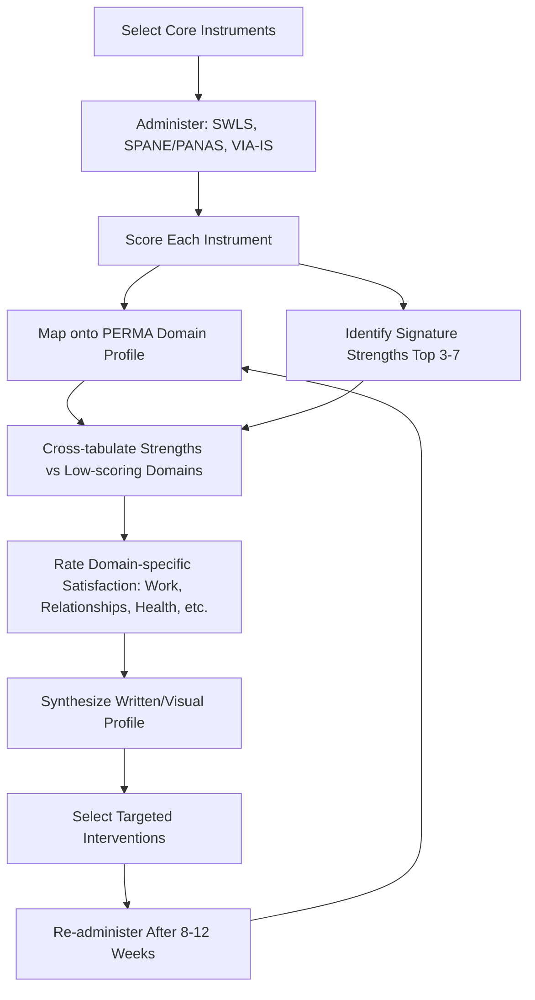

## Conducting a Personal Well-Being and Strengths Audit

### Overview

A personal well-being and strengths audit is a structured, systematic self-assessment process that maps an individual's current standing across recognized well-being domains and character strengths, producing a baseline from which targeted resilience and flourishing interventions can be designed. It translates population-level positive psychology constructs (PERMA, character strengths, subjective well-being) into an individual-level diagnostic tool, functioning as the assessment phase preceding personalized intervention planning in applied positive psychology practice.

### Conceptual Foundations

**Key Points**

- **Assessment before intervention**: Consistent with evidence-based practice principles across applied psychology, a structured audit precedes intervention selection so that resources target genuine gaps and leverage genuine strengths rather than applying generic, undifferentiated interventions.
- **Strengths-based vs. deficit-based framing**: A strengths audit deliberately balances two lenses — deficit identification (what is lacking or under-resourced) and strengths identification (what is already working well and can be leveraged) — reflecting positive psychology's foundational departure from the traditional clinical deficit-only model.
- **Multidimensionality**: Well-being is not a single scalar; a proper audit assesses multiple, partially independent dimensions (hedonic/evaluative well-being, eudaimonic well-being, character strengths, psychological needs satisfaction) because interventions effective for one dimension may not transfer to another.
- **Baseline for measurement**: The audit establishes a quantifiable starting point, enabling pre/post comparison after interventions — a methodological requirement for evaluating whether personal resilience-building efforts are actually working (consistent with self-experimentation and personal science principles).

### Core Components of a Comprehensive Audit

| Component | Purpose | Common Instruments |
| --- | --- | --- |
| Evaluative well-being | Overall life satisfaction judgment | Satisfaction with Life Scale (SWLS), Cantril Ladder |
| Hedonic well-being (affect balance) | Ratio of positive to negative emotional experience | PANAS (Positive and Negative Affect Schedule), Scale of Positive and Negative Experience (SPANE) |
| Eudaimonic well-being | Meaning, purpose, autonomy, growth, mastery | Ryff's Psychological Well-Being Scales, Meaning in Life Questionnaire (MLQ) |
| Multidimensional flourishing | Combined hedonic + eudaimonic profile | PERMA-Profiler (Seligman's five pillars), Flourishing Scale (Diener et al.) |
| Character strengths | Signature strengths and strengths distribution | VIA Survey of Character Strengths (VIA-IS) |
| Basic psychological needs | Autonomy, competence, relatedness satisfaction | Basic Psychological Need Satisfaction Scale (Deci & Ryan's SDT framework) |
| Resilience/coping capacity | Adaptive response to adversity | Connor-Davidson Resilience Scale (CD-RISC), Brief Resilience Scale |
| Domain-specific satisfaction | Well-being broken down by life area | Custom domain ratings (work, relationships, health, finances, leisure, growth) |

### Step-by-Step Audit Protocol

**Step 1 — Select and administer core instruments**

Begin with at least one evaluative measure (SWLS), one affect measure (SPANE or PANAS), and the VIA Survey for character strengths, as this trio provides broad coverage of hedonic well-being and personal strengths with minimal respondent burden (typically 15-25 minutes combined). Add the PERMA-Profiler or Ryff scales if eudaimonic depth is desired.

**Step 2 — Score and interpret each instrument**

Each instrument has its own scoring convention. For example, the SWLS (5 items, 7-point Likert scale) sums to a total ranging 5-35, with published interpretive bands (e.g., 31-35 "extremely satisfied," 20 "neutral," 5-9 "extremely dissatisfied"). The VIA Survey produces a rank-ordered list of 24 character strengths, with the top 3-7 typically designated "signature strengths" (those the person recognizes as core to identity, feels energized using, and uses across many life contexts — Peterson & Seligman's original criteria for signature strengths, though the survey itself simply ranks all 24 strengths and does not label a fixed cutoff).

**Step 3 — Map results across the PERMA framework**

Cross-reference multiple instrument outputs against Seligman's five PERMA pillars to identify domain-specific patterns rather than relying on a single aggregate score:

$$\text{Domain Profile} = \{P, E, R, M, A\}$$

Where each pillar (Positive emotion, Engagement, Relationships, Meaning, Accomplishment) is populated using relevant sub-scores (e.g., PANAS/SPANE positive affect → P; flow/absorption items → E; relatedness satisfaction and social connectedness → R; MLQ or Ryff purpose subscale → M; Ryff environmental mastery/self-acceptance and goal-progress ratings → A).

**Step 4 — Identify strength-gap pairings**

Cross-tabulate signature strengths (Step 2) against low-scoring PERMA domains (Step 3) to identify actionable leverage points — the audit's central strategic output. This pairing logic underlies most subsequent strengths-based intervention design (see the related chapter items on strengths-based interventions).

**Step 5 — Contextualize with domain-specific life satisfaction**

Rate satisfaction (e.g., 0-10) across concrete life domains (work, romantic relationship, family, friendships, physical health, financial security, personal growth, leisure/recreation, community/contribution) to localize abstract PERMA/strengths findings into specific, actionable life areas.

**Step 6 — Synthesize into a written or visual profile**

Compile results into a single-page summary combining: (a) evaluative well-being score and band, (b) affect balance ratio, (c) top signature strengths, (d) PERMA domain profile (radar/bar format), (e) domain satisfaction ratings, (f) 2-3 identified priority areas for intervention.

**Step 7 — Set a re-assessment interval**

Schedule a repeat audit (commonly 8-12 weeks later, aligned with typical positive psychology intervention study durations) to evaluate change following intervention, maintaining consistent instrument choice for valid comparison.

### Illustration: Audit Workflow (svg_diagram)

### Practical Example: Sample Audit Output

**Example**

An individual completes the audit with the following simplified results:

- **SWLS score**: 21/35 (band: "slightly below average," per published SWLS interpretive ranges)
- **SPANE affect balance**: Positive affect 22, Negative affect 18 → SPANE-B (balance) = 22 − 18 = **+4** (mildly positive balance)
- **Top 5 VIA signature strengths**: Curiosity, Love of Learning, Honesty, Perseverance, Fairness
- **PERMA domain profile** (self-rated 0-10 based on mapped sub-scores): Positive Emotion = 5, Engagement = 8, Relationships = 4, Meaning = 6, Accomplishment = 7
- **Domain satisfaction**: Work = 8, Romantic relationship = N/A, Friendships = 3, Physical health = 5, Finances = 6

**Interpretation**: The individual shows strong Engagement and Accomplishment (consistent with high Perseverance and Love of Learning strengths being well-utilized, likely in work, which scores highest domain-wise) but a clear gap in Relationships (PERMA) and Friendships (domain), suggesting an actionable target. Given the person's Curiosity and Fairness signature strengths, a plausible intervention might involve joining a curiosity-aligned group activity (e.g., a discussion group or class) that simultaneously exercises signature strengths and directly targets the identified Relationships gap — illustrating the strength-gap pairing logic from Step 4 above.

### Positive Psychology Linkages

**Key Points**

- **VIA Classification (Peterson & Seligman)**: The audit's strengths component operationalizes the VIA Classification of 24 character strengths organized under 6 broad virtues (Wisdom, Courage, Humanity, Justice, Temperance, Transcendence) — the most widely used strengths taxonomy in positive psychology research and practice.
- **PERMA as the organizing schema**: Using PERMA as the mapping framework in Step 3 directly operationalizes Seligman's well-being theory, ensuring the audit captures multidimensional flourishing rather than a single hedonic score.
- **Self-Determination Theory integration**: Including basic psychological needs satisfaction (autonomy, competence, relatedness) adds a motivational-mechanism layer explaining *why* certain domains may be under-resourced, complementing the more descriptive PERMA/strengths mapping.
- **Hope theory and future orientation** (Snyder): Some comprehensive audits additionally incorporate the Adult Hope Scale (pathways and agency thinking) as a resilience-relevant construct distinct from but correlated with general well-being, particularly relevant for goal-directed intervention planning.

### Practical Guidance and Common Pitfalls

**Key Points**

- **Avoid single-instrument reliance**: Relying only on a life satisfaction score (e.g., SWLS alone) risks missing eudaimonic deficits (e.g., low meaning despite high momentary satisfaction) or affect imbalances masked by a cognitively-adjusted evaluative judgment.
- **Social desirability and self-report bias**: All listed instruments are self-report and subject to social desirability bias, particularly the VIA Survey's forced ranking of virtues; behavioral corroboration (asking a trusted other to also identify perceived strengths) can partially mitigate this.
- **Avoid over-frequent reassessment**: Reassessing too often (e.g., weekly) risks capturing normal day-to-day mood fluctuation rather than genuine trait-level or intervention-driven change; the 8-12 week interval balances sensitivity to change against noise.
- **Strengths overuse risk**: A well-documented finding in strengths research is that even signature strengths can become counterproductive if overused or misapplied to inappropriate contexts (e.g., Perseverance becoming stubbornness); an audit should note not just presence of strengths but also context-appropriateness of their use.
- **Distinguish state from trait**: Affect measures (PANAS/SPANE) are more state-sensitive (reflecting recent days/weeks depending on instructions given) while strengths (VIA) and psychological needs are more trait-stable; interpreting them on the same timescale is a common error.

### Related Topics

- VIA Classification of Character Strengths: full taxonomy of 24 strengths under 6 virtues
- PERMA-Profiler: item structure and scoring in depth
- Satisfaction with Life Scale (SWLS) and SPANE: psychometric properties and interpretive norms
- Signature strengths identification and strengths overuse/underuse dynamics
- Self-Determination Theory: Basic Psychological Need Satisfaction Scale
- Designing strengths-based interventions from audit results
- Hope theory (Snyder): pathways and agency thinking in resilience planning
- Longitudinal self-tracking methods for personal well-being measurement