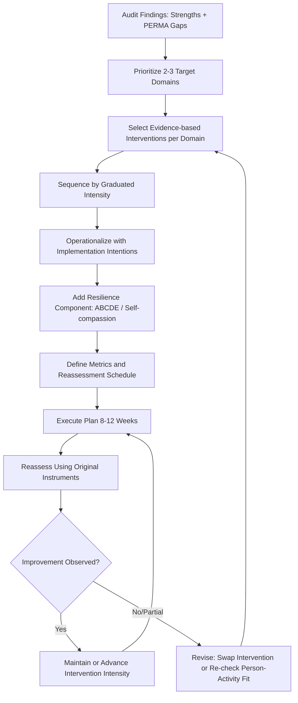

## Designing a Personalized Flourishing and Resilience Plan

### Overview

A personalized flourishing and resilience plan is the intervention-design phase that follows a personal well-being and strengths audit (see related chapter item), translating diagnostic findings into a structured, actionable, time-bound program of evidence-based positive psychology interventions (PPIs) targeted at an individual's specific gaps and leveraging their specific strengths. This topic covers the technical methodology for selecting, sequencing, and evaluating such a plan, distinct from the assessment methodology itself.

### Conceptual Foundations

**Key Points**

- **From diagnosis to prescription**: If the audit answers "where do I stand?", the plan answers "what specifically will I do, in what order, for how long, and how will I know it worked?" — the applied-practice equivalent of moving from psychological assessment to a treatment/intervention plan in clinical contexts.
- **Person-activity fit** (Lyubomirsky & Layous): A well-established finding in positive psychology intervention research is that PPI effectiveness depends heavily on fit between the intervention and the individual's personality, values, motivation, and current life circumstances — a poorly-fitting intervention (e.g., assigning a highly introverted person a large-group gratitude-sharing exercise) can underperform or even backfire relative to a well-fitted alternative achieving the same underlying mechanism.
- **Dose-response and habituation**: Positive psychology interventions show documented habituation effects — a fixed-frequency practice (e.g., writing three good things every single day indefinitely) tends to lose effectiveness over time as it becomes routine; effective plans build in variety, spacing, or intentional practice cycles to counteract this.
- **Sustainable Happiness Model** (Lyubomirsky, Sheldon & Schkade): Proposes that a fixed proportion of well-being variance is attributable to genetic set-point (~50% in the original formulation), circumstances (~10%), and intentional activity (~40%) — providing the theoretical rationale for why deliberately designed activity-based interventions (rather than circumstance-changing alone) represent the most tractable lever for individual flourishing efforts. [Unverified: these specific percentage estimates originate from a single influential theoretical model and have faced methodological critique regarding how "variance explained" was derived; treat the exact percentages as illustrative of the model's logic rather than precisely established constants.]

### Core Design Principles

| Principle | Description | Implementation Example |
| --- | --- | --- |
| Strength-gap alignment | Match interventions to leverage identified signature strengths against identified low-scoring domains | Using "Curiosity" strength to address a Relationships gap via a shared-learning social activity |
| Mechanism diversity | Target multiple PERMA pillars rather than over-concentrating on one | Pairing a gratitude practice (Positive Emotion) with a flow-inducing skill practice (Engagement) |
| Graduated intensity | Begin with low-effort, high-evidence interventions before adding complexity | Starting with a 5-minute daily gratitude journal before adding a structured strengths-application project |
| Habituation counter-measures | Vary practice format/frequency to sustain novelty and effect size | Alternating gratitude journaling with gratitude letters/visits every few weeks rather than identical daily repetition |
| Person-activity fit check | Screen candidate interventions against personality, values, and preferences before assignment | Avoiding public/social interventions for individuals scoring low on extraversion or high on social anxiety, substituting private-reflection equivalents |
| Built-in measurement | Embed pre-specified reassessment points using the same instruments as the audit | Re-administering SWLS/PERMA-Profiler at week 8-12 |
| Environmental support | Reduce reliance on willpower via implementation intentions and environmental cues | "If it is 8pm, then I write in my gratitude journal" (if-then planning per Gollwitzer's implementation intention research) |

### Step-by-Step Plan Design Protocol

**Step 1 — Import audit findings**

Begin with the completed strengths-gap pairings, PERMA domain profile, and domain satisfaction ratings from the prior audit as direct inputs; a plan should never be built independent of assessment data.

**Step 2 — Prioritize 2-3 target domains**

Resist the temptation to address every low-scoring area simultaneously. Select the 2-3 domains showing the lowest scores combined with the clearest available strength-leverage pairing, since intervention research on multi-component PPIs suggests concentrated effort typically outperforms diffuse effort across many simultaneous targets. [Inference: the specific number "2-3" reflects a common practical heuristic in applied intervention design rather than a fixed empirically-derived optimum; appropriate scope varies by individual capacity and circumstance.]

**Step 3 — Select evidence-based interventions per target domain**

Match each target domain to interventions with documented efficacy for that specific PERMA pillar or need (see table below for a reference mapping).

**Step 4 — Sequence and schedule interventions**

Arrange selected interventions on a realistic calendar, respecting graduated intensity (Step-level principle above) — e.g., weeks 1-2 introduce only the lowest-effort intervention; weeks 3-6 add a second; weeks 7-12 add a third if capacity allows.

**Step 5 — Operationalize with implementation intentions**

For each intervention, specify a concrete if-then trigger, location, and minimum viable dose (e.g., "After I pour my morning coffee, I will write one specific thing I'm grateful for in my notes app" rather than an unspecified "practice gratitude more").

**Step 6 — Build in a resilience/adversity-response component**

Distinct from flourishing-enhancement (raising the ceiling), include at least one resilience-specific practice targeting adaptive response to setbacks (e.g., cognitive reappraisal practice, a pre-written "adversity response protocol" per Seligman's ABCDE model from learned optimism research, or a self-compassion practice per Neff's framework) since flourishing and resilience are related but not identical constructs — flourishing concerns raising baseline well-being, resilience concerns maintaining function and recovering well under stress.

- **A**dversity: name the triggering situation
- **B**eliefs: identify automatic beliefs/interpretations about it
- **C**onsequences: identify emotional/behavioral consequences of those beliefs
- **D**isputation: actively challenge/dispute inaccurate or unhelpful beliefs
- **E**nergization: note the resulting shift in emotional energy after successful disputation

**Step 7 — Define success metrics and reassessment schedule**

Specify which instruments will be re-administered (matching the original audit's instruments) and at what interval (typically 8-12 weeks), plus any interim micro-metrics (e.g., weekly single-item mood check-ins) for faster feedback than the full reassessment cycle allows.

**Step 8 — Plan for revision**

Explicitly schedule a plan-revision checkpoint after the first reassessment — a resilience/flourishing plan is not static; interventions showing no measurable effect or poor adherence should be replaced rather than persisted with indefinitely.

### Evidence-Based Intervention Mapping by PERMA Pillar

| PERMA Pillar | Example Interventions | Key Evidence Source |
| --- | --- | --- |
| Positive Emotion | Three Good Things / gratitude journaling; savoring practices; Best Possible Self writing exercise | Seligman et al. (2005) PPI efficacy studies; Lyubomirsky's savoring research |
| Engagement | Signature strengths application in new ways; flow-conducive skill practice matched to challenge-skill balance | Csikszentmihalyi's flow research; Peterson & Seligman's strengths-use studies |
| Relationships | Active-constructive responding practice; gratitude visit/letter; scheduled quality time with strong ties | Gable et al.'s active-constructive responding research; Seligman's gratitude visit studies |
| Meaning | Values clarification exercises; service/volunteering; job crafting toward personal values | Steger's Meaning in Life research; Wrzesniewski's job crafting studies |
| Accomplishment | Goal-setting using implementation intentions; breaking long-term goals into tracked sub-goals | Gollwitzer's implementation intention research; goal-setting theory (Locke & Latham) |
| Resilience (cross-cutting) | ABCDE disputation practice; self-compassion practice; cognitive reappraisal training | Seligman's Learned Optimism; Neff's self-compassion research |

### Illustration: Plan Design and Feedback Loop (svg_diagram)

### Practical Example: A Sample 12-Week Plan

**Example**

Building on the sample audit from the related "strengths audit" topic (low Relationships/Friendships, high Curiosity/Perseverance, strong Engagement/Accomplishment):

- **Weeks 1-2**: Daily 5-minute gratitude journaling (if-then: "After brushing teeth at night, I write one good thing from today") — low-effort entry point targeting Positive Emotion as a foundation.
- **Weeks 3-6**: Add a weekly curiosity-driven social activity (e.g., joining a book club or evening class aligned with a genuine interest) — directly leverages the Curiosity signature strength to address the Relationships/Friendships gap identified in the audit, following the strength-gap pairing logic.
- **Weeks 4-12 (parallel track)**: Weekly ABCDE disputation practice applied to one identified stressor per week — the resilience component, chosen because Perseverance (a signature strength) can otherwise tip into unproductive rumination on setbacks without an explicit disputation practice to interrupt unhelpful belief patterns.
- **Week 8**: Interim single-item mood/satisfaction check-in (quick pulse check, not full reassessment).
- **Week 12**: Full reassessment using SWLS, SPANE, and self-rated PERMA/domain satisfaction, identical to original audit instruments, followed by a plan revision session.

### Positive Psychology Linkages

**Key Points**

- **Positive psychology interventions (PPIs) as a formal category**: This plan design methodology directly operationalizes the broader PPI literature (Sin & Lyubomirsky's meta-analytic work established that PPIs produce reliable, moderate improvements in well-being and reductions in depressive symptoms across many studies), converting general PPI menus into individualized sequences.
- **Learned optimism and explanatory style** (Seligman): The ABCDE resilience component is drawn directly from Seligman's foundational learned optimism research, distinguishing pessimistic explanatory style (permanent, pervasive, personal attributions for negative events) from optimistic style, and training active disputation as the mechanism of change.
- **Self-compassion (Neff)**: An increasingly evidence-supported alternative/complementary resilience mechanism to cognitive disputation, particularly for self-critical individuals, comprising self-kindness, common humanity, and mindfulness components.
- **Job crafting** (Wrzesniewski & Dutton): Where Meaning is a target domain and the individual's context includes paid work, job crafting (altering task, relational, or cognitive boundaries of one's job to better align with strengths and values) provides a specific, well-researched Meaning-domain intervention distinct from generic "find your purpose" exercises.

### Common Pitfalls and Practical Guidance

**Key Points**

- **Overloading the plan**: The most common design failure is assigning too many simultaneous interventions, leading to adherence collapse; graduated intensity (Step 4) exists specifically to prevent this.
- **Ignoring person-activity fit**: Applying a generically "evidence-based" intervention without checking fit against the individual's personality and circumstances (e.g., assigning volunteering to someone already experiencing burnout from caregiving obligations) can reduce rather than improve well-being.
- **Conflating flourishing-building with resilience-building**: A plan focused solely on positive-emotion-boosting activities without any adversity-response component leaves a gap in handling inevitable setbacks; Step 6's resilience component is not optional filler but addresses a genuinely distinct construct.
- **Static plans**: Failing to schedule Step 8's revision checkpoint risks persisting with non-working interventions well past the point where evidence (or simple lack of adherence) suggests a change is needed.
- **Neglecting environmental design**: Relying purely on motivation/willpower rather than implementation intentions and environmental cues is a well-documented predictor of intervention non-adherence in behavior change research generally, not unique to positive psychology.

### Related Topics

- Conducting a personal well-being and strengths audit (assessment phase preceding this plan)
- Positive psychology interventions (PPI) meta-analytic evidence (Sin & Lyubomirsky)
- Sustainable Happiness Model (Lyubomirsky, Sheldon & Schkade): set point, circumstances, intentional activity
- Learned optimism and the ABCDE model (Seligman) in depth
- Self-compassion framework (Neff): three components and measurement
- Implementation intentions and if-then planning (Gollwitzer) for behavior change
- Job crafting (Wrzesniewski & Dutton): task, relational, and cognitive crafting
- Habituation and the hedonic treadmill: designing interventions that resist adaptation
- Active-constructive responding (Gable) for relationship-focused interventions