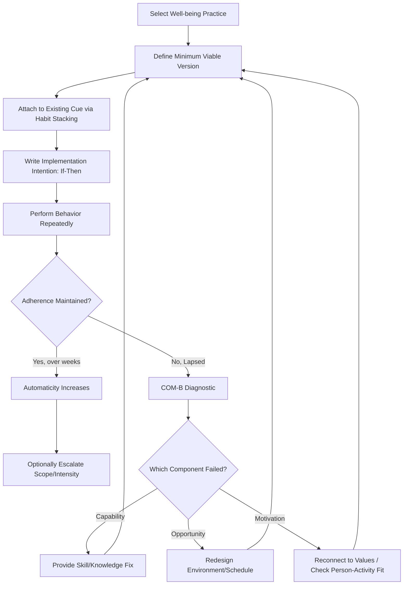

## Habit Formation and Behavior Change for Sustained Well-Being

### Overview

This topic addresses the behavioral science underlying why well-being interventions succeed or fail over time, independent of whether the intervention itself is evidence-based. A positive psychology intervention (gratitude journaling, strengths application, exercise) only produces sustained well-being gains if it is actually performed consistently over time — making habit formation and behavior change science the operational infrastructure that determines whether a flourishing and resilience plan (see related chapter item) succeeds or is abandoned. This topic synthesizes habit formation research, self-regulation theory, and behavior change frameworks as applied specifically to well-being practices.

### Conceptual Foundations

**Key Points**

- **The intervention-adherence gap**: A substantial portion of positive psychology intervention research finds that effect sizes correlate strongly with adherence/dosage — an intervention with strong average population-level efficacy in a study still fails for any individual who does not actually sustain the practice; this reframes "which intervention is best" as partly a secondary question to "which intervention will I actually keep doing."
- **Habit as automaticity**: In behavioral science, a habit is technically defined as a learned association between a contextual cue and a behavioral response that, with repetition, becomes increasingly automatic (requiring less conscious deliberation, motivation, or willpower) — distinct from merely "a behavior done often," since the defining feature is automaticity, not frequency alone.
- **The Habit Loop** (cue-routine-reward, popularized by Duhigg, drawing on earlier behavioral psychology): A widely used simplified model in which an environmental or internal cue triggers a routine (the behavior), which produces a reward, reinforcing the cue-routine association for future repetition.
- **Habit formation timeline**: Lally et al.'s (2010) frequently cited study found that time to reach automaticity varied widely across individuals and behaviors, with an average around 66 days but a wide range (18 to 254 days) depending on behavior complexity and individual differences — a substantially longer and more variable timeline than the popularly circulated "21 days" claim, which has no strong empirical basis. [Unverified: this specific mean/range comes from a single study using self-report automaticity ratings for simple health behaviors; generalizability across all behavior types, especially complex psychological practices like gratitude journaling or meditation, has not been comprehensively established across the broader habit literature.]

### Core Behavior Change Frameworks Applied to Well-Being Practices

| Framework | Core Mechanism | Application to Well-Being Practice |
| --- | --- | --- |
| Implementation Intentions (Gollwitzer) | Pre-committing to a specific if-then plan reduces reliance on in-the-moment willpower | "If it is 9pm, then I write three good things in my journal" |
| Habit Stacking (Fogg, Clear) | Anchoring a new habit to an already-automatic existing behavior/routine | "After I pour my morning coffee (existing habit), I will name one thing I'm grateful for" |
| Tiny Habits / Minimum Viable Habit (Fogg) | Starting with a deliberately trivial version of the behavior to minimize the motivation required to begin | Committing to "write one word" in a gratitude journal rather than "write a full page," removing the initiation barrier |
| Self-Determination Theory (Deci & Ryan) | Autonomous motivation (behavior aligned with genuine values/interest) sustains behavior better than controlled motivation (guilt, external pressure) | Choosing a strengths-application activity genuinely enjoyed rather than one selected only because "it's evidence-based" |
| COM-B Model (Michie et al.) | Behavior requires sufficient Capability, Opportunity, and Motivation simultaneously | Diagnosing why a practice isn't sticking: is it a skill/knowledge gap (Capability), an environmental/access barrier (Opportunity), or a motivation problem? |
| Transtheoretical Model / Stages of Change (Prochaska & DiClemente) | Behavior change progresses through identifiable stages (precontemplation, contemplation, preparation, action, maintenance) requiring different support at each stage | Recognizing that someone in "contemplation" needs motivational/values-clarification support, not an action plan yet |

### The COM-B Model: Technical Detail

The **COM-B model** (Michie, van Stralen & West, 2011) is among the more systematically structured diagnostic frameworks for identifying *why* a specific well-being behavior is not being sustained, proposing that behavior (B) occurs only when three conditions are jointly sufficient:

$$B = f(C, O, M)$$

Where:

- **Capability (C)**: Physical and psychological capacity to perform the behavior (e.g., knowing *how* to do a disputation exercise correctly; having sufficient working memory/executive function bandwidth in a period of high stress)
- **Opportunity (O)**: Physical and social environment enabling the behavior (e.g., having a quiet 5 minutes available; a social environment that doesn't stigmatize the practice)
- **Motivation (M)**: Reflective (conscious intentions, beliefs about value) and automatic (habitual impulses, emotional drives) processes directing behavior

**Diagnostic application**: If a gratitude journaling habit has lapsed, COM-B directs troubleshooting toward identifying which component failed — a Capability failure (forgot the specific method), Opportunity failure (no longer has a quiet evening routine after a schedule change), or Motivation failure (lost genuine interest/perceived value) — since the appropriate fix differs substantially by category (a Capability fix is instructional; an Opportunity fix is environmental/logistical; a Motivation fix may require values reconnection or person-activity refit).

### Implementation Intentions: Technical Detail

**Implementation intentions** (Gollwitzer, 1999) are a specific and heavily evidence-supported self-regulation technique with a precise structural format:

$$\text{"If } [situational\ cue], \text{ then I will } [specific\ behavior]\text{."}$$

**Mechanism**: This pre-commitment works by transferring initiation control from effortful conscious decision-making (which is vulnerable to competing demands, fatigue, and self-regulatory depletion) to automatic, cue-triggered responding — effectively "pre-loading" the decision so it doesn't need to be remade under real-time conditions when willpower may be depleted. Meta-analytic evidence (Gollwitzer & Sheeran, 2006) found implementation intentions produce a medium-to-large effect on goal attainment across diverse behavior domains, making this among the more robustly supported single techniques in the behavior change literature broadly, not specific to well-being practices alone.

**Example**

Compare a **goal intention** ("I will practice gratitude more") against an **implementation intention** ("If it is 8:00pm and I am brushing my teeth, then I will think of one specific good thing from today"). The second version specifies an exact, unambiguous, recognizable cue (a specific time plus an existing routine behavior) and an exact response, removing the need for in-the-moment deliberation about whether, when, or how to act — the primary mechanism by which implementation intentions outperform vague intentions in adherence research.

### Habit Stacking and Tiny Habits: Reducing the Initiation Barrier

**Key Points**

- **Habit stacking** (a term popularized by James Clear, building on B.J. Fogg's earlier "anchor" concept) links a new target behavior to an existing, already-automatic behavior, borrowing the existing habit's established cue-strength rather than requiring the new behavior to establish its own novel cue from scratch.
- **Tiny Habits methodology** (Fogg): Recommends deliberately shrinking the initial version of a new habit to the smallest possible unit (e.g., "one push-up," "one sentence of journaling") specifically to minimize the motivation threshold required for the behavior's first repetitions, on the theoretical basis (Fogg Behavior Model: $B = MAT$, i.e., Behavior occurs when Motivation, Ability, and a Trigger converge) that reducing required Ability (making the task trivially easy) compensates for naturally fluctuating Motivation.
- **Escalation after establishment**: Both frameworks recommend allowing the habit to naturally escalate in scope only after automaticity is established at the minimal version, rather than starting at the intended full-scope version and risking early abandonment.

### Illustration: Habit Formation and Troubleshooting Loop (svg_diagram)

### Practical Example: Troubleshooting a Lapsed Practice

**Example**

An individual committed to a weekly gratitude-letter practice (from their flourishing plan) but has not completed one in three weeks. Applying COM-B diagnosis:

- **Capability check**: Do they still know how to write an effective gratitude letter (specific, addressed to a specific person, describing specific impact)? If yes, rule out Capability.
- **Opportunity check**: Has their schedule changed such that the previously-used Sunday-afternoon time slot is no longer free? If yes, this points to an Opportunity failure requiring a new cue/time slot rather than a motivation intervention.
- **Motivation check**: If schedule and skill are both intact but the person reports "I just don't feel like it anymore," this points to a Motivation failure, prompting a person-activity fit reassessment — possibly the practice's format (a full letter) is too effortful relative to genuine interest, suggesting a tiny-habit downgrade (e.g., a one-line gratitude text message) rather than abandoning the underlying gratitude-practice goal entirely.

This example demonstrates why undifferentiated troubleshooting ("try harder," "be more disciplined") is less effective than component-specific diagnosis — the appropriate fix differs entirely depending on which COM-B component actually failed.

### Positive Psychology Linkages

**Key Points**

- **Self-Determination Theory and autonomous motivation**: SDT's distinction between autonomous motivation (intrinsic interest, personally endorsed values) and controlled motivation (external pressure, guilt, "should") predicts that well-being practices adopted for autonomous reasons show better long-term adherence — directly relevant to the person-activity fit principle in flourishing plan design.
- **Positive affect as a natural reward signal**: Practices that reliably produce genuine positive affect in the moment of practice (not just as a distal outcome) more readily complete the habit loop's "reward" component, suggesting well-designed well-being habits should be checked for immediate, not just eventual, reinforcement value.
- **Broaden-and-build relevance**: [Inference] Fredrickson's broaden-and-build theory, which proposes positive emotions broaden momentary thought-action repertoires and build lasting resources, offers a theoretical account of why successfully habituated positive practices may produce compounding benefits over time beyond the direct effect of any single instance — though direct empirical linkage between broaden-and-build theory and habit-formation-specific mechanisms is a less thoroughly established area than either literature independently.
- **Relapse as data, not failure**: Consistent with self-compassion research (Neff) and the Transtheoretical Model's recognition of relapse as a normal stage-cycle feature rather than a terminal failure, applied practice guidance typically frames lapsed well-being habits as diagnostic information (per the COM-B troubleshooting example above) rather than evidence of personal inadequacy — itself a self-compassionate framing consistent with sustained behavior change literature.

### Common Pitfalls and Practical Guidance

**Key Points**

- **All-or-nothing thinking**: Treating a single missed day as "breaking the streak" and therefore abandoning the practice entirely is a well-documented adherence failure pattern; framing missed instances as recoverable lapses rather than terminal failures (consistent with relapse-prevention research broadly) improves long-term persistence.
- **Underestimating environmental design**: Behavior change research consistently finds that environmental/contextual factors (Opportunity in COM-B terms) are often under-weighted relative to willpower/motivation-focused explanations when people self-diagnose their own habit failures.
- **Scaling too fast**: Escalating a tiny habit's scope before automaticity is genuinely established (jumping from "one sentence" to "one page" after only a few days) risks re-triggering the original motivation barrier the tiny-habit approach was designed to avoid.
- **Ignoring the reward component**: A cue and routine without a genuinely satisfying reward (even a small, immediate one, such as a brief moment of noticing genuine positive affect) weakens the habit loop's reinforcement, regardless of how well the cue and implementation intention are specified.
- **Treating all well-being practices as equally habit-forming**: Practices with a clear, brief, unambiguous action (gratitude journaling) are structurally easier to habituate than open-ended or context-dependent practices (e.g., "practice active-constructive responding" requires recognizing an unpredictable social opportunity rather than a fixed daily cue), and plans should account for this difference in specifying cues.

### Related Topics

- Designing a personalized flourishing and resilience plan (the plan this habit science supports)
- COM-B Model and the Behaviour Change Wheel (Michie, Atkinson & West) in full
- Implementation intentions: meta-analytic evidence (Gollwitzer & Sheeran, 2006)
- Self-Determination Theory: autonomous vs. controlled motivation and sustained behavior change
- Fogg Behavior Model (B=MAT) and Tiny Habits methodology
- Transtheoretical Model / Stages of Change (Prochaska & DiClemente)
- Relapse prevention research and self-compassion (Neff) in habit maintenance
- Broaden-and-build theory (Fredrickson) and compounding positive-emotion effects