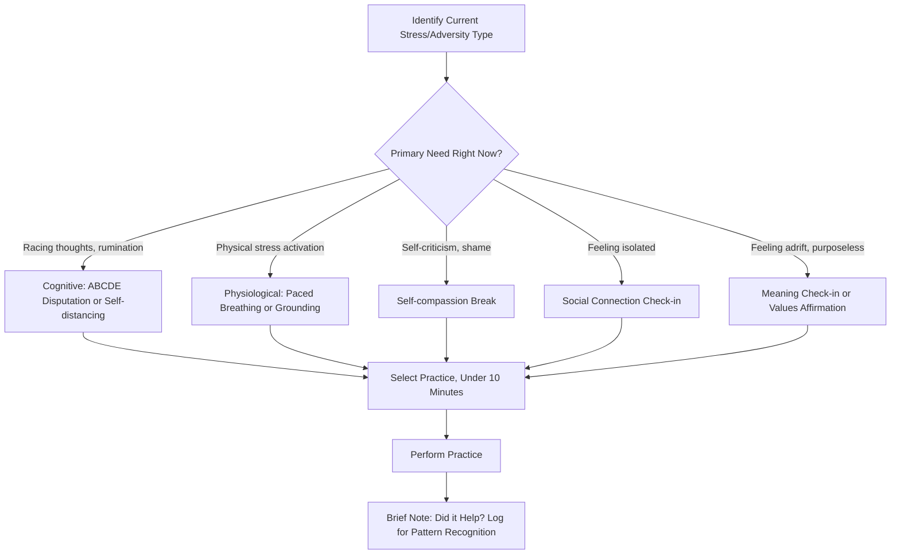

## A Practical Toolkit of Daily Resilience-Building Practices

### Overview

This topic compiles a curated, evidence-informed set of brief, dailyable practices specifically targeting resilience — the capacity to maintain functioning and recover adaptively under stress, adversity, or setback — as distinct from general flourishing-enhancement practices. Where the flourishing plan (see related chapter item) addresses raising overall well-being, this toolkit focuses narrowly on practices with demonstrated or theoretically grounded mechanisms for building adaptive capacity specifically under difficulty, formatted for direct daily or near-daily implementation.

### Conceptual Foundations

**Key Points**

- **Resilience as capacity, not trait fixity**: Contemporary resilience research (e.g., work following Bonanno's studies of trajectories after loss and trauma) treats resilience as a dynamic, buildable capacity rather than a fixed personality trait some people simply have and others lack — the premise underlying any toolkit-based approach to resilience-building.
- **Resilience vs. flourishing distinction**: Flourishing concerns raising the baseline/ceiling of well-being during ordinary conditions; resilience concerns maintaining functioning and recovering well specifically under adversity — related but empirically and conceptually distinct constructs, meaning practices effective for one do not automatically transfer to the other.
- **Multiple pathways, not one mechanism**: Resilience research does not point to a single "resilience practice" but rather several partially independent mechanisms (cognitive reappraisal, physiological regulation, social support activation, meaning-making, self-compassion) — a toolkit approach reflects this by offering practices across mechanisms rather than over-relying on one.
- **Brevity and daily feasibility**: Unlike more intensive interventions (structured strengths-application projects, multi-week programs), this toolkit specifically emphasizes practices completable in under 10-15 minutes, reflecting the practical reality that resilience-building must fit into ordinary daily life to be sustained (see the related "habit formation" topic for adherence mechanics).

### The Toolkit: Practices by Mechanism

| Mechanism | Practice | Approximate Duration | Primary Evidence Base |
| --- | --- | --- | --- |
| Cognitive reappraisal | ABCDE disputation of one negative automatic thought | 5-10 min | Seligman's Learned Optimism / cognitive-behavioral tradition |
| Physiological regulation | Diaphragmatic breathing / paced breathing (e.g., 4-6 breathing pattern) | 3-5 min | Heart-rate variability and vagal tone research |
| Positive emotion cultivation | Three Good Things journaling | 5 min | Seligman et al. (2005) PPI studies |
| Self-compassion | Self-compassion break (three-component practice) | 3-5 min | Neff's self-compassion research |
| Meaning-making | One-sentence "meaning check-in": naming why today's effort mattered | 2-3 min | Steger's meaning in life research |
| Social connection | Brief genuine check-in message to one person | 3-5 min | Social support literature; belongingness research |
| Body-based grounding | 5-4-3-2-1 sensory grounding technique | 3-5 min | Mindfulness/grounding techniques from trauma-informed practice |
| Cognitive distancing | Third-person self-talk about a current stressor | 2-3 min | Kross's self-distancing research |
| Values reconnection | Brief values-affirmation writing | 5 min | Self-affirmation theory (Steele) |
| Strengths micro-application | Using one signature strength in a small, new way today | Variable, low-effort | VIA strengths-application research |

### Detailed Protocol: The ABCDE Disputation Practice

Drawn from Seligman's learned optimism framework, this is among the most structured cognitive resilience tools:

1. **A — Adversity**: Write one sentence naming the specific triggering event objectively (e.g., "My presentation feedback included three critical comments").
2. **B — Beliefs**: Write the automatic belief/interpretation that arose (e.g., "I'm not good at this job and everyone noticed").
3. **C — Consequences**: Note the emotional and behavioral consequence of that belief (e.g., "Felt anxious, avoided checking email for the rest of the day").
4. **D — Disputation**: Actively challenge the belief using evidence, alternative explanations, and implications questioning (e.g., "Is this belief accurate? What's the evidence against it? Even if partly true, does it mean I'm fundamentally bad at this job, or that this one presentation needs revision?").
5. **E — Energization**: Note the resulting shift in emotional state after successful disputation (e.g., "Feel calmer, motivated to revise rather than avoid").

**Example**

A person receives critical feedback on a work project. Applying ABCDE: (A) "My manager flagged three issues with my report." (B) "I'm incompetent and going to get fired." (C) Feels anxious, ruminates through the evening. (D) Disputes: "One report with issues doesn't erase two years of positive reviews; the manager gave specific, fixable feedback, not a global judgment; feeling anxious doesn't mean the catastrophic interpretation is accurate." (E) Notices feeling calmer and more able to plan concrete revisions rather than avoiding the task. This demonstrates the disputation step doing the actual cognitive work — the shift in belief, not merely "thinking positive," produces the emotional and behavioral change.

### Detailed Protocol: Self-Compassion Break (Neff)

Kristin Neff's self-compassion framework comprises three components, operationalized as a brief practice:

1. **Mindfulness** ("This is a moment of suffering" / "This hurts"): Acknowledging the difficulty without exaggeration or suppression.
2. **Common humanity** ("Suffering is part of being human" / "Others struggle with this too"): Countering isolation by recognizing shared human experience of difficulty.
3. **Self-kindness** ("May I be kind to myself in this moment" / a physical gesture like a hand on the heart): Actively offering oneself the same warmth one would offer a friend.

**Distinction from self-esteem**: [Inference] Neff's research program has specifically argued self-compassion produces more stable resilience benefits than self-esteem-boosting approaches, because self-compassion does not depend on comparative or achievement-based evaluation (which can be threatened by failure) — self-compassion remains available precisely during failure or inadequacy, when self-esteem-based strategies are least accessible.

### Detailed Protocol: Self-Distancing (Kross)

Ethan Kross's self-distancing research demonstrates that shifting linguistic self-reference during self-reflection on a stressor changes the psychological experience of that reflection:

**Mechanism**: Reflecting on a stressor using first-person language ("Why am I so anxious about this?") tends to amplify rumination and emotional reactivity, whereas reflecting using one's own name or second/third-person language ("Why is [Name] so anxious about this?" or "Why are you so anxious about this?") creates psychological distance that supports more adaptive processing, similar to the perspective one might take advising a friend.

**Example**

Instead of internally repeating "I can't believe I said that, I'm so embarrassed," a self-distanced version would be: "[Name], you said something you regret — what would you tell a friend who did the same thing?" This linguistic shift is a low-effort, immediately deployable technique requiring no special training beyond awareness of the technique itself.

### Illustration: Toolkit Selection Logic (svg_diagram)

### Toolkit Assembly: A Sample Daily Structure

**Example**

A sample daily resilience routine combining toolkit elements across a low-stress baseline day versus a high-stress day, illustrating adaptive selection rather than rigid fixed sequencing:

**Baseline day** (maintenance mode): Morning — 5-minute Three Good Things journaling. Evening — brief values reconnection note ("What mattered to me today?").

**High-stress day** (acute adversity encountered): Immediate — paced breathing (3-5 min) for physiological regulation before any cognitive work. Within the hour — ABCDE disputation if a specific triggering belief is identifiable, or self-compassion break if the primary experience is self-criticism/shame rather than a disputable belief. Evening — brief social connection check-in as a buffering practice, plus a shortened Three Good Things (even acknowledging something small) to prevent the day from being coded as uniformly negative in memory.

This illustrates the toolkit's intended use: not a fixed daily checklist but a mechanism-matched selection made based on the specific need of the moment, consistent with the COM-B/person-activity fit principles discussed in the related habit formation topic.

### Positive Psychology Linkages

**Key Points**

- **Learned optimism and explanatory style** (Seligman): The ABCDE practice is the direct applied tool derived from decades of explanatory style research distinguishing resilient (optimistic, specific, external-when-appropriate) from vulnerable (pessimistic, global, internal) attributional patterns for negative events.
- **Broaden-and-build theory** (Fredrickson): Practices generating genuine positive affect even briefly (Three Good Things, savoring) are theoretically linked to broadened cognitive-behavioral repertoires and resource-building, offering a mechanism for why brief daily positive-emotion practices may compound into greater resilience capacity over time.
- **Post-traumatic growth research** (Tedeschi & Calhoun): [Inference] Meaning-making practices in this toolkit draw conceptually on post-traumatic growth literature, which finds that some individuals derive genuine psychological growth (not merely recovery to baseline) from processing significant adversity — though this toolkit's brief daily meaning check-ins are a lower-intensity, everyday-stress-oriented application rather than a direct intervention for significant trauma, which typically requires more intensive, often clinically-supported processes.
- **Self-compassion as an alternative resilience pathway to self-esteem**: Neff's body of work represents a distinct branch within positive psychology's broader resilience literature, offering an alternative to more achievement/comparison-based resilience-building approaches.

### Practical Guidance and Common Pitfalls

**Key Points**

- **Match practice to actual need, not habit alone**: As the daily structure example illustrates, effective toolkit use involves diagnosing the specific stress type/mechanism needed (cognitive, physiological, social, self-evaluative) rather than mechanically performing the same practice regardless of context.
- **Severity ceiling**: This toolkit is designed for everyday stressors and ordinary adversity, not as a substitute for professional mental health support in cases of significant, persistent distress, trauma, or clinical-level symptoms — brief self-help practices have a documented ceiling of applicability and are not designed to replace therapy or crisis intervention when those are indicated.
- **Avoid toxic positivity framing**: Practices like Three Good Things or gratitude journaling are not intended to suppress or invalidate genuine negative emotions; resilience research explicitly distinguishes healthy emotional processing from avoidance/suppression, and toolkit practices should be framed as complementing rather than bypassing acknowledgment of difficulty (as the ABCDE and self-compassion protocols explicitly build in acknowledgment steps before any reframing).
- **Individual variation in mechanism effectiveness**: Not every practice will resonate equally for every individual (see person-activity fit, covered in the related flourishing plan topic); the toolkit's breadth across mechanisms exists specifically so individuals can identify which specific tools are personally effective through trial rather than assuming uniform efficacy.
- **Pattern logging value**: The brief "did it help?" logging step in the illustration is a low-effort but valuable practice, since it allows a person to build their own personalized evidence base about which toolkit elements are genuinely effective for them specifically, rather than relying solely on population-level research findings.

### Related Topics

- Designing a personalized flourishing and resilience plan (the broader plan this toolkit supports)
- Habit formation and behavior change for sustained well-being (adherence mechanics for toolkit practices)
- Learned optimism and explanatory style (Seligman) in full
- Self-compassion (Neff): three components and empirical distinction from self-esteem
- Self-distancing research (Kross): linguistic mechanisms and applications
- Post-traumatic growth (Tedeschi & Calhoun) vs. everyday resilience-building
- Broaden-and-build theory (Fredrickson) and positive emotion micro-practices
- Heart-rate variability and physiological regulation techniques for stress resilience
- Recognizing when professional mental health support is indicated beyond self-help toolkits