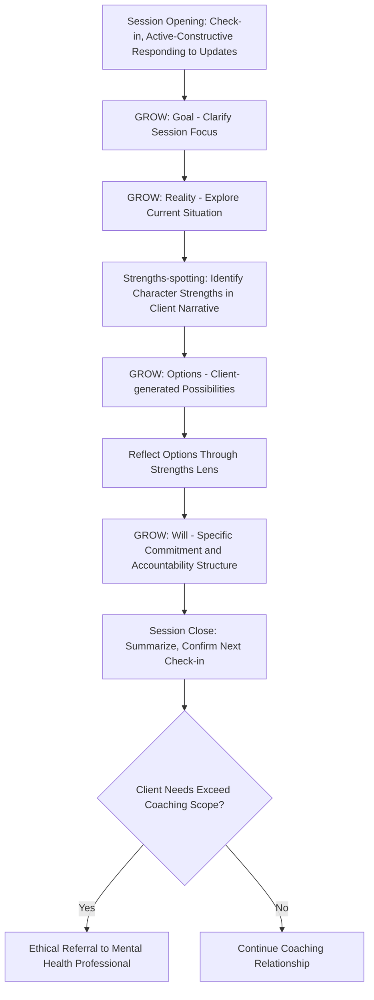

## Positive Psychology Coaching Skills and Facilitation

### Overview

This topic addresses the practitioner-facing skill set required to deliver positive psychology content to others — whether as a professional coach, a workplace facilitator, an educator, or a peer supporter — as distinct from the self-applied audit and planning methodologies covered in prior chapter items. Positive psychology coaching applies well-being science (PERMA, character strengths, resilience mechanisms) within a structured coaching relationship, requiring specific facilitation competencies beyond knowledge of the underlying theory itself: active listening, powerful questioning, strengths-spotting in real time, and ethical practice boundaries.

### Conceptual Foundations

**Key Points**

- **Coaching vs. therapy vs. mentoring distinction**: Positive psychology coaching is typically distinguished from psychotherapy by its focus on growth, goal-attainment, and flourishing enhancement in a generally non-clinical population, rather than diagnosis and treatment of psychopathology; it differs from mentoring in that a coach generally does not need direct subject-matter expertise in the client's specific goal domain, instead facilitating the client's own expertise and self-generated solutions. [Inference: these distinctions are professionally and conceptually important but boundaries can blur in practice, and formal scope-of-practice definitions vary by professional body and jurisdiction.]
- **Evidence-based coaching movement**: Positive psychology coaching is part of a broader "evidence-based coaching" movement (associated with researchers such as Anthony Grant) that emphasizes grounding coaching practice in empirically supported psychological theory and outcome measurement, rather than purely intuitive or anecdotal coaching approaches.
- **The coach as facilitator, not expert-advisor**: A foundational stance across most coaching methodologies (including the GROW model and solution-focused approaches) positions the coach as facilitating the client's own insight and self-directed solution generation rather than providing direct advice or answers — a stance requiring specific disciplined facilitation skill rather than simply "being a positive psychology expert who talks to people."
- **Strengths-spotting as a core skill**: Distinct from administering a formal strengths assessment (e.g., the VIA Survey), strengths-spotting is the real-time facilitation skill of noticing and reflecting back character strengths as they show up in a client's language and stories during a session — a skill requiring practiced pattern-recognition of the VIA taxonomy's 24 strengths in naturalistic conversation.

### Core Coaching Competencies

| Competency | Description | Illustrative Technique |
| --- | --- | --- |
| Active listening | Full attention to verbal and non-verbal content, reflecting understanding back accurately | Paraphrasing, summarizing, reflecting emotional undertones |
| Powerful questioning | Open-ended questions that provoke genuine reflection rather than yes/no or leading responses | "What would that look like if it were already true?" rather than "Don't you think you should try X?" |
| Strengths-spotting | Real-time identification and reflection of character strengths as they appear in client narrative | Noticing when a client describes overcoming a setback and naming "That sounds like real perseverance" |
| Active-constructive responding | Responding to a client's positive news in a way that amplifies rather than deflates it | Enthusiastic, elaborative engagement with good news rather than passive or minimizing acknowledgment |
| Goal-setting facilitation | Helping clients articulate specific, values-aligned, and appropriately challenging goals | Using frameworks like GROW or SMART goals collaboratively rather than prescriptively |
| Holding space / non-judgment | Creating psychological safety for genuine disclosure without evaluation | Suspending visible judgment even when a client's stated goal seems suboptimal to the coach |
| Accountability structuring | Establishing follow-through mechanisms between sessions | Collaboratively defining specific commitments and check-in methods |
| Ethical boundary recognition | Recognizing when a client's needs exceed coaching's appropriate scope | Recognizing signs warranting referral to a mental health professional rather than continued coaching |

### The GROW Model: Technical Structure

**GROW** (Whitmore) is among the most widely used general coaching frameworks, adaptable to positive psychology-specific content:

1. **G — Goal**: What does the client want to achieve, ideally specific and time-bound? ("What would you like to focus on today / by when?")
2. **R — Reality**: What is the current situation, including relevant facts, obstacles, and resources already present? ("What have you already tried? What's currently working?")
3. **O — Options**: What possible paths forward exist, generated primarily by the client rather than supplied by the coach? ("What are some ways you could approach this? What else?")
4. **W — Will (or Way Forward)**: What specific action will the client commit to, and how will accountability be structured? ("What will you do, by when, and how will you know you've done it?")

**Application to positive psychology content**: When the coaching goal involves a well-being-specific target (e.g., "I want to feel more engaged at work"), the Reality stage can be enriched using PERMA-Profiler or VIA strengths data if available (per the related "strengths audit" topic), and the Options stage can be explicitly prompted toward strength-leveraging options ("Given that Curiosity is a strength you've named, what options come to mind that would use that?").

### Active-Constructive Responding: Technical Detail

Drawn from Shelly Gable's relationship research, **active-constructive responding (ACR)** is both a coaching-relationship skill (how the coach responds to client disclosures) and a teachable client skill (for the client's own relationships) with a defined 2x2 structure:

|  | Constructive | Destructive |
| --- | --- | --- |
| **Active** | Enthusiastic, engaged, elaborative response ("That's wonderful! Tell me more about how that happened.") | Pointing out downsides/problems actively ("That's great, but did you consider the risk of...?") |
| **Passive** | Understated, low-energy acknowledgment ("That's nice.") | Ignoring or changing the subject entirely |

Gable's research found that active-constructive responding to good news is more strongly associated with relationship quality outcomes than how a partner (or, by extension, a coach) responds to *bad* news — making ACR a specific, trainable technique for the "Relationships" (R) pillar of PERMA when applied to a client's own life, and a technique the coach should model directly within the coaching relationship itself.

### Powerful Questioning: Design Principles

**Key Points**

- **Open vs. closed structure**: Effective coaching questions are constructed to require elaborative reflection ("What has that experience taught you about yourself?") rather than binary or fact-recall responses ("Did that experience teach you something?").
- **Avoiding embedded advice ("leading questions")**: A common facilitation error is asking questions that actually smuggle in the coach's own suggested answer ("Don't you think you'd feel better if you exercised more?"), which undermines the client-centered, self-generated-insight principle central to most coaching methodologies.
- **Future-oriented and possibility-focused framing**: Positive psychology coaching in particular favors questions oriented toward strengths, possibility, and desired future states (consistent with strengths-based and solution-focused traditions) over exclusively problem-analysis questions, without avoiding acknowledgment of genuine difficulty.
- **The "miracle question" technique** (adapted from solution-focused brief therapy, Steve de Shazer): "If you woke up tomorrow and this problem were completely solved, what would be different? What would you notice first?" — used to bypass analysis-paralysis about the problem itself and surface concrete, actionable descriptions of the desired outcome.

### Illustration: A Positive Psychology Coaching Session Flow (svg_diagram)

### Practical Example: A Coaching Exchange Illustrating Multiple Skills

**Example**

**Client**: "I finally gave that presentation I'd been avoiding for weeks. It actually went okay."

**Weak response (passive-constructive)**: "Oh good, glad it went fine." *(Minimal engagement, missed opportunity.)*

**Strong response (active-constructive + strengths-spotting)**: "That's a big deal — you'd been avoiding it for weeks and you did it anyway. What got you to finally go ahead with it? [pause for elaboration] ... It sounds like real courage to walk into that room after weeks of dreading it. What did you notice in yourself once you started?"

This example demonstrates active-constructive responding (enthusiastic engagement, follow-up elaboration prompts) combined with strengths-spotting (naming "courage," a VIA character strength, based on the client's own description rather than a formal assessment) combined with powerful, open-ended questioning ("What got you to..." rather than a closed "Are you glad you did it?"), illustrating how these distinct competencies operate together within a single brief exchange.

### Positive Psychology Linkages

**Key Points**

- **VIA Classification as the strengths-spotting vocabulary**: Effective strengths-spotting requires internalized familiarity with the VIA taxonomy's 24 strengths and their behavioral manifestations, since a coach cannot reflect back a strength they cannot recognize in naturalistic language.
- **PERMA as a diagnostic and goal-organizing lens**: Many positive psychology coaching approaches use the PERMA framework not just as an assessment tool (per the related strengths audit topic) but as a live conversational lens — helping a coach notice, for instance, that a client's stated goals cluster heavily around Accomplishment while neglecting Relationships, prompting exploratory questions about the underdeveloped pillar.
- **Hope theory application** (Snyder): Hope theory's distinction between agency thinking ("I can do this") and pathways thinking ("I know how to do this, or can find out") maps directly onto GROW's Options and Will stages, giving coaches a theoretical basis for diagnosing whether a client's stuckness reflects an agency deficit or a pathways deficit, which call for different facilitation responses.
- **Well-being theory as content, coaching skill as delivery mechanism**: This topic emphasizes that possessing accurate positive psychology knowledge (PERMA, strengths, resilience mechanisms — covered in prior chapter items) is necessary but insufficient for effective practitioner-facilitated application; the facilitation skills covered here are the delivery mechanism through which that knowledge becomes actionable for another person.

### Ethical and Scope-of-Practice Considerations

**Key Points**

- **Scope boundaries**: Positive psychology coaching is generally intended for a non-clinical population pursuing growth and flourishing goals; coaches without clinical mental health training should recognize signs suggesting a client's needs exceed coaching's appropriate scope (e.g., persistent significant distress, symptoms suggestive of a mental health condition, safety concerns) and have a clear, prepared referral pathway to appropriate mental health professionals.
- **Professional credentialing landscape**: Coaching, unlike clinical psychology or counseling in most jurisdictions, has historically had less standardized or legally regulated credentialing; organizations such as the International Coaching Federation (ICF) provide voluntary certification and ethical standards frameworks, but requirements and enforcement vary substantially by region and are not equivalent to clinical licensure. [Unverified: specific credentialing/regulatory requirements vary by jurisdiction and are subject to change; practitioners should verify current requirements applicable to their specific location and practice context.]
- **Avoiding scope creep into unlicensed clinical practice**: A coach without clinical training should avoid activities that functionally constitute diagnosis or treatment of mental health conditions, even if using seemingly similar techniques (e.g., a general resilience-building conversation is distinct from trauma-focused clinical intervention, and the boundary should be actively maintained rather than assumed self-evident).
- **Informed consent and confidentiality norms**: Even outside formal clinical contexts, ethical coaching practice typically involves clarity with clients about confidentiality boundaries, the non-therapeutic nature of the relationship where applicable, and the coach's own scope and limitations, established at the outset of the coaching relationship.

### Related Topics

- VIA Classification of Character Strengths: taxonomy and strengths-spotting practice
- Active-constructive responding (Gable): full 2x2 model and relationship research
- GROW model and alternative coaching frameworks (solution-focused brief therapy, CLEAR model)
- Hope theory (Snyder): agency and pathways thinking in goal facilitation
- Conducting a personal well-being and strengths audit (content a coach may help a client work through)
- Ethics and scope-of-practice boundaries between coaching and clinical mental health services
- International Coaching Federation (ICF) competency framework and certification standards
- Motivational interviewing as a complementary client-centered facilitation methodology