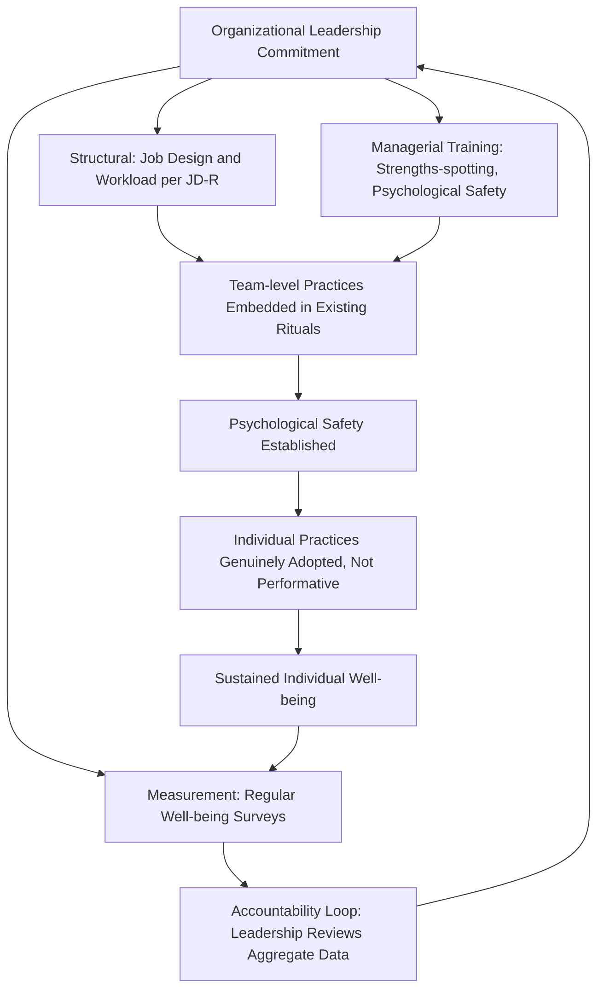

## Integrating Well-Being and Resilience Practice into Daily and Organizational Life

### Overview

This topic addresses the capstone integration challenge of applied positive psychology: moving well-being and resilience practices from isolated individual techniques (covered in prior chapter items — audits, plans, daily toolkits, coaching) into durable, embedded features of both personal daily life and organizational systems. It examines the distinct but related challenges of individual-level sustained integration versus organizational-level culture and systems change, since practices that work for a single motivated individual do not automatically scale to a team, department, or institution without deliberate systemic design.

### Conceptual Foundations

**Key Points**

- **From intervention to infrastructure**: A recurring finding across applied positive psychology is that isolated interventions (a single workshop, a temporary challenge, a standalone app) tend to produce short-lived effects that decay once the novel program ends, whereas integration into existing routines, defaults, and systems produces more durable change — paralleling the habit-formation principle (see related topic) that automaticity, not motivation alone, sustains behavior.
- **Individual integration vs. organizational integration are distinct problems**: Embedding a practice into one's own daily routine is primarily a self-regulation and habit-design challenge (addressed in the related habit formation topic); embedding well-being practice into an organization additionally requires addressing incentive structures, leadership modeling, resource allocation, and cultural norms that operate independently of any single employee's motivation.
- **Ecological systems perspective**: Effective integration typically requires attention to multiple nested levels simultaneously — the individual (personal practice), the immediate group/team (norms, psychological safety), and the broader organization or institution (policy, resource allocation, leadership behavior) — since interventions targeting only one level often get undermined by unaddressed factors at another level (e.g., an individual mindfulness practice undermined by an organizational culture that penalizes taking breaks).
- **Job Demands-Resources (JD-R) Model** (Bakker & Demerouti): An influential organizational psychology framework proposing that employee well-being and engagement depend on the balance between job demands (workload, time pressure, emotional labor) and job resources (autonomy, social support, feedback, growth opportunities) — providing a systems-level diagnostic framework distinct from purely individual-level well-being audits.

### Individual-Level Integration: Beyond the Isolated Habit

**Key Points**

- **Routine embedding vs. added task**: Practices integrated into existing daily transition points (start of workday, commute, meal times, end of day) tend to persist better than practices treated as an additional separate task competing for discretionary time and willpower — directly connecting to the habit-stacking principle from the related habit formation topic.
- **Identity-based integration**: Behavior change research (e.g., James Clear's identity-based habit framing, though this itself draws on longer-standing psychological identity theory) suggests that framing a practice as expressive of identity ("I am someone who reflects on gratitude" rather than "I am doing a gratitude task") supports more durable integration than purely outcome-focused framing.
- **Environmental redesign over willpower reliance**: Consistent with the COM-B model's Opportunity component (see related habit formation topic), durable individual integration often requires redesigning one's physical or digital environment (e.g., a visible journal on the nightstand, a scheduled calendar block) rather than relying on remembering or feeling motivated in the moment.
- **Periodic reassessment as integration maintenance**: Building recurring reassessment (e.g., quarterly re-administration of well-being audit instruments, per the related strengths audit topic) into one's calendar as a standing routine — rather than a one-time event — is itself an integration practice that keeps the broader well-being effort alive over time.

### Organizational-Level Integration: Systems and Culture

| Level of Intervention | Description | Example |
| --- | --- | --- |
| Individual-level programs | Optional resources for employees to use independently | Meditation app subscriptions, EAP (Employee Assistance Program) access |
| Team-level practices | Embedded rituals within team routines and meetings | Weekly team gratitude-sharing round, active-constructive responding norms in check-ins |
| Managerial behavior and training | Equipping managers with well-being-relevant facilitation skills | Manager training in strengths-spotting, psychological safety practices |
| Structural/policy change | Altering job design, workload, or resource allocation | Redesigning roles per Job Demands-Resources balance; flexible scheduling policies |
| Leadership modeling | Visible leadership behavior signaling genuine organizational priority | Senior leaders visibly taking breaks, discussing their own well-being practices |
| Measurement and accountability | Embedding well-being metrics into organizational reporting/review cycles | Regular employee well-being surveys tied to leadership accountability, analogous to national well-being budgeting (see related chapter items) |

**Key structural insight**: Organizational integration efforts frequently fail when they operate only at the individual-program level (offering an app or a single workshop) while leaving job demands, managerial behavior, and structural incentives unchanged — a pattern sometimes critiqued in organizational psychology as placing the burden of "resilience" entirely on individual employees while leaving systemic stressors (excessive workload, poor psychological safety, unsupportive management) unaddressed. [Inference: this critique is prominent in organizational well-being literature and practitioner discourse, though the relative effectiveness of individual-level vs. structural-level interventions varies by context and is an active area of applied research rather than fully settled.]

### The Job Demands-Resources (JD-R) Model: Technical Detail

The JD-R model provides a diagnostic structure for organizational-level well-being integration:

$$\text{Engagement/Burnout Risk} = f(\text{Job Demands}, \text{Job Resources})$$

- **Job demands**: Aspects of a job requiring sustained physical, cognitive, or emotional effort (workload, time pressure, role ambiguity, emotionally demanding interactions) — high demands without adequate resources predict burnout via an exhaustion pathway.
- **Job resources**: Aspects of a job that help achieve goals, reduce demands' impact, or stimulate growth (autonomy, supervisor support, feedback, skill variety, opportunities for development) — resources predict engagement via a motivational pathway, and can also buffer the negative effects of high demands.

**Organizational application**: Rather than only adding well-being programs (a resource addition), JD-R directs attention to whether *demands* themselves need reduction or redesign — a more structurally significant intervention than supplementary well-being programming layered on top of an unchanged, excessive workload.

### Psychological Safety as an Organizational Integration Foundation

**Key Points**

- **Definition** (Amy Edmondson): A shared team belief that the environment is safe for interpersonal risk-taking — expressing concerns, admitting mistakes, asking questions — without fear of humiliation or punishment.
- **Prerequisite role**: Psychological safety functions as a foundational prerequisite for many team-level well-being practices (e.g., a gratitude-sharing round or genuine active-constructive responding norm will not function authentically in a low-psychological-safety team, where genuine disclosure is suppressed regardless of the practice's nominal design).
- **Leadership behaviors supporting psychological safety**: Explicitly framing work as learning (not purely execution), acknowledging one's own fallibility, actively inviting input, and responding non-punitively to reported problems or mistakes — behaviors requiring specific leadership modeling rather than emerging automatically from a stated policy.

### Illustration: Multi-Level Integration Architecture (svg_diagram)

### Practical Example: Contrasting Two Organizational Approaches

**Example**

**Organization A** implements a "wellness month" with a lunchtime yoga session, a meditation app subscription for all employees, and a poster campaign about stress management, while leaving unchanged an already-high workload and a management culture where taking the offered yoga break is subtly discouraged by unspoken expectations of continuous availability.

**Organization B** conducts a JD-R-informed audit finding excessive job demands (unsustainable meeting load, unclear role boundaries) as the primary driver of low engagement scores. It reduces meeting load by 20%, clarifies role expectations, trains managers in psychological safety behaviors and active-constructive responding, and only then introduces optional individual practices (journaling prompts, break-scheduling tools) as a complement to the structural changes already made.

**Comparative prediction**: [Inference] Organizational psychology research on the JD-R model and the critique of individual-only well-being interventions would predict Organization B's approach produces more durable well-being and engagement improvement, because it addresses demand-side structural drivers rather than layering resource-side programs onto an unchanged high-demand environment — though actual comparative outcomes depend heavily on implementation quality and organizational context in any specific case.

### Positive Psychology Linkages

**Key Points**

- **Positive institutions as a founding pillar**: This topic represents the fullest expression of positive psychology's original three-pillar structure (positive traits, positive experiences, and positive institutions per Seligman & Csikszentmihalyi's foundational framing) — moving beyond individual traits and experiences to the institutional/systemic level explicitly named in the field's founding conception.
- **PERMA at the organizational level**: Several of PERMA's pillars map onto organizational design directly — Engagement (job design supporting flow-conducive challenge-skill balance), Relationships (psychological safety and team cohesion), Meaning (organizational purpose clarity and job crafting opportunities), and Accomplishment (recognition systems and growth pathways) — suggesting organizational integration can be systematically organized around the same PERMA framework used for individual assessment.
- **Job crafting at scale** (Wrzesniewski & Dutton): Organizational encouragement and structural permission for individual job crafting (employees proactively reshaping task, relational, or cognitive boundaries of their roles) represents a specific mechanism connecting individual agency to organizational-level well-being architecture.
- **Positive leadership research**: A growing applied positive psychology literature on "positive leadership" (e.g., Kim Cameron's work) examines how leader behaviors specifically (virtuous leadership practices, compassionate response to failure) causally influence organizational-level flourishing outcomes, extending individual positive psychology constructs to leadership behavior specifically.

### Common Pitfalls and Practical Guidance

**Key Points**

- **Wellness-washing**: A well-documented organizational risk where well-being programming is adopted primarily for reputational or superficial compliance reasons without addressing underlying structural stressors — often recognizable when programs focus exclusively on individual-level resources (apps, single workshops) while demand-side factors (workload, psychological safety, management quality) remain unaddressed or unmeasured.
- **Voluntary program participation gaps**: Optional individual-level well-being programs frequently show low uptake concentrated among employees who need them least, while employees facing the highest job demands report insufficient time or psychological safety to use them — a pattern well-being program designers should anticipate and address through structural rather than purely voluntary design.
- **Measurement without action**: Collecting well-being survey data without a credible, visible follow-through mechanism (the accountability loop in the illustration above) tends to produce employee cynicism and reduced future survey engagement — measurement must be paired with demonstrated responsive action to remain credible over successive cycles.
- **Underestimating leadership modeling**: Stated organizational policies supporting well-being (e.g., "we value work-life balance") are frequently undermined by contradictory leadership behavior (e.g., leaders sending emails at all hours, visibly working through stated break times); explicit modeling matters more than policy statements alone in shaping actual team norms.
- **One-size-fits-all program design**: Given documented individual variation in person-activity fit (see related flourishing plan topic), organizational programs offering only a single practice format (e.g., mandatory group meditation) risk lower overall efficacy than offering a structured menu of options across mechanisms, mirroring the toolkit-based approach at individual scale.

### Related Topics

- Job Demands-Resources (JD-R) Model (Bakker & Demerouti) in full
- Psychological safety (Edmondson): measurement and team-level intervention research
- Job crafting (Wrzesniewski & Dutton): task, relational, and cognitive crafting at organizational scale
- Positive leadership research (Cameron) and virtuous leadership practices
- Habit formation and behavior change for sustained well-being (individual-level integration mechanics)
- Well-being budgeting and government well-being frameworks (a societal-scale parallel to organizational integration)
- Employee Assistance Programs (EAPs): scope, effectiveness evidence, and limitations
- Burnout: measurement (Maslach Burnout Inventory) and organizational vs. individual intervention debates