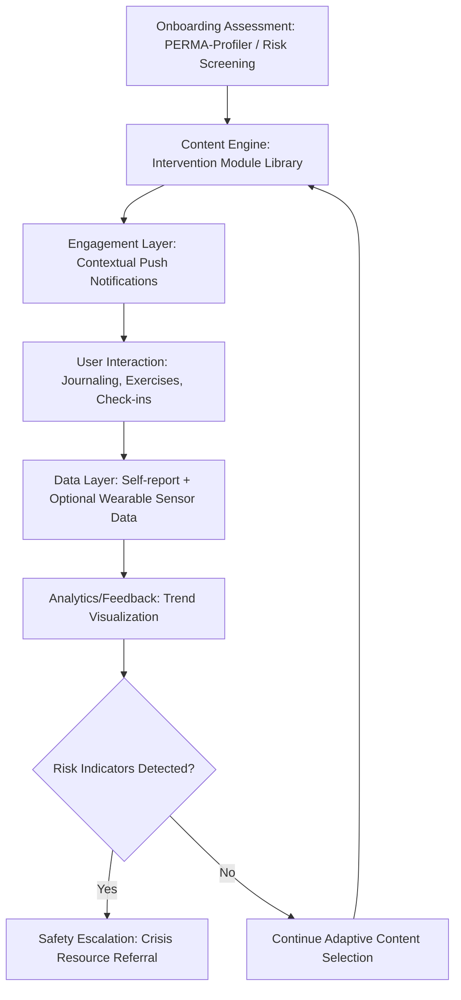

## Technology, Apps, and Digital Well-Being Interventions

### Overview

This topic examines the design, delivery mechanisms, evidence base, and risks of digitally-mediated positive psychology interventions — mobile applications, web platforms, wearables, chatbots, and virtual/augmented reality tools that deliver PPI content (gratitude practices, strengths assessment, mindfulness, mood tracking) at scale. It also addresses the complicating relationship between technology *as intervention delivery mechanism* and technology *as a well-being risk factor* (e.g., problematic use, social comparison), a duality central to this emerging area of the field.

### Conceptual Foundations

**Key Points**

- **Scalability rationale**: Digital delivery addresses a core limitation of traditional positive psychology intervention research and practice — cost and practitioner availability — by allowing evidence-informed content (gratitude journaling prompts, strengths assessments, CBT-adjacent exercises) to reach populations far exceeding what individual coaching or therapy delivery could serve.
- **Ecological Momentary Intervention (EMI)**: A technical term for interventions delivered in real time, in a person's natural environment, often triggered contextually (e.g., a prompt following a detected stress event via wearable biometric data) — representing a delivery paradigm not achievable in traditional clinic- or session-based intervention formats.
- **The digital delivery does not guarantee efficacy**: A critical distinction in this literature is that digitizing an evidence-based intervention does not automatically preserve its evidence base; app-based adaptations often differ substantially from the original tested protocol (frequency, dosage, guidance level), and the majority of commercially available mental health and well-being apps have little to no direct efficacy testing of the specific app itself, as opposed to the general intervention type it claims to deliver. [Unverified: the proportion of untested apps varies by review and by app-store category and changes as the market evolves; treat specific percentages from any single review with appropriate caution and verify against current systematic reviews if precision is needed.]
- **The technology duality**: Unlike most positive psychology intervention categories, digital tools are simultaneously a delivery *mechanism* for well-being interventions and, in their broader recreational/social form (social media, gaming, general smartphone use), a documented *risk factor* for well-being in some usage patterns — meaning this topic must address both technology-as-solution and technology-as-problem within the same domain.

### Categories of Digital Well-Being Interventions

| Category | Function | Example Mechanism |
| --- | --- | --- |
| PPI delivery apps | Deliver structured positive psychology exercises | Gratitude journaling prompts, strengths-based goal trackers |
| Mindfulness/meditation apps | Guided meditation and breathing exercises | Timed guided audio sessions, breathing pacers |
| Mood/well-being tracking | Ecological momentary assessment (EMA) of mood/affect over time | Daily check-in prompts, passive sensor-based mood inference |
| CBT/cognitive-adjacent apps | Structured cognitive restructuring exercises, often via chatbot interface | Guided thought-record exercises, automated Socratic questioning |
| Wearable-integrated interventions | Combine physiological data (HRV, sleep, activity) with well-being prompts | Stress-detection triggering a breathing exercise prompt |
| Social connection platforms | Facilitate structured positive social interaction | Gratitude-sharing platforms, accountability/support communities |
| VR/AR-based interventions | Immersive environments for specific therapeutic or restorative purposes | VR nature exposure for Attention Restoration Theory-based stress reduction; VR exposure-based practice for specific anxieties |
| AI conversational agents / chatbots | Conversational delivery of therapeutic or coaching-adjacent content | Chatbot-guided CBT-style dialogues, reflective prompting |

### Technical Architecture of a Typical Digital PPI: Design Pattern

Since many well-being apps share a common underlying architecture, a representative design pattern synthesized from standard practice in this domain follows:

**Core components**:

1. **Onboarding/assessment layer**: Initial intake often incorporating validated instruments (abbreviated PERMA-Profiler items, PHQ-9/GAD-7 for risk screening, or custom onboarding questionnaires) to personalize subsequent content.
2. **Content/intervention engine**: A library of intervention modules (gratitude prompts, CBT exercises, strengths content) selected and sequenced based on onboarding data and, in more sophisticated systems, adaptive algorithms responding to ongoing engagement and self-reported outcomes.
3. **Engagement/notification layer**: Push notification scheduling designed to prompt practice at optimal times, frequently informed by behavior change principles (implementation-intention-style contextual triggers, per the related habit formation topic) rather than arbitrary fixed schedules.
4. **Data layer**: Storage of user-entered data (journal entries, mood ratings) and, in wearable-integrated systems, passively collected physiological/behavioral data (step count, heart rate variability, sleep duration).
5. **Analytics/feedback layer**: Visualization of trends over time (mood graphs, streak tracking) intended to provide users with personally meaningful feedback and reinforce continued engagement.
6. **Safety/escalation layer**: Risk-detection logic (e.g., responses indicating self-harm risk on a screening instrument) triggering appropriate crisis resource referral rather than continued automated content delivery — an ethically essential component, though implementation quality varies substantially across products. [Unverified: the presence, sophistication, and clinical validation of safety/escalation layers varies widely across commercially available apps and is not a universal or standardized feature; users and practitioners should not assume any given app has robust safety escalation without direct verification.]

### Illustration: Digital PPI Architecture (svg_diagram)

### Evidence Base: What Digital PPI Research Shows

**Key Points**

- **Meta-analytic findings on app-based mental health/well-being interventions**: Systematic reviews of app-based interventions for depression, anxiety, and general well-being generally find small-to-moderate positive effects on average, though with substantial heterogeneity across studies, high dropout/attrition rates, and effect sizes typically smaller than those found in comparable face-to-face intervention research. [Inference: exact effect size estimates vary considerably by meta-analysis, target outcome, and app category; this represents a general pattern across multiple reviews rather than a single precise, universally agreed figure.]
- **Attrition as a central methodological and practical challenge**: Digital intervention research consistently documents very high real-world dropout rates (frequently the majority of users disengaging within days to weeks of download), a much larger practical concern for digital delivery than for supervised in-person intervention formats, directly connecting to the habit-formation and adherence challenges covered in the related chapter item.
- **Guided vs. unguided digital interventions**: A consistent finding across digital mental health/well-being research is that interventions incorporating some form of human guidance or accountability (even minimal coach check-ins or therapist-supported app use) show better outcomes and lower attrition than fully automated, unguided app use alone — suggesting pure automation has not fully replicated the accountability/relational component present in traditional coaching or therapy (see related coaching skills topic).
- **Publication and industry evidence gaps**: A substantial proportion of commercially available well-being and mental health apps lack peer-reviewed efficacy studies of the specific product, relying instead on marketing claims referencing the general evidence base for the underlying intervention type (e.g., citing general CBT or mindfulness research rather than app-specific trials) — a distinction consumers and practitioners recommending apps should actively verify rather than assume.

### The Duality: Technology as Well-Being Risk Factor

**Key Points**

- **Social comparison and social media**: A substantial body of research examines associations between social media use patterns (particularly passive scrolling and upward social comparison via curated content) and reduced well-being/increased depressive symptoms, though the literature also finds substantial heterogeneity by usage pattern (active/social use vs. passive consumption) and individual differences, making blanket claims about "social media causing unhappiness" an oversimplification of a genuinely mixed and actively researched evidence base. [Unverified: causal direction (does social media use reduce well-being, or does lower well-being drive more passive social media use, or both) remains actively debated and likely bidirectional; specific effect sizes vary substantially across studies and populations.]
- **Displacement hypothesis**: One proposed mechanism suggests recreational screen time may displace activities more robustly associated with well-being (face-to-face social interaction, physical activity, sleep), with well-being effects mediated by this displacement rather than screen use per se.
- **Notification-driven attention fragmentation**: Independent of specific app content, the general design pattern of frequent interruptive notifications across many apps (well-being apps included) can contribute to attention fragmentation, a documented stressor distinct from the content of any individual app.
- **Problematic use / behavioral addiction frameworks**: Some researchers apply behavioral addiction frameworks (e.g., examining variable-ratio reinforcement schedules in social media and gaming design, analogous to gambling mechanics) to explain compulsive smartphone/app use patterns that can undermine rather than support well-being, distinguishing this from the deliberate, time-limited use pattern typical of a well-designed PPI delivery app.

### Digital Well-Being Design Countermeasures

| Design Feature | Purpose | Example |
| --- | --- | --- |
| Usage dashboards | Increase user awareness of actual usage patterns | Built-in screen time tracking features |
| Notification batching/limits | Reduce interruption frequency and attention fragmentation | User-configurable notification schedules, "do not disturb" defaults |
| Session-end nudges | Interrupt extended passive scrolling sessions | "Take a break" prompts after extended continuous use |
| Intentional friction | Add deliberate small barriers to reduce automatic/compulsive use | Requiring an extra confirmation step to reopen certain apps |
| Evidence-transparency labeling | Allow users to assess an app's actual evidence base | Disclosure of clinical trial data or lack thereof (not yet a universal standard) |

### Practical Example: Evaluating a Well-Being App

**Example**

Consider evaluating a hypothetical gratitude-journaling app claiming to "boost happiness using positive psychology research." A structured evaluation, consistent with the evidence-gap issues discussed above, would examine: (1) Does the app cite the *specific underlying intervention* (e.g., Three Good Things) with a traceable citation to peer-reviewed research, or only vague appeals to "positive psychology"? (2) Has the *app itself* (not merely the underlying technique) been subject to any published efficacy testing? (3) Does the app include any human guidance/accountability component, or is it fully automated and unguided (relevant given the guided-vs-unguided evidence gap above)? (4) Does the app include a safety/escalation pathway for concerning entries (e.g., journal content suggesting significant distress)? (5) What is the app's data privacy policy regarding sensitive journaled content? A favorable evaluation on most of these dimensions provides meaningfully more confidence than marketing language alone.

### Positive Psychology Linkages

**Key Points**

- **Digitizing established PPIs**: Nearly all major evidence-based interventions discussed elsewhere in this course (Three Good Things, gratitude visits, strengths application, savoring) have digital adaptations, making this topic the delivery-technology layer for content otherwise covered in the applied practice chapter, rather than an entirely separate intervention category.
- **Ecological Momentary Assessment (EMA) as a research and practice tool**: Digital tools enable EMA-based well-being measurement (repeated, in-context, real-time self-report) that is substantially more temporally granular than traditional single-timepoint survey instruments (e.g., SWLS), offering positive psychology researchers a methodological advance beyond what the strengths-audit chapter's static instruments alone can capture — though this granularity comes with its own burden and attrition trade-offs.
- **Person-activity fit at digital scale**: The person-activity fit principle from the related flourishing plan topic applies directly to digital intervention selection — adaptive algorithms in more sophisticated apps attempt to operationalize this principle computationally, though the effectiveness of algorithmic person-activity matching (versus human coach-facilitated matching) remains an open empirical question.
- **Broaden-and-build and restorative digital environments**: VR-based nature exposure interventions represent a direct technological application of Attention Restoration Theory (see related community design topic) and broaden-and-build theory, using immersive technology to approximate restorative natural-environment exposure for populations lacking convenient physical access to such environments.

### Limitations and Emerging Considerations

**Key Points**

- **Regulatory and evidence-standard gaps**: Unlike pharmaceutical interventions, most well-being and mental health apps are not subject to rigorous pre-market efficacy testing requirements in most jurisdictions, creating a genuine buyer/practitioner-beware landscape distinct from other more regulated health intervention categories. [Unverified: regulatory frameworks for digital health/wellness apps are evolving and vary substantially by jurisdiction; specific current requirements should be verified against current regulatory guidance for any given region.]
- **Data privacy of sensitive well-being data**: Journaled emotional content, mood data, and biometric data collected by well-being apps constitute sensitive personal data; data privacy practices, third-party data sharing, and monetization models vary substantially across apps and are not uniformly transparent or protective.
- **AI chatbot-specific concerns**: Emerging AI conversational agents for mental health/well-being support raise additional considerations distinct from static app content, including the risk of inaccurate or inappropriate responses in high-stakes emotional disclosures, unclear liability and oversight structures, and the evolving and actively debated question of appropriate use boundaries for AI-mediated emotional support relative to human coaching or clinical care. [Speculation: as this is a rapidly evolving area, specific regulatory and best-practice standards for AI conversational well-being agents are likely to change substantially in the near term relative to the state of the field at any given writing.]
- **Digital divide considerations**: Reliance on smartphone/app-based delivery for scaling positive psychology access assumes device access, digital literacy, and reliable connectivity that are not universally distributed, meaning digital delivery may inadvertently widen rather than close access gaps for some populations even while lowering cost barriers for others.

### Next Steps

- Ecological Momentary Assessment and Ecological Momentary Intervention methodology in depth
- Systematic reviews and meta-analyses of app-based mental health/well-being intervention efficacy
- Behavioral addiction frameworks applied to problematic smartphone and social media use
- VR/AR-based restorative and therapeutic interventions: current evidence base
- Data privacy and regulatory frameworks for digital mental health and well-being products
- AI conversational agents in mental health support: current capabilities, risks, and ethical debate
- Guided vs. unguided digital intervention research and implications for hybrid coaching-technology models
- Digital divide and equitable access considerations in scaling positive psychology interventions