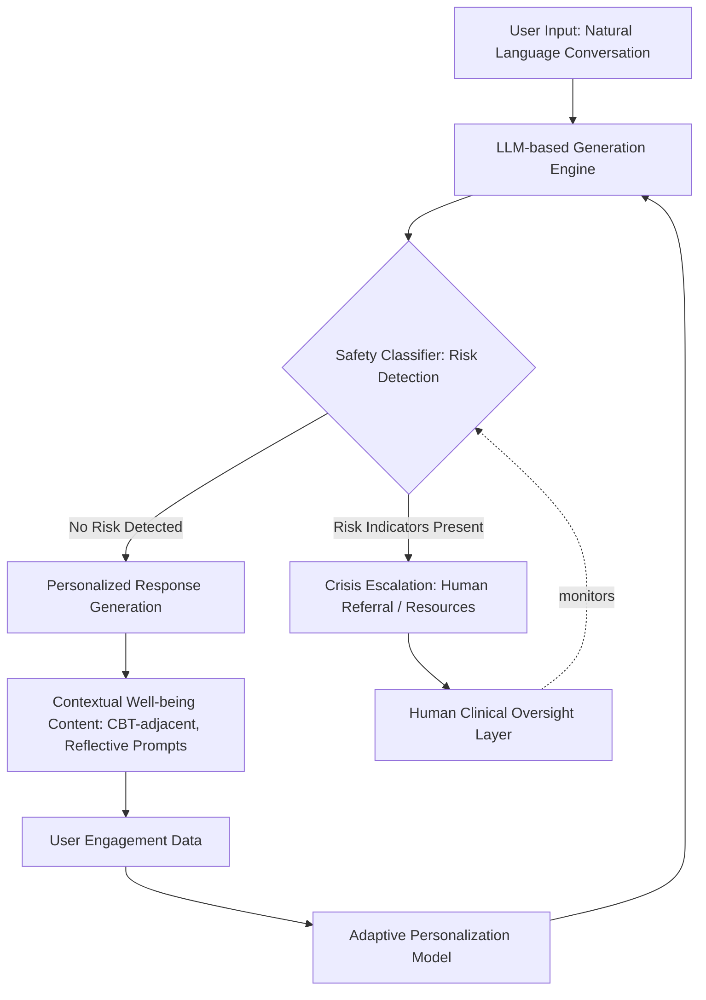

## Artificial Intelligence and Personalized Well-Being Support

### Overview

This topic examines the emergence of large language models (LLMs) and purpose-built AI conversational agents as a distinct and rapidly growing category within digital well-being support, building on but structurally different from the earlier app-based digital interventions covered in the related chapter item. Where earlier digital PPI delivery relied on fixed content libraries and scripted logic trees, AI-based personalized support uses generative, adaptive natural-language interaction to deliver well-being content, emotional support, and coaching-adjacent conversation — introducing both substantial new capability and substantial new categories of risk and uncertainty that are actively being characterized in real time as the technology and its evidence base evolve.

### Conceptual Foundations

**Key Points**

- **Generative vs. scripted digital support**: Traditional well-being apps deliver pre-written content matched to user input via decision trees or simple rules; AI conversational agents (built on LLMs) generate novel, contextually responsive text in real time, enabling more naturalistic, flexible dialogue but also introducing unpredictability absent from fixed-content systems.
- **General-purpose vs. purpose-built systems**: A critical distinction in this domain is between general-purpose LLM chatbots (e.g., consumer AI assistants not specifically designed or safety-tuned for mental health use) being used informally for emotional support, versus purpose-built mental health/well-being AI products specifically designed, safety-tuned, and sometimes clinically evaluated for this use case. General large language models are being used by significant numbers of people for emotional support, coaching, counseling, and companionship purposes, despite general AI tools not being designed using evidence-based practices or with the safety guardrails necessary for mental health use in the way purpose-built products aim to be. [faspsych](https://faspsych.com/blog/ai-mental-health-trends-2025-llms-vs-apps/)[jmir](https://formative.jmir.org/2026/1/e86904)
- **Scale of informal use**: Research suggests that a substantial proportion of individuals have used a general LLM for mental health support in the past year, with common reasons including anxiety, personal advice, and depression, indicating that informal AI use for emotional and well-being support is already occurring at meaningful scale independent of purpose-built product design. [jmir](https://formative.jmir.org/2026/1/e86904)
- **The personalization promise**: The core value proposition of AI-based well-being support is deeper, more dynamic personalization than static app content can offer — theoretically addressing the person-activity fit challenge (see related flourishing plan and digital interventions topics) computationally, by adapting conversational content, tone, and suggested exercises to an individual's specific expressed needs in real time rather than relying on a fixed decision tree.

### Categories of AI-Based Well-Being Support

| Category | Description | Distinguishing Feature |
| --- | --- | --- |
| Purpose-built mental health/well-being chatbots | AI systems specifically designed, trained, and safety-tuned for emotional support or therapeutic-adjacent use | Built-in safety guardrails, crisis detection, often integrated with human clinical oversight |
| General-purpose LLM informal use | Consumer AI assistants used by individuals for emotional support despite not being purpose-built for this | No mental-health-specific safety tuning; used due to accessibility and conversational fluency |
| AI-guided structured programs (CBT-adjacent) | Chatbot-delivered structured therapeutic protocols with defined session structure | Follows a defined clinical/quasi-clinical protocol rather than open-ended conversation |
| AI-augmented human coaching/therapy | AI tools supporting (not replacing) human practitioners — session notes, between-session check-ins, homework reminders | Human practitioner remains primary; AI is an adjunct tool |
| Predictive/monitoring AI | Passive analysis of behavioral or biometric data to detect risk or well-being changes | Detection/monitoring function rather than direct conversational support |
| AI-personalized content curation | Algorithmic matching of a user to specific evidence-based exercises based on inferred needs | Personalization without necessarily involving open-ended generative conversation |

### Emerging Evidence Base

**Key Points**

- **Efficacy signal from recent trials**: A 2026 meta-analysis of 39 randomized trials provides evidence for chatbot interventions in depressive and anxiety symptoms, representing a more substantial evidence base than existed for earlier-generation digital mental health tools, though this is characterized in the source literature as a real efficacy signal, but a narrow one — meaning the evidence supports specific, bounded use cases rather than broad claims of general therapeutic equivalence to human care. [nih](https://pmc.ncbi.nlm.nih.gov/articles/PMC13214549/)[nih](https://pmc.ncbi.nlm.nih.gov/articles/PMC13214549/)
- **Real-world pilot findings**: A naturalistic cohort study evaluating a foundation model purpose-built for mental health found generative AI purpose-built for social and mental health support to be associated with safety, promotion of social health, and reductions in depression and anxiety in real-world use, using repeated measurement over a multi-week follow-up period. [Inference: real-world naturalistic cohort designs, while valuable for ecological validity, generally provide weaker causal evidence than randomized controlled trials due to lack of a comparison/control condition; this finding should be interpreted as promising real-world signal rather than definitive causal proof of efficacy.] [arxiv](https://arxiv.org/pdf/2511.11689)
- **Adoption and usage patterns**: Purpose-built conversational AI tools show usage patterns suggesting integration into daily emotional-regulation routines — diary study results suggest that users imagined using a conversational AI tool when feeling stress or anxiety and during morning routines, commutes, or while winding down at night, indicating these tools are being adopted into similar contextual, routine-embedded usage patterns as the habit-stacking principles described in the related habit formation topic. [jmir](https://formative.jmir.org/2026/1/e86904)
- **Retention patterns**: Retained users of one purpose-built conversational AI tool showed notably higher session counts per user compared to the broader user base and an earlier tool version, suggesting — consistent with the broader digital intervention attrition challenge covered in the related topic — that a subset of highly engaged users drives much of the meaningful usage, while overall population-level retention remains a live challenge. [jmir](https://formative.jmir.org/2026/1/e86904)
- **Professional adoption**: A meaningful proportion of psychologists were reported using AI at least monthly by 2025, primarily to reduce administrative burdens, allowing more focus on direct patient care — indicating AI's clinical-adjacent role currently skews toward practitioner support tools rather than exclusively direct-to-consumer emotional support replacement. [faspsych](https://faspsych.com/blog/ai-mental-health-trends-2025-llms-vs-apps/)[faspsych](https://faspsych.com/blog/ai-mental-health-trends-2025-llms-vs-apps/)

### Illustration: AI-Based Well-Being Support System Architecture (svg_diagram)

### Technical and Design Considerations for Purpose-Built Systems

**Key Points**

- **Safety guardrail design**: Purpose-built systems require dedicated safety classifiers distinct from the core conversational generation engine, specifically designed to detect crisis indicators (self-harm risk, acute distress signals) and route to appropriate escalation pathways rather than continued automated conversational response — a substantially more complex requirement than the simpler screening-instrument-triggered escalation used in earlier scripted apps (see related digital interventions topic).
- **Human oversight integration**: Sustainable AI mental health intervention design has been characterized in systematic review literature as depending on appropriate human-AI integration alongside ethical considerations including privacy, informed consent, algorithmic bias, and human oversight — positioning human oversight not as an optional add-on but as a structural sustainability requirement. [nih](https://www.ncbi.nlm.nih.gov/pmc/articles/PMC12469610/)[nih](https://www.ncbi.nlm.nih.gov/pmc/articles/PMC12469610/)
- **Federated learning and privacy-preserving personalization**: Resource-efficient personalization techniques such as federated learning have been identified as relevant to sustainable AI-enhanced therapeutic intervention design, representing an architectural approach where model personalization can occur without centralizing sensitive user data, relevant given the particularly sensitive nature of emotional/mental health data discussed in the related digital interventions topic. [nih](https://www.ncbi.nlm.nih.gov/pmc/articles/PMC12469610/)
- **Cultural adaptability**: Implementation challenges for sustainable AI mental health interventions include cultural adaptation and resource allocation across diverse contexts, an equity consideration paralleling the digital divide concerns raised in the related digital well-being interventions topic, but specific to whether AI training data and conversational design adequately represent diverse cultural expressions of distress and well-being. [nih](https://www.ncbi.nlm.nih.gov/pmc/articles/PMC12469610/)
- **Regulatory emergence**: Regulatory bodies have begun issuing specific guidance for this domain, including WHO guidance on large multi-modal models in health emphasizing ethics and governance, and draft regulatory guidance on AI-enabled device software functions centering lifecycle risk management — indicating the regulatory landscape is actively forming rather than settled, a dynamic distinct from more mature, established regulatory categories. [nih](https://pmc.ncbi.nlm.nih.gov/articles/PMC13214549/)

### Positive Psychology Linkages

**Key Points**

- **PERMA-consistent conversational design**: [Inference] Purpose-built well-being AI systems can, in principle, be explicitly designed to probe and support multiple PERMA pillars conversationally (e.g., prompting reflection on positive experiences, engagement activities, relationship quality, sources of meaning, and accomplishments) rather than narrowly focusing on symptom reduction alone, extending the PERMA framework's application from human-coach-facilitated conversation (see related coaching topic) into AI-mediated dialogue — though the extent to which current commercial systems explicitly implement this theoretical framework, versus more general supportive conversation, varies by product and is not uniformly documented.
- **Social connection function**: Notably, the evaluated purpose-built mental health generative AI system was found to be associated with promoting social health in addition to symptom reduction, suggesting these tools may function partly through a Relationships-adjacent mechanism (companionship, feeling heard) rather than purely through cognitive-restructuring content delivery — relevant given Relationships' established centrality within PERMA and broader SWB research covered throughout this course. [arxiv](https://arxiv.org/pdf/2511.11689)
- **Strengths-spotting and active-constructive responding at scale**: [Speculation] The coaching competencies covered in the related chapter item (strengths-spotting, active-constructive responding) represent skills that, in principle, could be partially operationalized in AI conversational design (e.g., training a system to respond to positive user disclosures in an active-constructive rather than passive style); the extent to which current systems successfully replicate these nuanced human facilitation skills, versus superficially mimicking supportive language patterns, is not yet well established in the available evidence.
- **Coaching vs. AI support distinction**: The ethical scope-of-practice boundaries discussed in the related coaching topic (distinguishing coaching from clinical therapy) apply with additional urgency to AI systems, which lack a human practitioner's professional judgment, licensure accountability, and capacity for genuine clinical risk assessment beyond programmed heuristics — an unresolved tension actively discussed in current governance and regulatory guidance.

### Risks, Limitations, and Open Debates

**Key Points**

- **Uneven safety design across the informal-use landscape**: Because a substantial share of general-purpose AI usage for emotional support occurs via systems not specifically designed for mental health use, a large proportion of real-world AI-mediated emotional support currently occurs outside the safety-guardrail architecture that purpose-built systems aim to provide — a significant real-world gap between where usage is occurring and where safety design investment has concentrated. [faspsych](https://faspsych.com/blog/ai-mental-health-trends-2025-llms-vs-apps/)
- **Narrow evidentiary scope**: As emphasized in current review literature, the strongest available efficacy evidence for chatbot mental health interventions applies to a real but narrow scope — meaning broad claims that AI conversational support is broadly equivalent to human therapeutic or coaching relationships substantially outrun the current evidence base, and this remains an active, rapidly evolving area of research rather than a settled question. [nih](https://pmc.ncbi.nlm.nih.gov/articles/PMC13214549/)
- **Bias, equity, and cultural representation**: Algorithmic bias has been identified as a specific risk mitigation concern in sustainable AI mental health intervention design, relevant given that training data underlying large language models may not equally represent diverse cultural expressions of distress, help-seeking norms, or well-being constructs. [nih](https://www.ncbi.nlm.nih.gov/pmc/articles/PMC12469610/)
- **Rapid pace of change**: [Speculation] Given the pace of change evident in this domain — with adoption patterns, evidence base, and regulatory guidance all evolving within short timeframes based on the sources reviewed — specific product capabilities, safety designs, and regulatory requirements described in any point-in-time summary should be expected to change meaningfully in subsequent months to years, more so than in most other topics covered in this course.
- **Companionship and dependency questions**: The finding that therapy and companionship represent a leading and rapidly rising use case for general AI tools raises open questions — not yet resolved in the available evidence — about potential dependency dynamics, the appropriate boundary between supportive companionship and unhealthy reliance, and how these dynamics compare to established understanding of healthy versus problematic reliance patterns in human relationships and traditional digital tools alike. [faspsych](https://faspsych.com/blog/ai-mental-health-trends-2025-llms-vs-apps/)

*Note: This is a sensitive and rapidly evolving topic. If you are personally experiencing significant mental health difficulties, please note that AI tools — whether general-purpose or purpose-built — are not a substitute for professional mental health care, and reaching out to a qualified mental health professional or crisis resource is recommended for significant or persistent distress.*

### Next Steps

- Purpose-built vs. general-purpose AI systems for mental health: comparative safety architecture
- Federated learning and privacy-preserving personalization in AI well-being systems
- Regulatory landscape: WHO guidance and evolving device-software regulatory frameworks for AI health tools
- Human-AI integration models: AI as adjunct to, versus replacement for, human coaching and therapy
- Algorithmic bias and cultural representation in AI mental health training data
- Companionship, dependency, and healthy-use boundaries in AI emotional support relationships
- Longitudinal and RCT evidence gaps distinguishing narrow efficacy signals from broad therapeutic claims
- Crisis detection and escalation architecture design in conversational AI safety systems