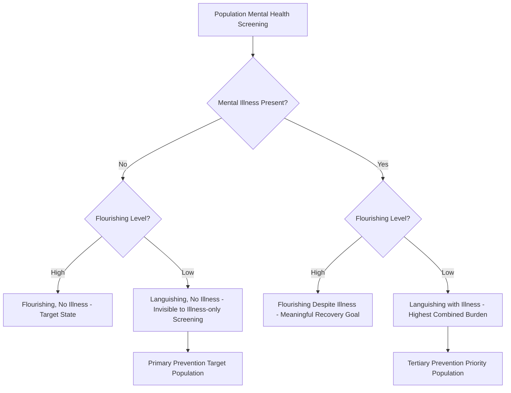

## Positive Psychology's Role in Public Health and Prevention Science

### Overview

This topic examines the integration of positive psychology constructs and interventions into public health and prevention science frameworks — moving well-being from an individual clinical/coaching concern (covered in the applied practice chapter) toward population-level prevention infrastructure. It addresses how flourishing-oriented constructs are being incorporated into the traditional prevention science paradigm (primary, secondary, tertiary prevention), how positive psychology complements rather than replaces deficit-focused public mental health models, and the emerging evidence base for population-scale flourishing interventions.

### Conceptual Foundations

**Key Points**

- **The two-continua model of mental health** (Keyes): A foundational conceptual bridge between positive psychology and public health, proposing that mental illness and mental health/flourishing are related but distinct dimensions rather than opposite ends of a single continuum. Under this model, an individual can be free of diagnosable mental illness yet still be "languishing" (low flourishing), or can experience symptoms of mental illness while still maintaining meaningful flourishing in some domains — a framework with direct implications for public health measurement and intervention design, since screening for illness alone misses the languishing population.
- **From treatment to prevention paradigm shift**: Traditional public mental health has historically concentrated resources on treating diagnosed disorders (tertiary/secondary prevention); positive psychology's integration into public health pushes toward primary prevention — building protective factors (resilience, social connection, meaning, positive emotion regulation skills) in the general population *before* disorder onset, on the theoretical premise that flourishing constructs function as protective factors against future mental illness incidence.
- **Salutogenesis** (Antonovsky): A parallel and historically earlier public health concept (originating in medical sociology) focused on factors supporting health and well-being ("sense of coherence") rather than only factors causing disease (the traditional pathogenic orientation) — often cited as a conceptual precursor to positive psychology's public health applications, emphasizing that positive psychology's health-promotion orientation has intellectual roots predating the formal founding of positive psychology as a field.
- **Complementary, not replacement, framing**: Consistent with positive psychology's own founding rhetoric (not claiming to replace clinical psychology but to complement its traditional deficit focus), most serious public health integration efforts explicitly frame flourishing-promotion as complementary to, rather than a replacement for, continued investment in treatment access and clinical care for diagnosed mental illness — an important distinction given legitimate concerns about resource diversion in public health policy debates.

### Prevention Science Framework Applied to Well-Being

| Prevention Level | Traditional Public Health Focus | Positive Psychology Integration |
| --- | --- | --- |
| Primary prevention | Preventing disorder onset in the general/at-risk population before symptoms appear | Universal school-based or community-based flourishing/resilience programs (e.g., strengths education, social-emotional learning) |
| Secondary prevention | Early detection and intervention for emerging symptoms | Screening incorporating flourishing/languishing measures (not just symptom checklists) to identify at-risk individuals via the two-continua model |
| Tertiary prevention | Treatment and management of diagnosed conditions, preventing relapse/recurrence | Positive psychology interventions as adjunctive treatment components (e.g., well-being therapy alongside standard treatment) to support fuller recovery, not just symptom remission |

### The Two-Continua Model: Technical Detail

Keyes' model proposes a two-dimensional classification rather than a single symptom-severity scale:

$$\text{Mental Health Status} = f(\text{Flourishing/Languishing dimension}, \text{Mental Illness Presence/Absence dimension})$$

This produces four quadrants:

1. **Flourishing without mental illness**: High well-being, no diagnosable disorder — the target state, but notably a minority of the population in Keyes' original epidemiological surveys.
2. **Languishing without mental illness**: No diagnosable disorder, but low well-being — an epidemiologically significant group invisible to illness-only screening, associated in Keyes' research with functional impairment (missed work days, reduced productivity) comparable in some respects to diagnosed depression despite the absence of formal diagnosis.
3. **Flourishing with mental illness**: Diagnosed disorder present, yet maintaining meaningful well-being in other respects — demonstrating that treatment goals can meaningfully include well-being promotion even without full symptom remission.
4. **Languishing with mental illness**: The most severe combined burden, both low well-being and diagnosed illness present.

[Inference: exact population proportions across these quadrants vary across studies, populations, and time periods, and are not universal fixed constants; the value of the model lies primarily in its qualitative structure — distinguishing illness and flourishing as separate dimensions — rather than in any single study's precise quadrant percentages.]

### Illustration: The Two-Continua Model (svg_diagram)

### Population-Scale Intervention Examples

**Key Points**

- **School-based social-emotional learning (SEL) and positive education**: Universal school programs incorporating character strengths education, gratitude practices, and resilience skill-building (e.g., the Penn Resiliency Program, geared toward preventing adolescent depression through cognitive-behavioral and explanatory-style skill-building) represent primary prevention applications delivered at population scale through existing educational infrastructure, avoiding the access barriers associated with individually-delivered clinical intervention.
- **Workplace flourishing programs as occupational public health**: Extending the organizational integration principles from the related chapter item, workplace-based well-being programs can be understood through a public health lens as delivering primary prevention (reducing burnout and stress-related illness incidence) through existing organizational infrastructure reaching large working-age populations.
- **Community-level resilience-building post-disaster**: Public health responses to community-wide disasters or collective trauma (natural disasters, pandemics) have increasingly incorporated community resilience-building frameworks alongside traditional trauma-focused mental health response, reflecting Bonanno's resilience trajectory research (most individuals show resilient rather than prolonged-dysfunction trajectories following adversity) as a rationale for resilience-supportive rather than purely pathology-anticipating public health response design.
- **National well-being surveillance as public health infrastructure**: The national well-being indices and dashboards covered in earlier chapter items (OECD Better Life Index, UK ONS well-being programme) function, from a prevention science perspective, as population-level surveillance systems analogous to traditional epidemiological disease surveillance — enabling identification of declining well-being trends before they manifest as increased clinical mental illness incidence, connecting this topic directly back to the societal policy chapter.

### Positive Psychology Linkages

**Key Points**

- **PERMA as a population health outcome framework**: Seligman's PERMA model, originally developed for individual well-being theory, has been adapted in public health contexts as a multidimensional population outcome measure (e.g., population-level PERMA-Profiler surveys) providing a more complete public health outcome set than symptom-prevalence statistics alone.
- **Character strengths as population-level protective factors**: Positive psychology's strengths research reframes certain traits (optimism, curiosity, social intelligence, self-regulation) as public-health-relevant protective factors, analogous to how traditional epidemiology identifies protective factors against physical disease (e.g., certain dietary or exercise patterns) — supporting universal strengths-building programs as a population health strategy rather than only an individual growth pursuit.
- **Broaden-and-build theory's public health implications**: [Inference] Fredrickson's broaden-and-build theory, proposing that positive emotions build durable psychological, social, and physical resources over time, provides a theoretical rationale for why population-level positive emotion promotion (not merely negative-symptom reduction) could plausibly contribute to longer-term reduced disease burden — though direct large-scale public health outcome evidence specifically tracing this causal pathway (broaden-and-build mechanisms to reduced population disease incidence) remains a less mature evidence base than more established behavioral risk factor epidemiology.
- **Post-traumatic growth and community resilience**: Tedeschi and Calhoun's post-traumatic growth research, applied at community scale following collective trauma events, supports public health messaging and intervention design that neither minimizes genuine distress nor assumes uniformly negative trajectories, aligning with Bonanno's resilience-trajectory findings referenced above.

### Methodological and Practical Challenges

**Key Points**

- **Population-scale outcome measurement complexity**: Unlike disease incidence (which has relatively established diagnostic criteria and surveillance infrastructure), flourishing and well-being outcomes require validated population-level instruments (PERMA-Profiler, Flourishing Scale, Keyes' Mental Health Continuum) that are less universally standardized across public health systems than traditional epidemiological measures, complicating cross-program and cross-national comparison.
- **Attribution difficulty at scale**: Demonstrating that a population-level flourishing intervention (e.g., a national school-based program) causally reduced downstream mental illness incidence requires long-term, large-scale study designs (cluster-randomized trials, long-term cohort follow-up) that are resource-intensive and less common than shorter-term individual-level PPI efficacy studies covered elsewhere in this course.
- **Equity in access to primary prevention infrastructure**: Universal primary prevention programs (school-based, workplace-based) inherently depend on existing institutional access; populations outside these institutions (unemployed individuals, those in under-resourced schools, informal-sector workers) may be systematically under-reached by infrastructure-dependent prevention approaches, an equity consideration paralleling the digital divide concerns raised in the related technology topic.
- **Resource allocation tension**: Genuine and legitimate public health policy debates exist regarding the appropriate balance of finite public health resources between primary prevention/flourishing-promotion investment versus continued and expanded treatment access for existing unmet mental illness treatment need — a tension without a single objectively correct resolution, requiring value-based policy judgment rather than a purely technical answer, consistent with the evenhanded treatment such policy trade-offs warrant.
- **Risk of the framework being used to deprioritize treatment access**: A documented concern in public health policy discourse is that well-being/flourishing-promotion framing, if used carelessly or in bad faith, could be invoked to justify reduced investment in clinical treatment access (framing prevention as a substitute rather than complement) — a risk the field's own complementary-not-replacement framing (noted above) explicitly aims to guard against, though the framing's actual influence on real-world resource allocation decisions varies by political and institutional context.

### Related Topics

- Keyes' two-continua model and the Mental Health Continuum measurement instrument in depth
- Salutogenesis (Antonovsky) and sense of coherence as a public health precursor concept
- Penn Resiliency Program and school-based positive education: evidence and implementation
- Bonanno's resilience trajectory research following collective trauma and disaster
- National well-being surveillance systems as public health infrastructure (linking to OECD BLI, national well-being indices chapter items)
- Post-traumatic growth (Tedeschi & Calhoun) at community and population scale
- Equity and access considerations in universal primary prevention program design
- Public health resource allocation debates: prevention/flourishing investment vs. treatment access expansion