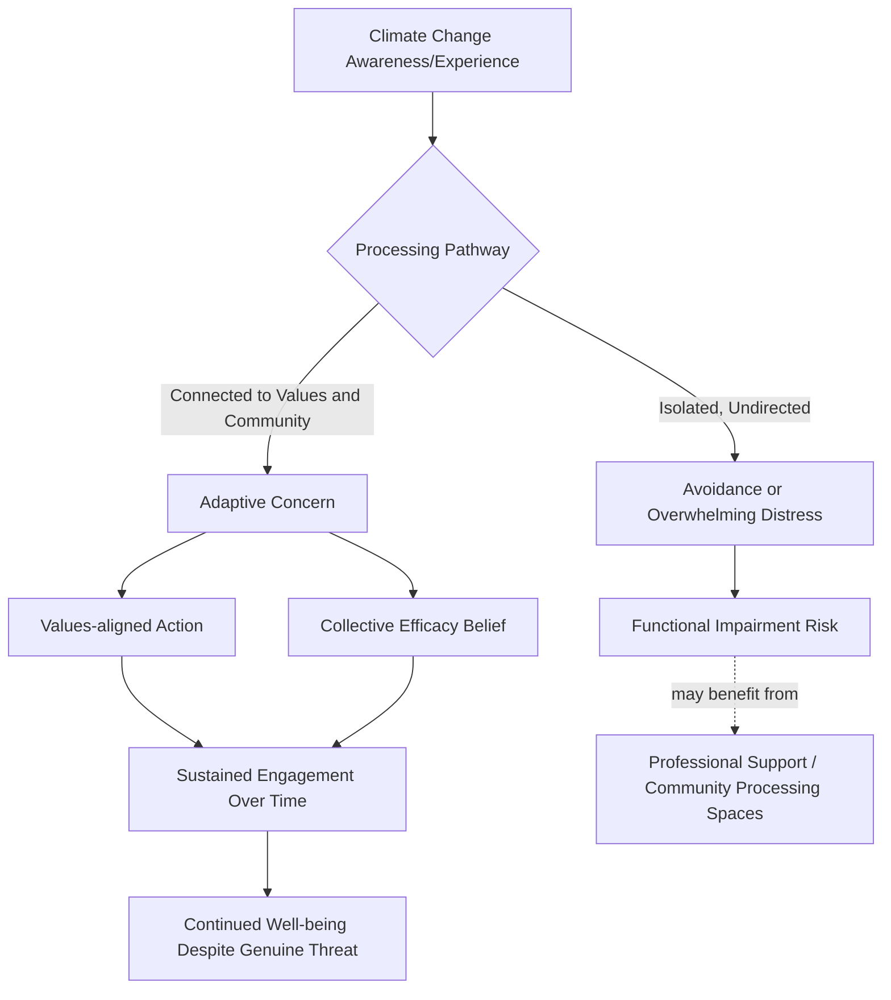

## Climate Change, Eco-Anxiety, and Ecological Resilience

### Overview

This topic addresses an emerging intersection between positive psychology and climate science: the psychological impact of climate change awareness and experience (eco-anxiety, ecological grief, climate distress) and the resilience frameworks being developed to support adaptive functioning and continued constructive engagement in the face of a genuinely severe, long-term, and partially uncontrollable collective threat. It represents a distinctive case within positive psychology because the "problem" (climate change) is a real, evidence-based external threat rather than a distorted cognition — requiring resilience frameworks that support accurate threat appraisal and sustained engagement rather than frameworks aimed at correcting inaccurate negative beliefs.

### Conceptual Foundations

**Key Points**

- **Eco-anxiety defined**: Commonly described in the literature as chronic fear or worry about environmental doom and the future impacts of climate change — distinguished from clinical anxiety disorders in that it is generally considered a rational, proportionate response to a genuine and well-evidenced threat rather than a distorted or disproportionate cognitive pattern, a distinction with direct implications for intervention design (see below).
- **Ecological grief**: A related but distinct construct referring to grief experienced in relation to experienced or anticipated ecological losses — loss of species, ecosystems, landscapes, or ways of life connected to a stable climate — drawing on grief and bereavement psychology applied to non-human and environmental loss.
- **Solastalgia** (Albrecht): A specific term coined by philosopher Glenn Albrecht for the distress caused by environmental change to one's home environment while still physically residing there — distinguished from traditional homesickness (nostalgia) by the fact that the environment itself, not the person's location, has changed.
- **Why this differs from standard cognitive-restructuring approaches**: Because climate change constitutes a genuine, scientifically substantiated threat, an intervention approach that simply disputes or reframes the underlying belief (as in traditional cognitive restructuring for anxiety disorders, see the related ABCDE protocol in the daily resilience toolkit topic) would be inappropriate and arguably epistemically dishonest if applied to accurately calibrated climate concern — necessitating a different resilience framework oriented toward sustaining functional engagement and well-being *despite* an accurately appraised serious threat, rather than correcting a distorted appraisal.

### Distinguishing Adaptive Concern from Impairing Distress

| Dimension | Adaptive Climate Concern | Impairing Eco-Anxiety/Distress |
| --- | --- | --- |
| Functional impact | Motivates engagement, action, or informed adaptation | Produces paralysis, avoidance, or significant functional impairment |
| Emotional regulation | Concern is present but modulated; allows continued daily functioning | Overwhelming, persistent distress disrupting sleep, work, relationships |
| Behavioral response | Channeled into proportionate action (individual or collective) or informed acceptance | Avoidance of climate-related information, or compulsive consumption without action capacity |
| Social connection | Concern often shared and processed within supportive community | Isolation, sense that others don't understand or share the concern |
| Relationship to hope/agency | Coexists with some sense of agency or collective efficacy, even amid uncertainty | Accompanied by hopelessness and perceived lack of any meaningful agency |

[Inference: this table represents a synthesized conceptual distinction drawn from the broader climate psychology literature; precise diagnostic boundaries between "adaptive concern" and "impairing distress" are not as sharply or universally standardized as, for example, formal clinical diagnostic criteria for anxiety disorders, and researchers continue to refine measurement approaches for this relatively young area of study.]

### Positive Psychology Frameworks Applied to Climate Distress

**Key Points**

- **Meaning-making and values-based engagement**: Rather than attempting to reduce concern to zero (an inappropriate goal given the genuine threat), positive-psychology-informed approaches often focus on connecting climate concern to a person's broader sense of meaning and values (Steger's meaning in life research; see related audit topic), channeling concern into values-aligned action as a route to both agency and psychological well-being, rather than the concern remaining an unprocessed, undirected source of distress.
- **Collective efficacy over individual efficacy alone**: Given the genuinely collective and structural nature of climate change (individual behavior change alone cannot resolve it), resilience frameworks in this domain often emphasize collective efficacy — a shared belief in a group's or community's capacity to effect meaningful change together — as more psychologically sustainable than frameworks relying solely on individual behavioral efficacy, which can produce disproportionate guilt or helplessness when individual actions feel visibly insufficient relative to the scale of the problem.
- **Post-traumatic growth-adjacent framings**: Some climate psychology literature draws on post-traumatic growth concepts (Tedeschi & Calhoun, also referenced in the related public health topic) to describe how direct experience of climate-related disaster or loss can, for some individuals, coexist with or eventually give rise to renewed meaning, community connection, or values clarification — without this framing minimizing the genuine severity of climate-related losses or implying that growth is a required or universal outcome.
- **Radical acceptance and dialectical framings**: Approaches drawing on acceptance-based frameworks (conceptually related to Acceptance and Commitment Therapy, though not exclusively a positive psychology intervention) emphasize holding both genuine grief/concern and continued values-driven action simultaneously, rather than requiring resolution of the distress before action becomes possible — a dialectical stance distinct from approaches that treat distress reduction as a necessary precondition for functioning.
- **Ecological resilience and place-based community connection**: Drawing on the community design and social capital concepts covered in the related urban planning topic, place-based community resilience-building (strengthening local social ties, shared local ecological stewardship activities) has been proposed as both a practical climate adaptation strategy and a psychologically protective factor against isolation-driven eco-anxiety.

### Illustration: Pathways from Climate Awareness to Functional Outcomes (svg_diagram)

### Practical Example: Contrasting Two Responses to the Same Awareness

**Example**

Two individuals independently learn detailed information about accelerating climate impacts in their region.

**Person A** processes this information in isolation, primarily through anxiety-inducing social media content, without connecting it to any specific values-based action or community. Over subsequent months, they report avoiding climate-related news entirely (to manage distress) while simultaneously experiencing intrusive worry, disrupted sleep, and a sense of hopeless futility about any personal or collective action — an example of the impairing distress pathway.

**Person B** learns similar information but processes it partly through a local community group focused on climate adaptation and mitigation efforts relevant to their specific region. They report ongoing genuine concern (not eliminated, nor should it be) but channel this into concrete values-aligned activities (local advocacy, skill-building relevant to their community's adaptation needs) and experience meaningful social connection through the group — an example of the adaptive concern pathway, illustrating how the *same underlying accurate threat information* can lead to substantially different psychological and functional outcomes depending on processing context, consistent with the meaning-making and collective-efficacy mechanisms described above. [Inference: this contrast is illustrative of documented patterns in the climate psychology literature rather than a claim that community engagement guarantees adaptive outcomes for every individual, since the relationship between community engagement and reduced distress plausibly varies by individual and context.]

### Positive Psychology Linkages

**Key Points**

- **Meaning in Life research** (Steger) as a core mechanism: The values-connection approach described above directly applies meaning in life research (also referenced in the related flourishing plan topic) to a specific, high-stakes contemporary context, demonstrating the broader applicability of meaning-making frameworks beyond individually-focused well-being concerns.
- **Hope theory's relevance and limits** (Snyder): Hope theory's agency and pathways components (see related coaching topic) are relevant to sustaining climate engagement, but climate psychology researchers have noted the distinctive challenge that pathways to fully resolving climate change are neither fully known nor entirely within any individual's or even any single nation's control — requiring a version of hope compatible with genuine uncertainty and only partial individual agency, differing from more straightforwardly resolvable personal goals typically addressed in hope theory applications.
- **Resilience as accurate engagement, not symptom elimination**: Distinct from most resilience applications covered elsewhere in this course (which generally aim to reduce or reframe distress responses to often-distorted or disproportionate stressors), ecological resilience in this context is explicitly not about eliminating concern regarding a genuinely severe threat, but about sustaining functional, values-aligned engagement alongside continued, appropriately-calibrated concern — a meaningfully different resilience target than most of the daily resilience toolkit practices covered earlier in this course.
- **Post-traumatic growth's careful application**: As referenced above, the application of post-traumatic growth concepts to climate-related loss requires particular care not to imply that growth is expected, required, or that it minimizes the legitimacy of grief and distress — consistent with the broader caution the post-traumatic growth literature itself applies regarding growth narratives potentially being used to pressure individuals experiencing genuine trauma or loss.

### Emerging Research Directions and Open Questions

**Key Points**

- **Measurement development**: Validated psychometric instruments specifically for eco-anxiety and ecological grief (as distinct from general anxiety or grief measures) are a relatively recent and still-developing area, with instruments continuing to be refined and validated across different populations and climate-impact contexts. [Unverified: the psychometric maturity and cross-cultural validation status of specific eco-anxiety measurement instruments is an active area of ongoing research rather than a fully settled methodological matter; current instruments should be understood as evolving rather than fixed gold-standard tools.]
- **Intergenerational and demographic considerations**: Research suggests climate distress may be particularly salient among younger generations and populations more directly and immediately exposed to climate impacts, raising distinct considerations for age-appropriate and culturally-appropriate resilience-building approaches rather than a uniform one-size-fits-all intervention model.
- **Environmental justice intersections**: Populations experiencing the most severe and immediate climate impacts (often lower-income communities and Global South populations with lower historical emissions contribution) face a distinct equity dimension where ecological resilience-building must be considered alongside genuine justice concerns regarding differential exposure and differential resources for adaptation — a consideration this topic shares conceptually with the equity concerns raised in the related public health and digital access topics.
- **Balancing honest threat communication with resilience support**: An ongoing tension in this emerging field involves how to support psychological resilience and continued functioning without minimizing or downplaying the genuine severity of climate science findings — an ethical and communication challenge distinct from most other resilience-building contexts covered in this course, where the underlying threat being processed is not itself a matter of active scientific and policy urgency at the same scale.

### Related Topics

- Meaning in Life research (Steger) and values clarification exercises applied to collective threats
- Collective efficacy theory and community-based climate adaptation psychology
- Post-traumatic growth (Tedeschi & Calhoun): careful application to ongoing and anticipated loss
- Community design, urban planning, and flourishing: place-based resilience and social capital (related chapter item)
- Hope theory (Snyder) under conditions of genuine uncertainty and limited individual agency
- Environmental justice and differential climate exposure/resource considerations
- Measurement development: eco-anxiety and ecological grief psychometric instruments
- Positive psychology's role in public health and prevention science: population-scale resilience parallels (related chapter item)