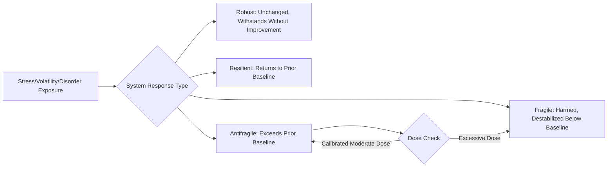

## Antifragility and Stress-Adapted Systems as a Counterpart to Resilience Science

### Overview

This topic examines antifragility — a concept originating in Nassim Nicholas Taleb's work on risk and uncertainty — as a distinct theoretical counterpart to resilience within positive psychology and adjacent fields. Where resilience (covered extensively in the applied practice chapter) describes the capacity to withstand, recover from, or return to baseline functioning after stress or adversity, antifragility describes systems (biological, psychological, organizational) that actually improve, strengthen, or benefit from exposure to moderate stress, volatility, or disorder, rather than merely enduring it. This topic addresses the conceptual distinctions between fragility, robustness, resilience, and antifragility, and examines the emerging and still-developing application of this framework to human psychological functioning.

### Conceptual Foundations

**Key Points**

- **Origin of the concept**: Antifragility was formally introduced by Nassim Nicholas Taleb in his 2012 book *Antifragile: Things That Gain from Disorder*, originally developed in the context of financial risk, complex systems theory, and epistemology of uncertainty, rather than originating within positive psychology or clinical psychology research traditions — meaning its application to human psychological well-being represents an adaptation and extension of a concept developed elsewhere, rather than an empirically-derived psychological construct in the way, for example, learned optimism or self-compassion were developed through direct psychological research programs.
- **The four-category distinction**: Taleb's framework proposes a spectrum distinct from a simple fragile-to-resilient binary:
  1. **Fragile**: Harmed or destabilized by stress, volatility, or disorder; performs best only under stable, predictable conditions (e.g., a glass object, or a rigid system that shatters under unexpected shocks).
  2. **Robust**: Withstands stress and volatility without being harmed, but also does not improve from it; remains essentially unchanged (e.g., a system engineered to a fixed tolerance that neither degrades nor improves under stress within its design limits).
  3. **Resilient**: Absorbs stress or shock and returns to its prior baseline state after a disruption (e.g., a system or individual that recovers to pre-stress functioning following adversity) — the target state of most resilience science and interventions covered elsewhere in this course.
  4. **Antifragile**: Actually improves, strengthens, or benefits from exposure to stress, volatility, or moderate disorder, exceeding its pre-stress baseline rather than merely returning to it (e.g., certain biological systems like muscle tissue, which grows stronger through the controlled stress of resistance exercise, or an immune system that develops greater capability through exposure to pathogens).
- **Key distinction from resilience**: The critical conceptual difference is trajectory relative to baseline — resilience is fundamentally about *returning to* baseline after disruption, while antifragility is about *exceeding* baseline as a direct consequence of the disruption itself, positioning antifragility as a qualitatively different (not merely stronger) response pattern rather than simply "more resilience."

### Antifragility Applied to Biological and Psychological Systems

| System Type | Fragile Response | Resilient Response | Antifragile Response |
| --- | --- | --- | --- |
| Musculoskeletal system | Injury from stress without adequate recovery capacity | Returns to baseline strength after minor strain, given rest | Grows stronger than baseline following progressive resistance training stress (hormesis) |
| Immune system | Overwhelmed by pathogen exposure, prolonged illness | Recovers to prior immune baseline after infection | Develops enhanced future immunity/antibody response following exposure (adaptive immunity) |
| Psychological stress response (proposed) | Overwhelmed, prolonged dysfunction following adversity (a trauma-consistent pattern in some individuals) | Returns to prior psychological baseline after a stressful period (the dominant pattern in Bonanno's resilience trajectory research) | [Speculation] Some individuals may show measurable post-stress psychological functioning exceeding pre-stress baseline, potentially overlapping conceptually with post-traumatic growth research (Tedeschi & Calhoun) |
| Organizational systems | Collapse or severe dysfunction under market/operational shocks | Return to prior operational baseline after a disruption, given adequate recovery time | Organizations that develop improved future adaptive capacity, innovation, or market position as a direct result of navigating a disruption |

### Hormesis: The Biological Mechanism Underlying Antifragility

**Key Points**

- **Definition**: Hormesis is a well-established biological/toxicological phenomenon in which low-to-moderate doses of a stressor (that would be harmful at higher doses) trigger adaptive, beneficial physiological responses exceeding baseline — providing a genuinely evidence-based biological mechanism underlying the antifragility concept, distinct from the more speculative direct psychological extensions.
- **Examples with established evidence**: Resistance exercise-induced muscle hypertrophy (mechanical stress triggering protein synthesis and muscle fiber strengthening beyond pre-exercise baseline), and controlled heat/cold exposure triggering certain adaptive cellular stress-response pathways, represent physiological domains where the dose-response curve for stress genuinely follows a hormetic (beneficial at moderate dose, harmful at excessive dose) pattern rather than a simple resilience (recovery to baseline) pattern.
- **Dose-dependency is essential**: A critical qualifier across all hormetic and antifragile framings is that the beneficial effect is strictly dose-dependent — insufficient stress produces no adaptive benefit, while excessive stress produces genuine harm (injury, illness, trauma) rather than benefit; antifragility does not imply that "more stress is always better" but rather that a specific, calibrated, and individually-variable dose range produces net-positive adaptation.

$$\text{Adaptive Benefit} = f(\text{Stress Dose}), \text{ where the function is non-monotonic (inverted U-shaped)}$$

### The Psychological Extension: Promise and Caution

**Key Points**

- **The theoretical appeal**: [Inference] The antifragility framework has attracted interest in applied psychology and organizational contexts because it offers a more ambitious framing than resilience alone — suggesting that well-designed exposure to manageable adversity, challenge, or stress could be intentionally used not merely to build coping capacity (a resilience framing) but to produce genuine psychological growth exceeding pre-stress functioning (an antifragility framing) — a compelling extension of post-traumatic growth research's finding that growth, not merely recovery, is a documented outcome for some individuals following adversity.
- **The evidentiary gap**: Despite this theoretical appeal, direct, rigorous empirical research specifically validating "psychological antifragility" as a distinct, measurable construct — with defined operationalization, validated measurement instruments, and controlled studies demonstrating stress-exposure-induced psychological improvement exceeding baseline in a reliable, generalizable way — remains considerably less developed than the biological hormesis evidence base or the established resilience/post-traumatic growth literatures. [Unverified: at present, "psychological antifragility" functions more as a compelling theoretical framework and organizing metaphor drawing on genuine biological analogy and overlapping conceptually with post-traumatic growth research, than as an independently and rigorously validated psychological construct with its own dedicated measurement science comparable to, for example, the Connor-Davidson Resilience Scale's validation history.]
- **Relationship to post-traumatic growth research**: The psychological antifragility concept substantially overlaps with, and arguably may be largely redescribing, existing post-traumatic growth research (Tedeschi & Calhoun) — raising a genuine conceptual question, actively debated rather than resolved, about whether antifragility offers meaningfully new psychological content beyond existing post-traumatic growth and stress-inoculation frameworks, or primarily offers a compelling reframing/rebranding of related existing findings using biologically-inspired language.
- **Risk of overgeneralization**: A significant caution in applying antifragility language to human psychological experience, particularly regarding genuine trauma, is the risk of implying that all adversity should or will produce growth, or that individuals who do not experience growth (and instead show prolonged distress or genuine harm) have somehow failed to be sufficiently antifragile — a framing that risks the same problematic implications the post-traumatic growth literature itself explicitly warns against (see related eco-anxiety and public health topics), and that could inappropriately minimize the reality that severe or prolonged adversity frequently causes genuine harm rather than benefit, consistent with the dose-dependency principle above.

### Illustration: The Fragile-Robust-Resilient-Antifragile Spectrum (svg_diagram)

### Applications in Organizational and Systems Design

**Key Points**

- **Antifragile organizational design principles**: Beyond individual psychology, the antifragility concept has been applied to organizational and systems design, proposing that organizations can be deliberately structured (via redundancy, optionality, decentralization, and controlled exposure to smaller-scale failures) to benefit from market volatility or operational disruption rather than merely surviving it — connecting to the organizational integration principles discussed in the related chapter item, though applied at the level of systemic structural design rather than individual employee well-being programming specifically.
- **Controlled failure and "pre-mortems"**: Practices such as deliberately exposing systems to small-scale, contained failures or stress tests (analogous to controlled hormetic dosing) to reveal and correct vulnerabilities before a larger, uncontrolled disruption occurs represent a systems-design application of the antifragility principle distinct from, but conceptually related to, the graduated stress-exposure principle underlying calibrated hormesis.
- **Barbell strategy**: A specific antifragility-derived heuristic (from Taleb's broader work) suggesting combining a very safe, low-risk core (financial, operational, or personal) with a smaller allocation to genuinely high-risk, high-upside exposure, rather than pursuing a uniformly moderate-risk middle path — proposed as a structural way to gain antifragile upside exposure while strictly bounding downside risk, though this remains more a strategic heuristic drawn from Taleb's broader risk-management writing than a directly psychology-validated intervention framework.

### Positive Psychology Linkages

**Key Points**

- **Stress inoculation training** (Meichenbaum): A well-established, empirically-supported clinical/applied psychology intervention predating the antifragility concept's popularization, involving graduated, controlled exposure to manageable stressors to build coping skill and confidence for handling future larger stressors — representing a genuinely evidence-based psychological precursor sharing substantial conceptual overlap with the antifragility framework's graduated-exposure logic, and arguably providing a more rigorously validated foundation for "beneficial calibrated stress exposure" claims than the antifragility framework's own direct psychological evidence base.
- **Post-traumatic growth as the closest validated parallel**: As noted above, post-traumatic growth research (Tedeschi & Calhoun) represents the positive psychology literature's most directly comparable and independently validated construct to psychological antifragility, documenting that some individuals report positive psychological change (in relating to others, new possibilities, personal strength, spiritual change, appreciation of life) following significant adversity — while, importantly, this research does not claim growth is universal, guaranteed, or that adversity should be sought out for this purpose.
- **Broaden-and-build theory's boundary conditions**: [Inference] Fredrickson's broaden-and-build theory (positive emotions building durable resources over time) describes a resource-accumulation mechanism operating primarily during and following *positive* emotional states, which is conceptually distinct from — though potentially complementary to — antifragility's proposed mechanism of benefit arising specifically from stress/adversity exposure itself; these represent two different theoretical pathways to resource-building rather than the same mechanism under different names.
- **Learned optimism and explanatory style as a bridging mechanism**: [Speculation] It is plausible that an individual's explanatory style (Seligman's learned optimism framework, covered in the related daily resilience toolkit topic) may moderate whether a given stress exposure produces a resilient, antifragile, or fragile response pattern — for instance, an optimistic, specific, non-catastrophizing interpretation of a setback may support extracting genuine learning and growth from the experience, while a pessimistic, global, catastrophizing interpretation may impede such extraction — though this specific moderating relationship between explanatory style and antifragile outcomes has not been directly and rigorously established as a validated research finding, and should be treated as a plausible theoretical hypothesis rather than confirmed fact.

### Practical and Ethical Considerations

**Key Points**

- **Not a license to seek unnecessary adversity**: Given the dose-dependency principle central to hormesis, and the significant evidentiary gaps regarding direct psychological antifragility claims, applying this framework practically should emphasize that manageable, voluntarily undertaken challenge (e.g., progressively difficult goals, skill-building involving productive struggle) differs fundamentally from involuntary, severe, or prolonged adversity (trauma, abuse, chronic severe stress) — the latter of which the evidence base robustly associates with genuine harm rather than antifragile benefit, and conflating the two represents a serious misapplication of the concept.
- **Avoiding retrospective justification of harm**: A significant ethical caution is that antifragility language should not be used to retrospectively reframe genuinely harmful experiences (abuse, severe trauma, chronic adversity) as beneficial or necessary for growth after the fact — a framing that risks minimizing genuine harm and can be experienced as invalidating by individuals who have experienced serious adversity without corresponding growth, an important practical caution connecting to the broader post-traumatic growth literature's own explicit warnings against growth-expectation pressure.
- **Appropriate application domain**: The most defensible current applications of antifragility-adjacent thinking in applied practice contexts likely lie in domains with genuine evidence bases — controlled exercise/training (hormesis), stress inoculation training for specific, manageable, anticipated future stressors, and organizational resilience/redundancy design — rather than in broad claims about general psychological benefit from arbitrary life adversity, where the framework's application currently outpaces its direct supporting evidence.

### Related Topics

- Stress inoculation training (Meichenbaum): evidence base and graduated exposure protocol design
- Post-traumatic growth (Tedeschi & Calhoun): the most directly comparable validated construct
- Hormesis and dose-response relationships in exercise physiology and toxicology
- Bonanno's resilience trajectory research: distinguishing resilient, recovery, and chronic-dysfunction patterns
- Broaden-and-build theory (Fredrickson) as a distinct positive-emotion-based resource-building mechanism
- Organizational antifragility: redundancy, optionality, and controlled-failure system design
- Learned optimism and explanatory style as a potential moderator of stress-response trajectory
- Ethical considerations in applying growth-oriented frameworks to genuine trauma and adversity