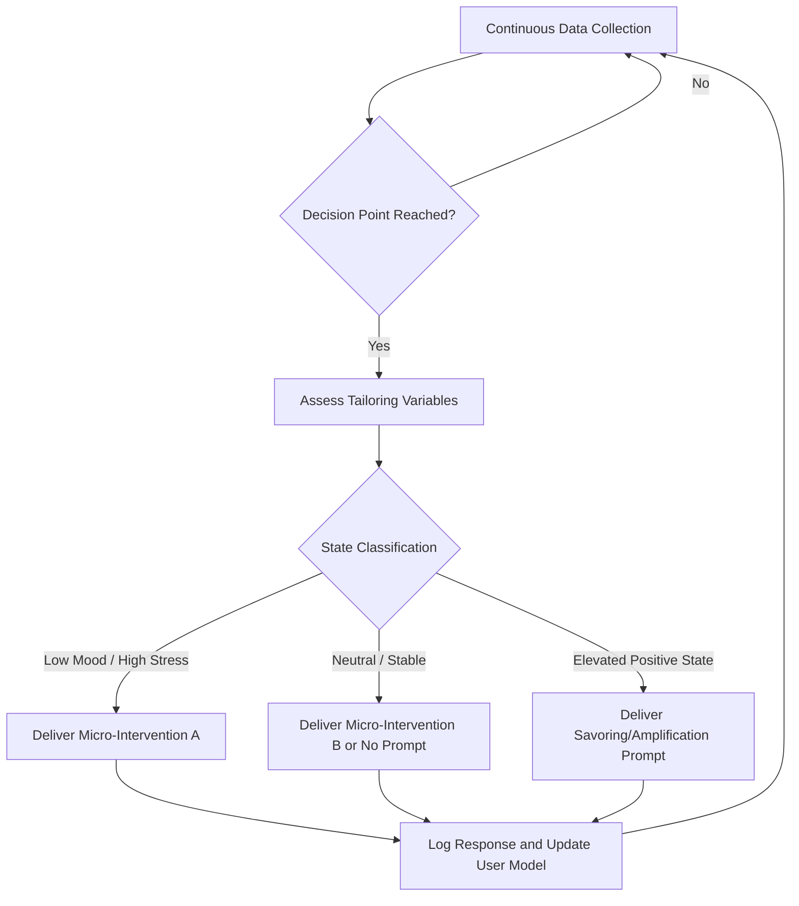
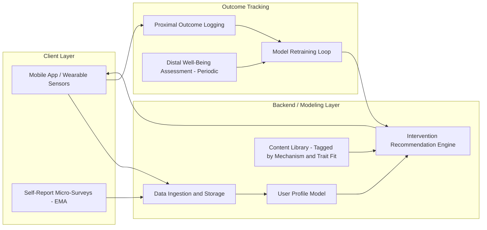

## Precision and Personalized Approaches to Well-Being Interventions


### Overview

Precision well-being (also called personalized positive psychology intervention, or PPPI) refers to the practice of matching well-being interventions to individual characteristics rather than applying a uniform, one-size-fits-all program. This paradigm borrows its logic from precision medicine: just as a cancer treatment can be tailored to a tumor's genetic profile, a happiness intervention can, in principle, be tailored to a person's personality, values, motivation, culture, and context.

The core premise is that positive psychology interventions (PPIs) — gratitude journaling, acts of kindness, strengths use, best-possible-self exercises, mindfulness, and so on — do not produce uniform effects across people. Meta-analytic evidence consistently shows small-to-moderate average effect sizes with substantial heterogeneity, which suggests that some subgroups benefit strongly while others benefit little or not at all. Precision approaches attempt to explain and exploit that heterogeneity rather than average over it.

### Key Points

- **Person-Activity Fit**: The dominant theoretical model (Lyubomirsky & Layous) proposing that an intervention's benefit depends on the fit between the activity's features and the person's characteristics (motivation, values, personality, culture, effort invested).
- **Moving beyond average effects**: Precision approaches treat heterogeneity in intervention response as signal to be modeled, not noise to be averaged out.
- **Moderators over main effects**: The research question shifts from "does gratitude journaling work?" to "for whom, under what conditions, and via what mechanism does gratitude journaling work?"
- **Measurement-based care**: Continuous or frequent assessment (e.g., ecological momentary assessment) is used to adapt intervention content or dosage over time.
- **Algorithmic matching**: Machine learning models increasingly assist in mapping individual profiles to predicted "best-fit" interventions.

### Theoretical Foundations

#### The Person-Activity Fit Diagnostic Model

Lyubomirsky and Layous (2013) proposed that the sustainability of intervention-driven happiness gains depends on fit across several dimensions:

$$\text{Sustained Well-Being Gain} = f(\text{Activity} \times \text{Person} \times \text{Fit Factors})$$

Fit factors include:

1. **Motivation and effort** — whether the person is intrinsically motivated to perform the activity versus externally compelled.
2. **Personality congruence** — e.g., extraverts may benefit more from social-connection-based interventions (acts of kindness), while introverts may benefit more from solitary reflective ones (gratitude writing).
3. **Culture and values** — collectivist versus individualist orientations shape whether other-focused or self-focused interventions land better.
4. **Preexisting well-being level or symptom severity** — individuals with clinical-range depressive symptoms may need different intervention intensity or combination with therapy than subclinical populations.
5. **Timing and life circumstances** — an intervention's fit can change with life stage, stressor exposure, or current emotional state.

#### Differential Susceptibility and Sensitivity Frameworks

Borrowed from developmental psychology, differential susceptibility theory suggests some individuals are more responsive to *both* positive and negative environmental inputs ("orchid" individuals), while others are comparatively unaffected either way ("dandelion" individuals). Applied to PPIs, this implies that responsiveness itself is a trait-like individual difference worth measuring and screening for. [Inference] The direct transplantation of this framework from developmental psychology into adult well-being intervention research is theoretically plausible but has limited direct empirical validation as of this writing.

#### PERMA and Multidimensional Targeting

Because well-being is multidimensional (Seligman's PERMA: Positive emotion, Engagement, Relationships, Meaning, Accomplishment), precision approaches also personalize *which dimension* to target. A profiling instrument might reveal that a client is low specifically on Meaning while adequate on Positive Emotion, directing intervention selection toward meaning-centered approaches (e.g., values clarification, legacy projects) rather than emotion-focused ones (e.g., savoring exercises).

### Methodological Approaches to Personalization

#### 1. Trait-Based Matching

Static individual-difference variables are measured once and used to assign interventions.

| Individual Difference | Example Matching Logic |
| --- | --- |
| Extraversion | Higher extraversion → social/kindness interventions show larger gains |
| Attachment style | Secure attachment → relationship-gratitude interventions; avoidant attachment → may need lower-intimacy entry points |
| Baseline well-being | Lower baseline → larger absolute gains possible (regression to the mean caveat applies) |
| Rumination tendency | High trait rumination → savoring/mindfulness may require modification to avoid backfiring into rumination |
| Cultural orientation | Collectivist orientation → other-praising/kindness activities; individualist orientation → self-focused strength activities |

[Unverified] Specific effect-size magnitudes for each matched pairing vary considerably across studies and populations; the table reflects general directional hypotheses found in the literature, not fixed, universally replicated coefficients.

#### 2. Preference-Based / Self-Selected Matching

Rather than algorithmically assigning an intervention, participants choose from a menu of validated activities. Research (e.g., Schueller, 2010) finds that self-selected activities are sometimes but not always associated with better adherence and outcomes, since choice can increase engagement and perceived autonomy (consistent with self-determination theory).

#### 3. Adaptive / Just-in-Time Adaptive Interventions (JITAIs)

JITAIs use real-time or near-real-time data (via smartphone sensors, ecological momentary assessment, or wearables) to determine *when* and *what* intervention content to deliver. The general decision architecture:



Core components of a JITAI:

- **Decision points**: Moments when a decision about intervention delivery is made (fixed intervals or event-triggered).
- **Tailoring variables**: Internal or contextual states (mood, location, stress biomarkers, sleep quality) used to inform the decision.
- **Decision rules**: Algorithms (rule-based or ML-based) mapping tailoring variable states to intervention options.
- **Proximal outcomes**: Short-term targets (e.g., reduced momentary negative affect) presumed to aggregate into distal outcomes (e.g., longitudinal well-being gain).

#### 4. Machine Learning–Based Personalization Engines

More recent approaches use supervised learning to predict which intervention a given user profile will respond best to, using historical trial data with heterogeneous treatment effect estimation techniques.

Common technical approaches:

- **Causal forests / Generalized Random Forests**: Estimate conditional average treatment effects $\tau(x)$ for covariate profile $x$, enabling identification of subgroups with differential intervention benefit.
- **Uplift modeling**: Originally from marketing analytics, repurposed to predict which individuals will show the largest *incremental* benefit from a specific intervention versus a control condition, rather than just predicting the outcome itself.
- **Contextual bandits**: A reinforcement-learning formulation in which the "arms" are candidate interventions and the "context" is the user's profile; the algorithm balances exploration (trying under-tested matches) and exploitation (delivering known-good matches) as data accumulates.

A simplified conditional average treatment effect (CATE) estimator can be expressed as:

$$\hat{\tau}(x) = \hat{\mu}_1(x) - \hat{\mu}_0(x)$$

where $\hat{\mu}_1(x)$ is the predicted outcome under intervention and $\hat{\mu}_0(x)$ is the predicted outcome under control, both conditioned on individual covariate profile $x$.

[Inference] While these techniques are well-established in causal inference and computational social science generally, their application specifically to well-being/PPI trial data remains a comparatively young research niche; published, peer-reviewed applications specifically to positive psychology interventions (as opposed to clinical mental health interventions more broadly) are fewer than in adjacent fields like digital mental health for depression/anxiety.

### Digital and Technological Infrastructure

#### Typical System Architecture for a Personalized Well-Being App



Key architectural considerations:

- **Data privacy and consent**: Mood, sensor, and location data are sensitive; systems generally require explicit consent flows and, depending on jurisdiction, may fall under health-data regulations (e.g., HIPAA in the U.S. context for certain deployments, GDPR in the EU).
- **Content tagging ontology**: The intervention content library is typically tagged along multiple axes (target PERMA dimension, mechanism of action, expected fit traits, delivery modality) to support the recommendation engine's matching logic.
- **Cold-start problem**: New users lack historical response data, so systems often begin with population-average or trait-based assignment before shifting to personalized/adaptive recommendations as data accumulates — a standard exploration-exploitation tradeoff in recommender systems.

### Practical Example: Building a Simple Rule-Based Matching Logic

A simplified, illustrative pseudocode decision procedure combining trait-based screening with a menu-based choice architecture:

```python
def recommend_intervention(profile):
    """
    profile: dict with keys like
      'extraversion' (0-1), 'baseline_wellbeing' (0-1),
      'low_dimension' (one of 'positive_emotion','engagement',
                        'relationships','meaning','accomplishment'),
      'rumination_tendency' (0-1)
    """
    candidates = []

    if profile['low_dimension'] == 'meaning':
        candidates.append('values_clarification_exercise')
        candidates.append('legacy_letter_writing')

    if profile['low_dimension'] == 'relationships':
        if profile['extraversion'] > 0.5:
            candidates.append('acts_of_kindness_public')
        else:
            candidates.append('gratitude_letter_private')

    if profile['low_dimension'] == 'positive_emotion':
        if profile['rumination_tendency'] < 0.5:
            candidates.append('savoring_exercise')
        else:
            candidates.append('behavioral_activation_light')
            # Savoring/reflection-based tasks are avoided here because
            # elevated rumination tendency raises the risk that
            # unstructured reflection prompts amplify negative
            # rumination cycles rather than positive affect.

    if not candidates:
        candidates.append('three_good_things')  # robust default

    return candidates
```

**Output** (example call with `profile = {'extraversion': 0.3, 'baseline_wellbeing': 0.4, 'low_dimension': 'relationships', 'rumination_tendency': 0.6}`):



```
['gratitude_letter_private']
```

This illustrates the basic logic pattern underlying many trait-matching systems: branch on the deficient well-being dimension first, then refine using secondary trait moderators. Production systems replace these hand-coded rules with learned models but often retain this hierarchical structure for interpretability.

### Empirical Evidence and Limitations

- **Meta-analytic heterogeneity**: Sin and Lyubomirsky's (2009) meta-analysis and subsequent updates find that PPIs produce reliable but modest average effects ($d \approx 0.3$–$0.4$ for well-being outcomes), with wide confidence intervals suggesting real moderation.
- **Mixed matching-effect evidence**: Some trials find that matched interventions outperform mismatched/random assignment (supporting Person-Activity Fit); others find null or inconsistent matching effects, particularly when the matching variable is weakly theoretically justified. [Unverified] The overall replication rate of specific matching hypotheses (e.g., extraversion-kindness matching) across independent labs is not settled, and effect sizes should not be treated as fixed constants.
- **Overfitting risk in ML-personalization**: Small clinical/well-being trial sample sizes (often n < 500) relative to the number of candidate moderators create meaningful risk of overfitting when using flexible ML models for subgroup identification; pre-registration and out-of-sample validation are recommended methodological safeguards.
- **Ethical and equity concerns**: Personalization systems trained predominantly on WEIRD (Western, Educated, Industrialized, Rich, Democratic) populations may generalize poorly to underrepresented groups, potentially widening rather than closing well-being disparities. [Inference] This is an extrapolation from well-documented algorithmic fairness concerns in adjacent ML application domains, applied here to the well-being intervention context specifically.
- **Behavioral variability disclaimer**: Because these are behavioral and psychological interventions, actual individual outcomes may vary based on adherence, context, comorbid conditions, and factors outside the model's covariates; algorithmic recommendations should be understood as probabilistic guidance rather than guaranteed outcomes.

### Illustrative Diagram: Precision Well-Being Pipeline (svg_diagram)

<svg xmlns="http://www.w3.org/2000/svg" viewBox="0 0 800 320">
<text x="400" y="24" text-anchor="middle" font-size="16" font-weight="bold" fill="#222">Precision Well-Being Intervention Pipeline (svg_diagram)</text>
<rect x="20" y="60" width="140" height="60" rx="8" fill="#dbe9ff" stroke="#3366cc" />
<text x="90" y="85" text-anchor="middle" font-size="12" fill="#222">Individual</text>
<text x="90" y="100" text-anchor="middle" font-size="12" fill="#222">Profiling</text>
<rect x="200" y="60" width="140" height="60" rx="8" fill="#dbe9ff" stroke="#3366cc" />
<text x="270" y="85" text-anchor="middle" font-size="12" fill="#222">Trait / State</text>
<text x="270" y="100" text-anchor="middle" font-size="12" fill="#222">Feature Extraction</text>
<rect x="380" y="60" width="140" height="60" rx="8" fill="#ffe9c6" stroke="#cc8800" />
<text x="450" y="85" text-anchor="middle" font-size="12" fill="#222">Matching /</text>
<text x="450" y="100" text-anchor="middle" font-size="12" fill="#222">Recommendation Engine</text>
<rect x="560" y="60" width="140" height="60" rx="8" fill="#d9f2d9" stroke="#339933" />
<text x="630" y="85" text-anchor="middle" font-size="12" fill="#222">Delivered</text>
<text x="630" y="100" text-anchor="middle" font-size="12" fill="#222">Intervention</text>
<line x1="160" y1="90" x2="200" y2="90" stroke="#555" stroke-width="2" marker-end="url(#arrow)" />
<line x1="340" y1="90" x2="380" y2="90" stroke="#555" stroke-width="2" marker-end="url(#arrow)" />
<line x1="520" y1="90" x2="560" y2="90" stroke="#555" stroke-width="2" marker-end="url(#arrow)" />
<rect x="380" y="180" width="140" height="60" rx="8" fill="#f2d9d9" stroke="#cc3333" />
<text x="450" y="205" text-anchor="middle" font-size="12" fill="#222">Outcome</text>
<text x="450" y="220" text-anchor="middle" font-size="12" fill="#222">Measurement</text>
<line x1="630" y1="120" x2="630" y2="210" stroke="#555" stroke-width="2" />
<line x1="630" y1="210" x2="520" y2="210" stroke="#555" stroke-width="2" marker-end="url(#arrow)" />
<line x1="450" y1="180" x2="450" y2="120" stroke="#555" stroke-width="2" stroke-dasharray="5,4" marker-end="url(#arrow)" />
<text x="470" y="150" font-size="11" fill="#555">model update</text>
</svg>

### Conclusion

Precision and personalized well-being interventions represent a shift from population-average intervention design toward individually tailored, data-informed matching between people and practices. The field draws on established theory (Person-Activity Fit, PERMA), borrows statistical machinery from precision medicine and causal inference (CATE estimation, uplift modeling), and is increasingly implemented through adaptive digital systems (JITAIs, ML-based recommendation engines). While early evidence for matching effects is promising in specific cases, the field faces open challenges around sample size, overfitting, generalizability across cultural and demographic groups, and disentangling genuine moderation from statistical noise.

### Related Topics

- Just-in-Time Adaptive Interventions (JITAIs) in digital mental health
- Causal inference methods: causal forests, uplift modeling, heterogeneous treatment effects
- Ecological Momentary Assessment (EMA) and experience sampling methodology
- Self-Determination Theory and autonomy-supportive intervention design
- Algorithmic fairness and equity in digital health personalization
- Positive psychology intervention (PPI) meta-analyses and effect size heterogeneity
- Wearable sensor-based affective computing for well-being monitoring
- Recommender systems: cold-start problem and exploration-exploitation tradeoffs