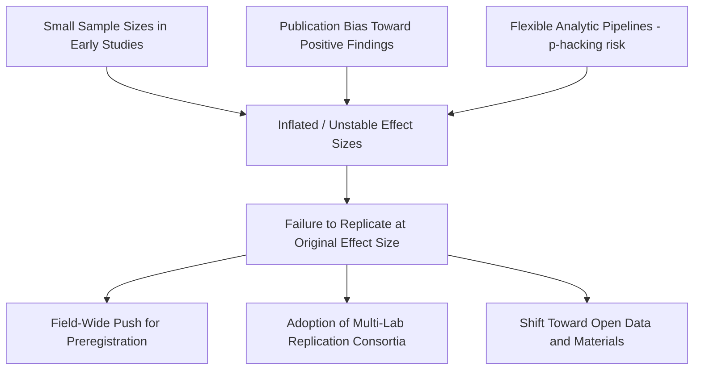

## Open Questions and the Ongoing Evolution of Positive Psychology and Resilience Science


### Overview

Positive psychology and resilience science have matured from a founding manifesto (Seligman & Csikszentmihalyi, 2000) into an empirically active field spanning clinical psychology, organizational behavior, education, public health, and computational social science. Maturation, however, has surfaced significant unresolved tensions: definitional disputes, measurement problems, replication concerns, cultural generalizability limits, and philosophical questions about what "flourishing" even means. This section catalogs the field's major open questions and the directions researchers are pursuing to resolve them.

### Key Points

- Positive psychology's foundational constructs (happiness, well-being, resilience, flourishing) remain contested and inconsistently operationalized across studies.
- The replication crisis affecting psychology broadly has specifically implicated several canonical positive psychology findings.
- Resilience science has shifted from trait-based models toward dynamic-systems and process-based models.
- Measurement methodology (self-report reliance, retrospective bias) remains a persistent limitation.
- Cultural and demographic generalizability is a growing concern as the evidence base has been dominated by WEIRD samples.
- Integration with neuroscience, computational modeling, and network science represents a major emerging direction.

### Open Question 1: Construct Definition and Fragmentation

#### The Problem

"Well-being," "happiness," "flourishing," and "resilience" are used inconsistently across studies, sometimes interchangeably and sometimes as distinct constructs with different operationalizations. Major competing frameworks include:

| Framework | Core Definition | Primary Proponent(s) |
| --- | --- | --- |
| Hedonic well-being | Subjective pleasure, positive affect minus negative affect, life satisfaction | Diener |
| Eudaimonic well-being | Meaning, purpose, self-actualization, psychological functioning | Ryff, Ryan & Deci |
| PERMA | Five-factor composite: Positive emotion, Engagement, Relationships, Meaning, Accomplishment | Seligman |
| Broaden-and-Build | Positive emotions broadening cognitive-behavioral repertoires over time | Fredrickson |

These frameworks are not fully reducible to one another, and studies using different frameworks sometimes report divergent or even contradictory findings about the "same" underlying phenomenon. [Inference] This fragmentation is widely acknowledged in review literature as a barrier to cumulative science, though there is no field-wide consensus yet on which framework (if any) should be treated as canonical.

#### Emerging Resolution Attempts

- **Network approaches to well-being**: Treating well-being not as a single latent trait but as a dynamic network of interacting components (affect, cognition, behavior), borrowing methodology from psychopathology network analysis.
- **Bifactor modeling**: Statistical attempts to separate a general well-being factor from framework-specific residual factors, to test whether PERMA, hedonic, and eudaimonic measures share a common core.

### Open Question 2: The Replication Crisis and Positive Psychology

#### Specific Implicated Findings

Several widely cited early findings have faced replication difficulties or effect-size deflation in more rigorous follow-up studies:

- **Facial feedback hypothesis** (holding a pen in one's teeth inducing smiling-related mood effects) — a large multi-lab replication effort found substantially attenuated effects compared to the original study.
- **Power posing** (expansive postures causing hormonal and behavioral confidence effects) — one of the original co-authors publicly retracted confidence in the effect after replication failures.
- **Ego depletion / willpower-as-limited-resource** — a large-scale multi-lab Registered Replication Report found effects indistinguishable from zero, undermining a construct that had been foundational to some self-regulation-based resilience models.

[Unverified] The above are documented cases widely discussed in the metascience literature; the broader claim that "most" positive psychology findings would fail replication is a stronger and less settled assertion that this summary does not endorse.

#### Structural Causes Under Discussion



#### Field Responses

- **Preregistration** of hypotheses and analysis plans prior to data collection, now required or strongly encouraged by many journals in the field.
- **Registered Reports**, where peer review occurs before results are known, reducing publication bias.
- **Multi-lab collaborative replication networks** (e.g., the Psychological Science Accelerator model) applied to well-being research questions.
- **Meta-analytic recalibration**, revising canonical effect-size estimates downward as more rigorous, higher-powered studies accumulate.

### Open Question 3: From Trait Resilience to Process-Based and Dynamic Systems Models

#### Historical Shift

Early resilience research (1970s–1990s) largely conceptualized resilience as a relatively stable individual trait — some people simply "have" more of it (hardiness, ego-resilience). Contemporary resilience science has moved toward:

1. **Process models**: Resilience as an *outcome of dynamic processes* (coping, meaning-making, social support mobilization) rather than a fixed trait.
2. **Multisystem resilience frameworks** (Masten): Resilience emerges from interactions across individual, family, community, and sociocultural systems — not solely from within-person characteristics.
3. **Dynamic systems / complexity models**: Resilience represented as a system's capacity to maintain or recover stable functioning following perturbation, formalized using concepts borrowed from ecology and physics (e.g., attractor states, resistance, recovery rate, critical transitions).

#### Mathematical Framing (Illustrative)

Dynamic systems resilience models sometimes represent psychological functioning $y(t)$ as returning toward a baseline attractor state following a perturbation $P$ at time $t_0$:

$$y(t) = y_{\text{baseline}} + (y(t_0) - y_{\text{baseline}}) \cdot e^{-\lambda (t - t_0)}$$

where $\lambda$ represents a recovery rate parameter. Higher $\lambda$ indicates faster return to baseline functioning after adversity — operationalizing "resilience" as a recovery-rate parameter rather than a static trait score. [Inference] This exponential-recovery formalization is one illustrative simplification used in complexity-inspired resilience modeling; real empirical recovery trajectories are often non-monotonic and may not follow a clean exponential form.

#### Open Sub-Questions

- Is resilience domain-general or domain-specific (can someone be resilient at work but not in relationships)?
- Is resilience better measured as an outcome (absence of psychopathology after adversity) or as a process (active coping mechanisms), and does conflating the two cause circular reasoning in study designs?
- How should "adversity exposure" be operationalized and quantified across heterogeneous stressor types?

### Open Question 4: Measurement Methodology Limitations

- **Self-report dominance**: The overwhelming majority of well-being and resilience measures rely on retrospective self-report, which is subject to recall bias, social desirability bias, and mood-congruent memory effects.
- **Ecological validity gap**: Cross-sectional self-report snapshots may not capture the temporal dynamics that process-based resilience models claim matter most.
- **Emerging methodological responses**:
  - **Ecological Momentary Assessment (EMA)** and experience sampling to capture real-time affect and behavior with reduced recall bias.
  - **Passive sensing** (smartphone-based behavioral markers, wearable physiological signals) as objective or semi-objective proxies for well-being-relevant states (sleep, activity, social contact frequency).
  - **Behavioral and performance-based tasks** as alternatives or complements to self-report (e.g., approach-avoidance tasks, implicit association measures for well-being-relevant constructs).
  - **Natural language processing** of diary or social media text as a scalable, less reactive measurement channel. [Speculation] The long-term validity and cross-cultural robustness of NLP-derived well-being indicators as a substitute for validated self-report scales is an active and unresolved research question, not an established measurement standard.

### Open Question 5: Cultural Generalizability and the WEIRD Problem

Much of the empirical base for positive psychology and resilience science derives from WEIRD (Western, Educated, Industrialized, Rich, Democratic) samples, raising generalizability concerns:

- Constructs like "self-esteem" and "individual achievement" as central well-being components may reflect individualist cultural assumptions not shared by collectivist cultural contexts, where relational harmony or family honor may carry more well-being-relevant weight.
- Some interventions validated in Western contexts (e.g., certain gratitude or self-compassion exercises) show attenuated or culturally discordant effects when transported directly without adaptation. [Unverified] The specific magnitude of cross-cultural attenuation varies by study and intervention type, and should not be treated as a fixed universal discount factor.
- Indigenous and non-Western conceptions of flourishing (e.g., Ubuntu-influenced relational well-being models in parts of Southern Africa, Confucian relational harmony frameworks in East Asian contexts) are increasingly being incorporated as parallel, non-hierarchical frameworks rather than as "variants" to be explained by Western models.

### Open Question 6: Integration with Neuroscience and Computational Approaches

#### Affective Neuroscience Integration

Ongoing work attempts to ground well-being and resilience constructs in neurobiological substrates (e.g., prefrontal-amygdala regulatory circuits, reward-system dopaminergic signaling, HPA-axis stress reactivity). This raises an open question of **levels of explanation**: whether psychological resilience constructs will eventually reduce to, map onto, or remain conceptually independent from neurobiological markers.

#### Computational Modeling and Formal Theory

The field has historically been theory-rich but formalization-poor compared to fields like cognitive science. Emerging efforts include:

- **Agent-based models** simulating how resilience-relevant behaviors (help-seeking, coping strategy selection) propagate through social networks under stress.
- **Formal computational models of emotion regulation**, borrowing from control theory to model affect as a regulated variable with feedback loops.
- **Network psychometrics** applied to resilience and well-being item-level data, treating symptoms/strengths as causally interacting nodes rather than reflective indicators of a single latent construct.


### Open Question 7: Ethical, Political, and Philosophical Tensions

- **"Positivity as obligation" critique**: Critics (e.g., within critical psychology) argue that positive psychology risks pathologizing negative emotion or implicitly blaming individuals for insufficient resilience in the face of structural/systemic adversity (poverty, discrimination, political violence).
- **Whose flourishing counts?**: Questions about whether well-being science adequately incorporates structural and societal determinants of well-being (economic inequality, systemic discrimination) versus over-emphasizing individual-level intervention.
- **Commercialization concerns**: The proliferation of wellness apps and corporate "resilience training" programs raises questions about whether commercial incentives are outpacing the evidentiary basis for specific products, and whether responsibility for well-being is being inappropriately shifted onto individuals in contexts where structural change would be more effective (e.g., using individual resilience training to address burnout instead of addressing organizational conditions causing it).

### Practical Example: Formulating a Precision, Open-Question-Aware Research Design

An illustrative checklist a researcher might use to address several open questions simultaneously within a single study design:

```python
research_design_checklist = {
    "construct_definition": "Explicitly specify hedonic vs eudaimonic vs PERMA framework used; justify choice",
    "preregistration": "Register hypotheses, sample size rationale, and analysis plan prior to data collection",
    "measurement_triangulation": [
        "self_report_scale",
        "ecological_momentary_assessment",
        "passive_sensor_data (optional)"
    ],
    "sample_diversity": "Report sample demographics; avoid overgeneralizing from single-culture sample",
    "process_vs_outcome": "Specify whether resilience is measured as trajectory/process or as endpoint outcome",
    "effect_size_reporting": "Report effect sizes with confidence intervals, not just significance tests",
    "replication_plan": "Identify at least one independent lab or dataset for replication attempt"
}
```

**Output** (conceptual, not executable against real data — illustrates the checklist structure only):



```
Design flagged as addressing 6 of 7 identified open-question categories.
Missing: sample_diversity justification not yet specified.
```

### Illustrative Diagram: Field Evolution Timeline (svg_diagram)

<svg xmlns="http://www.w3.org/2000/svg" viewBox="0 0 800 260">
<text x="400" y="24" text-anchor="middle" font-size="16" font-weight="bold" fill="#222">Evolution of Positive Psychology and Resilience Science (svg_diagram)</text>
<line x1="60" y1="140" x2="740" y2="140" stroke="#888" stroke-width="2" />
<circle cx="100" cy="140" r="6" fill="#3366cc" />
<text x="100" y="165" text-anchor="middle" font-size="11" fill="#222">1998-2005</text>
<text x="100" y="180" text-anchor="middle" font-size="11" fill="#222">Founding &amp;</text>
<text x="100" y="193" text-anchor="middle" font-size="11" fill="#222">Trait Models</text>
<circle cx="260" cy="140" r="6" fill="#3366cc" />
<text x="260" y="165" text-anchor="middle" font-size="11" fill="#222">2005-2012</text>
<text x="260" y="180" text-anchor="middle" font-size="11" fill="#222">Intervention</text>
<text x="260" y="193" text-anchor="middle" font-size="11" fill="#222">Boom (PPIs)</text>
<circle cx="420" cy="140" r="6" fill="#cc8800" />
<text x="420" y="165" text-anchor="middle" font-size="11" fill="#222">2012-2018</text>
<text x="420" y="180" text-anchor="middle" font-size="11" fill="#222">Replication</text>
<text x="420" y="193" text-anchor="middle" font-size="11" fill="#222">Crisis Reckoning</text>
<circle cx="580" cy="140" r="6" fill="#339933" />
<text x="580" y="165" text-anchor="middle" font-size="11" fill="#222">2018-2023</text>
<text x="580" y="180" text-anchor="middle" font-size="11" fill="#222">Process &amp; Multisystem</text>
<text x="580" y="193" text-anchor="middle" font-size="11" fill="#222">Resilience Models</text>
<circle cx="700" cy="140" r="6" fill="#cc3333" />
<text x="700" y="165" text-anchor="middle" font-size="11" fill="#222">2023-Present</text>
<text x="700" y="180" text-anchor="middle" font-size="11" fill="#222">Precision &amp; Computational</text>
<text x="700" y="193" text-anchor="middle" font-size="11" fill="#222">Integration</text>

<text x="400" y="230" text-anchor="middle" font-size="11" fill="#666" font-style="italic">Timeline is a simplified heuristic organization of major thematic shifts, not a precise chronology</text>

</svg>

### Conclusion

Positive psychology and resilience science remain vigorously contested, self-correcting fields rather than settled bodies of knowledge. Core open questions span construct definition, measurement validity, replicability, dynamic-systems reconceptualization of resilience, cultural generalizability, computational formalization, and ethical/political critique. Rather than representing weaknesses, this ongoing contestation reflects a maturing science actively engaged in the standard scientific process of hypothesis revision, methodological improvement, and theoretical refinement — a process expected to continue as new tools (computational modeling, precision-matching algorithms, network psychometrics) and more globally representative samples become available.

### Related Topics

- The psychology replication crisis: causes, consequences, and reforms
- Multisystem resilience theory (Ann Masten) and ecological models of development
- Network psychometrics applied to well-being and psychopathology
- Cross-cultural psychology and non-Western models of flourishing
- Precision and personalized approaches to well-being interventions
- Critical psychology critiques of the positive psychology movement
- Preregistration, Registered Reports, and open science practices in psychology
- Computational and formal modeling approaches in affective science