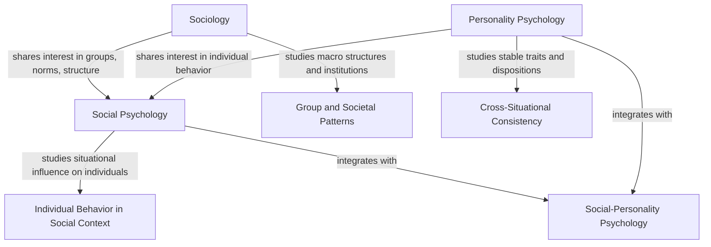

## Relationship to Sociology and Personality Psychology

### Overview

Social psychology occupies a middle ground between sociology and personality psychology, sharing subject matter with both while retaining a distinct level of analysis and methodological identity. Understanding these boundary relationships clarifies why social psychology asks the questions it asks and, equally, why it avoids others.

### Social Psychology and Sociology

**Shared Subject Matter**

Both fields study group behavior, social norms, prejudice, deviance, collective action, and social influence. Historically, social psychology even developed two semi-independent traditions: a *psychological social psychology* (housed in psychology departments, experimental, individual-focused) and a *sociological social psychology* (housed in sociology departments, often using survey and field methods, structure-focused). Some textbooks trace this dual lineage to the near-simultaneous 1908 publication of textbooks by psychologist William McDougall and sociologist Edward Ross.

**Key Points of Divergence**

| Dimension | Sociology | Social Psychology |
| --- | --- | --- |
| Unit of analysis | Groups, institutions, social structures | Individuals within social contexts |
| Explanatory target | Macro-level patterns (class, culture, institutions) | Micro-level processes (cognition, affect, behavior) |
| Typical method | Survey, ethnography, archival/demographic data | Controlled experiment, lab/field study |
| Causality model | Structural/systemic causation | Proximal, situational causation |
| Sample question | Why does income inequality correlate with crime rates? | Why does relative deprivation increase an individual's aggression? |

**Key Points**

- Sociology treats social structures (class, institutions, culture) as causal forces in their own right; social psychology treats them as inputs that shape individual cognition and behavior.
- Sociological social psychology (e.g., symbolic interactionism, associated with George Herbert Mead) examines how the self is constructed through social interaction—a topic social psychology also studies, but typically with more emphasis on internal cognitive mechanisms and less on symbolic meaning-systems.
- Methodologically, sociology has historically been more comfortable with correlational and observational designs answering "what patterns exist at scale," while social psychology prioritizes experimental control to answer "what causes what."

**Example**

Studying racial prejudice: a sociologist might examine how residential segregation and institutional policy produce disparate group outcomes at a city level (structural explanation). A social psychologist might run an experiment manipulating intergroup contact to see whether it reduces an individual's implicit bias scores (individual-level, causal-mechanism explanation). Both are legitimate and often complementary; contemporary work increasingly integrates both levels (e.g., studying how structural segregation shapes intergroup contact opportunities, which in turn shape individual attitudes).

### Social Psychology and Personality Psychology

**Shared Subject Matter**

Both fields seek to explain individual behavior, and both are historically rooted in overlapping questions: why do people differ in aggression, altruism, or conformity? Many personality constructs (e.g., self-esteem, attachment style, Big Five traits) are studied within social-psychological research as moderators of situational effects.

**The Person-Situation Debate**

The clearest articulation of the boundary is Kurt Lewin's formula:

$$B = f(P, E)$$

Personality psychology emphasizes $P$ (stable individual differences that predict behavior consistently across situations), while social psychology emphasizes $E$ (situational and social forces that predict behavior across individuals, regardless of their traits). This tension became historically acute after Walter Mischel's 1968 critique, which argued that cross-situational consistency in trait-based predictions was often weaker than assumed, appearing to favor the situationist position central to social psychology.

**Resolution: Interactionism**

Contemporary consensus treats this as a false dichotomy. Most modern research adopts an **interactionist** framework, studying:

- **Person × Situation interactions**: e.g., high self-monitors conform more in public than low self-monitors, but this trait difference only manifests under certain situational conditions (public vs. private behavior).
- **Situational strength**: In "strong" situations (clear norms, high social pressure, e.g., a funeral), behavior is fairly uniform across individuals regardless of personality. In "weak" situations (ambiguous norms, e.g., a party with no clear script), personality differences predict behavior more strongly.

**Key Points**

- Personality psychology asks: what stable dispositions predict cross-situational behavioral consistency?
- Social psychology asks: what situational and social factors predict behavior across people, holding disposition roughly constant?
- The two fields are increasingly integrated in **social-personality psychology**, a hybrid subfield and common departmental/journal pairing (e.g., *Journal of Personality and Social Psychology*).

**Example**

Consider helping behavior. A personality psychologist might measure trait empathy and find it predicts helping across many situations. A social psychologist (Latané & Darley's bystander research) would instead manipulate the number of bystanders present and find that helping decreases as group size increases—an effect that held across people regardless of their individual empathy levels, demonstrating the situational power central to the field's scope. An interactionist study might show that the bystander effect is attenuated among individuals high in trait empathy or personal responsibility, illustrating $P \times E$.

### Diagram: Disciplinary Boundaries

### Comparative Table: Three-Way Distinction

| Feature | Sociology | Social Psychology | Personality Psychology |
| --- | --- | --- | --- |
| Primary question | How do structures shape groups? | How does the social situation shape the individual? | How do stable traits shape the individual? |
| Typical variable of interest | Institutional/structural variables | Situational/experimental manipulations | Trait/dispositional measures |
| Emphasis on causality | Systemic | Proximal/experimental | Predictive/correlational (historically) |
| Representative construct | Social stratification | Conformity, obedience, attribution | The Big Five, self-esteem, attachment style |
| Historical figure | Émile Durkheim, George Herbert Mead | Kurt Lewin, Solomon Asch | Gordon Allport, Walter Mischel |

### Why the Boundaries Matter

[Inference] Because social psychology's identity was partly forged in explicit contrast to both neighboring fields—rejecting sociology's macro-structural determinism and rejecting personality psychology's purely dispositional determinism—the field's methodological signature (controlled experimentation isolating situational causes while often assuming individuals are broadly interchangeable) can be traced directly to this dual boundary-setting. This explains why classic social psychology studies (Asch, Milgram, Zimbardo) minimize attention to participant personality differences and instead emphasize how situational manipulation alone can produce dramatic behavioral shifts.

### Caveats

[Unverified] The sharpness of these disciplinary boundaries varies by era, country, and institution; some departments blend sociological and psychological approaches to social behavior more than others, and the boundary has become increasingly porous with the rise of computational social science, which draws methods from both fields.

**Next Steps**

- Kurt Lewin's field theory and the person-situation debate in depth
- Symbolic interactionism (Mead, Cooley, Goffman) and its influence on the self-concept
- Walter Mischel's person-situation critique and the interactionist resolution
- Social-personality psychology as an integrated subfield
- Cross-cultural psychology's critique of individual-level explanations
- The replication crisis and its differential impact on experimental social psychology