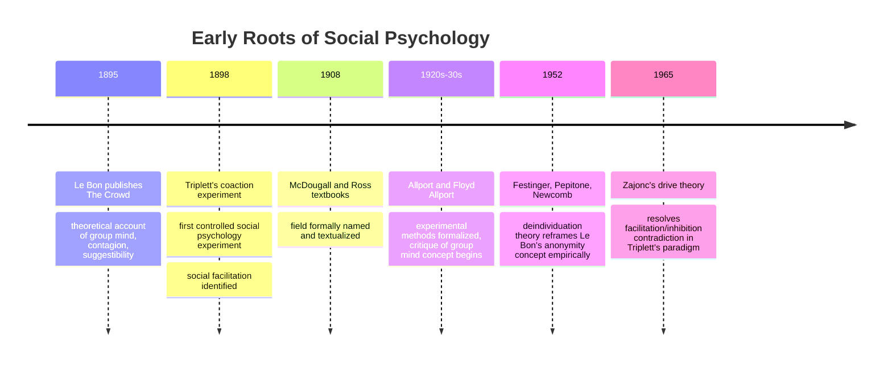

## Early Crowd Psychology: Triplett and Le Bon

### Overview

The origins of social psychology as an empirical discipline are conventionally traced to two figures who approached "the group" from very different methodological angles: Norman Triplett, whose 1898 experiment is widely cited as the first social psychology study, and Gustave Le Bon, whose 1895 treatise on crowd behavior shaped popular and theoretical understanding of collective action decades before rigorous experimental methods existed. Together they represent the discipline's dual origin—one empirical and quantitative, one theoretical and descriptive.

### Norman Triplett and Social Facilitation (1898)

**Background**

Norman Triplett, a psychologist at Indiana University, observed that competitive cyclists tended to ride faster when racing against others than when racing alone against the clock. Intrigued by this pattern, he designed what is generally regarded as the first controlled experiment in social psychology.

**Study Design**

Triplett had children wind fishing reels as quickly as possible under two conditions:

1. **Alone condition**: the child performed the task in isolation.
2. **Coaction condition**: the child performed the task alongside another child doing the same task simultaneously.

**Findings**

Children generally wound the reels faster in the coaction condition than when alone, which Triplett interpreted as evidence that the mere presence of another person performing the same task acts as a stimulant to individual performance.

**Theoretical Significance**

This phenomenon became known as **social facilitation**—the tendency for the presence of others to enhance performance on certain tasks. [Inference] Triplett's study is frequently cited as the founding empirical demonstration of social psychology's core definitional claim (that the presence of others influences individual behavior), which is likely why it holds canonical status in the field's origin narrative, even though some historians note that his statistical analysis and interpretation would not meet modern methodological standards.

**Later Refinement: Zajonc's Drive Theory (1965)**

Robert Zajonc later resolved an apparent contradiction in the social facilitation literature (why presence of others sometimes helps and sometimes hurts performance) by proposing that the presence of others increases physiological arousal, which strengthens the dominant response:

- On **simple or well-learned tasks**, the dominant response is typically correct, so arousal improves performance (facilitation).
- On **complex or novel tasks**, the dominant response is often incorrect, so arousal impairs performance (social inhibition/impairment).

$$\text{Performance} = f(\text{Arousal} \times \text{Dominant Response Correctness})$$

**Key Points**

- Triplett's 1898 study is the most commonly cited "first" social psychology experiment, though some historians point to earlier German work on group performance (e.g., Max Ringelmann's rope-pulling studies in the 1880s) as contemporaneous or even earlier.
- The phenomenon he identified—social facilitation—remains a foundational and still-studied effect in the field.
- Zajonc's drive theory reconciled decades of conflicting findings by introducing task complexity as a moderating variable.

**Example**

A musician may play a well-rehearsed piece more energetically in front of an audience (facilitation) but fumble while sight-reading unfamiliar sheet music under the same audience conditions (impairment)—both consistent with Zajonc's arousal-based account of Triplett's original coaction effect.

### Gustave Le Bon and Crowd Psychology (1895)

**Background**

Gustave Le Bon, a French social theorist, published *The Crowd: A Study of the Popular Mind* (*Psychologie des Foules*) in 1895, during a period of political upheaval in France (including memories of the Paris Commune) that shaped his largely negative view of collective behavior.

**Core Thesis: The "Group Mind"**

Le Bon argued that individuals undergo a psychological transformation when part of a crowd, submerging their individual identity into a collective "group mind" (*l'âme collective*). He proposed three mechanisms driving this transformation:

1. **Anonymity**: Being part of a crowd creates a sense of anonymity that reduces personal accountability, weakening the individual's sense of responsibility for their actions.
2. **Contagion**: Emotions and behaviors spread rapidly through a crowd in a quasi-hypnotic, involuntary manner, similar to the spread of an emotional contagion.
3. **Suggestibility**: Crowd members become highly suggestible, uncritically accepting ideas and impulses that they would normally reject as individuals, entering something Le Bon likened to a hypnotic trance state.

**Consequences Le Bon Proposed**

Le Bon argued crowds are characterized by:

- Reduced intellectual capacity and increased emotionality ("the crowd is always intellectually inferior to the isolated individual")
- Impulsivity and volatility
- Susceptibility to extreme, simplified, and often irrational ideas
- Potential for both destructive violence and, more rarely, heroic self-sacrifice

**Key Points**

- Le Bon's work was **theoretical and observational**, not experimental—it drew on his interpretation of historical events (revolutions, riots, mob violence) rather than controlled data collection.
- His concept of the "group mind" has been heavily criticized by later social psychologists as overly deterministic and lacking empirical rigor, but it was historically influential, shaping early 20th-century thinking about propaganda, fascism, and mass movements. [Unverified] Some historical accounts suggest Le Bon's ideas influenced later political strategists' thinking about mass persuasion, though the extent and directness of this influence is debated among historians.
- Le Bon's ideas prefigured, but were later substantially revised by, deindividuation theory (Festinger, Pepitone, & Newcomb, 1952; Zimbardo, 1969), which retained his emphasis on anonymity but grounded it in testable psychological mechanisms.

**Modern Critique and Successor Theories**

Contemporary social psychology has largely rejected Le Bon's "group mind" as an explanatory mechanism in favor of more precise, testable frameworks:

| Le Bon's Concept | Modern Successor Theory | Key Difference |
| --- | --- | --- |
| Group mind / contagion | Deindividuation theory | Explains reduced self-regulation via anonymity and reduced self-awareness, not a mystical collective consciousness |
| Suggestibility | Social identity theory (Tajfel & Turner) | Crowd behavior reflects a shift to *social* identity (group norms), not loss of individual mind |
| Crowd irrationality | Emergent norm theory (Turner & Killian) | Crowds develop situational norms through interaction, rather than uniformly regressing to primitive impulses |
| Homogeneous crowd behavior | Social identity model of deindividuation effects (SIDE) | Anonymity increases conformity to *salient group norms*, which can be prosocial or antisocial depending on context |

**Example**

Le Bon would explain a riot as individuals losing rational self-control through contagion and suggestibility. A modern social identity theorist would instead argue that rioters are not "losing their minds" but shifting from personal identity to a salient social identity (e.g., "protester," "fan," "rioter"), causing behavior to align with the perceived norms of that group identity—a very different, testable mechanism producing superficially similar outcomes.

### Comparing Triplett and Le Bon

| Dimension | Triplett | Le Bon |
| --- | --- | --- |
| Year | 1898 | 1895 |
| Method | Controlled experiment | Theoretical/observational treatise |
| Focus | Dyadic/small-group coaction | Large, often anonymous crowds |
| Core phenomenon | Social facilitation | Deindividuation, group contagion |
| Legacy | Empirical origin point of experimental social psychology | Theoretical origin point of collective behavior/crowd psychology; later heavily revised |
| Modern status | Core finding still replicated and refined (Zajonc) | Core mechanism ("group mind") largely rejected; specific insights (anonymity effects) retained in revised form |

### Diagram: Two Origins of Social Psychology

### Why Both Matter to the Field's Foundations

[Inference] The pairing of Triplett and Le Bon in foundational narratives is pedagogically useful because it illustrates the discipline's two complementary lineages: Triplett represents the commitment to controlled, quantifiable experimentation that came to define mainstream social psychology's methodology, while Le Bon represents the enduring theoretical interest in collective, emergent phenomena that experimental methods would later need to be adapted to explain rigorously. The tension between Le Bon's rich but untestable theorizing and Triplett's narrow but replicable experimentation foreshadows a recurring methodological debate in the field between ecological richness and experimental control.

**Next Steps**

- Deindividuation theory and the Zimbardo Stanford Prison Experiment
- Social identity theory and self-categorization theory
- Zajonc's drive theory of social facilitation in full
- Emergent norm theory of collective behavior (Turner & Killian)
- Floyd Allport's critique of the group mind concept
- History of the field's formal establishment (McDougall and Ross, 1908)