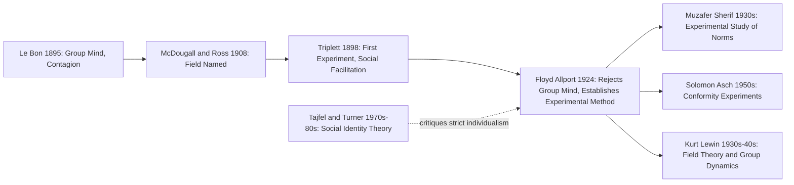

## Floyd Allport and the Founding of Experimental Social Psychology

### Overview

Floyd Henry Allport (1890–1978) is widely credited as the principal founder of experimental social psychology as a rigorous, laboratory-based science. His 1924 textbook, *Social Psychology*, is considered a foundational text that redirected the field away from the speculative, group-mind theorizing of figures like Gustave Le Bon and toward controlled experimentation grounded in individual-level behaviorist principles.

### Historical Context

By the early 20th century, social psychology existed in a fragmented state: sociologists (Ross), instinct theorists (McDougall), and crowd theorists (Le Bon) had all offered competing, largely non-experimental accounts of group behavior. Behaviorism, led by John B. Watson, was simultaneously reshaping American psychology by demanding observable, measurable behavior as the field's proper subject matter. Floyd Allport, trained at Harvard and influenced by this behaviorist wave, sought to apply its methodological rigor specifically to social phenomena.

### Allport's Core Contributions

**1. Rejection of the Group Mind Concept**

Allport's most consequential theoretical move was his forceful rejection of the "group mind" idea central to Le Bon's and McDougall's theorizing. He argued that:

- Groups do not possess a psychology separate from the individuals composing them.
- All social behavior, including crowd behavior, ultimately occurs within and can be explained by individual psychological and physiological processes.
- This position is often summarized in his frequently cited assertion that there is no psychology of groups that is not essentially and entirely a psychology of individuals.

This stance established what is now called **methodological individualism** as a foundational commitment of experimental social psychology—the view that social phenomena must be explained by reference to processes occurring within individuals, even when those processes are triggered by social context.

**Key Points**

- Allport did not deny that groups influence individuals; he denied that groups have an emergent, independent "mind" or consciousness above and beyond their members.
- This distinction preserved social psychology's interest in group phenomena (conformity, social facilitation) while insisting they be studied through individual-level measurement.
- The rejection of the group mind is a direct rebuttal of Le Bon's contagion/suggestibility framework.

**2. Empirical Extension of Social Facilitation**

Building on Triplett's 1898 coaction paradigm, Allport conducted systematic experiments examining how the presence of others affects individual task performance, coining and popularizing key terminology:

- **Coaction effects**: performance changes that occur when individuals perform the same task simultaneously alongside others, without direct interaction.
- **Audience effects**: performance changes that occur when individuals perform a task while being observed by passive spectators.

He found that coaction tended to improve performance on simple, quantitative tasks (e.g., simple arithmetic, word association) but could impair performance on tasks requiring careful, quality-focused reasoning—an early empirical foreshadowing of what Zajonc would later formalize as drive theory.

**3. Establishment of Experimental Methodology as the Field's Standard**

Allport's 1924 textbook explicitly modeled social psychology as an experimental science, advocating:

- Controlled laboratory manipulation of social variables (presence of others, group size, task type).
- Quantitative measurement of individual behavioral output.
- Hypothesis testing over descriptive or historical analysis.

[Inference] This textbook is frequently identified as marking the field's definitive transition from a primarily theoretical/philosophical enterprise (as practiced by Le Bon, McDougall, and Ross) to an experimental science, which is likely why Allport, rather than the earlier Triplett or the contemporaneous 1908 textbook authors, is often specifically credited with "founding" experimental social psychology as an institutionalized discipline.

### Allport vs. Predecessors: A Paradigm Shift

| Dimension | Le Bon / McDougall (pre-1920s) | Floyd Allport (1920s onward) |
| --- | --- | --- |
| Explanatory unit | Group mind, collective consciousness, or instinct | Individual, measurable behavior |
| Method | Observation, historical analysis, theorizing | Controlled laboratory experimentation |
| View of groups | Groups possess emergent properties distinct from members | Groups are aggregates of individuals; "group effects" are individual-level responses to social stimuli |
| Underlying framework | Instinct theory, crowd contagion | Behaviorism |
| Epistemological standard | Descriptive/philosophical | Quantitative/empirical |

### Theoretical Legacy

**Behaviorist Grounding**

Allport's framework treated social stimuli (the presence, actions, or expectations of others) as environmental inputs that produce measurable behavioral outputs, consistent with the stimulus-response logic dominant in psychology at the time:

$$\text{Social Stimulus} \rightarrow \text{Individual Response (measurable behavior)}$$

This behaviorist framing allowed social psychology to adopt the experimental rigor already established in general experimental psychology, giving the field scientific legitimacy within psychology departments.

**Institutional Impact**

[Unverified] Allport's advocacy is often credited with substantially shaping the norms of the field as it developed through the mid-20th century (influencing later figures such as Kurt Lewin, Muzafer Sherif, and Solomon Asch, all of whom relied heavily on controlled experimental designs), though the precise causal weight of Allport's specific influence versus the broader behaviorist zeitgeist of the era is difficult to disentangle historically.

**Criticism and Later Revision**

Allport's strict methodological individualism has been critiqued by later theorists, particularly proponents of **social identity theory** (Tajfel & Turner, 1979) and **self-categorization theory** (Turner et al., 1987), who argue that Allport's framework:

- Underestimated the psychological reality of group-level identity and its distinct effects on cognition and behavior.
- Could not fully explain phenomena like group polarization or intergroup discrimination without reintroducing some notion of shared social identity that goes beyond simple aggregation of individual responses.

[Inference] This later critique suggests that while Allport's rejection of the mystical "group mind" was empirically sound and methodologically productive, his more extreme individualist position may have been a methodological corrective that, once the field had matured, was seen as needing partial rebalancing—not a return to Le Bon's contagion model, but a more sophisticated account of how group membership shapes individual self-concept.

### Diagram: Allport's Position in the Field's Development

### Illustrative Example

**Example**

Suppose a researcher observes that a mob at a political rally becomes increasingly aggressive. Le Bon would attribute this to the crowd's collective mind overtaking individual rationality through contagion. Floyd Allport would instead insist the explanation must be found at the individual level: each person in the crowd is individually responding to visible social cues (others' aggressive behavior, reduced individual accountability due to anonymity, heightened arousal from the coaction of many people performing similar actions), and it is these individually mediated, measurable psychological processes—not a mystical shared consciousness—that produce the aggregate pattern of collective aggression. This reframing is precisely what allowed later researchers to design testable experiments (e.g., deindividuation studies) rather than relying on unfalsifiable group-mind narratives.

### Summary of Enduring Contributions

**Conclusion**

Floyd Allport's lasting contribution was not a single discovery but a **paradigm shift**: he redefined social psychology's proper object of study (the individual responding to social stimuli, not an emergent group consciousness) and its proper method (controlled experimentation, not historical or theoretical description). This combination of methodological individualism and experimental rigor became the disciplinary template that subsequent foundational figures—Lewin, Sherif, Asch, Festinger—would build upon, cementing experimental social psychology as a recognized branch of empirical psychological science by the mid-20th century.

**Next Steps**

- Kurt Lewin's field theory and the founding of group dynamics research
- Muzafer Sherif's autokinetic effect studies and the emergence of social norms
- Solomon Asch's conformity experiments
- Social identity theory as a later corrective to strict methodological individualism
- The behaviorist movement's broader influence on early 20th-century psychology
- Deindividuation theory as an empirical successor to Le Bon's contagion concept