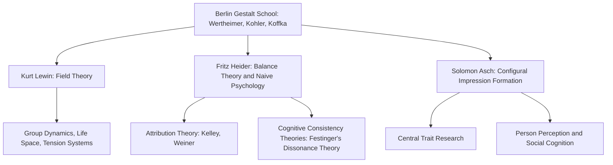

## The Gestalt Tradition

### Overview

The Gestalt tradition, originating in early 20th-century German perceptual psychology, exerted a profound and lasting influence on social psychology's theoretical foundations—an influence arguably as significant as, and closely intertwined with, behaviorism's contribution via Floyd Allport. Where behaviorism emphasized discrete stimulus-response links and molecular analysis of behavior, Gestalt psychology insisted that psychological phenomena must be understood as organized wholes, a principle that migrated from perception research into social cognition, motivation, and group processes primarily through the work of Kurt Lewin and later Fritz Heider and Solomon Asch.

### Core Gestalt Principles

**The Foundational Claim**

Gestalt psychology, developed by Max Wertheimer, Wolfgang Köhler, and Kurt Koffka in Berlin, is built on the principle often summarized as: the whole is different from the sum of its parts. This was originally demonstrated in visual perception (e.g., the *phi phenomenon*, where discrete flashing lights are perceived as continuous motion) and later extended as a general epistemological stance about psychological organization.

**Key Points**

- Perception, cognition, and motivation are organized into meaningful, structured wholes ("Gestalten"), not built up from isolated sensory or behavioral elements.
- Psychological phenomena should be studied at the level of the organized structure, not reduced to atomistic components.
- This holism directly opposed both structuralist psychology (which sought to break down mental experience into elementary sensations) and behaviorism (which sought to explain behavior through discrete stimulus-response associations).

### Migration into Social Psychology: Kurt Lewin

Kurt Lewin, trained within the Berlin Gestalt school, is the primary conduit through which Gestalt principles entered social psychology. His **field theory** directly extends Gestalt holism from perception to motivation and social behavior:

$$B = f(LS) = f(P, E)$$

Just as a Gestalt psychologist argues that a perceived scene cannot be reduced to isolated visual elements, Lewin argued that an individual's behavior cannot be reduced to isolated stimulus-response pairs but must be understood as arising from the total, organized **life space**—the dynamic, interdependent field of psychological forces (needs, goals, perceived barriers, social pressures) operating on the person at a given moment.

**Key Points**

- Lewin's insistence that behavior depends on the subjectively *construed* situation, not the objective situation, is a direct application of Gestalt perceptual principles (where perception depends on organization, not raw sensory input) to motivation and social behavior.
- Lewin's group dynamics research extended this holism to groups themselves: a group, like a perceptual Gestalt, is treated as a dynamic whole with emergent properties (cohesion, norms, "group locomotion" toward goals) not reducible to the simple sum of its individual members' traits—while still avoiding Le Bon's mystical "group mind," since Lewin grounded group-level dynamics in measurable psychological forces.

### Fritz Heider and Naive/Balance Theory

Fritz Heider, also trained in the Gestalt tradition, applied Gestalt organizational principles directly to **social perception and cognition**, becoming a founding figure of attribution theory and cognitive consistency theories.

**Balance Theory**

Heider's 1958 balance theory proposes that people seek cognitive consistency (a balanced "Gestalt") among their perceptions of themselves (P), another person (O), and an attitude object (X). Relationships among these three elements are evaluated as positive or negative, and an imbalanced triad creates psychological tension motivating attitude change to restore balance—directly paralleling Lewin's tension-system concept.

The balance principle can be summarized: a P-O-X triad is balanced when the product of the three relationship signs is positive.

$$\text{Balance} \iff (\text{sign}_{P \to O}) \times (\text{sign}_{O \to X}) \times (\text{sign}_{P \to X}) = +1$$

**Example**

If Person P likes Person O ($+$), and O likes political candidate X ($+$), balance requires P to also like X ($+$), since $(+1)(+1)(+1) = +1$. If instead P dislikes O ($-$) while O likes X ($+$), balance requires P to dislike X ($-$), since $(-1)(+1)(-1) = +1$. If P likes O but O likes something P dislikes, the triad is imbalanced ($(+1)(+1)(-1) = -1$), creating psychological tension that Heider argued would motivate change—for instance, P reevaluating their liking of O, or reconsidering their attitude toward X.

**Naive/Common-Sense Psychology**

Heider also proposed that ordinary people function as intuitive scientists, organizing perceptions of others' behavior into coherent causal wholes (attributing behavior to dispositional or situational causes) in order to render a chaotic social world predictable and manageable—a direct precursor to formal attribution theory (later developed by Harold Kelley and Bernard Weiner).

### Solomon Asch and Gestalt-Based Impression Formation

Solomon Asch, though perhaps best known for his conformity experiments, made a foundational contribution to social cognition rooted explicitly in Gestalt principles: his **configural model of impression formation** (1946).

**Configural (Gestalt) Model vs. Additive Models**

Asch argued that when people form impressions of others based on a list of traits, they do not simply sum or average the individual traits (an atomistic, additive model). Instead, they organize the traits into a unified, holistic impression, where **central traits** disproportionately shape the meaning of surrounding traits—precisely analogous to how a Gestalt figure's overall organization determines the perceived meaning of its individual elements.

**Key Points**

- Asch demonstrated that inserting the trait "warm" versus "cold" into an otherwise identical list of traits dramatically altered participants' overall impression of a person, even though "warm/cold" was just one trait among many—evidence that it functioned as a **central trait** reorganizing the entire Gestalt of the impression, not merely adding independent weight.
- This directly contrasts with later, more atomistic models (e.g., Norman Anderson's information integration theory), illustrating an enduring theoretical tension between holistic (Gestalt) and additive (associationist) accounts of person perception that persists in social cognition research today.

**Example**

Told that a person is "intelligent, skillful, industrious, warm, determined, practical, cautious," participants form a favorable, coherent impression where "determined" is interpreted as admirable persistence. Substitute "cold" for "warm," and the identical remaining traits are reorganized: "determined" is now more likely interpreted as stubbornness. The single central trait reorganizes the perceived meaning of the whole trait list—a hallmark Gestalt phenomenon transplanted into social cognition.

### Comparative Table: Gestalt vs. Behaviorist Legacies in Social Psychology

| Dimension | Gestalt Tradition (Lewin, Heider, Asch) | Behaviorist Tradition (F. Allport) |
| --- | --- | --- |
| Unit of analysis | Organized psychological wholes (life space, impressions, cognitive triads) | Discrete stimulus-response units |
| View of social behavior | Emerges from dynamic, holistic construal of the situation | Emerges from measurable responses to social stimuli |
| Key mechanism | Cognitive organization, tension reduction, balance-seeking | Reinforcement, coaction, measurable behavioral output |
| Representative theory | Field theory, balance theory, configural impression formation | Social facilitation via coaction/audience effects |
| Legacy field | Social cognition, attribution theory, group dynamics | Experimental methodology, quantitative measurement standards |

[Inference] These two traditions are often presented as complementary rather than opposed within the field's history: behaviorism supplied the methodological rigor (controlled experimentation, operationalized measurement) that made social psychology a credible science, while the Gestalt tradition supplied the theoretical content (holistic construal, cognitive organization, dynamic motivational fields) that gave the field's experiments conceptual depth beyond simple stimulus-response mapping.

### Diagram: Gestalt Tradition's Branches in Social Psychology

### Enduring Influence

**Conclusion**

The Gestalt tradition's central legacy in social psychology is the enduring principle that people respond to their *construed*, organized understanding of a social situation rather than to its objective, atomized features. This principle underlies field theory's life space, Heider's balance-seeking triads, Asch's configural impressions, and—through Festinger, Heider's intellectual successor—cognitive dissonance theory. [Unverified] Some historians of psychology argue the Gestalt tradition's holistic emphasis has been relatively under-credited in mainstream accounts of the field's founding compared to the more experimentally quantifiable behaviorist contributions, though its conceptual fingerprints remain visible throughout modern social cognition research, including dual-process theories and schema-based information processing models.

**Next Steps**

- Fritz Heider's balance theory in full detail
- Solomon Asch's conformity experiments and configural impression formation studies
- Leon Festinger's cognitive dissonance theory as a Gestalt-influenced successor to balance theory
- Attribution theory: Kelley's covariation model and Weiner's attribution framework
- Comparison of holistic versus additive models in modern social cognition (information integration theory)
- Kurt Lewin's field theory in depth