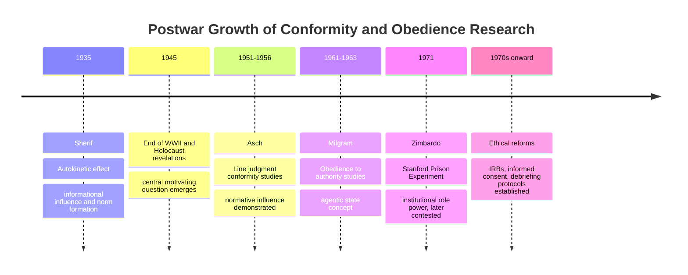

## Post-War Growth of Obedience and Conformity Research

### Overview

The decades following World War II witnessed an unprecedented expansion of social psychological research into conformity, obedience, and social influence. This growth was not merely an internal disciplinary development but a direct intellectual response to the atrocities of the Holocaust and totalitarian regimes, which raised urgent questions about how ordinary individuals could participate in mass violence and how social pressure could override individual moral judgment.

### Historical and Intellectual Context

**The Central Question**

In the aftermath of the Nuremberg trials, where numerous defendants invoked the defense that they were "just following orders," psychologists and the broader public confronted a disturbing question: were the perpetrators of the Holocaust uniquely pathological individuals, or could ordinary people be induced to commit or comply with atrocities under the right social conditions?

**Key Points**

- This question directly motivated a shift in the field's research priorities toward understanding social influence, obedience to authority, and group conformity pressures as powerful, near-universal psychological phenomena rather than as products of individual pathology or unique national character.
- The postwar period also coincided with the Cold War, during which Western researchers were additionally motivated by concerns about totalitarian "brainwashing," propaganda, and the psychological vulnerability of democratic populations to authoritarian ideological pressure.
- [Inference] This convergence of historical urgency and available funding (including U.S. government interest in psychological research relevant to national security and ideological resilience) likely accelerated the pace and visibility of conformity and obedience research during this era beyond what purely academic interest would have produced.

### Muzafer Sherif and the Emergence of Social Norms (1935)

Although conducted slightly before the war, Muzafer Sherif's autokinetic effect studies laid essential groundwork for postwar conformity research and gained renewed relevance in this context.

**Study Design**

Sherif used the autokinetic effect (a visual illusion in which a stationary point of light in a darkened room appears to move) to study norm formation. Participants estimated how far the light moved, first alone, then in groups.

**Findings**

When judging alone, individual estimates varied widely. When judging in a group, estimates converged toward a shared group norm, which persisted even when individuals were later retested alone.

**Significance**

Sherif demonstrated that group influence could shape genuinely internalized perceptual judgments in an ambiguous situation, establishing **informational social influence** as a mechanism distinct from mere public compliance—people privately adopted the group's judgment as their own reality.

### Solomon Asch and Conformity to Group Pressure (1951–1956)

Asch's line-judgment experiments became the paradigmatic demonstration of conformity and remain among the most cited studies in the field's history.

**Study Design**

Participants viewed a standard line and were asked to identify which of three comparison lines matched it in length—a task with an objectively unambiguous correct answer. Participants sat among confederates who, on critical trials, unanimously gave an obviously incorrect answer before the real participant responded.

**Findings**

Approximately 75% of participants conformed to the incorrect majority judgment on at least one critical trial, despite the correct answer being visually unambiguous; roughly one-third of responses on critical trials conformed to the erroneous majority.

**Key Points**

- Asch's design deliberately used an unambiguous stimulus (unlike Sherif's ambiguous autokinetic effect) to isolate **normative social influence**—conformity driven by a desire to fit in or avoid social disapproval, rather than genuine informational uncertainty.
- Asch found conformity decreased sharply when even one confederate broke ranks with the majority, demonstrating the power of a single dissenting ally to reduce normative pressure.
- [Inference] Asch's demonstration that conformity occurred even on a task with an obvious correct answer was likely particularly unsettling to a postwar audience, since it suggested that social pressure could distort judgment even absent ambiguity, ideology, or coercion—a finding directly relevant to understanding mass compliance with visibly wrong or immoral group behavior.

### Stanley Milgram and Obedience to Authority (1961–1963)

Milgram's obedience studies, conducted at Yale University, represent the most direct and famous experimental response to the postwar question of how ordinary people participate in atrocities. Milgram, notably, had been a student of Solomon Asch.

**Study Design**

Participants were assigned the role of "teacher" and instructed by an experimental authority figure to administer increasingly severe electric shocks (up to a labeled 450 volts) to a "learner" (a confederate, unseen or partially seen) for incorrect answers on a memory task. No actual shocks were delivered, but participants believed they were real.

**Findings**

A majority of participants (in Milgram's original variant, roughly 65%) continued administering shocks to the maximum voltage level despite the learner's simulated protests, screams, and eventual silence, simply because the experimenter (an authority figure) instructed them to continue.

**Key Points**

- Milgram systematically varied conditions across dozens of experimental variants, finding obedience decreased with physical proximity to the victim, decreased when the authority figure's legitimacy was reduced, and decreased when participants observed peers refusing to continue.
- [Unverified] The precise obedience rate is sometimes cited with minor variation across sources and across Milgram's many experimental variants; readers should consult the original studies or subsequent meta-analyses for condition-specific figures rather than treating a single percentage as universally representative.
- Milgram explicitly framed his research as addressing the Holocaust question directly, arguing his findings demonstrated that ordinary individuals could be induced to act against their own moral principles when directed by a perceived legitimate authority—a phenomenon he termed the **agentic state**, in which individuals see themselves as instruments carrying out another's wishes rather than as autonomous moral agents.

### Comparative Table: Three Foundational Postwar/Pre-War Influence Studies

| Study | Researcher | Year(s) | Type of Influence | Key Mechanism |
| --- | --- | --- | --- | --- |
| Autokinetic effect | Sherif | 1935 | Norm formation under ambiguity | Informational social influence |
| Line judgment | Asch | 1951–1956 | Conformity under unambiguous conditions | Normative social influence |
| Obedience to authority | Milgram | 1961–1963 | Compliance with direct authority instruction | Agentic state, legitimacy of authority |

### Philip Zimbardo and the Stanford Prison Experiment (1971)

Extending this research trajectory into the following decade, Zimbardo's study examined how situational roles and institutional power structures, rather than individual disposition, could produce abusive behavior.

**Study Design**

Psychologically healthy college students were randomly assigned to role-play "guards" or "prisoners" in a simulated prison environment.

**Findings**

Guards rapidly escalated to abusive, dehumanizing treatment of prisoners, and prisoners showed signs of severe psychological distress, leading researchers to terminate the study after six days (originally planned for two weeks).

**Key Points**

- [Unverified] The Stanford Prison Experiment has faced substantial methodological criticism in recent decades, including allegations that guards were coached toward abusive behavior and that the study's demand characteristics and lack of a proper control condition undermine its status as rigorous experimental evidence; readers should treat its findings as historically influential but scientifically contested rather than as an unambiguously validated demonstration of situational power.
- Despite this controversy, the study remains historically significant as part of the broader postwar research program investigating how situational and institutional forces can produce cruelty in ordinary individuals, complementing Milgram's authority-based findings with an institutional-role-based mechanism.

### Theoretical Synthesis: Why This Research Mattered

**The Situationist Thesis**

Collectively, this body of research established what became known as the **situationist thesis** in social psychology: that situational and social forces are often more powerful determinants of behavior than individual disposition or character, a conclusion with direct implications for understanding historical atrocities as products of situational and social-structural pressures rather than solely individual moral failure or unique pathology.

$$B = f(P, E)$$

This formula, inherited from Lewin, gained renewed empirical support and social urgency through this postwar research program, which repeatedly demonstrated $E$'s power to override individually held moral commitments ($P$).

**Ethical Legacy**

The Milgram and Zimbardo studies, in particular, became central case studies in the development of modern research ethics, directly contributing to the establishment of Institutional Review Boards (IRBs), informed consent requirements, and debriefing protocols in psychological research, given the psychological distress participants experienced.

### Diagram: Trajectory of Postwar Influence Research

### Illustrative Example

**Example**

A historian asks why ordinary German citizens and bureaucrats participated in implementing genocidal policy. A pre-postwar, dispositional explanation might attribute this to unique national character flaws or individual sadism. The postwar social psychological research program instead offers a situational account: unanimous group pressure can override individual judgment even on unambiguous matters (Asch), legitimate authority figures can induce ordinary people to act against their own stated moral values (Milgram), and institutional roles can rapidly reshape behavior toward cruelty even among psychologically healthy individuals (Zimbardo, with caveats). Together, these findings reframed mass atrocity as substantially explicable through predictable, demonstrable social psychological mechanisms rather than requiring appeal to exceptional individual evil—a reframing with significant, if debated, implications for how societies understand moral responsibility under authoritarian and conformist pressure.

**Next Steps**

- Solomon Asch's conformity experiments in full methodological detail
- Stanley Milgram's obedience experiments and experimental variants
- The Stanford Prison Experiment and its contemporary methodological critiques
- Informational versus normative social influence as distinct mechanisms
- The development of modern research ethics and Institutional Review Boards
- Hannah Arendt's "banality of evil" concept and its relationship to Milgram's findings