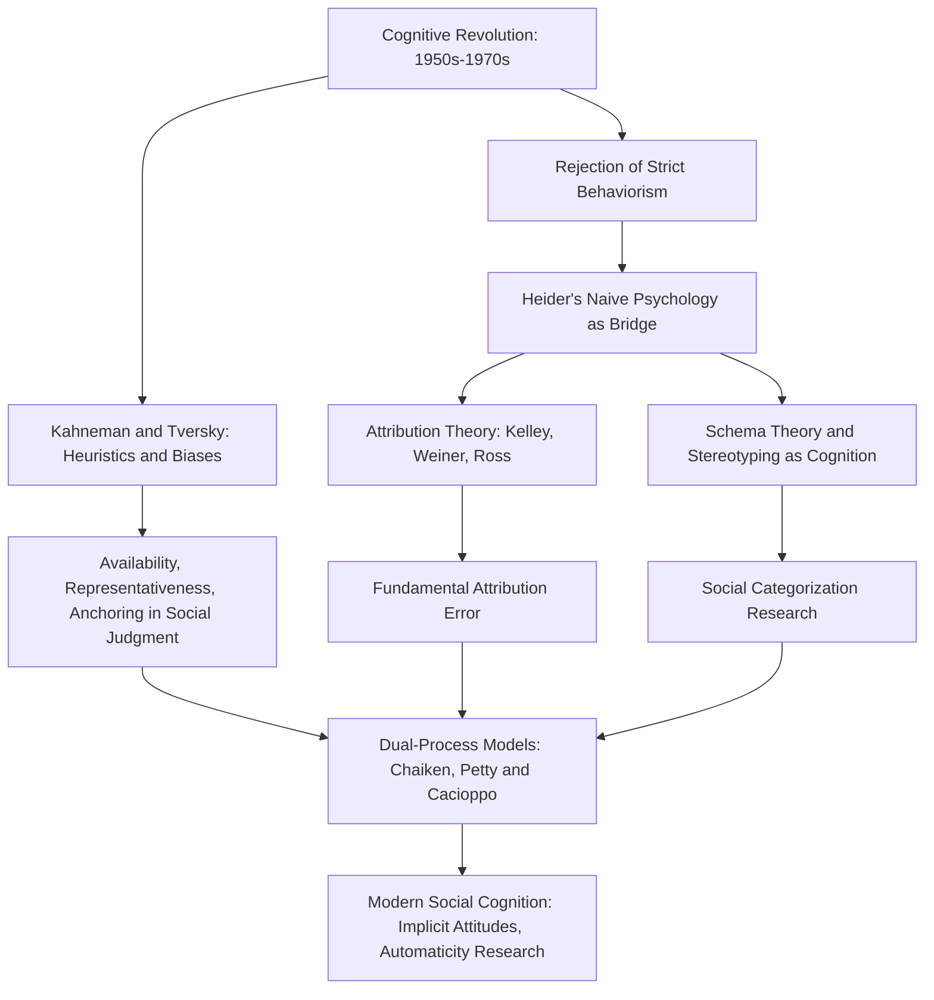

## The Cognitive Revolution and Social Cognition

### Overview

The cognitive revolution, which swept through psychology broadly from the late 1950s through the 1970s, fundamentally reshaped social psychology by shifting the field's dominant explanatory framework away from behaviorist stimulus-response models and toward mental representations, information processing, and cognitive structures. This shift gave rise to **social cognition** as a major subfield, reframing classic social psychological questions (attitudes, stereotyping, attribution, conformity) as products of how people perceive, encode, store, and retrieve social information.

### Historical Context: From Behaviorism to Cognitivism

**The Broader Cognitive Revolution**

Beginning in the late 1950s, psychology as a discipline underwent a broad paradigm shift away from strict behaviorism (which had dominated American psychology, including Floyd Allport's foundational experimental social psychology) toward cognitive science, influenced by developments in linguistics (Noam Chomsky's critique of behaviorist language acquisition theory), computer science (the computer as a metaphor for the mind's information processing), and cognitive psychology (memory and attention research).

**Key Points**

- Behaviorism had explicitly avoided reference to unobservable mental states, treating the mind as a "black box" and explaining behavior purely through observable stimulus-response associations.
- The cognitive revolution reintroduced internal mental representations, memory structures, and information-processing mechanisms as legitimate and necessary objects of scientific study.
- [Inference] Social psychology's adoption of cognitive frameworks was likely accelerated by the field's preexisting Gestalt lineage (via Lewin and Heider), since Gestalt psychology had never fully abandoned interest in internal cognitive organization even during behaviorism's dominance, making the field arguably better prepared than some other psychology subfields for a smooth transition to cognitivism.

### Fritz Heider as a Bridge Figure

Fritz Heider's 1958 work on naive psychology and attribution, though rooted in the Gestalt tradition, is frequently identified as a direct conceptual bridge into social cognition, since it explicitly modeled ordinary people as active processors of social information—intuitive scientists who observe behavior and infer underlying causes in order to render their social world predictable and controllable. This framing anticipated the information-processing metaphor that would come to dominate social cognition research.

### Core Development: Attribution Theory

Attribution theory, formalized in the 1960s–1970s, became one of social cognition's foundational research programs, directly building on Heider's naive psychology.

**Harold Kelley's Covariation Model (1967)**

Kelley proposed that people attribute behavior to internal (dispositional) or external (situational) causes by analyzing patterns across three types of information:

- **Consensus**: Do other people behave the same way in this situation?
- **Distinctiveness**: Does this person behave differently in other situations?
- **Consistency**: Does this person behave the same way in this situation across time?

| Pattern | Consensus | Distinctiveness | Consistency | Likely Attribution |
| --- | --- | --- | --- | --- |
| High consensus, high distinctiveness, high consistency | High | High | High | Situational (external) |
| Low consensus, low distinctiveness, high consistency | Low | Low | High | Dispositional (internal) |

**Bernard Weiner's Attribution Framework**

Weiner extended attribution theory into achievement contexts, proposing that causal attributions vary along dimensions of locus (internal/external), stability (stable/unstable), and controllability (controllable/uncontrollable), with significant implications for subsequent emotion and motivation.

**The Fundamental Attribution Error**

Lee Ross's (1977) coining of the **fundamental attribution error**—the pervasive tendency to overestimate dispositional causes and underestimate situational causes when explaining others' behavior—became a signature finding of the social cognition era, directly connecting cognitive information-processing research to the field's longstanding situationist commitments inherited from Lewin and the postwar conformity/obedience research tradition.

### Core Development: Schemas and Social Categorization

**Schema Theory**

Drawing on cognitive psychology's memory research (particularly Frederic Bartlett's earlier schema concept), social cognition researchers proposed that people organize social knowledge into **schemas**—mental structures representing organized knowledge about people, roles, events, or social groups that guide attention, encoding, memory, and inference.

**Key Points**

- Schemas enable efficient processing of a complex social world by allowing people to fill in missing information based on prior expectations, but this efficiency comes at the cost of systematic biases (e.g., schema-consistent information is better remembered and schema-inconsistent information may be discounted or misremembered).
- **Stereotypes** were reconceptualized within this framework as a specific category of schema—cognitive structures representing beliefs about social groups—shifting stereotype research from a purely motivational/attitudinal framing (stereotypes as products of prejudice or ignorance) toward a cognitive framing (stereotypes as a natural, even inevitable, byproduct of ordinary categorization and cognitive economy).
- This cognitive reframing of stereotyping, associated particularly with researchers like David Hamilton and Susan Fiske, proved highly influential, though it has also been critiqued for potentially normalizing stereotyping as merely "efficient cognition" without adequately addressing its social and moral consequences.

### Core Development: Heuristics and Biases

The cognitive revolution's information-processing framework was substantially enriched by Amos Tversky and Daniel Kahneman's heuristics and biases research program (beginning in the early 1970s), which, though originating in cognitive/judgment psychology, was rapidly absorbed into social cognition.

**Key Heuristics Applied to Social Judgment**

- **Availability heuristic**: judging the likelihood or frequency of an event based on how easily examples come to mind, applied to social judgments such as estimating a group's prevalence of certain behaviors.
- **Representativeness heuristic**: judging probability based on similarity to a prototype, applied to stereotyping and social categorization.
- **Anchoring and adjustment**: relying heavily on an initial piece of information when making subsequent judgments, applied to impression formation and negotiation research.

$$P(\text{judgment}) \approx f(\text{heuristic cues}) \neq P(\text{judgment} \mid \text{normative statistical reasoning})$$

This formalized the idea that everyday social judgment systematically deviates from normative statistical reasoning in predictable, mechanism-specific ways—a hallmark cognitive (rather than purely motivational) explanation for social judgment errors.

### Emergence of Dual-Process Theories

By the 1980s, social cognition research had matured to the point of proposing integrative **dual-process models**, distinguishing two modes of social information processing:

| Process Type | Characteristics | Examples |
| --- | --- | --- |
| Automatic/heuristic (System 1) | Fast, effortless, associative, relies on schemas and heuristics | Snap judgments, stereotyping under cognitive load, implicit attitudes |
| Controlled/systematic (System 2) | Slow, effortful, deliberate, resource-dependent | Careful attribution reasoning, deliberate persuasion evaluation, motivated correction of bias |

Influential dual-process models include Shelly Chaiken's Heuristic-Systematic Model and Richard Petty and John Cacioppo's Elaboration Likelihood Model of persuasion, both of which distinguish superficial, cue-based processing from effortful, argument-based processing of persuasive messages.

### Diagram: Cognitive Revolution's Impact on Social Psychology

### Illustrative Example

**Example**

Consider a manager evaluating why an employee missed a deadline. A behaviorist-era social psychologist (in the Allport tradition) would focus narrowly on observable, measurable behavioral outputs under specific stimulus conditions, largely bracketing unobservable mental inference processes. A social cognition researcher instead examines the manager's inferential process directly: Does the manager check consensus (did other employees also miss it?), distinctiveness (does this employee usually miss deadlines on other projects?), and consistency (has this specific employee missed this specific type of deadline before) per Kelley's covariation model? Is the manager's judgment distorted by the fundamental attribution error, over-attributing the missed deadline to the employee's laziness (dispositional) while underweighting situational factors like an unrealistic timeline (situational)? Is the manager relying on an existing schema about that employee's competence, filtering new information to fit prior expectations? This entire chain of inferential, information-processing questions exemplifies the social cognition approach, unthinkable within a strict behaviorist framework.

### Legacy and Continuity with the Field's Foundations

**Conclusion**

The cognitive revolution did not represent a wholesale rejection of social psychology's earlier foundations but rather a synthesis and extension of them. It absorbed and formalized Heider's Gestalt-influenced naive psychology into rigorous attribution models, gave cognitive-mechanistic grounding to the situationist insights of Lewin and the postwar conformity/obedience researchers (explaining, via the fundamental attribution error, precisely why observers so often failed to appreciate situational power), and established information-processing as social psychology's dominant meta-theoretical framework from the 1970s onward—a framework that continues to underlie contemporary research on implicit attitudes, automaticity, and dual-process models of persuasion and stereotyping.

**Next Steps**

- Attribution theory: Kelley's covariation model and Weiner's framework in depth
- The fundamental attribution error and cross-cultural critiques of its universality
- Schema theory and its role in stereotyping research
- Kahneman and Tversky's heuristics and biases program
- Dual-process models: the Elaboration Likelihood Model and Heuristic-Systematic Model
- Implicit attitude measurement and automaticity research (e.g., the Implicit Association Test)