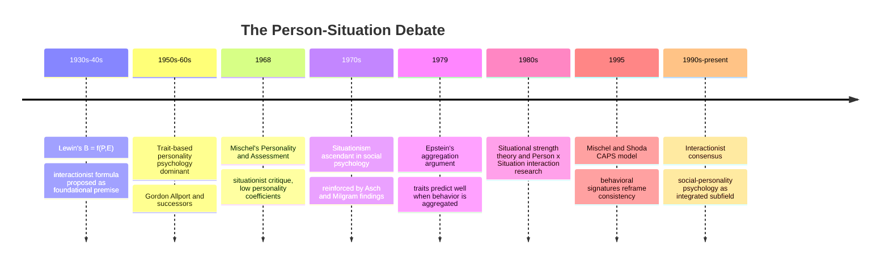

## The Person-Situation Debate

### Overview

The person-situation debate refers to a foundational and prolonged controversy in psychology concerning the relative power of stable individual dispositions (personality traits) versus situational/social factors in predicting and explaining behavior. Though the debate touches personality psychology broadly, it holds special significance for social psychology because the field's core disciplinary identity—its emphasis on situational power—was substantially forged in explicit response to this controversy.

### Origins: Lewin's Formula

The debate's conceptual starting point is Kurt Lewin's foundational equation:

$$B = f(P, E)$$

Where behavior ($B$) is a joint function of the person ($P$) and the environment ($E$), understood as the psychologically construed life space. Lewin himself treated this as an interactionist formula from the outset, but subsequent researchers and theoretical camps came to emphasize one term over the other, setting up decades of tension.

### Walter Mischel's Critique (1968)

**The Central Challenge**

Walter Mischel's 1968 book *Personality and Assessment* is the debate's decisive flashpoint. Mischel conducted an extensive review of the empirical literature on personality trait measurement and found that correlations between trait measures and actual behavior across different situations were typically modest, often in the range of $r \approx 0.30$ or lower—a figure that became known as the **personality coefficient**.

**Key Points**

- Mischel argued that this level of predictive power was too weak to justify the traditional trait-based assumption that personality consistently predicts behavior across diverse situations.
- He proposed instead that behavior is highly **situation-specific**: an individual might behave assertively in a work meeting but passively in a family setting, with cross-situational consistency being the exception rather than the rule.
- Mischel's critique was widely interpreted, particularly by social psychologists, as strong support for a **situationist** position—that situational forces, not stable traits, are the primary determinants of behavior.

**Impact on the Field**

[Inference] Mischel's critique arrived at a historically opportune moment for social psychology, since it appeared to provide direct empirical vindication for the field's accumulating body of postwar findings (Asch's conformity studies, Milgram's obedience research) demonstrating that situational manipulation could override individual disposition and even stated moral values—reinforcing social psychology's emerging disciplinary identity as the science of situational power in contrast to personality psychology's trait-based tradition.

### The Trait Theorists' Response

Personality psychologists mounted several influential counterarguments over the following decades:

**1. Aggregation Argument (Seymour Epstein, 1979)**

Epstein argued that single behavioral observations are unreliable and noisy, but traits predict behavior well when behavior is **aggregated** across many occasions and situations. Just as a single item on a psychological test poorly predicts an underlying construct while an aggregated test score predicts well, a single behavioral instance poorly reflects a trait while an averaged behavioral pattern across many situations reflects it reliably.

**2. Person-by-Situation Interactions**

Researchers demonstrated that traits and situations often interact multiplicatively rather than one dominating the other. For example, high self-monitors (a trait) adjust their behavior more to situational social cues than low self-monitors, meaning the *situational effect itself* is moderated by a stable individual difference.

**3. Situational Strength Theory**

Researchers proposed that situations vary in their **strength**: "strong" situations (e.g., a funeral, a fire alarm, a formal interview) impose clear behavioral expectations that most people follow regardless of personality, minimizing observable trait-based variation. "Weak" situations (e.g., an unstructured party, unsupervised free time) provide little behavioral guidance, allowing personality differences to manifest more strongly.

$$\text{Behavioral Variance Explained by Trait} \propto \frac{1}{\text{Situational Strength}}$$

**4. Predictability of Behavioral Signatures**

Researchers, notably Walter Mischel himself in later work with Yuichi Shoda (the Cognitive-Affective Personality System, or CAPS model), reframed consistency not as *mean-level* behavioral consistency across situations but as consistent **if-then patterns** (behavioral signatures): a person may reliably become hostile *when criticized* but reliably calm *when praised*, producing a stable, idiographic pattern of situation-behavior relationships even without cross-situational behavioral uniformity.

### The Interactionist Resolution

By the 1980s–1990s, most researchers on both sides converged on an **interactionist** position, treating the strict person-versus-situation dichotomy as a false one. Key interactionist principles include:

| Principle | Description |
| --- | --- |
| Reciprocal determinism | Persons and situations mutually influence one another (Bandura); people select, modify, and create situations, not merely respond to them |
| Person × Situation interaction | Trait effects on behavior depend on situational strength, and situational effects depend on individual differences |
| Behavioral signatures | Consistency exists at the level of if-then situation-behavior contingencies, not simple cross-situational trait expression |
| Situational strength moderation | Strong situations suppress trait expression; weak situations allow it to emerge |

**Key Points**

- This resolution did not restore the trait-based tradition to its pre-Mischel dominance, nor did it validate an extreme situationist position; instead it established that both stable dispositions and situational forces matter, but their relative influence is itself contingent on measurable moderating conditions.
- Social psychology, as a field, retained its characteristic emphasis on situational manipulation and experimental control even after the interactionist resolution, but increasingly incorporated individual difference measures as moderators within experimental designs (giving rise to the hybrid subfield of **social-personality psychology**).

### Comparative Table: Positions in the Debate

| Position | Key Proponents | Core Claim | Main Limitation |
| --- | --- | --- | --- |
| Trait/dispositional | Gordon Allport, Raymond Cattell (pre-1968) | Stable traits predict behavior across situations | Overestimated cross-situational consistency; low single-instance predictive validity |
| Situationist | Walter Mischel (1968), postwar social psychologists | Situational forces are the primary determinant of behavior | Underestimated stable individual differences, especially in weak situations |
| Interactionist | Epstein, Bem and Funder, Mischel and Shoda (CAPS) | Behavior is a joint, often multiplicative, function of person and situation | Requires more complex, conditional models than either pure position |

### Illustrative Example

**Example**

Consider predicting whether a person will speak up in a meeting. A pure trait theorist might measure the person's score on an extraversion scale and predict speaking-up behavior directly from that score across all meetings. A pure situationist, in the spirit of early Mischel, would argue this single trait score poorly predicts behavior in any individual meeting, since so much depends on the specific situation (a hostile boss present, an anonymous brainstorming format, the topic's personal relevance). An interactionist account would instead predict that the person's extraversion trait will predict speaking-up behavior far more strongly in "weak" situations (an unstructured, informal meeting with no clear norms) than in "strong" situations (a formal meeting with an explicitly enforced turn-taking protocol), and further that this individual may show a consistent behavioral signature—reliably speaking up when discussing topics of personal expertise, regardless of general extraversion level, but reliably staying quiet when criticized, illustrating Mischel and Shoda's if-then behavioral signature concept rather than simple linear trait expression.

### Diagram: Evolution of the Person-Situation Debate

### Significance for Social Psychology's Disciplinary Identity

**Conclusion**

The person-situation debate is not merely a historical footnote but a defining episode that clarified and hardened social psychology's methodological and theoretical commitments. The field's characteristic experimental strategy—manipulating situational variables while often holding or measuring individual differences as secondary—traces directly to the situationist momentum generated by Mischel's critique combined with the preexisting postwar research tradition (Asch, Milgram) demonstrating situational power. The subsequent interactionist resolution refined rather than reversed this commitment, cementing person-by-situation interaction as the field's mature theoretical default while preserving social psychology's foundational insistence that situational forces deserve serious, often underestimated, explanatory weight.

**Next Steps**

- Walter Mischel's Cognitive-Affective Personality System (CAPS) model in depth
- Situational strength theory and its measurement
- Social-personality psychology as an integrated subfield
- The fundamental attribution error as a cognitive parallel to the situationist thesis
- Bandura's concept of reciprocal determinism
- Self-monitoring theory (Mark Snyder) as a Person x Situation interaction case study