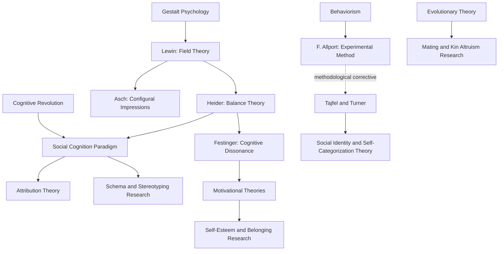

## Major Theoretical Paradigms

### Overview

Social psychology has developed through several coexisting, sometimes competing, theoretical paradigms, each offering a distinct core assumption about what drives social behavior and cognition. Rather than a single unified theory, the field operates as a federation of paradigms, each with characteristic explanatory mechanisms, methodological preferences, and historical lineages traceable to the foundational figures already established in this chapter (Lewin, Heider, Allport, Festinger).

### 1. Behaviorist/Reinforcement Paradigm

**Core Assumption**

Social behavior is shaped by reinforcement history and observable stimulus-response contingencies, extending general learning theory principles to social contexts.

**Key Mechanisms**

- Operant and classical conditioning applied to attitude formation (e.g., attitudes toward objects paired with positive/negative stimuli).
- Social learning theory (Albert Bandura), which extended behaviorism by incorporating **observational learning**—the acquisition of behavior through watching and imitating models, without requiring direct reinforcement of the observer.

**Key Points**

- Bandura's Bobo doll experiments demonstrated that children could acquire aggressive behavior patterns purely through observation of a model, a finding that substantially revised strict behaviorist accounts by introducing cognitive mediation (attention, retention, reproduction, motivation) into an otherwise behaviorist framework.
- This paradigm's disciplinary legacy is most visible in Floyd Allport's foundational experimental methodology, even as later social learning theory moved toward cognitive mediation.

**Example**

A child who observes a parent responding to conflict with aggression, and later imitates that aggressive response in a peer conflict without ever having been directly reinforced for aggression themselves, illustrates observational learning's departure from strict reinforcement-based behaviorism.

### 2. Gestalt/Field Theory Paradigm

**Core Assumption**

Social behavior and cognition must be understood as organized, dynamic wholes shaped by subjective construal, not reducible to isolated elements or stimulus-response links.

**Key Mechanisms**

- Lewin's life space and force-field concepts: $B = f(P, E)$.
- Heider's balance theory and naive psychology.
- Asch's configural (Gestalt) model of impression formation.

**Key Points**

- This paradigm supplies social psychology's foundational emphasis on subjective interpretation of situations over objective situational features.
- It directly generated cognitive consistency theories, most importantly cognitive dissonance theory.

### 3. Cognitive Consistency Paradigm

**Core Assumption**

People are motivated to maintain consistency among their beliefs, attitudes, and behaviors; inconsistency produces psychological discomfort that motivates change.

**Key Theories**

- **Heider's balance theory**: consistency among P-O-X triads.
- **Festinger's cognitive dissonance theory (1957)**: inconsistency between cognitions (or between behavior and attitude) produces an aversive drive state (dissonance) that motivates attitude or behavior change to restore consistency.

$$\text{Dissonance Magnitude} \propto \frac{\text{Number and importance of dissonant cognitions}}{\text{Number and importance of consonant cognitions}}$$

**Key Points**

- Dissonance theory generated extensive research on counterattitudinal behavior, effort justification, and post-decisional dissonance (e.g., people rate a chosen alternative more favorably after a difficult decision).
- This paradigm assumes an active, motivated cognizer seeking psychological coherence, distinguishing it from purely mechanistic information-processing accounts.

**Example**

A person who smokes despite knowing smoking causes cancer experiences dissonance between the cognition "I smoke" and "smoking is dangerous." Dissonance theory predicts this person will resolve the tension not necessarily by quitting, but potentially by minimizing the perceived risk ("my grandfather smoked and lived to 90"), illustrating the theory's prediction that attitude change, not just behavior change, can resolve dissonance.

### 4. Social Cognition/Information-Processing Paradigm

**Core Assumption**

Social behavior and judgment result from how people attend to, encode, store, and retrieve information about the social world, modeled on cognitive science's information-processing framework.

**Key Mechanisms**

- Schema theory and social categorization.
- Attribution theory (Kelley's covariation model, Weiner's framework).
- Heuristics and biases (availability, representativeness, anchoring).
- Dual-process models (Elaboration Likelihood Model, Heuristic-Systematic Model).

**Key Points**

- This paradigm dominated the field from the 1970s onward, following the broader cognitive revolution, and remains the most methodologically dominant framework in contemporary social psychology.
- It reframed stereotyping and prejudice as partly rooted in ordinary, even adaptive, cognitive processes (categorization, cognitive economy) rather than exclusively in motivated bias or personality pathology.

### 5. Motivational Paradigm

**Core Assumption**

Social behavior is driven by underlying psychological needs and motives, such as self-esteem maintenance, belonging, accurate understanding, and control.

**Key Theories and Constructs**

- **Self-esteem maintenance**: self-serving attributional bias, self-affirmation theory (Steele).
- **Need to belong** (Baumeister & Leary): a fundamental human motivation shaping social behavior broadly.
- **Terror management theory**: mortality salience motivates cultural worldview defense and self-esteem striving.
- **Social comparison theory** (Festinger, 1954): people evaluate their own abilities and opinions by comparing themselves to others, particularly under uncertainty.

**Key Points**

- This paradigm often intersects with the cognitive paradigm (motivated reasoning combines cognitive mechanisms with motivational goals), reflecting the field's increasing integration of cognition and motivation rather than treating them as separate explanatory domains.

**Example**

A student who performs poorly on an exam and attributes the failure to an unfair test (external) rather than lack of ability (internal) illustrates the **self-serving bias**, a motivationally driven attribution pattern that protects self-esteem, distinct from a purely cognitive account of attribution based on consensus/distinctiveness/consistency information alone.

### 6. Evolutionary Paradigm

**Core Assumption**

Many social behaviors and cognitive tendencies reflect psychological adaptations shaped by natural and sexual selection over human evolutionary history, favoring behaviors that historically enhanced survival and reproductive success.

**Key Applications**

- Mate selection preferences and sex differences in mating strategies.
- Kin selection and altruism toward genetic relatives.
- Intergroup bias as a potential evolved response to coalitional threat.
- Status-seeking and dominance hierarchies.

**Key Points**

- [Unverified] Evolutionary explanations in social psychology remain more theoretically contested than cognitive or motivational accounts, with ongoing debate about falsifiability, the risk of post-hoc "just-so" storytelling, and the difficulty of directly testing claims about ancestral environments; researchers and readers should treat specific evolutionary hypotheses as requiring the same empirical scrutiny as any other paradigm's claims, rather than as inherently more fundamental explanations.
- This paradigm is often presented as operating at a different explanatory level (ultimate/distal causation) than cognitive or situational paradigms (proximate causation), meaning it is frequently framed as complementary to, rather than competing with, other paradigms.

### 7. Social Identity/Intergroup Paradigm

**Core Assumption**

Much of social behavior, particularly intergroup behavior, is driven by the human tendency to categorize the self and others into social groups, deriving self-esteem and identity partly from group membership.

**Key Theories**

- **Social identity theory** (Tajfel & Turner, 1979): people categorize themselves and others into ingroups and outgroups, and derive part of their self-concept from group membership, motivating ingroup favoritism to maintain positive social identity.
- **Self-categorization theory** (Turner et al., 1987): extends social identity theory by explaining when and how individuals shift between personal and social identity salience.

**Key Points**

- This paradigm developed partly as a corrective to Floyd Allport's strict methodological individualism, reintroducing group-level identity as a psychologically real and measurable construct without returning to Le Bon's unfalsifiable "group mind."
- It remains the dominant framework for explaining intergroup prejudice, discrimination, and collective action.

### Comparative Table: Paradigms at a Glance

| Paradigm | Core Driver of Behavior | Key Figures | Primary Legacy Area |
| --- | --- | --- | --- |
| Behaviorist/Reinforcement | Reinforcement history, observational learning | F. Allport, Bandura | Methodology, social learning theory |
| Gestalt/Field Theory | Holistic construal of psychological field | Lewin, Heider, Asch | Foundational theory, group dynamics |
| Cognitive Consistency | Drive to reduce psychological inconsistency | Heider, Festinger | Attitude change research |
| Social Cognition | Information processing of social stimuli | Kelley, Weiner, Fiske | Attribution, stereotyping, judgment biases |
| Motivational | Fulfillment of psychological needs | Festinger, Baumeister, Steele | Self-esteem, social comparison, belonging |
| Evolutionary | Adaptations from ancestral selection pressures | Buss, Kenrick | Mating, kin altruism, coalitional psychology |
| Social Identity/Intergroup | Categorization into ingroups/outgroups | Tajfel, Turner | Prejudice, discrimination, collective behavior |

### Diagram: Paradigm Relationships and Lineage

### Integrative Perspective

**Conclusion**

No single paradigm fully accounts for social behavior; contemporary social psychology typically integrates multiple paradigms within a single research program. For example, modern prejudice research often combines the social cognition paradigm (implicit stereotyping as automatic cognitive processing), the motivational paradigm (prejudice as serving self-esteem or system-justification needs), the social identity paradigm (ingroup/outgroup categorization), and sometimes the evolutionary paradigm (coalitional threat detection) within a single integrated theoretical account. [Inference] This paradigmatic pluralism likely reflects the genuine multi-causal complexity of social behavior rather than a failure of theoretical consolidation, since phenomena as complex as prejudice or attitude change plausibly require explanatory mechanisms operating at multiple levels (cognitive, motivational, evolutionary, situational) simultaneously.

**Next Steps**

- Cognitive dissonance theory in full detail, including classic studies
- Social identity theory and self-categorization theory
- Social learning theory and Bandura's Bobo doll experiments
- Terror management theory and existential motivational research
- Evolutionary social psychology: mate selection and kin altruism research
- Integrating multiple paradigms in contemporary prejudice and stereotyping research