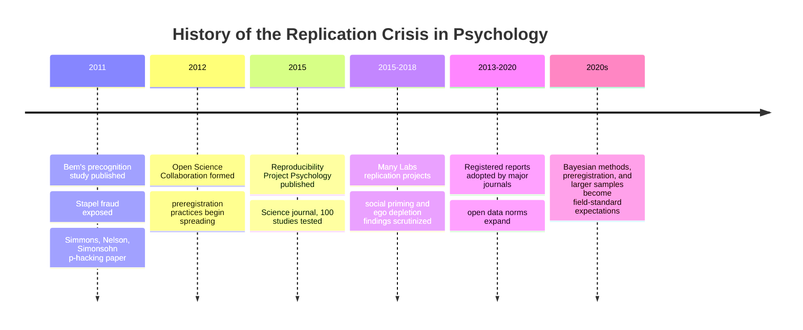

## History of the Replication Crisis

### Overview

The replication crisis refers to a period of intense methodological reckoning, beginning roughly in the early 2010s, during which psychology broadly—and social psychology in particular—confronted widespread evidence that a substantial proportion of published findings, including some classic and highly cited studies, failed to replicate under rigorous retesting. This crisis prompted major reforms in research methodology, statistical practice, and publication norms that continue to shape the field.

### Precursors and Early Warning Signs

**Statistical Critiques Before 2010**

[Inference] Concerns about questionable research practices and weak statistical foundations in psychology predate the crisis's acute phase, though they gained little traction until converging with specific triggering events around 2011, suggesting the underlying methodological problems had been present for decades before becoming a recognized disciplinary crisis.

**Jacob Cohen's Power Critiques**

Statistician Jacob Cohen had, as early as the 1960s–1990s, repeatedly warned that psychological research was systematically underpowered (using sample sizes too small to reliably detect real effects), a critique that would later be recognized as directly relevant to replication failures.

### Triggering Events (2011)

**Daryl Bem's "Feeling the Future" (2011)**

A pivotal triggering event was the publication of Daryl Bem's study claiming to find evidence for precognition (participants' current behavior influenced by future, randomly determined events), published in a top-tier journal (*Journal of Personality and Social Psychology*) using conventional statistical methods and experimental designs standard in the field. The study's implausible conclusion, combined with its use of entirely mainstream methodology, led many researchers to conclude that if standard methods could produce statistically significant support for precognition, those same methods might be generating spurious findings across many other areas of the field.

**Diederik Stapel Fraud Case (2011)**

The exposure of Dutch social psychologist Diederik Stapel's extensive research fraud—fabricating data across dozens of published studies, including well-known findings on social priming and prejudice—delivered a severe reputational shock to social psychology specifically, since Stapel had been a prominent, senior figure in the field, and his fabricated work had passed peer review repeatedly across many journals.

**Key Points**

- These events did not single-handedly cause the replication crisis but functioned as catalysts that focused preexisting methodological concerns into a coordinated reform movement.
- [Unverified] The relative causal weight of the Bem and Stapel cases versus slower-building statistical critiques is difficult to establish precisely, and different accounts of the crisis's history emphasize different combinations of these triggering events.

### Core Methodological Critiques

**Questionable Research Practices (QRPs)**

Simmons, Nelson, and Simonsohn's influential 2011 paper, often referred to by the term "p-hacking," demonstrated that common, seemingly innocuous researcher degrees of freedom (flexibly deciding when to stop collecting data, which variables to report, which conditions to combine or exclude) could produce statistically significant results from entirely null data at alarmingly high rates.

**Key Points**

- This work formalized what became known as the **garden of forking paths** problem: even without deliberate fraud, ordinary analytic flexibility could inflate false-positive rates well above the nominal $\alpha = 0.05$ threshold.
- **Publication bias** (the tendency for journals to publish statistically significant, novel findings while rejecting null results) was identified as compounding this problem, since null replication attempts historically had difficulty reaching publication, creating a literature systematically skewed toward false positives.

**Low Statistical Power**

Analyses of the psychological literature found that many studies were substantially underpowered to detect the effect sizes they claimed to find, meaning even genuine effects were likely to produce inconsistent results across replication attempts due to sampling variability alone.

$$\text{Statistical Power} = P(\text{reject } H_0 \mid H_1 \text{ true})$$

Low power not only reduces the probability of detecting true effects but also, counterintuitively, increases the likelihood that any statistically significant result obtained is an overestimate of the true effect size (a phenomenon termed the **winner's curse**).

### Large-Scale Replication Efforts

**The Reproducibility Project: Psychology (2015)**

The Open Science Collaboration, led by Brian Nosek, conducted a landmark large-scale replication effort, attempting to replicate 100 studies published in top psychology journals. The project found that only a minority of studies produced statistically significant results matching the original findings' direction and significance, with effect sizes in successful replications typically substantially smaller than originally reported.

**Many Labs Projects**

Subsequent coordinated multi-laboratory replication projects (Many Labs 1, 2, and 3) tested specific classic findings across dozens of research sites and large combined samples, providing more statistically robust evidence about which effects replicate reliably and which do not.

**Notable Specific Replication Failures in Social Psychology**

- **Social priming research**, particularly studies claiming that subtle exposure to concepts (e.g., words associated with old age) could unconsciously influence unrelated behavior (e.g., walking speed), faced substantial replication failures, casting doubt on an entire influential research area.
- [Unverified] The ego depletion effect (the idea that self-control draws on a limited resource that becomes depleted with use) faced significant replication challenges in large-scale multi-lab studies, though the broader literature on self-control and willpower remains an active and evolving area of investigation rather than a fully settled question.
- Facial feedback hypothesis studies (the idea that facially mimicking an emotion, e.g., holding a pen in the mouth to simulate smiling, influences subjective emotional experience) produced mixed replication results across multi-lab efforts.

**Key Points**

- Not all classic social psychology findings failed to replicate; some robustly replicated (e.g., core findings in Asch-style conformity paradigms and certain attitude change effects), meaning the crisis prompted differentiated reassessment rather than wholesale rejection of the field's prior findings.
- Replication failures were not evenly distributed across subfields; some areas (particularly social priming and certain ego-depletion paradigms) were disproportionately affected.

### Institutional and Methodological Reforms

**Preregistration**

Researchers increasingly adopted **preregistration**—publicly specifying hypotheses, sample sizes, and analytic plans before data collection—to prevent post-hoc analytic flexibility (p-hacking) and distinguish confirmatory from exploratory analyses.

**Registered Reports**

A new publication format, the **registered report**, emerged in which journals review and accept a study's introduction and methodology before data collection, with publication guaranteed regardless of whether results are statistically significant, directly addressing publication bias.

**Open Science Practices**

- **Open data and open materials**: sharing raw data and study materials to enable independent verification and reanalysis.
- **Larger sample sizes and power analyses**: increased emphasis on a priori power calculations to ensure adequate sensitivity to detect claimed effect sizes.
- **Direct versus conceptual replication distinctions**: clearer methodological differentiation between exact replications (same procedures) and conceptual replications (same underlying construct, different operationalization), since ambiguity between these had previously allowed weak conceptual replications to be miscounted as confirmatory evidence.

**Statistical Reforms**

- Increased scrutiny of $p$-value thresholds and calls for reporting effect sizes and confidence intervals alongside or instead of binary significance testing.
- Growing adoption of Bayesian statistical approaches as an alternative or complement to traditional null hypothesis significance testing.

### Diagram: Timeline of the Replication Crisis

### Impact on Social Psychology's Disciplinary Identity

**Key Points**

- The crisis prompted significant self-reflection specifically within social psychology, given the field's prominent role in both triggering events (Bem, Stapel) and in several high-profile replication failures (social priming).
- Professional organizations and major journals in the field substantially revised submission guidelines, statistical reporting requirements, and expectations regarding preregistration and open data over the following decade.
- [Inference] The crisis likely strengthened, rather than undermined, the field's foundational commitment to rigorous experimental methodology inherited from Floyd Allport, since the primary reform response was to demand more rigorous, transparent, and adequately powered experimentation rather than to abandon experimentalism in favor of alternative epistemologies.

### Illustrative Example

**Example**

Consider a hypothetical original study finding that briefly holding a hot versus cold beverage causes people to judge a stranger as having a "warmer" personality (an embodied cognition/priming effect). Pre-crisis publication norms might have accepted this as a single significant finding from one underpowered lab study. Post-crisis standards would require: a preregistered replication attempt with a much larger, power-analyzed sample; open data allowing independent verification of the analysis; and ideally a multi-lab replication (in the style of Many Labs) before the effect would be considered well-established rather than a single-study curiosity vulnerable to the same false-positive risks the crisis revealed across the literature.

**Conclusion**

The replication crisis represents one of the most significant methodological turning points in social psychology's history since its establishment as an experimental science by Floyd Allport. While reputationally costly and disruptive to the field's confidence in certain classic findings, the crisis catalyzed a substantial and largely durable set of reforms—preregistration, open data, adequately powered studies, registered reports—that have measurably improved methodological rigor, positioning the current generation of social psychological research on a more robust empirical foundation than the pre-2011 literature, even as debate continues over which specific historical findings should be considered reliably established.

**Next Steps**

- The Reproducibility Project: Psychology and Many Labs replication projects in detail
- Preregistration and registered reports as publication reform mechanisms
- Social priming research and its specific replication controversies
- Questionable research practices and p-hacking mechanics
- Bayesian statistics as an alternative to null hypothesis significance testing
- The Diederik Stapel fraud case and its institutional aftermath