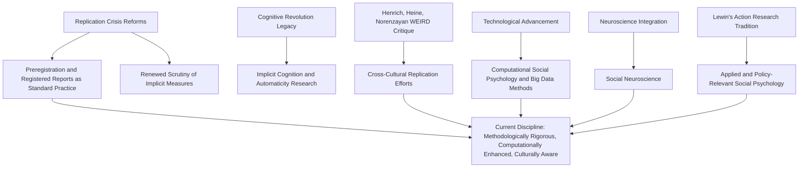

## Current Trajectory of the Discipline

### Overview

Contemporary social psychology, shaped decisively by the methodological reckoning of the replication crisis, is currently developing along several converging trajectories: greater methodological rigor, expanded technological and computational methods, increased attention to cultural and demographic generalizability, deeper integration with neuroscience, and growing engagement with real-world application and policy relevance. This section surveys the discipline's present direction as it builds on the theoretical and historical foundations established by Lewin, Heider, Allport, Festinger, and the postwar and cognitive-revolution research traditions.

### 1. Post-Replication-Crisis Methodological Consolidation

**Institutionalized Open Science Practices**

Preregistration, registered reports, open data, and adequately powered study designs, which emerged as reform proposals during the replication crisis, have become increasingly standard expectations at major journals and among funding bodies rather than optional best practices.

**Key Points**

- Meta-analytic and multi-lab replication approaches (in the tradition of the Many Labs projects) are increasingly treated as a more credible evidentiary standard than single-study findings, particularly for establishing whether an effect is robust across populations and contexts.
- [Inference] This methodological consolidation likely represents a durable, structural shift in the field's epistemic norms rather than a temporary reactive phase, since these practices have become embedded in graduate training, journal policy, and funding requirements rather than remaining a matter of individual researcher discretion.

### 2. Computational and Big-Data Methods

**Emergence of Computational Social Psychology**

Researchers increasingly draw on large-scale behavioral datasets, social media data, natural language processing, and machine learning techniques to study social phenomena at scales unavailable to traditional lab experimentation.

**Key Applications**

- Analyzing large text corpora (social media posts, online discourse) to study attitude expression, polarization, and misinformation spread at population scale.
- Using digital trace data (online behavior, mobile sensing) to study social behavior in naturalistic settings, complementing traditional lab-based experimental control with greater ecological validity.
- Applying machine learning classification methods to detect patterns in social judgment, emotion expression, or stereotyping that might be difficult to identify through traditional hypothesis-driven analysis alone.

**Key Points**

- This trend represents a methodological expansion rather than a replacement of experimental methods; most researchers in this space combine computational/observational data with traditional experimental designs to establish causal claims, since large-scale observational data alone typically cannot resolve causal questions as cleanly as controlled experimentation.
- [Unverified] The long-term influence of computational methods on the field's core theoretical paradigms remains an open and actively debated question; some researchers argue these methods will fundamentally reshape social psychological theory, while others view them primarily as a valuable methodological supplement to existing theoretical frameworks rather than a paradigm shift in themselves.

### 3. Generalizability, WEIRD Samples, and Cultural Psychology

**The WEIRD Sample Critique**

A major and growing concern in contemporary social psychology concerns the historical overreliance on samples drawn from Western, Educated, Industrialized, Rich, and Democratic (WEIRD) populations—disproportionately American undergraduate students—raising questions about whether many classic findings generalize to the broader, more culturally diverse global population.

**Key Points**

- This critique, prominently articulated by Joseph Henrich, Steven Heine, and Ara Norenzayan in the late 2000s, has substantially intensified in influence over the past decade, converging with and reinforcing the broader replication crisis's emphasis on rigorous generalizability testing.
- Cross-cultural replication efforts increasingly test whether foundational findings (e.g., cognitive dissonance effects, certain attribution biases, self-serving bias) hold consistently across individualist and collectivist cultural contexts, with some classic effects showing meaningful cultural variation rather than universal applicability.
- This trajectory intersects directly with cultural psychology, a related but historically distinct subfield increasingly integrated into mainstream social psychological training and publication.

**Example**

The fundamental attribution error, long treated as a near-universal cognitive bias, has been found in cross-cultural research to be substantially weaker or differently expressed in more collectivist cultural contexts, where situational and relational explanations for behavior may be more chronically accessible than in individualist Western contexts—illustrating how the WEIRD sample critique has prompted direct empirical reassessment of previously assumed universal findings.

### 4. Social Neuroscience Integration

**Core Development**

Social psychology has increasingly integrated with cognitive and affective neuroscience, giving rise to **social neuroscience** (or social cognitive neuroscience) as an established interdisciplinary research area, using techniques such as fMRI, EEG, and psychophysiological measurement to examine the neural and physiological substrates of social cognition and behavior.

**Key Applications**

- Neural correlates of social exclusion, empathy, intergroup bias, and self-referential processing.
- Physiological measurement (cortisol, cardiovascular reactivity) as objective indices of social stress and threat responses, complementing self-report measures.

**Key Points**

- [Unverified] The degree to which social neuroscience findings have generated genuinely novel theoretical insight, as opposed to providing biological corroboration for previously established behavioral findings, remains a matter of ongoing methodological and theoretical debate within the field.

### 5. Implicit Cognition and Automaticity Research

Building directly on the cognitive revolution's information-processing paradigm, research on implicit attitudes, automatic stereotyping, and non-conscious social cognition remains a highly active area, though it has itself undergone significant methodological reassessment.

**Key Points**

- The Implicit Association Test (IAT) and related implicit measures, widely used since the late 1990s, have faced substantial psychometric scrutiny regarding test-retest reliability and predictive validity for individual-level behavior, prompting more cautious interpretation of implicit measures than in earlier applications.
- [Inference] This reassessment of implicit measures parallels the broader replication crisis's emphasis on measurement rigor, suggesting the field's current methodological caution extends beyond experimental design reforms into renewed scrutiny of its core measurement instruments.

### 6. Applied and Policy-Relevant Social Psychology

**Growing Real-World Application**

Contemporary social psychology increasingly emphasizes translational research with direct application to public health, organizational behavior, education, climate behavior, and public policy, often through behavioral intervention design and "nudge"-style applications informed by social psychological principles.

**Key Application Areas**

- Health behavior interventions grounded in social norms research and self-affirmation theory.
- Prejudice-reduction interventions informed by intergroup contact theory and social identity research.
- Climate and pro-environmental behavior interventions using social comparison and descriptive norm messaging.
- Organizational interventions targeting workplace bias, team dynamics, and leadership, drawing on Lewin's original group dynamics tradition.

**Key Points**

- This applied emphasis reflects a direct continuity with Lewin's original action research philosophy and his maxim that there is nothing so practical as a good theory, suggesting the field's translational turn represents a return to, rather than a departure from, one of its foundational commitments.

### 7. Diversity, Equity, and Reflexivity Within the Field

**Institutional Self-Examination**

Beyond studying prejudice and intergroup relations as research topics, the discipline has increasingly turned reflexive attention toward its own demographic composition, historical exclusions, and the cultural specificity of its theoretical assumptions, partly overlapping with the WEIRD sample critique above.

[Unverified] The pace and depth of institutional change within academic social psychology in response to these concerns varies considerably across countries, universities, and professional organizations, and is an area of ongoing development rather than a settled matter.

### Diagram: Current Trajectories Radiating from Foundational History

### Comparative Table: Historical Foundations and Their Current Trajectory

| Historical Foundation | Current Trajectory Building on It |
| --- | --- |
| F. Allport's experimental rigor | Post-replication-crisis methodological consolidation, preregistration |
| Lewin's action research | Applied, translational, policy-relevant research |
| Cognitive revolution's information processing | Implicit cognition research, now under renewed measurement scrutiny |
| Postwar situationism (Asch, Milgram) | Continued emphasis on situational and contextual factors, now tested for cultural generalizability |
| Social identity theory | Intergroup relations research informing prejudice-reduction interventions |

### Illustrative Example

**Example**

A contemporary research team studying workplace gender bias today might: preregister hypotheses and analysis plans before data collection (replication crisis reform); combine a controlled lab experiment on hiring decisions with large-scale analysis of real organizational hiring data using natural language processing (computational methods); test whether the bias pattern holds across culturally distinct organizational samples rather than assuming a single WEIRD-derived finding generalizes universally (cultural generalizability trajectory); and design the study explicitly to inform an organizational debiasing intervention (applied/translational trajectory)—illustrating how multiple current trajectories converge within a single modern research program in a way that would have been methodologically and technologically unavailable to researchers even two decades earlier.

**Conclusion**

Social psychology's current trajectory reflects both continuity and transformation relative to its foundational history: the field retains its core commitment to rigorous experimentation (Allport), situational explanation (Lewin, the postwar tradition), and cognitive mechanism (the cognitive revolution), while substantially expanding its methodological toolkit (computational methods, neuroscience), demographic scope (cross-cultural generalizability), and practical application (translational and policy-relevant research). [Inference] This trajectory suggests a discipline in a phase of methodological maturation and scope expansion following a period of significant self-correction, rather than a discipline in fundamental theoretical crisis, positioning contemporary social psychology as both more methodologically cautious and more technologically and globally ambitious than at any prior point in its history.

**Next Steps**

- Computational social psychology methods and natural language processing applications
- The WEIRD sample critique and cross-cultural replication research
- Social neuroscience methods and findings
- Psychometric reassessment of the Implicit Association Test
- Applied social psychology interventions in health, education, and organizational contexts
- Intergroup contact theory and modern prejudice-reduction interventions