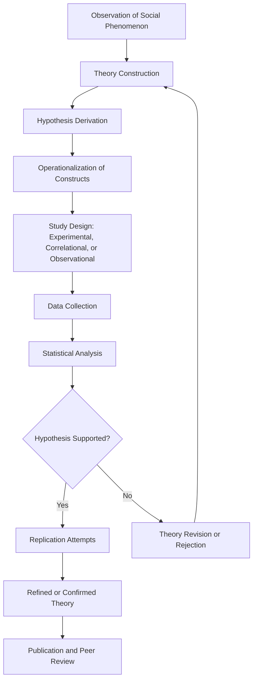

## The Scientific Method

### Overview

Social psychology's status as an empirical science rests on its systematic application of the scientific method to social phenomena—a commitment traceable directly to Floyd Allport's foundational insistence on experimental rigor. This section outlines how the general scientific method is structured and specifically adapted within social psychological research, from theory formation through hypothesis testing to replication.

### The Basic Scientific Cycle

**Core Sequence**

Social psychological research follows the standard hypothetico-deductive scientific cycle, adapted to social phenomena:

1. **Observation**: noticing a social phenomenon requiring explanation (e.g., bystanders failing to help in emergencies).
2. **Theory construction**: developing a systematic explanatory framework accounting for the phenomenon and generating testable predictions.
3. **Hypothesis formation**: deriving specific, falsifiable predictions from the theory.
4. **Empirical testing**: designing a study (experimental, correlational, or observational) to test the hypothesis.
5. **Data analysis**: statistically evaluating whether the data support or fail to support the hypothesis.
6. **Replication and refinement**: repeating the test, ideally across labs and populations, and revising theory based on accumulated evidence.

**Key Points**

- This cycle is iterative and self-correcting in principle: theories are provisional and subject to revision or rejection based on accumulating disconfirming evidence, a principle central to Karl Popper's philosophy of science and falsifiability.
- The replication crisis substantially reinforced step 6 (replication) as a non-optional component of the scientific cycle rather than an occasional afterthought, given widespread historical underinvestment in systematic replication.

### Theory and Hypothesis: Key Distinctions

**Theory**

A theory is a broad, organized set of principles that explains and predicts a range of phenomena (e.g., cognitive dissonance theory, social identity theory). A good theory in social psychology should be:

- **Parsimonious**: explaining phenomena with the fewest necessary assumptions.
- **Falsifiable**: generating predictions that could, in principle, be disconfirmed by evidence.
- **Generative**: producing new, testable hypotheses beyond the original observations that inspired it.

**Hypothesis**

A hypothesis is a specific, testable prediction derived from a theory, operationalized in terms of measurable variables. For example, cognitive dissonance theory (broad theoretical framework) generates the specific hypothesis that individuals induced to argue counterattitudinally for low external justification will show greater attitude change than those given high external justification—directly testable via experimental manipulation.

### Operationalization

**Core Concept**

Operationalization is the process of translating an abstract theoretical construct into a concrete, measurable procedure. This step is essential because social psychological constructs (attitudes, aggression, conformity, prejudice) are inherently abstract and must be rendered observable and quantifiable.

**Key Points**

- The same construct can be operationalized in multiple ways, and researchers must justify why their chosen operationalization validly captures the intended construct (**construct validity**).
- Poor operationalization is a common source of failed replication or contested findings, since two studies claiming to measure "the same" construct may in fact be measuring meaningfully different things.

**Example**

"Aggression" as a theoretical construct might be operationalized as: the intensity or duration of a noise blast a participant chooses to administer to another person in a lab paradigm (behavioral measure), self-reported hostile feelings on a questionnaire (self-report measure), or amygdala activation in response to provocation (physiological/neural measure). Each operationalization captures a different facet of the broader construct, and findings may not generalize identically across operationalizations.

### Variables and Causal Inference

**Types of Variables**

- **Independent variable (IV)**: the factor manipulated (in experiments) or measured as a presumed cause (in correlational designs).
- **Dependent variable (DV)**: the outcome measured as a presumed effect.
- **Extraneous/confounding variables**: uncontrolled factors that could provide alternative explanations for an observed relationship between IV and DV.

**The Centrality of Random Assignment**

Random assignment of participants to experimental conditions is the critical design feature that allows researchers to draw causal conclusions, since it ensures that, on average, groups do not systematically differ on any variable other than the manipulated IV, ruling out confounding as an alternative explanation.

$$\text{Causal Inference Requires: } \text{Covariation} + \text{Temporal Precedence} + \text{Elimination of Alternative Explanations}$$

**Key Points**

- Correlational designs can establish covariation but cannot, by themselves, establish temporal precedence or rule out confounds, making causal claims from purely correlational data inherently limited (the well-known principle that correlation does not imply causation).
- Experimental designs, through random assignment and manipulation, are specifically structured to satisfy all three causal inference criteria, which is why social psychology has historically prioritized experimentation as its methodological gold standard, following Floyd Allport's founding emphasis.

### Reliability and Validity

**Reliability**

The consistency of a measure across time (test-retest reliability), across items (internal consistency), or across raters (inter-rater reliability).

**Validity**

| Type of Validity | Definition |
| --- | --- |
| Construct validity | Does the measure actually capture the intended theoretical construct? |
| Internal validity | Can observed effects be confidently attributed to the manipulated IV, ruling out confounds? |
| External validity | Do findings generalize beyond the specific sample, setting, and operationalization used? |
| Statistical conclusion validity | Are the statistical analyses appropriate and correctly interpreted? |

**Key Points**

- A frequent tension exists between internal and external validity: highly controlled lab experiments maximize internal validity (confidence in causal claims) but may sacrifice external validity (generalizability to real-world settings), while field studies often show the reverse tradeoff.
- [Inference] This tradeoff is likely a primary reason social psychology has historically employed a diversified methodological toolkit (lab experiments, field experiments, correlational surveys, archival research) rather than relying on any single method exclusively, since triangulating findings across methods with complementary validity strengths and weaknesses provides more robust overall evidence than any single approach alone.

### Falsifiability and the Role of Null Results

**Popperian Falsifiability**

A scientific hypothesis must be capable, in principle, of being proven false by empirical evidence; hypotheses that are compatible with any conceivable observed outcome are not scientifically testable.

**The Historical Problem of Publication Bias**

As established in the replication crisis, null results (failures to find a predicted effect) were historically difficult to publish, creating systematic bias in the published literature and undermining the self-correcting function the scientific method depends on. Registered reports and open science reforms directly target this problem by evaluating study quality before results are known.

### Diagram: The Scientific Cycle in Social Psychology

### Illustrative Example: Applying the Full Cycle

**Example**

A researcher observes that people seem less likely to help in emergencies when more bystanders are present (observation). They draw on diffusion of responsibility theory to explain this (theory), predicting that as the number of bystanders increases, the likelihood any individual bystander intervenes will decrease (hypothesis). They operationalize "helping" as the latency (in seconds) before a participant reports an apparent emergency (smoke entering a room) to an experimenter, and manipulate "number of bystanders" by having participants complete the task alone, with one confederate, or with several confederates who remain passive (operationalization and IV manipulation). Participants are randomly assigned to these conditions to ensure causal inference is valid (random assignment). The researcher statistically compares helping latency across conditions (data analysis), and, upon finding support for the hypothesis, the finding is subsequently tested across multiple independent labs and populations before being considered a well-established effect (replication)—precisely the trajectory followed by Latané and Darley's classic bystander effect research program.

### Conclusion

**Conclusion**

The scientific method provides social psychology's core epistemological backbone, translating abstract theoretical claims about social behavior into falsifiable, measurable, and replicable empirical tests. While the field has historically prioritized experimental methods for their strong causal inference properties—a legacy of Floyd Allport's founding methodological commitments—rigorous application of the scientific method also demands careful attention to operationalization validity, the internal/external validity tradeoff, and, as the replication crisis starkly demonstrated, systematic replication as a non-negotiable component of genuine scientific progress rather than an optional afterthought.

**Next Steps**

- Experimental methods and research design in depth
- Correlational and quasi-experimental designs
- Reliability and validity measurement in detail
- Ethical considerations in social psychological research design
- Statistical analysis and hypothesis testing conventions
- Survey and self-report methodology