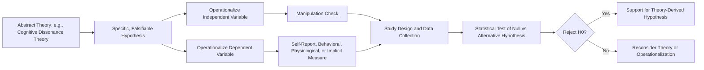

## Hypothesis Formation and Operationalization

### Overview

Hypothesis formation and operationalization together constitute the critical bridge between abstract social psychological theory and concrete, testable empirical research. This section examines how researchers derive specific, falsifiable hypotheses from broader theories and translate abstract constructs into measurable procedures—a process central to the scientific method's application in social psychology.

### Hypothesis Formation

**Definition**

A hypothesis is a specific, testable, and falsifiable prediction about the relationship between two or more variables, logically derived from a broader theory.

**Sources of Hypotheses**

Hypotheses in social psychology typically arise from several sources:

1. **Deduction from existing theory**: deriving a specific prediction from a general theoretical framework (e.g., deriving from cognitive dissonance theory the specific prediction that low-payment counterattitudinal advocacy produces more attitude change than high-payment advocacy).
2. **Observation of real-world phenomena**: noticing a puzzling social pattern and generating explanatory hypotheses to account for it (e.g., Latané and Darley's observation of bystander non-intervention in the Kitty Genovese case, which generated hypotheses about diffusion of responsibility).
3. **Prior empirical findings**: extending or qualifying previous research results, generating hypotheses about boundary conditions, moderators, or mechanisms.
4. **Inconsistencies or gaps in the literature**: generating hypotheses designed to resolve contradictory prior findings or address unexamined conditions.

**Key Points**

- A well-formed hypothesis must specify a clear, directional (or at minimum, non-null) predicted relationship between an independent and dependent variable.
- Hypotheses should be falsifiable: capable, in principle, of being disconfirmed by empirical data, consistent with Popperian philosophy of science.
- Hypotheses are distinct from theories: a theory is the broad explanatory framework; a hypothesis is the specific, testable prediction derived from it for a particular study.

### The Structure of a Good Hypothesis

**Directional vs. Non-Directional Hypotheses**

- **Directional hypothesis**: specifies the expected direction of the relationship (e.g., "increased group size will decrease individual helping behavior").
- **Non-directional hypothesis**: predicts a relationship exists without specifying direction (e.g., "group size will affect helping behavior"), generally considered weaker and less informative than directional hypotheses when theory permits a directional prediction.

**Null and Alternative Hypotheses**

In formal statistical testing, hypotheses are framed as a pair:

- **Null hypothesis ($H_0$)**: predicts no relationship or no difference between conditions.
- **Alternative hypothesis ($H_1$)**: predicts the relationship or difference the researcher expects, based on theory.

$$H_0: \mu_1 = \mu_2 \quad \text{vs.} \quad H_1: \mu_1 \neq \mu_2 \text{ (or } \mu_1 > \mu_2 \text{ for a directional test)}$$

Statistical hypothesis testing evaluates the probability of observing the obtained data (or more extreme data) assuming $H_0$ is true, rejecting $H_0$ in favor of $H_1$ when this probability falls below a predetermined threshold (conventionally $\alpha = 0.05$).

### Operationalization

**Definition**

Operationalization is the process of specifying precisely how an abstract theoretical construct will be measured or manipulated in concrete, observable, and replicable terms.

**Why Operationalization Is Necessary**

Social psychological constructs (aggression, prejudice, attraction, conformity, self-esteem) are inherently abstract mental or social phenomena that cannot be directly observed. Operationalization renders these constructs measurable, allowing empirical testing.

**Key Points**

- Operationalization involves an unavoidable trade-off: no single operational definition perfectly captures the full richness of an abstract construct, so researchers must select an operationalization that balances measurement precision, ecological validity, and practical feasibility.
- The same underlying construct can have multiple valid operationalizations, and findings can sometimes differ depending on which operationalization is used—a consideration directly relevant to replication and generalizability.

### Operationalizing Independent and Dependent Variables

**Independent Variable Operationalization (Manipulation)**

In experimental designs, operationalizing the IV means specifying exactly how the manipulated condition will be created. This requires a **manipulation check**—a supplementary measure confirming that the manipulation actually produced the intended psychological state in participants.

**Dependent Variable Operationalization (Measurement)**

Operationalizing the DV means specifying exactly how the outcome will be measured, typically through one or more of:

- **Self-report measures**: questionnaires, rating scales (e.g., Likert scales).
- **Behavioral measures**: directly observable actions (e.g., helping latency, aggression intensity in a noise-blast paradigm).
- **Physiological measures**: heart rate, cortisol, skin conductance, neural activation.
- **Implicit/indirect measures**: reaction-time based tasks (e.g., the Implicit Association Test) designed to capture automatic or non-conscious processes.

### Comparative Table: Operationalizing "Aggression"

| Operationalization Type | Concrete Example | Strength | Limitation |
| --- | --- | --- | --- |
| Behavioral | Intensity/duration of noise blast delivered to a confederate | High ecological realism for lab context | May not generalize to real-world aggression |
| Self-report | Buss-Perry Aggression Questionnaire scores | Easy to administer, captures trait-level tendencies | Subject to social desirability bias |
| Physiological | Cortisol reactivity following provocation | Objective, bypasses self-report bias | Indirect link to actual aggressive behavior |
| Archival | Criminal records or disciplinary reports | High real-world relevance | Limited experimental control, confounded by reporting biases |

**Key Points**

- Researchers often use **converging operations**—multiple operationalizations of the same construct within or across studies—to strengthen confidence that findings reflect the underlying construct rather than an artifact of a single measurement approach.
- Choice of operationalization directly affects a study's **construct validity**: the degree to which the chosen measure or manipulation actually captures the intended theoretical construct.

### Common Pitfalls in Hypothesis Formation and Operationalization

**1. Vague or Untestable Hypotheses**

Hypotheses stated too abstractly (e.g., "people are influenced by groups") lack the specificity needed for empirical testing and must be refined into a testable form (e.g., "individuals will conform to an incorrect unanimous group judgment on a subsequent unambiguous perceptual task").

**2. Construct Underrepresentation**

An operationalization that captures only a narrow slice of a broader construct, potentially producing misleading conclusions about the construct as a whole. For example, defining "prejudice" solely through explicit self-report scales risks entirely missing implicit or automatic bias processes.

**3. Construct-Irrelevant Variance**

When an operationalization inadvertently measures something in addition to, or instead of, the intended construct. For example, a "trust" measure requiring participants to give away real money may be confounded by financial risk-aversion rather than trust per se.

**4. Confirmatory Bias in Hypothesis Refinement**

Post-hoc adjustment of hypotheses after seeing data (sometimes termed HARKing—Hypothesizing After Results are Known) undermines the falsifiability principle central to legitimate hypothesis testing and was identified as a significant contributor to the replication crisis; preregistration is the primary methodological safeguard against this practice.

### Diagram: From Theory to Testable Hypothesis

### Illustrative Example: Full Worked Case

**Example**

Suppose a researcher wants to test social identity theory's prediction that ingroup favoritism increases when group identity is made salient. The broad theory (social identity theory) generates the specific hypothesis: participants whose group membership is made salient before an allocation task will allocate more resources to ingroup members than participants for whom group membership is not made salient. To operationalize the independent variable, the researcher might randomly assign participants to complete either a questionnaire emphasizing their group membership (e.g., university affiliation) or a neutral, unrelated questionnaire (manipulation), followed by a manipulation check item confirming increased self-reported group identification. To operationalize the dependent variable, the researcher might use a minimal-group resource allocation matrix task (behavioral measure) asking participants to distribute points between an ingroup and outgroup member. The null hypothesis ($H_0$: no difference in ingroup favoritism between conditions) is tested against the directional alternative hypothesis ($H_1$: salience condition shows greater ingroup favoritism than control), with statistical analysis determining whether observed differences exceed what would be expected by chance alone.

### Conclusion

**Conclusion**

Hypothesis formation and operationalization together determine whether an abstract social psychological theory can be meaningfully subjected to empirical scrutiny. A well-formed, falsifiable hypothesis paired with a valid, carefully justified operationalization allows researchers to draw legitimate inferences about theoretical constructs from concrete, measurable data. Weaknesses at either stage—vague hypotheses or poorly justified operationalizations—undermine construct validity and contribute to the kinds of replication difficulties that prompted the field's post-2011 methodological reforms, making careful attention to both stages a foundational requirement of rigorous social psychological research.

**Next Steps**

- Reliability and validity in measurement design
- Experimental design and manipulation check methodology
- Preregistration and its role in preventing HARKing
- Self-report versus behavioral versus implicit measurement approaches
- Converging operations and multi-method research designs
- Statistical hypothesis testing and Type I/Type II error