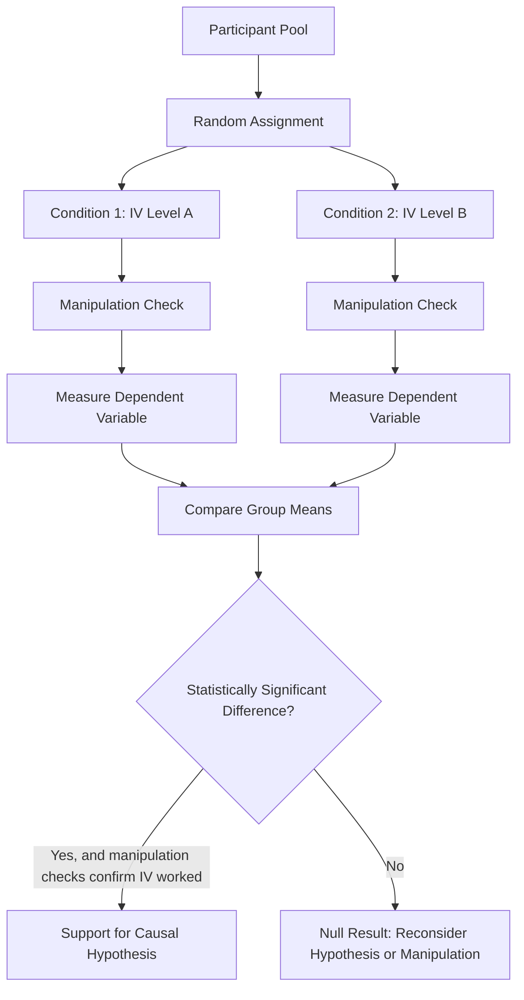

## Experimental Research Designs and Causal Inference

### Overview

Experimental research designs represent social psychology's methodological gold standard for establishing causal relationships between variables, distinguished from correlational designs by the researcher's direct manipulation of an independent variable and random assignment of participants to conditions. This methodology, rooted in Floyd Allport's founding emphasis on controlled experimentation, remains the field's primary tool for testing causal hypotheses derived from social psychological theory.

### Core Requirements for Causal Inference

**Three Criteria for Establishing Causation**

Experimental designs are specifically structured to satisfy all three logical criteria required for confident causal inference:

$$\text{Causation Requires: } \text{Covariation} + \text{Temporal Precedence} + \text{Elimination of Alternative Explanations}$$

1. **Covariation**: the independent variable (IV) and dependent variable (DV) must be statistically associated.
2. **Temporal precedence**: the IV must be manipulated before the DV is measured, establishing that the cause precedes the effect.
3. **Elimination of alternative explanations**: all plausible confounding explanations for the observed IV-DV relationship must be ruled out.

**Key Points**

- Correlational designs can typically establish covariation and, in longitudinal designs, temporal precedence, but they cannot definitively eliminate alternative explanations (third variables, reverse causation) the way experiments can.
- Experimental manipulation directly satisfies temporal precedence (the researcher controls when the IV is introduced), while random assignment satisfies the elimination-of-alternatives criterion.

### Random Assignment: The Defining Feature

**Core Mechanism**

Random assignment allocates participants to experimental conditions through a chance-based procedure (e.g., random number generation, coin flip), ensuring that, on average across a sufficiently large sample, the groups do not systematically differ on any measured or unmeasured characteristic other than the manipulated IV.

**Why This Matters**

Random assignment is the single design feature that distinguishes experiments from correlational designs in their capacity to eliminate confounds. Because assignment to condition is unrelated to any pre-existing participant characteristic (personality, intelligence, mood, prior experience), any systematic difference in the DV between conditions can be confidently attributed to the manipulated IV rather than to pre-existing group differences.

**Key Points**

- Random assignment is distinct from random *sampling* (how participants are selected from a population); random assignment concerns how already-recruited participants are allocated to conditions, and is what enables causal inference, whereas random sampling primarily supports generalizability (external validity).
- With small sample sizes, random assignment does not guarantee perfectly equivalent groups on every characteristic by chance alone, which is one reason adequate statistical power (sufficiently large samples) matters for the confidence of causal conclusions—a concern directly relevant to the replication crisis's critique of historically underpowered studies.

### Manipulating the Independent Variable

**Manipulation Strategies**

Social psychologists manipulate independent variables through several common strategies:

- **Instructional manipulation**: directly informing participants of different information or instructions across conditions (e.g., telling participants a task is either competitive or cooperative).
- **Confederate/staged manipulation**: using trained actors (confederates) to enact different social behaviors across conditions (e.g., Asch's unanimous incorrect confederates).
- **Environmental manipulation**: altering physical or situational features of the experimental setting (e.g., number of bystanders present, room temperature, presence of an audience).
- **Priming manipulation**: exposing participants to subtle stimuli intended to activate specific cognitive or motivational states outside conscious awareness (e.g., word-completion tasks embedding trait-related concepts).

**Manipulation Checks**

A manipulation check is a supplementary measure confirming that the experimental manipulation successfully produced the intended psychological state or perception in participants, distinct from the primary dependent variable. Manipulation checks are essential for interpreting null results: a failure to find a predicted effect could reflect either a genuinely false hypothesis or a failed manipulation, and manipulation checks help distinguish between these possibilities.

### Experimental Design Structures

**1. Between-Subjects Designs**

Different participants are assigned to each condition, and each participant experiences only one level of the IV.

| Feature | Description |
| --- | --- |
| Strength | No carryover effects between conditions; participants cannot guess the study's purpose from experiencing multiple conditions |
| Limitation | Requires larger samples; individual differences between participants add error variance, potentially reducing statistical power |

**2. Within-Subjects (Repeated-Measures) Designs**

The same participants experience all levels of the IV, with the DV measured after each condition.

| Feature | Description |
| --- | --- |
| Strength | Each participant serves as their own control, removing individual-difference variance and increasing statistical power with smaller samples |
| Limitation | Vulnerable to carryover effects (fatigue, practice, or demand characteristics arising from experiencing multiple conditions); order effects can confound results unless controlled |

**Counterbalancing**

To address order effects in within-subjects designs, researchers use counterbalancing—systematically varying the order in which conditions are presented across participants (e.g., using a Latin square design) so that order effects are distributed evenly across conditions rather than confounded with the IV itself.

**3. Factorial Designs**

Factorial designs manipulate two or more independent variables simultaneously, allowing researchers to examine both main effects (the independent effect of each IV) and interaction effects (whether the effect of one IV depends on the level of another IV).

$$\text{A 2} \times \text{2 factorial design yields 4 conditions, testing 2 main effects and 1 interaction effect}$$

**Example**

A 2 (group size: small vs. large) × 2 (task difficulty: easy vs. hard) factorial design examining social facilitation would allow researchers to test not only whether group size affects performance (main effect) and whether task difficulty affects performance (main effect), but also whether the effect of group size on performance *depends on* task difficulty—directly testing Zajonc's drive theory prediction that coaction improves performance on easy tasks but impairs performance on hard tasks (an interaction effect).

### Threats to Internal Validity

**Definition**

Internal validity refers to the degree of confidence that observed effects on the DV are genuinely caused by the manipulated IV rather than by confounding factors.

**Common Threats**

- **Confounding variables**: any factor other than the IV that systematically differs between conditions and could alternatively explain the DV differences.
- **Demand characteristics**: cues within the experimental situation that lead participants to infer the study's purpose and (consciously or unconsciously) alter their behavior to align with (or against) perceived expectations.
- **Experimenter expectancy effects**: unintentional influence of researchers' expectations on participant behavior or on the researchers' own data recording, often controlled through double-blind procedures where neither participant nor experimenter knows condition assignment.
- **Selection effects**: pre-existing differences between groups that random assignment failed to equalize, more likely with insufficient sample sizes.

**Key Points**

- Demand characteristics and experimenter expectancy effects are typically controlled through blinding procedures and carefully standardized experimental protocols, including the use of cover stories that disguise the study's true purpose (balanced against ethical requirements for eventual debriefing).

### Internal Validity vs. External Validity Trade-off

| Dimension | Lab Experiments | Field Experiments |
| --- | --- | --- |
| Control over confounds | High | Lower |
| Internal validity | Typically high | Typically moderate |
| External validity/realism | Often lower (artificial setting) | Often higher (naturalistic setting) |
| Practical/ethical constraints | Fewer | More (less control over real-world conditions) |

**Key Points**

- **Field experiments**, which retain random assignment and manipulation but occur in real-world settings, attempt to balance this trade-off, offering stronger external validity than lab experiments while retaining meaningfully stronger causal inference than purely correlational field research.
- [Inference] The persistent internal/external validity trade-off likely explains why social psychology has historically valued replication across both lab and field settings, since converging evidence from methodologically complementary designs provides stronger overall support for a causal claim than reliance on either setting alone.

### Diagram: Experimental Design Logic

### Illustrative Example: Full Experimental Case

**Example**

A researcher hypothesizes that exposure to a persuasive message from a high-credibility (versus low-credibility) source produces greater attitude change, derived from the Elaboration Likelihood Model. Participants are randomly assigned to read an identical persuasive message attributed either to a Nobel Prize-winning scientist (high-credibility condition) or to an anonymous high school student (low-credibility condition)—satisfying temporal precedence, since the manipulation occurs before attitude measurement. A manipulation check item ("How credible did you find the message source?") confirms participants perceived the intended credibility difference. Attitude change is measured via a post-message questionnaire (DV), and because participants were randomly assigned, any systematic difference in attitude change between conditions can be confidently attributed to source credibility rather than to pre-existing differences in participants' initial attitudes, argument-evaluation ability, or general persuadability—satisfying the elimination-of-alternative-explanations criterion and permitting a genuinely causal conclusion, in contrast to a correlational study merely measuring naturally occurring beliefs about message sources.

### Conclusion

**Conclusion**

Experimental research designs, through the combination of direct IV manipulation and random assignment, satisfy all three logical criteria for causal inference—covariation, temporal precedence, and elimination of alternative explanations—making them social psychology's most methodologically powerful tool for testing causal hypotheses. While experiments must contend with threats to internal validity (confounds, demand characteristics, experimenter expectancy) and an inherent trade-off against external validity relative to naturalistic field settings, careful experimental design, manipulation checks, and complementary field experimentation together allow social psychologists to draw confident, theoretically grounded causal conclusions about the social determinants of behavior.

**Next Steps**

- Quasi-experimental designs and their causal inference limitations
- Factorial designs and interaction effect interpretation in depth
- Field experiments and their balance of internal and external validity
- Demand characteristics and experimenter expectancy effect controls
- Statistical power and sample size determination
- Meta-analysis as a tool for synthesizing experimental findings across studies