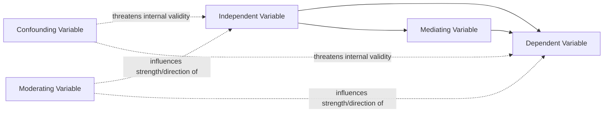

## Independent and Dependent Variables

### Overview

Independent and dependent variables form the fundamental building blocks of testable hypotheses in social psychological research. Precise understanding of these variable types, along with the related categories of confounding, mediating, and moderating variables, is essential for designing valid studies and correctly interpreting research findings.

### Independent Variable (IV)

**Definition**

The independent variable is the factor a researcher manipulates (in experimental designs) or measures as a presumed causal antecedent (in correlational designs), hypothesized to produce a change in the dependent variable.

**Key Points**

- In experimental designs, the IV is actively manipulated by the researcher, who creates at least two distinct levels or conditions (e.g., high vs. low group size, presence vs. absence of an audience).
- In correlational designs, the "IV" is measured rather than manipulated, and is more precisely termed a **predictor variable**, since without manipulation and random assignment, its causal status relative to the outcome cannot be firmly established.
- An IV must have at least two levels to permit comparison; a single, unvaried condition cannot constitute a testable independent variable.

**Types of IV Manipulation**

- **Manipulated (true) IV**: directly created by the researcher (e.g., randomly assigning participants to a competitive or cooperative task).
- **Subject/participant variable**: a pre-existing characteristic of participants (e.g., age, gender, personality trait) that cannot be experimentally manipulated and is instead measured, limiting causal interpretation even when treated statistically as an "IV" in an analysis of variance framework.

### Dependent Variable (DV)

**Definition**

The dependent variable is the outcome measured by the researcher, hypothesized to change as a function of variation in the independent variable.

**Key Points**

- The DV must be operationalized into a concrete, measurable form (self-report, behavioral, physiological, or implicit measure), as detailed in operationalization procedures.
- A well-chosen DV should have adequate **sensitivity**—the capacity to detect meaningful variation across conditions—since a DV with a ceiling or floor effect (where scores cluster near the maximum or minimum possible value) may fail to reveal a true underlying effect of the IV.

**Common DV Measurement Approaches in Social Psychology**

| Measurement Type | Example | Consideration |
| --- | --- | --- |
| Self-report | Attitude rating scales, Likert-scale questionnaires | Subject to social desirability bias and demand characteristics |
| Behavioral | Helping latency, noise-blast intensity, choice behavior | Higher ecological validity but sometimes noisier measurement |
| Physiological | Cortisol levels, skin conductance, heart rate variability | Objective but indirect link to the psychological construct of interest |
| Implicit/indirect | Reaction-time tasks (e.g., Implicit Association Test) | Captures automatic processes but faces psychometric reliability concerns |

### The IV-DV Relationship in Hypothesis Testing

**Core Logic**

$$\text{IV (cause)} \rightarrow \text{DV (effect)}$$

A hypothesis in social psychological research specifies a predicted directional or non-directional relationship between a specific IV and a specific DV, which is then tested by comparing DV scores across IV conditions (experimental) or examining the statistical association between measured IV and DV levels (correlational).

**Example**

In a classic social facilitation study, the IV is the presence versus absence of coacting others (manipulated by having participants complete a task alone or alongside another person performing the same task), and the DV is task performance, operationalized as the speed or accuracy of task completion (e.g., reel-winding speed in Triplett's original paradigm). The hypothesis predicts that the coaction condition (IV) will produce faster performance (DV) than the alone condition, at least for simple, well-learned tasks.

### Confounding Variables

**Definition**

A confounding variable is an extraneous factor that varies systematically along with the IV, providing an alternative explanation for any observed IV-DV relationship and thereby threatening internal validity.

**Key Points**

- Confounds arise when the IV manipulation inadvertently varies something else alongside the intended manipulation (e.g., if a "high group size" condition is also run at a different time of day than the "low group size" condition, time of day becomes confounded with group size).
- Random assignment does not eliminate confounds introduced by flawed manipulation procedures; it only equalizes pre-existing participant characteristics across conditions. Careful experimental design and standardized procedures are required to prevent procedural confounds.

**Example**

A researcher testing whether a persuasive message from a high-status (versus low-status) speaker produces more attitude change inadvertently uses a longer, more detailed message for the high-status speaker condition and a shorter message for the low-status condition. Message length is now confounded with speaker status, making it impossible to determine whether any observed attitude change difference is due to status, message length, or both.

### Mediating Variables

**Definition**

A mediating variable (or mediator) explains the psychological or causal mechanism through which an independent variable produces its effect on the dependent variable—it lies causally *between* the IV and DV.

$$\text{IV} \rightarrow \text{Mediator} \rightarrow \text{DV}$$

**Key Points**

- Mediation analysis tests *how* or *why* an effect occurs, distinct from moderation, which tests *when* or *for whom* an effect occurs.
- Establishing mediation typically requires demonstrating that the IV predicts the mediator, the mediator predicts the DV controlling for the IV, and the direct IV-DV relationship is reduced (partial mediation) or eliminated (full mediation) once the mediator is statistically accounted for.

**Example**

A study finds that induced counterattitudinal behavior (IV: low vs. high external justification for writing an essay contrary to one's beliefs) produces attitude change (DV). Cognitive dissonance theory proposes that this effect is mediated by experienced psychological discomfort (mediator): low justification induces greater dissonance, which in turn motivates attitude change to reduce the discomfort. Measuring self-reported discomfort as a mediator allows researchers to test this proposed mechanism directly.

### Moderating Variables

**Definition**

A moderating variable (or moderator) is a variable that influences the strength or direction of the relationship between the independent and dependent variables—it specifies the boundary conditions under which an effect occurs.

$$\text{IV} \times \text{Moderator} \rightarrow \text{DV}$$

**Key Points**

- Moderation is tested statistically through interaction effects, typically within factorial designs or moderated regression analysis.
- Identifying moderators is central to resolving apparently contradictory findings in the literature, since an effect that appears inconsistent across studies may in fact be reliably present only under specific moderating conditions.

**Example**

Zajonc's drive theory proposes that task complexity moderates the effect of social presence (IV) on performance (DV): the presence of others improves performance on simple/well-learned tasks but impairs performance on complex/novel tasks. Task complexity does not mediate the mechanism (it is not caused by social presence and does not explain *why* arousal affects performance) but instead moderates *when* social presence helps versus hurts—a boundary condition on the IV-DV relationship.

### Comparative Table: Mediator vs. Moderator

| Feature | Mediator | Moderator |
| --- | --- | --- |
| Question answered | Why or how does the IV affect the DV? | When or for whom does the IV affect the DV? |
| Causal position | Between IV and DV in the causal chain | Independent of the IV, interacts with it |
| Statistical test | Mediation analysis (e.g., Baron and Kenny steps, bootstrapping) | Moderated regression, factorial ANOVA interaction |
| Example | Perceived discomfort explaining dissonance-driven attitude change | Task complexity determining whether social presence helps or hurts performance |

### Diagram: Variable Relationships in Social Psychological Research

### Operationalization Considerations for Both Variable Types

**Key Points**

- Both IV and DV require careful operationalization to ensure construct validity: the manipulation must genuinely instantiate the intended theoretical construct, and the measure must genuinely capture the intended outcome construct.
- Manipulation checks (verifying the IV was perceived as intended) and pilot testing of DV measures (verifying adequate variability and sensitivity) are standard best practices before conducting the full study.

### Illustrative Example: Full Variable Identification

**Example**

Consider a study testing whether stereotype threat (IV: reminding versus not reminding a stigmatized group of a negative stereotype before a test) reduces test performance (DV: number of correct answers on a standardized test), through increased performance anxiety (mediator), with the effect being stronger among individuals who are highly identified with the relevant domain (moderator: domain identification). Here, the IV is manipulated (stereotype reminder present or absent), the DV is directly measured (test score), the mediator (anxiety) is measured to explain the underlying psychological mechanism, and the moderator (domain identification) is measured to establish the boundary condition under which the effect is strongest—together illustrating how a single well-designed study can incorporate IV, DV, mediator, and moderator within one coherent theoretical and statistical model.

### Conclusion

**Conclusion**

Precise identification and operationalization of independent and dependent variables, along with careful attention to potential confounding, mediating, and moderating variables, form the analytical backbone of rigorous social psychological research design. Correctly distinguishing these variable types is essential not only for designing valid studies but also for accurately interpreting published findings, since conflating a mediator with a moderator, or failing to identify a confound, can lead to fundamentally mistaken conclusions about the causal structure underlying a social psychological phenomenon.

**Next Steps**

- Mediation analysis statistical methods (Baron and Kenny approach, bootstrapping techniques)
- Moderated regression and factorial interaction interpretation
- Manipulation checks and pilot testing procedures
- Confound identification and experimental control techniques
- Operationalization strategies across self-report, behavioral, and physiological measures
- Statistical power considerations for detecting mediation and moderation effects