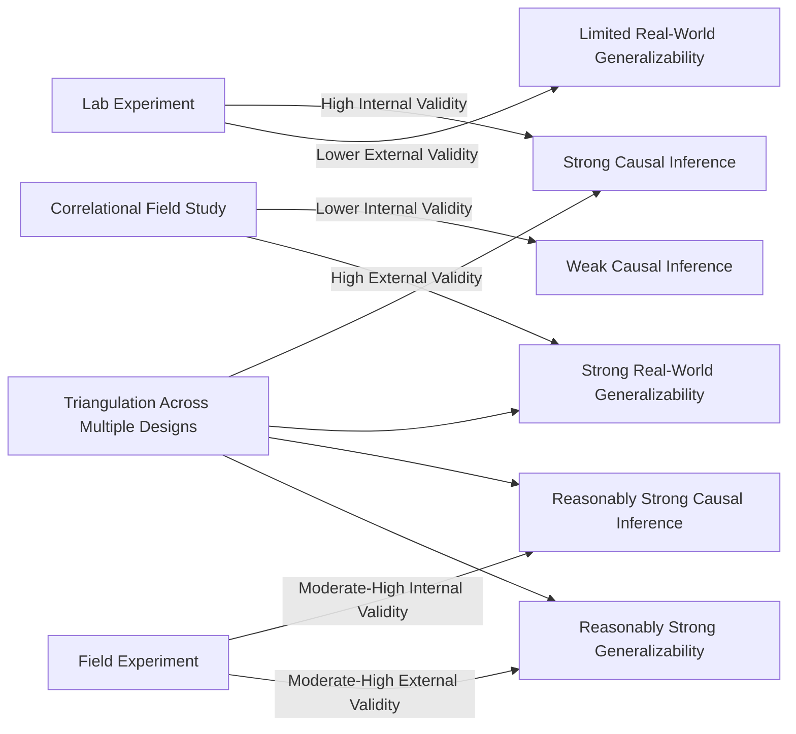

## Internal Versus External Validity

### Overview

Internal and external validity represent two distinct, often competing, dimensions of research quality that researchers must weigh when designing and interpreting social psychological studies. Understanding the tension and trade-offs between these two forms of validity is essential for correctly evaluating what a given study can and cannot conclude, and for building a comprehensive evidence base through complementary methodologies.

### Internal Validity

**Definition**

Internal validity refers to the degree of confidence that an observed relationship between the independent and dependent variable reflects a genuine causal effect of the IV, rather than the influence of confounding variables, alternative explanations, or measurement artifacts.

**Key Determinants of Internal Validity**

- **Random assignment**: ensures groups do not systematically differ on pre-existing characteristics, eliminating selection as an alternative explanation.
- **Experimental control**: standardizing all procedural elements except the manipulated IV, preventing procedural confounds.
- **Manipulation checks**: confirming the IV was perceived and experienced as intended.
- **Control of demand characteristics and experimenter expectancy**: preventing participant or researcher awareness of hypotheses from artificially producing the predicted result.

**Threats to Internal Validity**

| Threat | Description | Example |
| --- | --- | --- |
| Confounding variables | An uncontrolled factor varies systematically with the IV | Testing a "high group size" condition only in the morning and "low group size" only in the afternoon |
| Selection effects | Non-random or inadequately randomized group assignment produces pre-existing group differences | Allowing participants to choose their own condition |
| History effects | An external event occurring during the study differentially affects one condition | A news event affecting only participants tested on a particular day |
| Maturation effects | Natural changes in participants over time are mistaken for a treatment effect | Fatigue or practice effects across a long within-subjects session |
| Demand characteristics | Participants infer the hypothesis and adjust behavior accordingly | Participants guessing a study concerns helping behavior and acting unusually helpful |
| Experimenter expectancy | Researcher's expectations unintentionally influence participant behavior or data recording | A non-blinded experimenter subtly cueing participants toward the expected response |

### External Validity

**Definition**

External validity refers to the degree to which findings from a study generalize beyond the specific sample, setting, materials, and time period used in that particular study to other populations, contexts, and conditions.

**Dimensions of External Validity**

- **Population validity**: does the finding generalize to populations beyond the specific sample studied (e.g., beyond undergraduate participants to the broader adult population)?
- **Ecological validity**: does the finding generalize from the artificial laboratory setting to real-world, naturalistic contexts?
- **Temporal validity**: does the finding hold across different time periods, or is it specific to the historical/cultural moment in which the study was conducted?

**Key Points**

- The WEIRD sample critique (Western, Educated, Industrialized, Rich, Democratic populations) represents a specific and increasingly prominent concern about population validity in social psychology, given the field's historical overreliance on university undergraduate samples.
- Ecological validity concerns are particularly salient for social psychology given the field's heavy reliance on artificial laboratory manipulations (e.g., staged confederates, contrived scenarios) that may not accurately represent how social influence operates in naturalistic, real-world settings.

### The Fundamental Trade-off

**Core Tension**

Internal and external validity frequently exist in tension: research designs that maximize control over confounding variables (favoring internal validity) often do so by creating artificial, simplified conditions that diverge from real-world complexity (undermining external validity), while naturalistic field settings that maximize ecological realism (favoring external validity) typically sacrifice some degree of experimental control (undermining internal validity).

$$\text{Internal Validity} \nearrow \quad \Leftrightarrow \quad \text{External Validity} \searrow \text{ (typical, though not inevitable, trade-off)}$$

**Key Points**

- This trade-off is a tendency, not an iron law: well-designed field experiments can achieve reasonably high levels of both internal validity (through random assignment) and external validity (through naturalistic setting) simultaneously, though often at greater logistical and resource cost than lab experiments.
- [Inference] Recognition of this trade-off likely explains why social psychology has historically valued methodological triangulation—converging evidence from lab experiments, field experiments, and correlational field studies—over reliance on any single design type, since no single study design can typically maximize both forms of validity simultaneously.

### Comparative Table: Validity Across Common Design Types

| Design Type | Internal Validity | External Validity | Typical Trade-off |
| --- | --- | --- | --- |
| Lab experiment | High (strong experimental control, random assignment) | Often lower (artificial setting, unrepresentative samples) | Prioritizes causal certainty over generalizability |
| Field experiment | Moderate to high (retains random assignment, less procedural control) | Higher (naturalistic setting) | Balances causal inference with real-world relevance |
| Correlational field study | Low (no manipulation or random assignment) | Often high (naturally occurring variables and populations) | Prioritizes generalizability over causal certainty |
| Quasi-experiment | Moderate (no random assignment, but some manipulation or comparison structure) | Often higher than lab experiments | Partial compromise between the two |

### Illustrative Example: The Trade-off in Practice

**Example**

Consider studying whether physical proximity to a victim reduces bystander helping behavior. A highly controlled lab experiment might randomly assign participants to a staged emergency scenario with a confederate victim at varying distances, using standardized scripts and precisely measured helping latency (high internal validity, since random assignment and tight procedural control rule out confounds)—but the artificial, obviously staged nature of a lab "emergency" may not accurately capture how people behave during genuine real-world emergencies (lower external validity). Alternatively, a researcher might analyze archival data on real emergency responses (e.g., 911 call records correlated with bystander proximity data), which reflects genuine real-world behavior across diverse naturalistic contexts (higher external validity) but cannot rule out numerous confounding factors like neighborhood characteristics, time of day, or victim visibility that might independently explain any observed relationship (lower internal validity). Neither design alone provides a complete picture; converging evidence from both would provide stronger overall confidence in the finding's both causal status and real-world generalizability.

### Strategies for Balancing Both Forms of Validity

**1. Field Experiments**

Retaining random assignment and manipulation while conducting the study in a naturalistic setting (e.g., randomly assigning real charitable organizations to receive different fundraising appeal messages and measuring actual donation behavior), achieving a favorable balance between internal and external validity relative to either pure lab experiments or pure correlational field studies.

**2. Replication Across Diverse Samples and Settings**

Testing the same hypothesis across multiple populations, cultural contexts, and settings (as emphasized in post-replication-crisis methodological reforms) directly addresses population and ecological validity concerns that any single study, however internally valid, cannot resolve alone.

**3. Meta-Analysis**

Statistically aggregating findings across many individual studies, which vary in their specific samples, settings, and operationalizations, provides a more robust estimate of both the reliability of an effect and its generalizability across the conditions represented in the accumulated literature.

**4. Mixed-Methods and Multi-Study Papers**

Increasingly common in contemporary publication practice, combining a highly controlled lab study (establishing internal validity) with a complementary field or correlational study (establishing external validity) within the same research program or publication.

### Diagram: The Internal-External Validity Trade-off

### Relationship to the Replication Crisis and WEIRD Critique

**Key Points**

- The replication crisis primarily targeted internal validity concerns (underpowered studies, p-hacking, insufficient control of confounds and demand characteristics) through reforms like preregistration and adequately powered designs.
- The WEIRD sample critique primarily targets external validity concerns (population validity specifically), pushing the field toward more demographically and culturally diverse samples.
- [Inference] Together, these two major contemporary methodological movements suggest the field is currently engaged in a broad-based effort to strengthen both internal and external validity simultaneously, rather than treating improvement in one dimension as sufficient without corresponding attention to the other.

### Conclusion

**Conclusion**

Internal and external validity represent complementary but often competing research priorities: internal validity establishes confidence that an observed effect is genuinely caused by the manipulated variable, while external validity establishes confidence that the effect generalizes beyond the specific study context. No single study design can typically maximize both simultaneously, making methodological triangulation across lab experiments, field experiments, and correlational studies—combined with systematic replication across diverse samples and settings—the most robust overall strategy for building cumulative, generalizable causal knowledge in social psychology.

**Next Steps**

- Field experiments and their methodological design considerations
- The WEIRD sample critique and cross-cultural replication research
- Meta-analysis methodology and effect size aggregation
- Demand characteristics and experimenter expectancy effect controls
- Construct validity and its relationship to internal and external validity
- Quasi-experimental designs as a validity compromise strategy