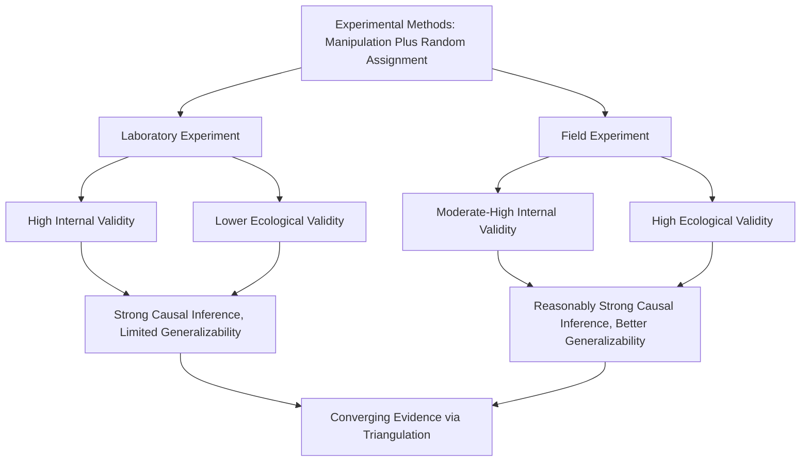

## Laboratory Experiments Versus Field Experiments

### Overview

Laboratory and field experiments represent two complementary experimental methodologies within social psychology, both retaining the defining experimental features of manipulation and random assignment, but differing fundamentally in setting, level of control, and resulting validity profile. Understanding when and why researchers select one approach over the other is central to designing and evaluating social psychological research.

### Laboratory Experiments

**Definition**

Laboratory experiments are conducted in a controlled, artificial research setting (typically a university psychology laboratory), where researchers exercise maximal control over the experimental environment, procedures, and extraneous variables.

**Key Characteristics**

- Standardized, tightly controlled physical environment (consistent lighting, room layout, timing, noise levels across all conditions).
- Precisely scripted procedures, often delivered via standardized instructions, computer-administered tasks, or trained confederates following exact protocols.
- Participants typically aware they are participating in a research study, even when the study's true purpose is disguised through cover stories.

**Advantages**

- **Maximal internal validity**: tight procedural control minimizes confounding variables, strengthening causal inference.
- **Precise manipulation and measurement**: researchers can manipulate subtle psychological variables (e.g., milliseconds of stimulus exposure in priming studies) and measure outcomes with high precision (e.g., reaction times, physiological responses) that would be impractical outside a controlled setting.
- **Replicability**: standardized procedures facilitate more direct replication attempts across different labs and researchers.

**Limitations**

- **Artificiality**: the contrived, obviously experimental nature of the setting may not accurately represent how people behave in genuine real-world social situations, threatening ecological validity.
- **Sample constraints**: historically heavy reliance on convenience samples (particularly university undergraduates), raising population validity concerns central to the WEIRD sample critique.
- **Demand characteristics**: participants' awareness of being observed in a research setting may alter behavior independent of the manipulation itself (sometimes termed the Hawthorne effect in related literatures).

### Field Experiments

**Definition**

Field experiments retain the core experimental features of manipulation and random assignment but are conducted in real-world, naturalistic settings rather than a controlled laboratory environment, often without participants' awareness that they are part of a research study.

**Key Characteristics**

- Conducted in genuine social environments (workplaces, public spaces, online platforms, schools, communities).
- Participants frequently unaware of their participation in research, interacting with the manipulation as a natural part of their everyday environment.
- Researchers retain random assignment to conditions but necessarily sacrifice some procedural control given the naturalistic setting.

**Advantages**

- **Higher ecological validity**: behavior is measured in genuine, naturalistic contexts, better representing how social psychological processes operate in real life.
- **Reduced demand characteristics**: when participants are unaware of being studied, their behavior is less likely to be distorted by awareness of observation or inference about the study's hypotheses.
- **Stronger population and setting generalizability**: field experiments conducted with diverse, non-university populations in authentic settings directly address population and ecological validity concerns.

**Limitations**

- **Reduced procedural control**: naturalistic settings introduce uncontrolled variability (weather, time of day, unpredictable social context) that can function as noise or, in problematic cases, as confounds.
- **Practical and logistical constraints**: field experiments are often more resource-intensive, time-consuming, and difficult to execute than lab studies, and researchers cannot control the full experimental context as precisely.
- **Heightened ethical complexity**: manipulating real-world environments and behavior, particularly without informed consent (common in field research using deception about study participation), raises distinct ethical considerations regarding privacy, consent, and potential real-world consequences for participants.

### Comparative Table: Laboratory vs. Field Experiments

| Dimension | Laboratory Experiment | Field Experiment |
| --- | --- | --- |
| Setting | Controlled, artificial research environment | Naturalistic, real-world environment |
| Participant awareness | Typically aware of participating in research | Often unaware |
| Internal validity | Typically highest achievable | Moderate to high, though reduced relative to lab |
| External/ecological validity | Often limited | Typically stronger |
| Precision of manipulation/measurement | High (fine-grained control) | Lower (constrained by real-world conditions) |
| Typical sample | Convenience samples (e.g., undergraduates) | Often more diverse, naturally occurring populations |
| Resource and logistical demands | Generally lower | Generally higher |
| Ethical complexity | Standard IRB oversight, informed consent typical | Often heightened, particularly regarding consent and deception |

### Historical and Classic Examples

**Laboratory Paradigm Examples**

- Asch's line-judgment conformity studies: conducted in a controlled lab setting with confederates delivering scripted incorrect responses.
- Milgram's obedience experiments: conducted in a Yale University laboratory setting with a scripted experimenter and staged shock apparatus.

**Field Experiment Examples**

- Latané and Darley's smoke-filled room studies extended into more naturalistic emergency-intervention field paradigms in subsequent bystander research.
- Studies examining charitable donation behavior by randomly varying fundraising appeal messages sent to real donors and measuring actual donation behavior.
- Studies examining prosocial behavior by having confederates "accidentally" drop items in public settings (e.g., a grocery store) and measuring whether unaware bystanders help, without any awareness that a study is occurring.

### The Trade-off Revisited: Internal vs. External Validity

**Core Tension**

$$\text{Laboratory Control} \nearrow \quad \Leftrightarrow \quad \text{Ecological Realism} \searrow$$

This trade-off directly parallels the broader internal-external validity tension discussed elsewhere in this chapter: lab experiments typically prioritize internal validity at some cost to external validity, while field experiments typically shift this balance toward external validity, often while retaining meaningfully strong (though somewhat reduced relative to the lab) internal validity through preserved random assignment.

**Key Points**

- Field experiments are not simply "correlational studies conducted outdoors"; the retention of random assignment is what distinguishes a true field experiment from a purely correlational field study, and this distinction is critical for evaluating a study's causal inference claims.
- [Inference] Given this distinction, field experiments likely occupy a particularly valuable position in social psychology's methodological toolkit, since they retain meaningfully strong causal inference capacity while substantially improving on the ecological validity limitations most associated with lab-based research.

### Illustrative Example: Same Hypothesis, Two Methodologies

**Example**

A researcher wants to test whether observing a bystander helping behavior increases subsequent helping by others (a form of prosocial modeling). In a laboratory version, participants might watch a confederate donate to a charity box in a controlled waiting-room setting before being given their own opportunity to donate, with all environmental factors (room, confederate script, timing) tightly standardized—maximizing internal validity but potentially introducing artificiality, since participants may sense they are being observed. In a field version, researchers might arrange for a confederate to visibly donate to a real donation box in a busy train station, then observe whether subsequent passersby (unaware they are part of a study) are more likely to donate compared to a control period without a visible donor—sacrificing some procedural control (uncontrollable variation in passerby characteristics, foot traffic, time of day) but gaining substantially stronger ecological validity, since the behavior occurs in a genuine, unmonitored real-world context. Ideally, a research program would include both versions, with converging findings across lab and field settings providing the strongest overall evidence for the underlying social psychological process.

### Diagram: Methodological Positioning

### Ethical Considerations Specific to Field Experiments

**Key Points**

- Field experiments frequently involve participants who have not provided informed consent, since obtaining consent would often compromise the naturalistic behavior under study; this practice requires careful ethical justification, typically involving minimal risk to participants, debriefing where feasible, and institutional review board approval under specific naturalistic-observation or minimal-risk provisions.
- [Unverified] Ethical standards and institutional review board practices regarding consent requirements for field experiments vary somewhat across countries and institutions, and researchers should consult current, jurisdiction-specific ethical guidelines rather than assuming uniform international standards.

### Conclusion

**Conclusion**

Laboratory and field experiments represent complementary rather than competing methodologies, occupying different positions along the internal-external validity trade-off while both preserving the defining experimental features of manipulation and random assignment necessary for causal inference. Laboratory experiments offer maximal procedural control and precision, well-suited to isolating subtle psychological mechanisms, while field experiments offer superior ecological validity and reduced demand characteristics, better suited to establishing real-world generalizability. The strongest social psychological research programs typically triangulate findings across both methodologies, using convergent evidence to build confidence in both the causal status and the practical, real-world relevance of a given effect.

**Next Steps**

- Internal versus external validity in depth
- Demand characteristics and their control in experimental settings
- Ethical considerations in deception and field research design
- The WEIRD sample critique and its implications for laboratory research
- Quasi-experimental designs as an alternative when random assignment is infeasible
- Replication across laboratory and field settings as a methodological triangulation strategy