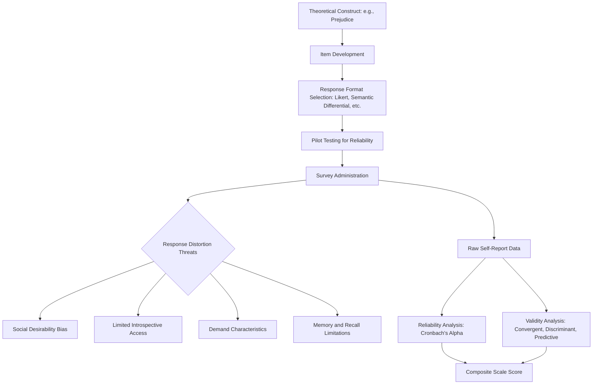

## Survey Methodology and Self-Report Measures

### Overview

Survey methodology and self-report measures constitute one of social psychology's most widely used data collection approaches, enabling researchers to directly assess participants' attitudes, beliefs, emotions, and self-perceptions at scale. Despite their ubiquity, self-report measures carry distinct methodological strengths and well-documented limitations that require careful design and interpretation.

### Core Definition and Purpose

**Definition**

Survey methodology involves systematically collecting data by directly asking participants to report on their own attitudes, beliefs, behaviors, emotions, or characteristics, typically through structured questionnaires.

**Primary Uses in Social Psychology**

- Measuring attitudes and attitude strength toward social objects, issues, or groups.
- Assessing self-concept, self-esteem, and identity-related constructs.
- Capturing subjective experiences (emotions, perceived stress, life satisfaction) that are, by their nature, difficult to observe directly through behavioral measures alone.
- Serving as the dependent variable in experimental designs (e.g., post-manipulation attitude questionnaires) or as both predictor and outcome in correlational survey research.

### Types of Self-Report Response Formats

**1. Likert Scales**

The most common self-report format, presenting a statement with an ordered set of response options indicating degree of agreement or disagreement (e.g., 1 = *strongly disagree* to 7 = *strongly agree*).

**Key Points**

- Likert-type items are typically summed or averaged across multiple related items to form a composite scale score, improving reliability relative to any single item.
- The number of scale points (commonly 5, 7, or 9-point scales) and the inclusion or exclusion of a neutral midpoint are active methodological design choices affecting data distribution and interpretability.

**2. Semantic Differential Scales**

Participants rate a concept along a continuum anchored by two bipolar adjectives (e.g., "good" to "bad," "strong" to "weak"), often used in classic attitude measurement research.

**3. Visual Analog Scales**

Participants mark a position along a continuous line (e.g., between "not at all" and "extremely") rather than selecting from discrete categories, allowing finer-grained measurement of continuous constructs.

**4. Forced-Choice and Categorical Items**

Participants select from a fixed set of discrete, mutually exclusive response categories (e.g., yes/no, multiple-choice options), often used for demographic or behavioral frequency items.

**5. Open-Ended Items**

Participants respond in their own words rather than selecting from predetermined categories, allowing richer qualitative data but requiring subsequent coding or content analysis to permit quantitative comparison.

### Survey Design Considerations

**Item Wording**

- **Clarity and simplicity**: avoiding ambiguous, complex, or double-barreled questions (items that ask about two distinct things simultaneously, e.g., "Do you support increased funding for schools and hospitals?").
- **Avoiding leading or loaded language**: item wording should not bias participants toward a particular response.
- **Reverse-scored items**: including items worded in the opposite direction of the majority of scale items (and later reverse-coding them during analysis) to detect and mitigate acquiescence bias (the tendency to agree with statements regardless of content).

**Response Order and Question Order Effects**

The order in which response options or questions are presented can influence responses, through mechanisms such as **priming** (earlier questions activating concepts that influence responses to later questions) or **context effects** (general versus specific question ordering affecting how participants interpret subsequent items).

**Sampling Methodology**

- **Probability sampling**: every member of the target population has a known, non-zero chance of selection (e.g., random sampling, stratified sampling), supporting stronger generalizability claims.
- **Non-probability sampling**: convenience sampling, snowball sampling, or online panel recruitment, common in academic social psychology but carrying greater risk of unrepresentative samples and reduced population validity.

### Reliability of Self-Report Measures

**Internal Consistency**

The degree to which items within a scale correlate with one another, typically quantified using **Cronbach's alpha** ($\alpha$), reflecting whether items are measuring a coherent, unified construct.

$$\alpha = \frac{k \cdot \bar{r}}{1 + (k-1)\bar{r}}$$

Where $k$ is the number of items and $\bar{r}$ is the average inter-item correlation. Conventionally, $\alpha \geq 0.70$ is often treated as acceptable internal consistency, though this threshold should be interpreted relative to scale length and context rather than applied rigidly.

**Test-Retest Reliability**

The consistency of scores when the same measure is administered to the same participants at two different time points, important for establishing that a scale captures a stable construct rather than transient measurement noise (particularly relevant for trait-like constructs, as opposed to state measures expected to fluctuate).

### Validity of Self-Report Measures

| Validity Type | Description |
| --- | --- |
| Face validity | Does the measure appear, on its surface, to assess the intended construct? |
| Content validity | Does the measure adequately sample the full conceptual domain of the construct? |
| Convergent validity | Does the measure correlate appropriately with other established measures of the same or related constructs? |
| Discriminant validity | Does the measure appropriately fail to correlate with measures of conceptually distinct constructs? |
| Predictive/criterion validity | Does the measure predict relevant future outcomes or behaviors? |

### Key Limitations of Self-Report Methodology

**1. Social Desirability Bias**

Participants may systematically distort responses toward socially approved or expected answers rather than their genuine attitudes or behaviors, particularly for sensitive topics (prejudice, illegal behavior, sexual attitudes).

**Key Points**

- Researchers address this limitation through several strategies: anonymous or confidential administration, indirect questioning techniques, the bogus pipeline technique (leading participants to believe a lie-detection device will reveal true attitudes, increasing honest responding), and complementing self-report with implicit or behavioral measures.

**2. Limited Introspective Access**

Participants may lack accurate conscious insight into their own psychological processes, particularly regarding automatic, non-conscious attitudes or the true causes of their own behavior—a concern directly motivating the development of implicit measurement techniques (e.g., the Implicit Association Test) as a complement to explicit self-report.

**3. Demand Characteristics**

As discussed in the context of internal validity broadly, participants completing self-report measures within an experimental context may infer the study's hypotheses and consciously or unconsciously adjust their responses accordingly.

**4. Memory and Recall Limitations**

Self-report measures asking about past behavior or experiences are subject to memory distortion, reconstruction, and systematic recall biases, particularly for infrequent or emotionally significant events.

**5. Response Style Biases**

- **Acquiescence bias**: tendency to agree with statements regardless of content.
- **Extreme response style**: tendency to favor endpoints of a scale over moderate options, or vice versa.
- **Cultural response style differences**: [Unverified] some cross-cultural research suggests systematic differences in response style tendencies (e.g., extreme responding, acquiescence) across cultural groups, which can complicate direct cross-cultural comparison of raw self-report scores, though the precise mechanisms and magnitude of these differences remain an active area of methodological research.

### Diagram: Self-Report Measurement Process and Threats

### Complementary and Corrective Approaches

**Key Points**

- **Multi-method triangulation**: combining self-report with behavioral or physiological measures strengthens overall construct validity by cross-validating findings across measurement approaches with different bias profiles.
- **Indirect and implicit measures**: reaction-time based techniques designed to bypass conscious control and social desirability concerns, though these carry their own distinct psychometric limitations (notably weaker test-retest reliability in many implicit measures relative to well-constructed explicit self-report scales).
- **Behavioral anchoring**: framing self-report items around concrete, specific behaviors rather than abstract trait judgments, which can reduce some forms of response bias and improve predictive validity.

### Illustrative Example

**Example**

A researcher studying attitudes toward a stigmatized group could ask participants to directly rate their agreement with statements like "I feel favorably toward [group]" on a 7-point Likert scale (explicit self-report), but this approach risks substantial social desirability bias, since most participants are motivated to appear unprejudiced regardless of their genuine attitudes. To address this limitation, the researcher might supplement the explicit measure with a reaction-time-based Implicit Association Test measuring automatic evaluative associations with the group (bypassing conscious self-presentation concerns), and might additionally include a behavioral measure, such as seating distance chosen from a group member in a subsequent unrelated task, to triangulate the self-report finding against a less directly controllable behavioral indicator—together providing a more robust, multi-method assessment of the underlying construct than any single self-report measure alone could offer.

### Conclusion

**Conclusion**

Survey methodology and self-report measures remain foundational tools in social psychology, offering direct access to participants' subjective attitudes, beliefs, and experiences that behavioral or physiological measures alone cannot capture. However, well-documented limitations—social desirability bias, limited introspective access, demand characteristics, and various response style biases—mean self-report data should be interpreted with appropriate methodological caution, ideally supplemented by careful survey design practices (reverse-scored items, anonymity protections, validated scales) and, where feasible, triangulated against complementary behavioral, physiological, or implicit measures to strengthen overall construct validity.

**Next Steps**

- Implicit measurement techniques and the Implicit Association Test in depth
- Social desirability bias and the bogus pipeline technique
- Scale development and psychometric validation procedures
- Cross-cultural measurement equivalence and response style differences
- Reliability and validity concepts applied across measurement types
- Combining self-report with behavioral and physiological measures in multi-method designs