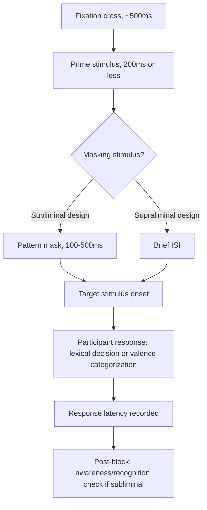

## Priming Paradigms in Research

### Overview

Priming refers to the phenomenon whereby exposure to one stimulus influences a person's response to a subsequently presented stimulus, without requiring intentional memory for the initial exposure. Priming paradigms are experimental procedures that exploit this phenomenon as a research tool to study the structure of memory, the automaticity of social cognition, and the malleability of judgment, attitudes, and behavior. Priming sits at the methodological core of social cognition research and has also been central to one of the field's largest credibility controversies (the replication crisis).

### Theoretical Foundations

**Spreading activation in associative networks**

Priming effects are typically explained via spreading-activation models of semantic memory (Collins & Loftus, 1975): concepts are represented as nodes in an associative network; activating one node partially activates connected nodes, temporarily lowering the threshold for their retrieval or use. A prime ("doctor") facilitates faster/easier processing of a related target ("nurse") than an unrelated target ("bread").

**Accessibility and construct activation**

In social psychology, priming is more often framed through the lens of **construct accessibility** (Higgins, 1996): primes temporarily or chronically increase the accessibility of a mental construct (trait concept, stereotype, goal, schema), making that construct more likely to be used in interpreting subsequent, ambiguous social information. This is distinct from purely semantic/lexical priming and underlies the classic "Donald" paragraph studies (Higgins, Rholes, & Jones, 1977; Srull & Wyer, 1979), where incidental exposure to trait words (e.g., "reckless" vs. "adventurous") shaped later impression judgments of an ambiguous target.

### Taxonomy of Priming Paradigms

**1. Semantic/associative priming**

- **Procedure**: prime word briefly presented, followed by target word; participant makes a lexical decision (word/nonword) or naming response
- **Measure**: response latency; faster RT to semantically related pairs indexes associative strength
- **Use**: basic memory structure research, psycholinguistics, stereotype activation studies

**2. Sequential (affective) priming**

- **Procedure**: prime (word, face, image) presented briefly (often 200 ms or less, sometimes subliminally via backward masking) before target; participant categorizes the target's valence (good/bad)
- **Measure**: facilitation (faster RT) for evaluatively congruent prime-target pairs vs. inhibition for incongruent pairs
- **Use**: automatic attitude measurement (Fazio et al., 1986 bona fide pipeline paradigm); implicit racial/social attitude research

**3. Trait/construct (impression formation) priming**

- **Procedure**: participants incidentally exposed to trait-related words (often disguised as an unrelated "scrambled sentence" or vigilance task) then asked to form an impression of an ambiguous target person/behavior described in a separate, ostensibly unrelated task
- **Measure**: content of subsequent trait ratings/impressions shifts toward the primed construct
- **Use**: classic construct accessibility studies; assimilation vs. contrast effects depending on prime-target relationship

**4. Behavioral priming**

- **Procedure**: exposure to a prime (words, images, or a scrambled-sentence task containing category-related words, e.g., elderly stereotype words) is followed by measurement of overt behavior (e.g., walking speed, performance on a task, aggressive responding)
- **Measure**: behavioral outcome differs by prime condition, interpreted as ideomotor/automatic behavioral activation of the associated stereotype or concept
- **Landmark/contested example**: Bargh, Chen, & Burrows (1996) "elderly walking" study — this specific finding has notably **failed to replicate** in several large, pre-registered attempts (Doyen et al., 2012; Pashler et al., 2011) and is now widely cited as a cautionary case in the replication crisis literature rather than a settled effect.

**5. Goal priming**

- **Procedure**: incidental activation of a goal representation (e.g., achievement, cooperation) via word tasks or scenario descriptions
- **Measure**: subsequent goal-directed behavior/persistence differs by prime condition
- **Distinguishing feature**: goal primes are theorized to show a post-goal-completion decay pattern distinct from simple construct priming, which does not require "completion"

**6. Subliminal/unconscious priming**

- **Procedure**: prime presented below the threshold of conscious perceptual awareness, typically via very brief exposure duration combined with pattern masking (a masking stimulus immediately follows the prime)
- **Verification requirement**: researchers must independently verify non-awareness, typically via post-experiment forced-choice recognition tests at chance-level performance, or online awareness checks
- **Use**: dissociating automatic/unconscious processes from strategic/conscious ones

**7. Evaluative conditioning / mere exposure adjacent paradigms**

- Related but conceptually distinct: repeated pairing of a neutral stimulus with a valenced stimulus shifts evaluation of the neutral stimulus, without necessarily relying on response-latency logic

### Procedural Diagram: Sequential Priming Trial Structure

### Key Methodological Parameters

| Parameter | Typical Range | Why It Matters |
| --- | --- | --- |
| Stimulus Onset Asynchrony (SOA) | 100–300 ms for automatic priming; 1000+ ms allows strategic/controlled processing to intrude | Short SOA isolates automatic component; long SOA confounds automatic and controlled processes |
| Prime exposure duration | 15–200 ms | Below ~50 ms combined with masking is typically used for subliminal claims |
| Masking | Pattern mask (visual noise) or metacontrast mask | Prevents conscious identification of prime in subliminal designs |
| ISI (inter-stimulus interval) | Task-dependent | Affects whether facilitation vs. inhibition (negative priming) is observed |
| Dependent variable | Response latency, error rate, or downstream judgment/behavior | Latency-based DVs require outlier trimming and often log-transformation |

### Data Analysis Considerations

- **RT trimming**: standard practice removes implausibly fast (<200–300 ms, anticipatory) and slow (>2000–3000 ms, attention lapse) responses; cutoffs vary by paradigm and should be justified/pre-registered
- **Transformation**: raw RTs are typically positively skewed; log-transformation or use of the D-score-style standardized difference approach (see IAT scoring) is common
- **Error trial handling**: error trials are commonly excluded from RT analysis but analyzed separately for accuracy effects; some paradigms use combined RT+accuracy scoring to avoid speed-accuracy tradeoff artifacts
- **Priming effect calculation**: typically a difference score — $RT_{incongruent} - RT_{congruent}$ — analyzed via repeated-measures ANOVA or, increasingly, linear mixed-effects models with participants and items as crossed random effects (Baayen, Davidson, & Bates, 2008 approach), which better accounts for item-level variance than pure by-participant aggregation

### The Replication Crisis and Priming Research

Priming research, particularly social/behavioral priming, became a central focus of psychology's broader replication crisis beginning around 2011–2015:

- **Direct replication failures**: several influential behavioral priming findings (elderly-walking effect; some money-priming and cleanliness-priming effects) failed to replicate in large, well-powered, often pre-registered replication attempts.
- **Contributing methodological factors identified in the broader literature**: small original sample sizes, flexible analytic choices ("researcher degrees of freedom" / $p$-hacking), publication bias favoring significant results, and in some cases outright fraud in unrelated but adjacent priming-related work (the Stapel case, which involved fabricated data but damaged confidence in the surrounding paradigm broadly).
- **Field response**: increased emphasis on pre-registration, larger sample sizes, multi-lab replication projects (e.g., Registered Replication Reports), and more cautious interpretation of single-study behavioral priming effects.
- [Inference] Current methodological consensus treats basic **cognitive/semantic priming effects** (short SOA, lexical-decision-based) as comparatively robust and well-replicated, while **complex behavioral and social priming effects** (especially those involving multi-step causal chains from incidental word exposure to overt behavior change) are treated with substantially more skepticism and require stronger evidentiary standards before being accepted as reliable phenomena.

### Priming vs. Adjacent Constructs — Disambiguation

| Construct | Distinguishing Feature |
| --- | --- |
| **Priming** | Prior stimulus exposure changes processing of a later stimulus; typically short-lived, doesn't require awareness |
| **Anchoring** | A numeric or judgmental starting point biases a subsequent quantitative estimate; a judgment-and-decision-making phenomenon, mechanistically related but studied in a distinct literature |
| **Framing effects** | Presentation format of logically equivalent information changes choice/judgment; not dependent on incidental prior stimulus exposure |
| **Mere exposure effect** | Repeated exposure to a stimulus increases liking for that same stimulus; no separate prime-target structure |
| **Classical conditioning** | Requires repeated, contingent pairing over trials; priming effects can occur from single incidental exposure |

### Example

**Example (Trait priming paradigm design)**

*Research question*: Does incidental exposure to hostility-related words increase the likelihood that participants interpret an ambiguous social behavior as aggressive?

*Design*:

1. Participants complete a "scrambled sentence task" (cover story: language processing study) embedding either hostility-related words (e.g., "hostile," "attack," "rude") or neutral words (e.g., "flower," "calendar," "walk") in half the trials
2. Participants then read an ambiguous vignette (e.g., a person refusing to let a salesperson into their home) in an ostensibly unrelated "reading comprehension" study
3. Participants rate the target's behavior on trait scales including hostility
4. **Predicted result**: participants in the hostility-prime condition rate the ambiguous target as more hostile than participants in the neutral-prime condition
5. **Confound control**: cover story separation between tasks, counterbalanced word lists, funnel debriefing to check for suspicion/awareness of connection between tasks

### Practical Design Safeguards

- **Funnel debriefing**: post-experiment questioning that moves from general to specific, used to detect and exclude participants who consciously identified the prime-target connection (demand characteristics threat)
- **Cover stories**: presenting prime and target tasks as unrelated studies reduces strategic/compensatory responding
- **Counterbalancing prime valence/category** across conditions rather than using only a single prime-absent control
- **Pre-registration of SOA, trimming rules, and primary DV** to reduce researcher degrees of freedom, now considered standard best practice for publishable priming work

### Related Topics

- Construct accessibility and chronic vs. temporary accessibility (Higgins' framework)
- Dual-process models of social cognition
- The replication crisis: causes, detection methods, and reforms in psychology
- Implicit measures and the Implicit Association Test
- Schema theory and social categorization
- Automaticity criteria (Bargh's "four horsemen": awareness, intentionality, efficiency, controllability)
- Pre-registration and Registered Reports as methodological reform tools
- Mixed-effects modeling for reaction-time data