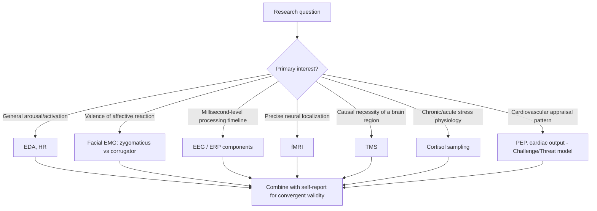

## Physiological and Neuroscience Measures

### Overview

Physiological and neuroscience measures assess bodily and neural responses (autonomic activity, endocrine markers, muscular activity, and brain structure/function) as indicators of underlying psychological states — emotion, stress, motivation, attitudes, and social cognition — that may not be fully captured by self-report or even behavioral/reaction-time measures. These methods form the basis of **social neuroscience** and **psychophysiology**, subfields that examine how social processes are instantiated in biological systems, and conversely, how biological states shape social behavior and judgment.

### Rationale for Physiological Measurement in Social Psychology

- **Independence from self-presentation**: many physiological responses are difficult to consciously control, reducing (though not eliminating) social desirability bias relative to self-report
- **Temporal resolution**: some measures (EEG, facial EMG) can track rapid, moment-to-moment processing that unfolds within milliseconds, capturing processes faster than deliberate report
- **Convergent validation**: used alongside self-report and behavioral measures to triangulate underlying constructs and establish that an effect is not purely an artifact of demand characteristics
- **Mechanism specification**: neuroscience measures allow researchers to test which underlying neural/physiological systems are implicated in a social process (e.g., threat appraisal vs. reward processing), refining theory beyond behavioral prediction alone

### Autonomic Nervous System (ANS) Measures

**Electrodermal activity (EDA) / Galvanic Skin Response (GSR)**

- **Mechanism**: sympathetic nervous system activation increases eccrine sweat gland activity, changing the skin's electrical conductance
- **Measure**: skin conductance level (SCL, tonic/baseline arousal) and skin conductance responses (SCRs, phasic responses to discrete stimuli)
- **Use in social psychology**: arousal indexing during intergroup contact, threat/anxiety responses, deception research, emotional reactivity to social stimuli
- **Limitation**: indexes general arousal/activation, not valence — cannot by itself distinguish fear from excitement

**Cardiovascular measures**

- **Heart rate (HR)**: general arousal index; deceleration often associated with attentional orienting, acceleration with defensive/active responding
- **Heart rate variability (HRV)**: variability in inter-beat intervals, often used as an index of parasympathetic (vagal) regulation; linked in the literature to emotion regulation capacity and social engagement (per Porges' polyvagal theory) [Inference — polyvagal theory's specific mechanistic claims remain debated within physiology and psychology]
- **Blood pressure / pre-ejection period (PEP)**: used in the **Biopsychosocial Model of Challenge and Threat** (Blascovich & Tomaka) to distinguish cardiovascular patterns associated with "challenge" appraisals (resource-adequate, characterized by increased cardiac efficiency) versus "threat" appraisals (resource-inadequate, characterized by vascular resistance) during motivated performance situations

**Cortisol**

- **Mechanism**: glucocorticoid hormone released via the hypothalamic-pituitary-adrenal (HPA) axis in response to stress
- **Measurement**: salivary assay most common in social psychology field/lab studies (non-invasive); blood or hair cortisol used for acute vs. chronic stress indexing respectively
- **Use**: social evaluative stress paradigms (e.g., Trier Social Stress Test), social status/rejection research, intergroup threat studies
- **Methodological note**: cortisol has a delayed response curve (peaking roughly 20–30 minutes post-stressor) requiring careful timing of sampling relative to the social manipulation [Unverified — exact peak timing varies by individual and stressor type]

### Facial Electromyography (fEMG)

- **Mechanism**: surface electrodes detect electrical activity from facial muscle contractions too subtle for visual detection
- **Key muscle sites**:
  - *Zygomaticus major* (cheek, pulls lip corners up) — associated with positive affect
  - *Corrugator supercilii* (brow, pulls eyebrows together/down) — associated with negative affect and cognitive effort
- **Use**: covert measurement of affective/evaluative reactions to social stimuli (attitude objects, in-group/out-group faces), including reactions faster or more subtle than participants would self-report or than could be reliably coded from visible facial expression alone

### Central Nervous System Measures

**Electroencephalography (EEG) and Event-Related Potentials (ERPs)**

- **Mechanism**: scalp electrodes record electrical activity generated by populations of cortical neurons; ERPs are stimulus-locked, averaged EEG waveforms reflecting processing stages following a specific event
- **High temporal resolution** (millisecond-level); **low spatial resolution** relative to fMRI
- **Key ERP components used in social cognition research**:

| Component | Typical Latency | Interpretation |
| --- | --- | --- |
| N170 | ~130–200 ms post-stimulus | Face-specific perceptual processing; sensitive to face inversion, race-of-face effects |
| P2/N2 | ~200–350 ms | Early categorization, conflict monitoring |
| N400 | ~400 ms | Semantic incongruity/violation of expectation (including social-category expectancy violations) |
| P3/P300 | ~300–600 ms | Attentional allocation, stimulus salience/categorization (used in some stereotype-activation and deception research) |
| Late Positive Potential (LPP) | 400 ms onward, sustained | Sustained motivated attention to emotionally/socially significant stimuli |
| Error-Related Negativity (ERN) | ~50–100 ms post-error | Conflict/error monitoring; studied in social evaluation and self-regulation contexts |

**Functional Magnetic Resonance Imaging (fMRI)**

- **Mechanism**: measures blood-oxygen-level-dependent (BOLD) signal as a proxy for regional neural activity via localized changes in blood flow/oxygenation
- **High spatial resolution** (millimeter-level); **low temporal resolution** relative to EEG (signal lags neural activity by several seconds due to the hemodynamic response)
- **Key regions of interest in social neuroscience**:

| Region | Commonly Associated Social Function |
| --- | --- |
| Amygdala | Threat/emotional salience detection, including rapid response to out-group faces in some studies |
| Medial prefrontal cortex (mPFC) | Self-referential processing, mentalizing/theory of mind, person perception |
| Anterior cingulate cortex (ACC) | Conflict monitoring, social pain/rejection response (Eisenberger's social pain overlap theory), cognitive control |
| Fusiform face area (FFA) | Face-specific visual processing |
| Temporoparietal junction (TPJ) | Theory of mind, perspective-taking, mentalizing about others' mental states |
| Ventral striatum / nucleus accumbens | Reward processing, including social reward (e.g., positive social feedback) |
| Insula | Interoception, disgust, empathy-related simulation |

- **Analytic approaches**: whole-brain univariate contrasts (condition A > condition B), region-of-interest (ROI) analysis, multivariate pattern analysis (MVPA)/decoding, functional connectivity analysis (how regions co-activate as networks rather than in isolation)

**Other neuroscience-adjacent methods**

- **Transcranial Magnetic Stimulation (TMS)**: temporarily disrupts or modulates activity in a targeted cortical region, allowing causal (not merely correlational) inference about a region's necessity for a given social process
- **Eye-tracking**: not strictly "physiological" in the ANS/CNS sense but frequently grouped with implicit/process measures; records fixation duration, gaze patterns, and pupil dilation (an ANS-linked arousal index) during social stimulus processing

### Diagram: Measure Selection by Research Question

### Methodological Considerations

**Reverse inference problem**

A central interpretive caveat, especially in fMRI research: observing activation in a region (e.g., amygdala) during a social task does **not** license the automatic conclusion that the underlying process is what that region is "typically" associated with (e.g., "fear"), because most brain regions are functionally heterogeneous and involved in multiple, cognitively distinct processes (Poldrack, 2006). Strong claims require converging evidence (e.g., lesion studies, TMS, multivariate decoding) rather than single-study univariate activation alone.

**Individual differences and baseline correction**

Physiological measures show substantial between-person baseline variability unrelated to the psychological construct of interest. Standard practice requires:

- Collecting a resting/baseline period before experimental manipulation
- Computing change scores or reactivity indices (post-manipulation minus baseline) rather than raw post-manipulation values
- Controlling for factors known to influence baseline physiology (caffeine, medication, time of day for cortisol, menstrual cycle phase where relevant to the specific measure)

**Artifact and signal-to-noise issues**

- EEG/ERP data require artifact rejection for eye blinks, muscle movement, and electrical interference; typically involves independent component analysis (ICA) or manual/automated trial rejection
- fMRI data require correction for head motion, physiological noise (cardiac/respiratory cycles), and multiple-comparisons correction across thousands of voxels (a major source of the "voodoo correlations" controversy — Vul et al., 2009 — regarding inflated fMRI-behavior correlations from non-independent ROI selection)

**Cost, sample size, and statistical power**

[Inference] fMRI and TMS studies are typically far more expensive and logistically constrained than behavioral or survey studies, historically leading to smaller sample sizes; this has been raised as a methodological concern for statistical power and replicability in social neuroscience specifically, paralleling broader replication-crisis concerns.

### Example

**Example (Combined measure design)**

*Research question*: Does experiencing social exclusion activate neural regions associated with physical pain?

*Design (modeled on Eisenberger, Lieberman, & Williams, 2003, Cyberball paradigm)*:

1. Participants play a virtual ball-tossing game ("Cyberball") believing they are playing with two other real participants
2. Condition manipulation: inclusion (ball thrown to participant regularly) vs. exclusion (ball thrown to participant briefly, then excluded for remainder of game)
3. fMRI acquired during gameplay; primary ROI analysis on dorsal ACC and anterior insula
4. Post-scan self-report measures of social distress collected for convergent validation
5. **Predicted result**: exclusion condition associated with greater dACC/insula activation, correlated with self-reported distress — interpreted as support for overlap between social and physical pain systems [Inference — the strength and specificity of this "overlap" interpretation has been debated in subsequent literature, e.g., Woo et al., 2014, using multivariate pain-signature approaches]

### Related Topics

- Social neuroscience as an interdisciplinary field
- The Biopsychosocial Model of Challenge and Threat
- Reverse inference and interpretive limits in fMRI research
- Implicit measures and the Implicit Association Test
- Priming paradigms in research
- Trier Social Stress Test and experimental stress induction methods
- Polyvagal theory and vagal tone in social engagement
- Multivariate pattern analysis (MVPA) and neural decoding methods