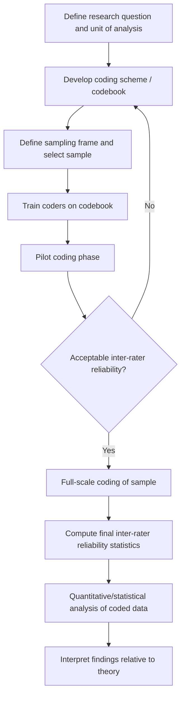

## Archival Research and Content Analysis

### Overview

Archival research and content analysis are methodologies that draw psychological data from pre-existing records — text, images, statistics, audio/video, or other artifacts — produced independently of the researcher's intervention, rather than from data generated through direct experimental manipulation or solicited self-report. These approaches are valued in social psychology for their high **ecological validity** and immunity to certain reactivity effects (e.g., demand characteristics, social desirability in the moment of measurement), while raising distinct challenges around sampling, coding reliability, and causal inference.

### Archival Research: Core Definition and Logic

Archival research uses records that were created for purposes other than the current research question — government statistics, historical documents, organizational records, news archives, social media posts, court records, sports statistics, obituaries, and similar sources — as the raw data for testing psychological hypotheses.

**Defining features**:

- **Non-reactive/unobtrusive**: because records were generated independent of and often prior to the research question, they are not subject to the participant altering behavior because they know they are being studied (a classic threat in lab and even field experimental designs)
- **Naturally occurring**: data reflect behavior/expression in real-world contexts rather than a constructed experimental setting, supporting external/ecological validity
- **Retrospective and often large-N**: archives frequently permit large sample sizes and, where longitudinal records exist, analysis across extended time periods or historical eras not otherwise accessible to a live researcher

**Common archival data sources in social psychology**:

| Source Type | Example Use |
| --- | --- |
| Government/census/crime statistics | Testing aggression theories against regional violent crime rates |
| Historical newspapers/media archives | Tracking shifts in stereotype content or intergroup rhetoric over decades |
| Organizational records | Examining hiring/promotion patterns for evidence of bias |
| Social media posts | Large-scale linguistic analysis of emotion, polarization, or self-presentation |
| Personal documents (diaries, letters) | Idiographic/historiometric personality and motive research |
| Legal/court records | Studying juror decision patterns, sentencing disparities |
| Sports/performance statistics | Testing choking-under-pressure or stereotype threat effects in real competitive settings |

### Content Analysis: Core Definition and Logic

Content analysis is a systematic, typically quantitative method for coding and categorizing the content of communications (text, images, speech, video) into meaningful categories in order to draw inferences about the source, the audience, or the broader social/cultural context. Content analysis is the primary **analytic technique** most often applied to archival text/media data, though it can also be applied to data generated within an experiment (e.g., coding open-ended experimental responses).

**Core procedural steps**:

1. **Define the unit of analysis**: the discrete element being coded — a word, sentence, paragraph, image, speech act, social media post, etc.
2. **Develop a coding scheme/codebook**: explicit, operationalized categories with clear inclusion/exclusion criteria and (ideally) example instances for each category
3. **Sample the material**: define the population of content (e.g., all front-page articles from Newspaper X, 1960–1980) and a sampling strategy (census, random sample, stratified sample) given practical constraints on coding all available material
4. **Train coders**: coders (human raters, or in computational approaches, algorithms) are trained on the codebook, typically via a practice/calibration phase
5. **Code the material**: apply the scheme systematically across the sample, usually with multiple independent coders for at least a subset of material
6. **Assess inter-rater reliability**: quantify agreement between independent coders
7. **Analyze coded data**: apply standard quantitative (frequency counts, correlational, regression) or qualitative analysis to the resulting coded dataset

### Diagram: Content Analysis Workflow

### Inter-Rater Reliability: Statistical Approaches

Because content analysis frequently relies on human judgment to assign codes, quantifying coder agreement is a required methodological step before substantive analysis proceeds.

**Percent agreement**

$$P_o = \frac{\text{number of agreements}}{\text{total number of judgments}}$$

Simple but does not correct for chance agreement, and is now generally considered insufficient as a sole reliability index in published work.

**Cohen's Kappa** (two coders, categorical/nominal data)

$$\kappa = \frac{P_o - P_e}{1 - P_e}$$

Where $P_o$ is observed agreement and $P_e$ is the agreement expected by chance given the marginal distribution of each coder's ratings. Conventional (though contested) benchmarks: $\kappa < 0.40$ poor, $0.40$–$0.60$ moderate, $0.60$–$0.80$ substantial, $> 0.80$ near-perfect [Unverified — benchmark cutoffs vary by source and are treated as rough heuristics, not fixed standards].

**Krippendorff's Alpha**

More general reliability coefficient that accommodates more than two coders, multiple levels of measurement (nominal, ordinal, interval, ratio), and missing data, making it increasingly preferred in contemporary content analysis over Cohen's Kappa for complex coding designs.

**Intraclass Correlation Coefficient (ICC)**

Used when the coded variable is continuous/interval rather than categorical (e.g., coders rating intensity of emotional expression on a 1–7 scale).

### Computational and Automated Content Analysis

Modern content analysis increasingly supplements or replaces manual human coding with computational text analysis, particularly for large-scale archival corpora (e.g., millions of social media posts):

- **Dictionary-based approaches**: pre-validated word lists mapped to psychological constructs; **LIWC (Linguistic Inquiry and Word Count)**, developed by Pennebaker and colleagues, is the most widely used tool in social psychology, providing word counts across categories including affect, cognitive processes, social words, and linguistic style markers
- **Machine learning/supervised classification**: human-coded training data used to train a classifier (e.g., support vector machine, or more recently transformer-based language models) to automatically extend coding to a much larger corpus
- **Topic modeling** (e.g., Latent Dirichlet Allocation): unsupervised technique to identify latent thematic structures across a large text corpus without a pre-specified codebook
- **Sentiment analysis**: automated classification of text valence/emotion, ranging from simple dictionary-based scoring to trained neural network classifiers
- [Inference] Computational approaches trade some of the nuanced contextual judgment of trained human coders for substantially greater scale and reproducibility; validation against human-coded subsamples remains standard practice to establish that automated coding tracks the intended construct.

### Historiometry and Psychobiography

A specialized archival tradition, most associated with Dean Keith Simonton, applying quantitative content-analytic and statistical methods to historical/biographical records (biographies, speeches, correspondence) to study personality, leadership, creativity, and eminence at a population level (e.g., analyzing the correlates of transformational vs. transactional leadership rhetoric across historical political speeches).

### Strengths

- **High ecological validity**: behavior/expression captured in genuine real-world contexts
- **Non-reactivity**: reduces demand characteristics and social desirability distortion present in live data collection
- **Access to otherwise inaccessible populations/eras**: enables study of historical periods, deceased individuals, or hard-to-recruit populations (e.g., political elites) unavailable to standard experimental or survey methods
- **Often large sample sizes**, improving statistical power for detecting real-world effect sizes
- **Longitudinal/trend analysis**: permits examination of psychological or cultural change over extended time spans

### Limitations and Threats to Validity

- **No random assignment/manipulation**: archival designs are inherently correlational; causal claims require caution and are vulnerable to confounding, reverse causation, and third-variable explanations
- **Selection and survivorship bias**: not all events/records are archived, and what is preserved or accessible may be systematically non-representative (e.g., only "notable" historical figures have detailed biographical records)
- **Coder-imposed meaning**: content analysis coding schemes, even when reliable (i.e., coders agree with each other), may not be valid (i.e., may not actually capture the intended psychological construct) — reliability is a necessary but not sufficient condition for validity
- **Missing operational control**: researchers cannot control the conditions under which the original record was produced, limiting ability to isolate specific causal variables the way an experiment can
- **Changing measurement context over time**: for historical/longitudinal archival data, the meaning, connotation, or social context of language and behavior can shift across the time period studied, threatening comparability of codes applied uniformly across eras
- **Access and ethical constraints**: some archival sources (e.g., private social media data, certain organizational or legal records) raise informed consent and privacy considerations distinct from prospective data collection, particularly relevant to contemporary institutional review board (IRB) evaluation of secondary data use

### Example

**Example (Archival + content analysis combined design)**

*Research question*: Has the emotional tone of U.S. presidential inaugural addresses shifted over the past century in ways associated with rising political polarization?

*Design*:

1. **Sampling frame**: all U.S. presidential inaugural addresses from 1925–2025 (census sample, not a subsample, given the manageable population size)
2. **Unit of analysis**: full speech text, further broken into sentence-level units for granular coding
3. **Coding approach**: computational content analysis using a validated dictionary tool (e.g., LIWC) to extract affect-category word usage (positive emotion, negative emotion, anger-related words) per speech
4. **Reliability step**: validate a random subsample of automated codes against two trained human coders using Krippendorff's alpha
5. **Analysis**: time-series regression of affective language category scores on year, controlling for speech length and political party of the speaker
6. **Interpretation caveat**: any observed trend is correlational; historical confounds (major events, media environment changes, speechwriting norms) must be considered as alternative explanations rather than attributing change solely to a single psychological construct like "polarization"

### Related Topics

- Naturalistic observation and field research methods
- Meta-analytic methods in psychology (aggregating archival/content-analytic findings across studies)
- Cross-cultural and historical methods in social psychology
- Computational social science and natural language processing applications
- Inter-rater reliability statistics (Kappa, Krippendorff's alpha, ICC)
- Ethics of secondary data use and informed consent in archival/social media research
- Correlational vs. experimental causal inference