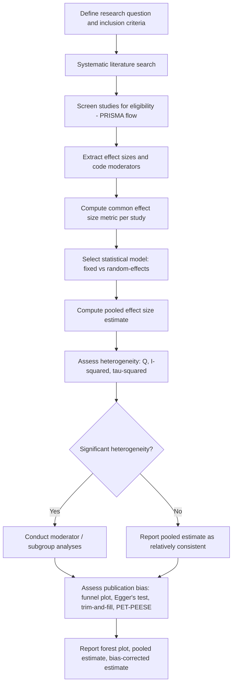

## Meta-Analytic Methods

### Overview

Meta-analysis is a set of quantitative statistical techniques for systematically combining and synthesizing effect size estimates from multiple independent studies addressing a common research question, in order to estimate an overall effect, assess consistency across studies, and identify moderators of effect size variation. In social psychology, meta-analysis has become the primary tool for resolving inconsistent findings across the literature, estimating "true" population effect sizes, and — since the replication crisis — for critically re-evaluating the evidentiary base of established phenomena.

### Rationale

A single study, however well-designed, provides only one noisy estimate of a population effect, subject to sampling error, the particular sample studied, and idiosyncratic methodological choices. Meta-analysis addresses this by:

- **Increasing statistical power** by aggregating sample sizes across studies, enabling more precise estimation of small effects that individual underpowered studies cannot reliably detect
- **Quantifying heterogeneity**: assessing whether effects are consistent across studies/contexts or vary meaningfully, and if so, why
- **Reducing the influence of any single study's idiosyncrasies** (sampling error, researcher degrees of freedom, sample-specific confounds) on overall scientific conclusions
- **Detecting and correcting for publication bias**, which can inflate the apparent effect size and prevalence of an effect in the unaggregated literature

### Core Procedural Steps

**1. Formulate the research question and inclusion criteria**

A well-specified meta-analysis pre-defines (ideally via a registered protocol, e.g., PROSPERO for some fields, or a pre-registration) the population, intervention/predictor, comparison, and outcome (PICO-style framework, adapted for psychology) as well as explicit inclusion/exclusion criteria (e.g., published/unpublished status, language, date range, minimum sample size, study design requirements).

**2. Conduct a systematic literature search**

- Multiple databases searched (PsycINFO, Web of Science, Google Scholar, etc.)
- Forward and backward citation searching (checking who cited eligible studies and what eligible studies cited)
- Direct outreach to researchers in the field for unpublished/file-drawer data
- Documentation of search process typically reported via a **PRISMA flow diagram** (Preferred Reporting Items for Systematic Reviews and Meta-Analyses)

**3. Extract effect sizes and code study characteristics**

Each eligible study's result is converted to a common effect size metric, and relevant moderator variables (sample characteristics, methodological features, publication year, etc.) are coded — often by two independent coders, with inter-rater reliability reported (see content analysis coding logic).

**4. Select and compute an effect size metric**

**5. Choose a statistical model (fixed-effect vs. random-effects)**

**6. Assess heterogeneity**

**7. Assess and correct for publication bias**

**8. Conduct moderator analyses**

**9. Interpret and report results**, typically accompanied by a forest plot and funnel plot

### Diagram: Meta-Analytic Workflow

### Common Effect Size Metrics

| Metric | Use Case | Formula/Note |
| --- | --- | --- |
| Cohen's $d$ | Standardized mean difference between two groups | $d = \dfrac{M_1 - M_2}{SD_{pooled}}$ |
| Hedges' $g$ | Bias-corrected version of $d$ for small sample sizes | Applies a correction factor $J$ to $d$ |
| Pearson's $r$ | Correlation between two continuous variables | Often Fisher $z$-transformed before pooling to normalize sampling distribution |
| Odds ratio (OR) | Association between two binary variables | Common in clinical/behavioral outcome meta-analyses |
| Risk ratio / relative risk | Probability comparison across groups | Common in applied/health-behavior social psychology |

### Statistical Models

**Fixed-effect model**

Assumes all included studies estimate one single true population effect size, with observed variability across studies attributable entirely to sampling error. Weights studies primarily by sample size/precision (inverse variance weighting).

$$\hat{\theta}_{FE} = \frac{\sum w_i \theta_i}{\sum w_i}, \quad w_i = \frac{1}{SE_i^2}$$

**Random-effects model**

Assumes the true effect size varies across studies (due to genuine differences in populations, methods, or context), and that included studies are a sample from a distribution of true effects rather than estimates of one fixed value. Incorporates an additional between-study variance component, $\tau^2$, into study weights.

$$w_i^* = \frac{1}{SE_i^2 + \tau^2}$$

- Random-effects models are now the standard default in psychology, since the fixed-effect assumption (one universal true effect across all study populations/contexts) is rarely defensible for social/behavioral phenomena
- Random-effects models typically produce wider confidence intervals around the pooled estimate than fixed-effect models, appropriately reflecting genuine between-study variability

### Heterogeneity Statistics

**Cochran's Q**: chi-square-distributed test of whether observed between-study variability exceeds what would be expected from sampling error alone; sensitive to the number of included studies (low power with few studies, over-powered/overly significant with many studies)

**$I^2$ statistic**: proportion of total variability across studies attributable to genuine heterogeneity rather than sampling error, expressed as a percentage

$$I^2 = \frac{Q - df}{Q} \times 100\%$$

Conventional (rough) interpretive benchmarks: 25% low, 50% moderate, 75% high heterogeneity [Unverified — treated as informal heuristics, not fixed thresholds, per Higgins et al.'s original guidance].

**$\tau^2$**: estimated variance of true effect sizes across studies (on the original effect size scale), used directly in random-effects weighting

### Publication Bias: Detection and Correction

Publication bias — the tendency for statistically significant, "positive" findings to be more likely published than null/negative findings — is a major concern for meta-analytic validity, since a biased pool of "eligible" published studies will produce an inflated pooled effect estimate.

**Detection methods**:

- **Funnel plot**: scatter plot of each study's effect size (x-axis) against a precision measure (e.g., standard error, y-axis, typically inverted); in the absence of bias, plots should be roughly symmetric, since imprecise/small-sample studies should scatter widely and symmetrically around the true effect, while precise/large-sample studies cluster narrowly near the true effect. Asymmetry (e.g., a gap in the region of small, non-significant effects) is suggestive of missing/suppressed studies.
- **Egger's regression test**: formal statistical test for funnel plot asymmetry (regressing standardized effect size on precision)

**Correction/adjustment methods**:

- **Trim-and-fill**: imputes hypothetical "missing" studies to restore funnel plot symmetry and recalculates the pooled estimate under that imputation
- **PET-PEESE** (Precision-Effect Test and Precision-Effect Estimate with Standard Error): regression-based approach that extrapolates the estimated effect size to the hypothetical limit of infinite precision (zero standard error), often producing more conservative (smaller) bias-corrected effect estimates than the uncorrected pooled result
- **p-curve analysis** (Simonsohn, Nelson, & Simmons, 2014): examines the distribution of statistically significant $p$-values across studies to assess whether a literature contains evidential value or is primarily attributable to selective reporting/p-hacking
- [Inference] No single bias-correction method is universally regarded as definitive; contemporary best practice in psychology increasingly recommends reporting multiple bias-detection/correction approaches together, given that each method rests on different assumptions and can produce divergent corrected estimates.

### Moderator Analysis

Meta-regression or subgroup analysis examines whether coded study characteristics (e.g., sample type — student vs. community; methodological rigor; publication year; cultural context; measure used) statistically predict variation in effect size across studies. This transforms meta-analysis from a purely descriptive aggregation tool into an explanatory tool for understanding **when and for whom** an effect holds, not merely **whether** it holds on average.

### Meta-Analysis and the Replication Crisis

Meta-analytic re-examination of classic social psychology literatures has played a central role in the post-2011 credibility reassessment of the field:

- Oswald et al.'s (2013) meta-analytic reanalysis of IAT predictive validity (see Implicit Measures topic) substantially revised the field's confidence in individual-level predictive claims
- Meta-analyses applying bias-correction techniques (PET-PEESE, p-curve) to previously "well-established" social priming and ego-depletion literatures have in several cases suggested that pooled naive effect estimates were substantially inflated by publication bias, with bias-corrected estimates approaching zero for some specific effects [Inference — findings vary considerably by specific literature and correction method applied; this remains an area of active methodological debate rather than settled consensus]
- This has led to increased emphasis on distinguishing **meta-analysis of a biased/non-pre-registered literature** (vulnerable to inheriting all the biases of its constituent studies) from **meta-analysis of pre-registered, multi-lab Registered Replication Report data** (considered a substantially stronger evidentiary standard, since these designs pre-specify methods and are not subject to publication-based selective reporting)

### Reporting Standards

Meta-analyses in psychology are expected to follow the **PRISMA** reporting guidelines (or **MARS** — Meta-Analysis Reporting Standards, from APA), which specify required elements including the search strategy, inclusion/exclusion flow, effect size computation methods, statistical model justification, heterogeneity assessment, and publication bias assessment — intended to make the synthesis process transparent and reproducible.

### Example

**Example (Meta-analytic design)**

*Research question*: What is the overall relationship between exposure to violent video games and aggressive behavior, and does this relationship vary by study design?

*Design*:

1. Systematic search across PsycINFO, Web of Science, and dissertation databases for studies (1990–2025) measuring violent video game exposure and an aggression outcome
2. Effect sizes standardized to Pearson's $r$ (correlational designs) or converted from Cohen's $d$ (experimental designs) using standard conversion formulas
3. Random-effects model selected given strong theoretical expectation of true heterogeneity (varying aggression measures, age groups, exposure durations)
4. Heterogeneity assessed via $I^2$; given expected high heterogeneity, moderator analysis conducted for study design (experimental vs. correlational vs. longitudinal), aggression measure type (behavioral vs. self-report), and participant age
5. Funnel plot and Egger's test conducted; trim-and-fill and PET-PEESE applied as sensitivity analyses given known publication bias concerns in this specific literature
6. **Interpretation**: pooled naive estimate reported alongside bias-corrected estimate, with explicit discussion of how much the corrected estimate diverges from the naive estimate as an index of literature-wide selective reporting risk

### Related Topics

- The replication crisis and its methodological reforms
- Publication bias and the file-drawer problem
- Pre-registration and Registered Reports
- Effect size and statistical power in psychological research
- Implicit measures and the Implicit Association Test
- Priming paradigms in research
- Systematic review methodology (PRISMA standards)
- p-hacking and researcher degrees of freedom