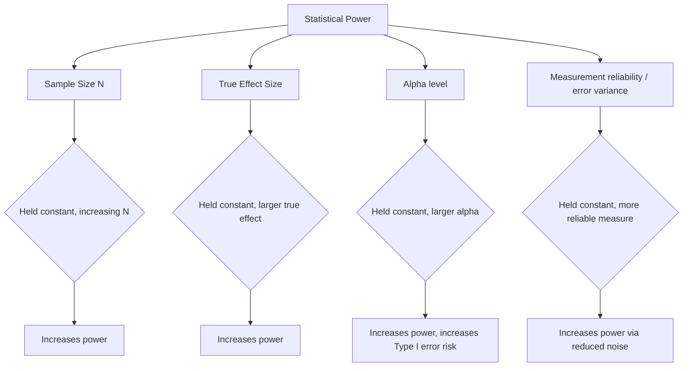

## Effect Size, Statistical Power, and Significance Testing

### Overview

Effect size, statistical power, and significance testing form the interlocking statistical framework used to evaluate whether an observed empirical result reflects a genuine, reproducible phenomenon and how large or practically meaningful that phenomenon is. These concepts are foundational to the design, interpretation, and post-hoc evaluation of virtually all quantitative social psychology research, and became a central focus of methodological reform following the replication crisis.

### Null Hypothesis Significance Testing (NHST): Logic and Mechanics

**Core logic**

NHST evaluates the probability of observing data as extreme as (or more extreme than) the obtained result, assuming the null hypothesis ($H_0$, typically "no effect" or "no difference") is true. If this probability ($p$-value) falls below a pre-specified threshold ($\alpha$, conventionally 0.05), the null hypothesis is rejected in favor of the alternative hypothesis ($H_1$).

**Key definitions**:

- **$p$-value**: the probability, under the assumption that $H_0$ is true, of obtaining a test statistic at least as extreme as the one observed. It is **not** the probability that $H_0$ is true, nor the probability that the result is a "false positive" — a common and persistent misinterpretation.
- **Alpha ($\alpha$)**: the pre-specified Type I error rate the researcher is willing to accept; conventionally set at 0.05 in psychology, meaning a 5% chance of rejecting a true null hypothesis across repeated sampling
- **Type I error**: rejecting $H_0$ when it is actually true (a "false positive")
- **Type II error ($\beta$)**: failing to reject $H_0$ when it is actually false (a "false negative")

**Decision matrix**:

|  | $H_0$ True | $H_0$ False |
| --- | --- | --- |
| **Reject $H_0$** | Type I Error (α) | Correct decision (power) |
| **Fail to reject $H_0$** | Correct decision | Type II Error (β) |

### Statistical Power

**Definition**

Statistical power is the probability of correctly rejecting a false null hypothesis — i.e., detecting a true effect that actually exists in the population — given a specified sample size, effect size, and alpha level.

$$\text{Power} = 1 - \beta$$

Conventionally, researchers target power of at least $0.80$ (an 80% chance of detecting a true effect of the assumed size), a benchmark popularized by Cohen (1988), though this remains a convention rather than a fixed requirement, and higher power thresholds (e.g., 0.90 or 0.95) are increasingly recommended for confirmatory/high-stakes research [Inference — target power conventions have shifted upward somewhat in post-replication-crisis methodological guidance].

**Determinants of statistical power**

Power is jointly determined by four interrelated parameters, such that any three determine the fourth:

1. **Sample size ($N$)**: larger samples increase power
2. **Effect size**: larger true population effects are easier to detect, increasing power for a given sample size
3. **Alpha level ($\alpha$)**: a more lenient (larger) alpha increases power but also increases Type I error risk
4. **Variance/measurement reliability**: less noisy, more reliable measures increase power by reducing error variance

**A priori power analysis**

Best practice requires researchers to conduct power analysis **before** data collection, specifying an expected effect size (from theory, pilot data, or prior meta-analytic estimates), desired alpha, and desired power, in order to determine the minimum required sample size. Common software/tools include G*Power and the R `pwr` package.

$$n \approx \left(\frac{(z_{1-\alpha/2} + z_{1-\beta})}{d}\right)^2 \times 2 \quad \text{(approximate formula for independent-samples } t\text{-test)}$$

**Post-hoc ("observed") power**

Calculating power retroactively using the study's own observed effect size is now widely considered statistically problematic and is discouraged in contemporary methodological guidance, because observed power is a direct, deterministic (though nonlinear) function of the obtained $p$-value and therefore provides no independent information beyond what the $p$-value itself already conveys [Unverified — the precise mathematical relationship and the strength of this critique are debated in some statistical sub-literatures, but the general discouragement of post-hoc power as a diagnostic tool is a widely shared methodological position].

### Effect Size

**Definition and rationale**

Effect size quantifies the magnitude of a relationship or difference, independent of sample size — addressing NHST's key limitation, which is that statistical significance reflects a joint function of true effect magnitude **and** sample size, meaning a trivially small effect can achieve significance with a sufficiently large sample, while a substantively large effect can fail to reach significance with a small sample.

**Common effect size metrics**

| Metric | Use Case | Rough Interpretive Benchmarks (Cohen, 1988) |
| --- | --- | --- |
| Cohen's $d$ | Standardized mean difference | 0.2 small, 0.5 medium, 0.8 large |
| Pearson's $r$ | Linear association strength | 0.1 small, 0.3 medium, 0.5 large |
| $\eta^2$ / partial $\eta^2$ | Variance explained in ANOVA designs | 0.01 small, 0.06 medium, 0.14 large |
| Cohen's $f^2$ | Variance explained in regression | 0.02 small, 0.15 medium, 0.35 large |
| Odds ratio (OR) | Effect in logistic regression / binary outcomes | Context-dependent; no single universal benchmark |

[Inference] These benchmarks were explicitly intended by Cohen as rough, field-general heuristics for contexts lacking better information, not as fixed, universally applicable standards — a point frequently reiterated in the methodological literature but often overlooked in applied use. Domain-specific expected effect sizes (e.g., typical effect sizes actually observed in social psychology broadly, estimated meta-analytically) are increasingly used as more appropriate benchmarks than Cohen's generic heuristics.

**Confidence intervals around effect sizes**

Best practice (per APA reporting guidelines) requires reporting confidence intervals (typically 95%) around point-estimate effect sizes, since the CI conveys the precision/uncertainty of the estimate — a narrow CI indicates a well-estimated effect, while a wide CI indicates substantial estimation uncertainty even if the point estimate itself appears meaningful.

### Diagram: Relationship Among Power, Effect Size, Sample Size, and Alpha

### Critiques of NHST and Methodological Reform

**Common misinterpretations of $p$-values**

- Misreading $p$ as "the probability the null hypothesis is true" (it is not; this requires Bayesian reasoning and a prior)
- Misreading $p < .05$ as indicating a "large" or "important" effect (significance reflects power/sample size as much as magnitude)
- Treating $p = .049$ and $p = .051$ as categorically different conclusions ("significant" vs. "not significant") despite near-identical evidential strength — a critique of the dichotomous thresholding logic itself

**Researcher degrees of freedom and $p$-hacking**

The flexibility researchers have in analytic choices — which variables to include, which participants to exclude, which subgroups to test, when to stop data collection — creates many implicit opportunities to reach $p < .05$ even when no true effect exists, a phenomenon formalized by Simmons, Nelson, & Simonsohn (2011) as "researcher degrees of freedom" and demonstrated via simulation to substantially inflate false-positive rates beyond the nominal 5% when such flexibility is exploited (even unintentionally).

**Reform proposals**:

- **Pre-registration**: specifying hypotheses, sample size, exclusion criteria, and analysis plan before data collection, closing off many researcher degrees of freedom
- **Registered Reports**: a publication format in which study design and analysis plan are peer-reviewed and provisionally accepted for publication **before** results are known, removing publication bias driven by outcome significance
- **Emphasis on effect size and CIs over binary significance**: several methodologists (e.g., Cumming's "New Statistics" approach) advocate shifting primary emphasis toward effect size estimation with confidence intervals rather than dichotomous null-hypothesis rejection
- **Bayesian approaches**: Bayes factors and posterior distributions offer an alternative inferential framework that can quantify evidence for the null hypothesis (not merely fail to reject it) and update continuously with data, addressing some NHST interpretive limitations
- **Lowering alpha thresholds**: some methodologists (Benjamin et al., 2018, "Redefine Statistical Significance") have proposed shifting the conventional significance threshold from $p < .05$ to $p < .005$ for claims of a "new discovery," though this proposal remains contested and is not universally adopted [Unverified — adoption varies substantially by subfield and journal]

### Equivalence Testing

A complementary framework (TOST — Two One-Sided Tests procedure) allows researchers to formally test for the **absence** of a meaningful effect, rather than merely failing to reject the null — addressing the logical asymmetry in standard NHST, where "failure to reject $H_0$" cannot itself be interpreted as evidence of no effect. This is increasingly used in psychology when researchers wish to make a positive claim about a null/negligible finding (e.g., "this manipulation does not meaningfully affect outcome X").

### Practical Application: Sample Size Justification

Contemporary journal and pre-registration standards in social psychology generally require explicit sample size justification via one of:

1. **A priori power analysis** based on a specified, justified expected effect size (ideally derived from meta-analytic estimates rather than a single prior study, which tends to overestimate true effect size due to publication bias)
2. **Resource-constrained justification**: explicit acknowledgment that sample size is determined by practical constraints (e.g., available participant pool), with corresponding acknowledgment of the resulting power limitations
3. **Sequential/Bayesian sampling designs**: pre-specified stopping rules based on accumulating evidence (e.g., Bayes factor thresholds), which can be more efficient than fixed-N designs but require pre-registration of the stopping rule to avoid introducing new researcher degrees of freedom

### Example

**Example (Power analysis and effect size interpretation)**

*Scenario*: A researcher plans a two-group between-subjects experiment testing whether a brief perspective-taking intervention reduces implicit outgroup bias (measured via IAT D-score).

*Application*:

1. Prior meta-analytic estimates suggest interventions of this type produce a small-to-medium effect, $d \approx 0.30$
2. A priori power analysis (independent-samples $t$-test, $\alpha = .05$, power $= .90$, $d = 0.30$) indicates a required sample size of approximately $n \approx 234$ per group (total $N \approx 468$) [Inference — exact required $N$ depends on the specific power software/formula and assumptions used; presented here as an illustrative approximate figure]
3. Researcher pre-registers this sample size, the primary analysis plan (independent-samples $t$-test on D-score), and exclusion criteria (e.g., IAT error rate thresholds) prior to data collection
4. Upon completion, results are reported with the effect size ($d$) and its 95% confidence interval, not merely the $p$-value and significance decision, allowing readers to evaluate both the statistical reliability and practical magnitude of the finding

### Related Topics

- Meta-analytic methods
- The replication crisis and researcher degrees of freedom
- Pre-registration and Registered Reports
- Bayesian statistics and Bayes factors in psychological research
- Confidence intervals and the "New Statistics" (Cumming)
- Equivalence testing (TOST procedure)
- Priming paradigms in research
- Implicit measures and the Implicit Association Test