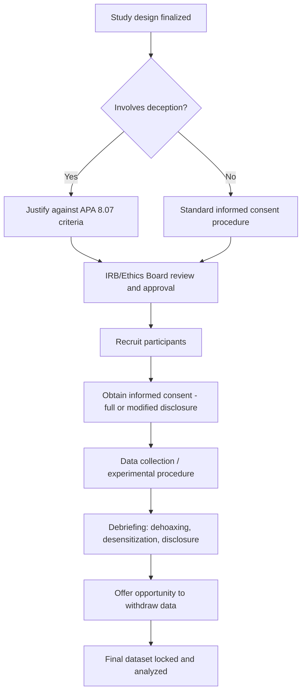

## Research Ethics: Consent, Deception, and Debriefing

### Overview

Research ethics in social psychology governs the moral and regulatory obligations researchers hold toward human participants, balancing scientific validity against participant welfare, autonomy, and dignity. The subfield's history includes both landmark contributions to understanding social behavior and some of psychology's most ethically contested studies, making ethics a methodologically foundational — not peripheral — topic for the discipline.

### Historical Context

**Foundational ethical breaches driving regulatory reform**

- **Milgram's obedience studies** (1961–1963): participants believed they were administering increasingly severe electric shocks to another participant; involved substantial psychological distress, deception about the study's true purpose, and no ability to genuinely withdraw once underway without pressure from the experimenter
- **Zimbardo's Stanford Prison Experiment** (1971): randomly assigned "guards" and "prisoners" in a simulated prison environment; study was terminated early due to escalating abusive treatment and participant psychological distress; has since faced substantial methodological and ethical re-examination, including allegations regarding experimenter influence over participant behavior [Unverified — specific historical/methodological critiques of this study remain debated among historians of psychology]
- **Tuskegee Syphilis Study** (1932–1972, biomedical but foundational to U.S. research ethics regulation generally): withheld treatment from Black male participants with syphilis without informed consent, directly motivating the **Belmont Report** (1979) and subsequent federal human subjects regulations

**Regulatory response**

These cases, among others, directly motivated the establishment of formal ethical codes (APA Ethics Code), institutional review structures (Institutional Review Boards/IRBs in the U.S.; Research Ethics Committees internationally), and foundational ethical frameworks such as the Belmont Report's three core principles: **respect for persons**, **beneficence**, and **justice**.

### Informed Consent

**Core requirement**

Informed consent requires that participants voluntarily agree to participate in research with adequate understanding of what participation involves, based on disclosure of relevant information, prior to any data collection.

**Standard elements of informed consent**:

| Element | Requirement |
| --- | --- |
| Purpose | General description of study purpose (may be incomplete if deception is used, see below) |
| Procedures | What participants will be asked to do, including duration |
| Risks | Reasonably foreseeable risks or discomforts |
| Benefits | Potential benefits to participant or society (not overstated) |
| Confidentiality | How data will be stored, anonymized, and protected |
| Voluntary participation | Explicit statement that participation is voluntary and can be discontinued at any time without penalty |
| Compensation | Any compensation and conditions for receiving it, including if participant withdraws |
| Contact information | Researcher and IRB/ethics board contact information for questions or concerns |

**Capacity and voluntariness considerations**

- **Vulnerable populations** (children, cognitively impaired individuals, prisoners, and in some frameworks, students in a power-differentiated relationship with the researcher) require additional protections, often including a legally authorized representative's consent (for minors, "parental permission" plus child "assent" where developmentally appropriate) and heightened institutional scrutiny
- **Coercion concerns**: research using participant pools tied to course credit requirements raises voluntariness concerns if alternative non-research options for earning credit are not genuinely equivalent and accessible
- **Waiver of consent documentation**: in specific low-risk circumstances (e.g., certain anonymous survey or archival research), IRBs may waive the requirement for a signed consent document while still requiring the informational disclosure itself, or in rare cases waive elements of consent entirely under strict regulatory criteria

### Deception in Research

**Definition and rationale**

Deception involves withholding the true purpose of a study, providing false information, or using confederates/staged scenarios, typically to prevent participant awareness from altering natural behavior (avoiding demand characteristics) or to create a psychologically realistic scenario that could not otherwise be ethically or practically induced directly.

**Types of deception**:

- **Passive/omission deception**: withholding full information about the study's purpose or hypotheses (e.g., not revealing which condition tests which specific hypothesis)
- **Active deception**: providing false information (e.g., false feedback about performance, a confederate posing as a fellow participant, a staged emergency)

**Ethical justification criteria (per APA Ethics Code, Standard 8.07)**

Deception is permitted only when **all** of the following conditions are met:

1. The research has significant scientific, educational, or applied value
2. Equally effective non-deceptive alternative procedures are not feasible
3. The deception does not involve concealing information that would affect participants' willingness to participate regarding **risk of physical pain or severe emotional distress**
4. Participants are debriefed as early as feasible, ideally at the conclusion of their participation

**Ongoing debate**

[Inference] There is a recognized tension in the field between deception's methodological utility (enabling study of naturalistic responses to social situations that could not otherwise be studied) and a broader disciplinary trend, accelerated by open-science reform movements, toward preferring non-deceptive designs (e.g., vignette-based methods, vetted "bogus pipeline" alternatives, or vetted vagueness rather than false information) where scientifically viable, partly due to concerns about eroding public trust and participant pool naivety over time (the "second-order" deception concern — repeated deception across studies in a shared participant pool can compromise the effectiveness of deception itself for later researchers, a public-goods-style externality).

### Debriefing

**Function**

Debriefing is the process, conducted after data collection, of disclosing any withheld or false information, explaining the true purpose and hypotheses of the study, and addressing any resulting participant distress or misconceptions — serving both an ethical remediation function (restoring the participant's autonomy and correcting deception) and, ideally, an educational function.

**Required elements**:

1. **Disclosure**: full explanation of any deception used and the actual study purpose/hypotheses
2. **Justification**: explanation of why deception was methodologically necessary
3. **Dehoaxing**: correcting any false beliefs induced during the study (e.g., false performance feedback, belief that a confederate was a genuine participant)
4. **Desensitization**: addressing any negative emotional states induced by the procedure (e.g., stress, negative self-relevant feedback), ensuring participants do not leave in a worse psychological state than they arrived
5. **Opportunity for questions and withdrawal of data**: participants should be given the opportunity to ask questions and, in many protocols, to withdraw their data from the study now that they understand its true nature
6. **Educational value**: explaining the broader theoretical/scientific context, ideally leaving participants with genuine understanding of the phenomenon under study

### Diagram: Ethical Review and Study Lifecycle

### Institutional Review Boards (IRBs) / Research Ethics Committees

- **Function**: independent bodies that review proposed research involving human participants prior to data collection, evaluating risk-benefit ratio, adequacy of informed consent procedures, and justification for any deception or other ethically sensitive elements
- **Risk categorization**: most frameworks distinguish between **exempt**, **expedited**, and **full board review** categories based on risk level, with minimal-risk research (e.g., anonymous surveys) typically qualifying for expedited or exempt review, while higher-risk or vulnerable-population research requires full board review
- **Continuing oversight**: IRB approval is often time-limited, requiring renewal/continuing review for ongoing studies, and any protocol modifications typically require re-submission

### Confidentiality and Privacy

- **Anonymity** (no identifying information collected at all) is distinct from **confidentiality** (identifying information collected but protected/restricted from disclosure) — a frequently conflated but methodologically important distinction, since anonymity limits certain analyses (e.g., longitudinal linking of the same participant's data across waves) that confidentiality protections can still permit
- **Data security requirements**: encrypted storage, restricted access, and de-identification procedures (e.g., replacing names with participant ID codes, storing the ID-to-identity key separately from the dataset) are standard practice, particularly heightened for archival/social-media-derived data and physiological/neuroimaging data given their re-identification risk

### Special Ethical Considerations in Contemporary Research

- **Online/crowdsourced research** (e.g., Mturk, Prolific): raises distinct consent, compensation fairness, and debriefing-delivery challenges relative to in-lab research, given reduced researcher-participant contact
- **Big data and social media research**: raises questions about whether publicly posted social media content constitutes a context where "informed consent" is meaningfully obtainable or ethically required, an area of ongoing disciplinary and regulatory debate [Unverified — practice and formal guidance continue to evolve and vary by institution and jurisdiction]
- **Physiological/neuroimaging research**: incidental findings (e.g., an unexpected structural brain abnormality discovered during an fMRI study) raise distinct ethical obligations regarding whether and how to disclose such findings to participants

### Example

**Example (Ethical design walkthrough)**

*Scenario*: A researcher wants to study whether social exclusion increases susceptibility to misinformation, using a rigged ball-tossing game (Cyberball) to manipulate exclusion.

*Ethical design considerations*:

1. **Deception justification**: the cover story (participants believe they are playing with real other participants) is necessary because awareness of the manipulation would undermine the psychological realism of the exclusion experience — satisfies APA 8.07 criteria 1–2
2. **Risk assessment**: exclusion-induced distress is mild and temporary, not "severe emotional distress" — satisfies criterion 3; still requires IRB evaluation of risk-benefit balance
3. **Consent**: participants are told the general topic (group dynamics/decision-making) without revealing the specific exclusion hypothesis, consistent with passive/omission deception standards
4. **Debriefing**: immediately following the study, the researcher discloses that the other "players" were computer-controlled, explains the true purpose (studying social exclusion effects), checks in on participant emotional state (desensitization), and offers an opportunity to withdraw data
5. **Documentation**: full deception justification and debriefing script submitted as part of the IRB protocol prior to data collection

### Related Topics

- The Belmont Report and foundational bioethical principles
- Institutional Review Board (IRB) structure and review categories
- History of social psychology's landmark and controversial studies
- Ethics of secondary data use in archival and social media research
- Vulnerable populations in research: additional protections
- Open science reforms and their intersection with ethical practice
- Confidentiality vs. anonymity in data management