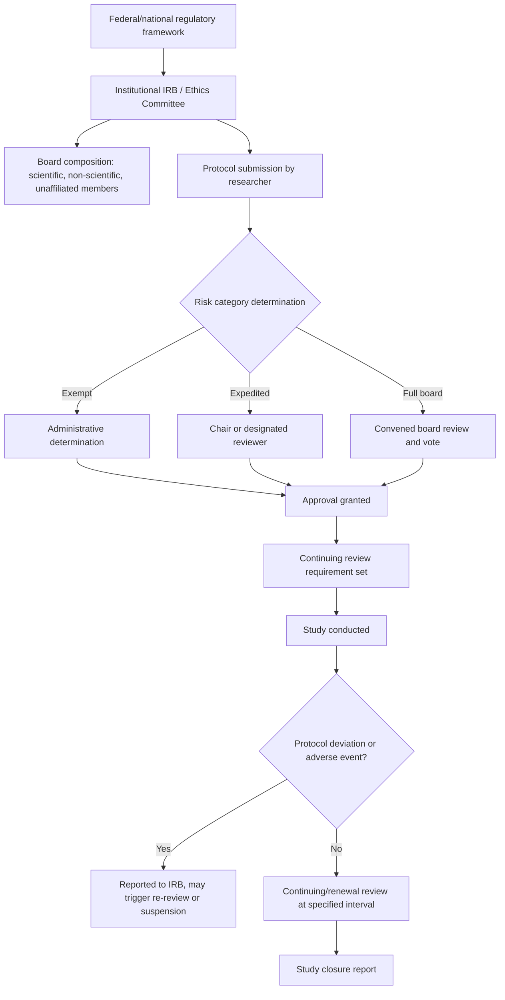

## Institutional Review and Ethical Oversight

### Scope Note

This chapter's prior item ("Research ethics: consent, deception, and debriefing") already covers IRB function, risk-tier review categories, and continuing oversight in detail. Rather than repeat that material, this entry goes deeper on the **institutional/administrative machinery** of ethical oversight specifically — how review boards are structured, how review actually proceeds procedurally, and how oversight extends beyond a single study's approval.

### IRB Structure and Composition

**Regulatory basis (U.S. context)**

U.S. IRBs operate under the **Common Rule** (45 CFR 46), which specifies minimum required board composition:

- At least five members, with varying backgrounds (not all from the same profession)
- At least one member whose primary concerns are scientific
- At least one member whose primary concerns are non-scientific (e.g., ethicist, community representative, clergy)
- At least one member unaffiliated with the institution
- Members with relevant expertise for vulnerable populations under review (e.g., children, prisoners) consulted as needed

International equivalents (Research Ethics Committees/Boards under frameworks such as the UK's Health Research Authority or institution-specific committees) follow broadly analogous multi-stakeholder composition principles, though specific regulatory requirements vary by country [Unverified — jurisdictional detail varies and should be checked against the specific national framework relevant to a given institution].

### Review Category Determination

| Category | Criteria | Review Process |
| --- | --- | --- |
| **Exempt** | Minimal risk; falls into one of several federally defined exemption categories (e.g., anonymous survey research on non-sensitive topics, certain educational setting research) | Administrative/expedited determination; typically not full-board |
| **Expedited** | Minimal risk but does not meet a formal exemption category; often includes minor procedural elements (e.g., non-invasive physiological recording) | Reviewed by IRB chair or designated experienced reviewer(s), not full board |
| **Full board** | Greater than minimal risk, vulnerable populations, sensitive topics, deception with potential for distress | Reviewed at a convened meeting of the full IRB, majority vote required for approval |

**"Minimal risk" standard**: defined in most frameworks as risk not greater than that "ordinarily encountered in daily life" — a deliberately comparative rather than absolute standard, applied by the reviewing board's judgment to the specific study.

### Diagram: Institutional Oversight Structure

### Protocol Amendment and Continuing Review

- **Amendments**: any substantive change to an approved protocol (recruitment procedure, measures, compensation, added deception) generally requires formal IRB re-submission and approval before implementation, not merely notification after the fact
- **Continuing review**: most frameworks require periodic (commonly annual) renewal review for ongoing studies, reassessing risk-benefit balance and confirming procedures still match what was approved
- **Adverse event reporting**: unexpected serious harm to a participant, or a protocol deviation with potential to affect participant welfare, generally triggers mandatory reporting to the IRB, which may suspend or modify the study pending review

### Multi-Site and Cross-Institutional Oversight

- **Single IRB (sIRB) models**: for multi-site research (increasingly common in large-scale replication and consortium studies in social psychology), regulatory reform (e.g., the U.S. NIH single-IRB mandate for federally funded multi-site studies) has pushed toward one IRB of record reviewing on behalf of all sites, replacing the historically more common model of independent per-site review, to reduce redundant review burden and inconsistent determinations across sites
- **Reliance agreements**: formal agreements between institutions specifying which IRB holds review authority for a given collaborative project

### Post-Approval Oversight Mechanisms

- **Audits/for-cause investigations**: IRBs or institutional research integrity offices may audit ongoing studies, particularly following a complaint, adverse event, or random compliance check
- **Data and safety monitoring**: more common in clinical/biomedical research but increasingly relevant to high-risk social psychology paradigms (e.g., studies involving significant induced stress or vulnerable populations), involving independent monitoring of accumulating data for unexpected harm signals
- **Research misconduct oversight**: distinct from IRB human-subjects review, most institutions maintain a separate research integrity office handling allegations of fabrication, falsification, or plagiarism — relevant to social psychology given notable historical misconduct cases (e.g., the Stapel case) that involved fabricated data in studies that had, notably, already received standard human-subjects ethical approval, illustrating that IRB approval addresses participant protection, not data integrity

### Related Topics

- Research ethics: consent, deception, and debriefing (see prior chapter item for consent/deception/debriefing procedures in depth)
- The Belmont Report and foundational bioethical principles
- Research misconduct and data integrity oversight
- Single IRB models and multi-site research governance
- Open science reforms and their intersection with ethical practice