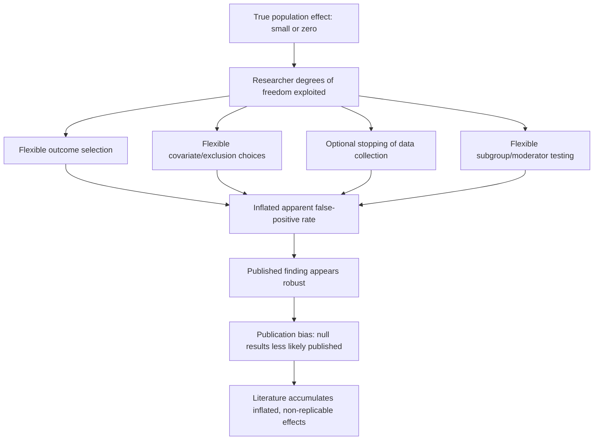
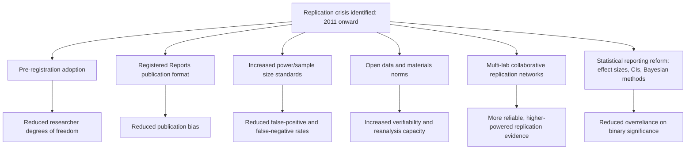

## The Replication Crisis and Questionable Research Practices

### Overview

The replication crisis refers to a period of methodological self-examination, beginning prominently around 2011, in which large-scale attempts to reproduce previously published psychological findings revealed substantially lower-than-expected replication success rates, prompting field-wide scrutiny of research practices, statistical norms, and incentive structures. Social psychology was disproportionately implicated relative to some other psychology subfields, making this topic foundational to understanding the discipline's current methodological standards.

### Originating Events and Catalysts

**Bem (2011) — "Feeling the Future"**

Daryl Bem published a series of nine experiments in a mainstream social psychology journal reporting evidence for precognition (participants' choices influenced by future, not-yet-occurring random events), using conventional NHST methods and standard experimental designs. The paper's publication in a top-tier journal, despite the extraordinary nature of its claim, prompted widespread concern that standard methodological and statistical practices in the field could produce "statistically significant" support for a claim most researchers considered a priori implausible — implicating the methods themselves rather than this single study.

**Stapel fraud case (2011)**

Diederik Stapel, a prominent Dutch social psychologist, was found to have fabricated data across dozens of publications over many years, some involving prominent, widely cited findings. While fraud is categorically distinct from the statistical/methodological issues discussed below, the case intensified scrutiny of the field's verification and oversight mechanisms and contributed to the broader crisis-of-confidence atmosphere.

**Simmons, Nelson, & Simonsohn (2011) — "False-Positive Psychology"**

This paper formalized the concept of **researcher degrees of freedom**: the many analytic choices available to researchers (which conditions to compare, which covariates to include, which participants to exclude, when to stop collecting data, which of several outcome measures to report) that, if exploited flexibly — even without conscious intent to deceive — can inflate the true false-positive rate far above the nominal $\alpha = .05$. Via simulation, the authors demonstrated that exploiting a small number of common flexible practices could push the false-positive rate above 60%.

**Open Science Collaboration (2015) — "Estimating the Reproducibility of Psychological Science"**

A large-scale, multi-lab effort attempting direct replications of 100 studies published in three major psychology journals. Headline findings: while 97% of original studies reported statistically significant results, only 36% of replications did; mean effect sizes in replications were approximately half the magnitude of original effect sizes [Unverified — precise headline figures are widely cited but exact percentages depend on which success criterion is applied, e.g., significance-based vs. effect-size-overlap-based]. Social psychology findings showed a notably lower replication rate than cognitive psychology findings within this same project.

### Diagram: Sources of Inflated False-Positive Findings

### Questionable Research Practices (QRPs)

QRPs are practices that fall short of outright fabrication but bias reported results toward false positives or inflated effect sizes, often without researchers recognizing them as problematic at the time given prior disciplinary norms.

| QRP | Description |
| --- | --- |
| **$p$-hacking** | Trying multiple analytic specifications (variables, subgroups, covariates, exclusion criteria) until achieving $p < .05$, then reporting only the significant result |
| **HARKing** (Hypothesizing After Results are Known) | Presenting a post-hoc, data-driven finding as though it had been the a priori hypothesis, obscuring its exploratory nature |
| **Optional stopping** | Checking results periodically during data collection and stopping as soon as significance is reached, rather than pre-specifying a fixed sample size |
| **Selective outcome reporting** | Measuring multiple outcome variables but reporting only those that reached significance |
| **File-drawer problem** | Non-significant/null findings going unpublished or unsubmitted, biasing the published literature toward positive findings |
| **Low statistical power as a systemic practice** | Historically common small sample sizes reduce the reliability of any single significant finding, even absent explicit QRP exploitation |

[Inference] Survey research on self-reported QRP prevalence (e.g., John, Loewenstein, & Prelec, 2012) suggested these practices were common and often not perceived by researchers as unethical prior to the post-2011 reform period, reflecting a genuine shift in disciplinary norms rather than only a shift in enforcement.

### Notable Affected Literatures in Social Psychology

[Inference — the replication status and interpretation of each literature below remains an area of ongoing empirical and theoretical debate; this list reflects areas that received substantial post-2011 replication scrutiny, not a settled consensus that each original effect is false]

- **Social/behavioral priming**: several high-profile behavioral priming findings (e.g., the "elderly walking" priming effect, Bargh, Chen, & Burrows, 1996) failed to replicate in large pre-registered attempts (Doyen et al., 2012; Pashler et al., 2011)
- **Ego depletion**: the theory that self-control draws on a limited, depletable resource was tested in a large-scale Registered Replication Report (Hagger et al., 2016) that found no significant depletion effect across many labs, though subsequent debate and alternative replication attempts have produced mixed results
- **Power posing**: Carney, Cuddy, & Yap's (2010) finding that expansive body postures cause hormonal and behavioral changes faced replication failure (Ranehill et al., 2015) and was later partially disavowed by one of the original authors regarding the hormonal component specifically

### Reform Movements and Methodological Responses

**Pre-registration**

Publicly time-stamping hypotheses, sample size, and analysis plan before data collection, closing off post-hoc researcher degrees of freedom. Platforms such as OSF (Open Science Framework) and AsPredicted provide standardized pre-registration infrastructure now widely adopted across social psychology journals.

**Registered Reports**

A publication format in which the introduction, hypotheses, and methods are peer-reviewed and provisionally accepted for publication **before** data collection and results are known, directly addressing publication bias since acceptance no longer depends on the significance/novelty of the outcome.

**Increased emphasis on statistical power**

Field-wide shift toward larger a priori-justified sample sizes and away from post-hoc "observed power" framing (see Effect Size, Statistical Power, and Significance Testing topic).

**Open data and materials**

Norms and journal requirements increasingly favor public posting of raw data, analysis code, and study materials, enabling independent verification and reanalysis.

**Multi-lab collaborative replication**

Large coordinated projects (Registered Replication Reports, the Psychological Science Accelerator, Many Labs projects) pool resources across many labs internationally to conduct highly powered, pre-registered direct replications of key findings, distributing both the labor and the credibility of replication efforts.

**Statistical and reporting reforms**

Increased use of effect sizes with confidence intervals rather than binary significance reporting; growing adoption of Bayesian approaches capable of quantifying evidence for the null; some journals adopting stricter alpha thresholds or requiring disclosure statements regarding all measures, manipulations, and exclusions in a study (the "21-word solution" disclosure statement proposed by Simmons et al.).

### Diagram: Reform Ecosystem

### Distinguishing Replication Failure from Fraud

An important conceptual distinction maintained throughout crisis-era discourse: the large majority of non-replicating findings are attributed to genuine statistical/methodological factors (small original samples, QRPs, publication bias, true small-to-null effects) rather than to deliberate fabrication. Fraud cases (e.g., Stapel) are comparatively rare and are addressed through research-integrity mechanisms distinct from the statistical reform movement, though both contributed to the same period of heightened scrutiny.

### Ongoing Debates and Nuance

- **Direct vs. conceptual replication**: debate continues over whether failed **direct** replications (exact procedural repetition) necessarily undermine a theory, versus whether unmeasured moderators (population, cultural context, historical period — sometimes termed "hidden moderators") can legitimately explain replication failure without falsifying the underlying theoretical construct [Inference — this remains a genuinely contested methodological and philosophical question, not a settled matter, with reasonable disagreement among methodologists about how much weight to give hidden-moderator explanations before they become unfalsifiable post-hoc rationalization]
- **Field-wide vs. subfield-specific severity**: replication rates have varied notably by psychology subfield, with cognitive psychology findings generally replicating at higher rates than social psychology findings in large-scale projects, prompting some subfield-specific rather than purely field-wide diagnostic discussion
- **Generational and institutional friction**: reform adoption has not been uniform, and debate continues regarding the appropriate balance between exploratory/generative research (which reform critics argue pre-registration can excessively constrain) and confirmatory rigor

### Example

**Example (Applying reform practices to avoid QRPs)**

*Scenario*: A researcher collects data testing whether a mindfulness intervention reduces implicit bias, measuring three potential outcome variables (IAT D-score, explicit attitude scale, behavioral approach/avoidance task).

*Reform-consistent practice*:

1. Pre-register the primary outcome (e.g., IAT D-score) as the confirmatory hypothesis test **before** data collection, explicitly labeling the other two measures as exploratory
2. Conduct and report an a priori power analysis justifying the sample size
3. Pre-specify exclusion criteria (e.g., IAT error rate thresholds) before seeing the data
4. Report all three measured outcomes in the paper regardless of significance, clearly distinguishing confirmatory (pre-registered) from exploratory (not pre-registered) results
5. Make raw data and analysis code publicly available via OSF upon publication

### Related Topics

- Meta-analytic methods (bias-corrected effect size estimation in affected literatures)
- Effect size, statistical power, and significance testing
- Pre-registration and Registered Reports
- Priming paradigms in research
- Publication bias and the file-drawer problem
- Research ethics: consent, deception, and debriefing
- Open science infrastructure (OSF, Many Labs, Psychological Science Accelerator)