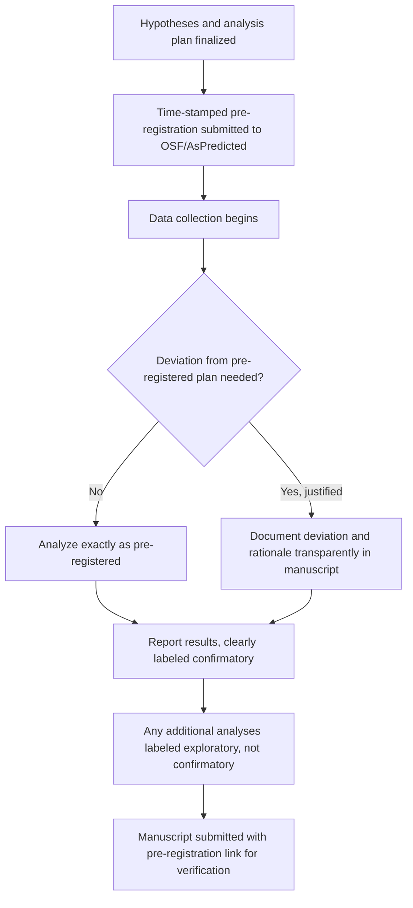
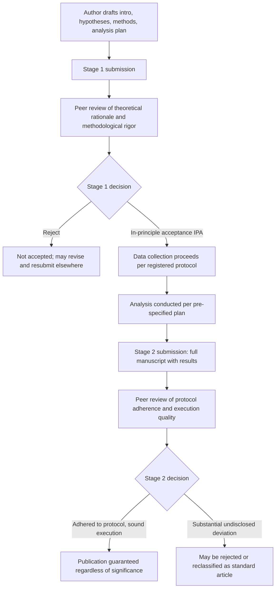

## Open Science: Preregistration and Registered Reports

### Scope Note

Pre-registration and Registered Reports were introduced conceptually in the prior chapter item on the replication crisis. This entry focuses on their **procedural mechanics** and situates them within the broader open science toolkit (open data, materials, code, and reporting standards) not yet covered elsewhere in this chapter.

### Preregistration: Document Structure

A pre-registration is a time-stamped, typically publicly accessible document specifying a study's design and analysis plan before data are collected (or, in a "secondary data" pre-registration, before the researcher has accessed the relevant portion of an existing dataset).

**Standard components**:

1. **Research question(s) and hypotheses**: stated in advance, ideally with directional predictions where theoretically justified
2. **Study design**: between/within-subjects, conditions, manipulations, and their operationalization
3. **Sampling plan**: target population, planned sample size with justification (typically an a priori power analysis), and any planned stopping rule
4. **Variables**: all measured variables, explicitly distinguishing the primary/confirmatory outcome(s) from secondary/exploratory measures
5. **Exclusion criteria**: pre-specified rules for excluding participants or trials (e.g., failed attention checks, outlier thresholds), defined before data are inspected
6. **Analysis plan**: the specific statistical test(s) that will address each hypothesis, including planned covariates and any planned contrasts

**Levels of pre-registration specificity**

Pre-registration templates vary in constraint level — from broad "light" templates (e.g., basic OSF pre-registration, roughly analogous to a short pre-analysis outline) to maximally detailed templates that pre-specify exact statistical code (e.g., some large multi-lab consortium templates). More detailed pre-registrations more fully close off researcher degrees of freedom but require more upfront planning effort and are harder to write for genuinely exploratory-stage research questions.

### Diagram: Pre-Registration Timeline and Deviation Handling

### Handling Deviations

A pre-registration is a commitment device, not a rigid cage: deviations are permitted but must be transparently disclosed and justified in the resulting manuscript (e.g., "we pre-registered exclusion criterion X, but discovered during data collection that Y required an amendment for reason Z"). Reviewers and readers can then evaluate whether a deviation appears principled or post-hoc-rationalized. Undisclosed deviation — silently changing the analysis without noting the departure from the registered plan — defeats the purpose of the mechanism and is treated as a serious transparency violation by most open-science norms.

### Registered Reports: Review Pipeline

Registered Reports (RRs) are a distinct **publication format**, offered by an increasing number of journals, structurally separating peer review of the research question and methods from peer review of the results.

**Two-stage review process**:

**Stage 1 review**: authors submit an introduction, hypotheses, detailed methods, and full analysis plan — without having collected data (or, in some designs, without having analyzed already-collected data). Reviewers evaluate:

- Theoretical/empirical justification for the hypotheses
- Whether the proposed methods can adequately test the stated hypotheses
- Adequacy of statistical power
- Clarity and completeness of the analysis plan

If accepted at Stage 1, the journal grants **in-principle acceptance (IPA)** — a conditional commitment to publish the eventual paper regardless of whether results are significant, contingent only on the authors following the registered protocol (or transparently justifying any deviation) and conducting the study with appropriate rigor.

**Stage 2 review**: after data collection and analysis, authors submit the completed manuscript. Reviewers at this stage evaluate:

- Adherence to the Stage 1-approved protocol
- Quality of execution
- Appropriateness of any deviations and their disclosure
- Whether conclusions are appropriately calibrated to the actual results (not the significance of the findings themselves, which does not affect the publication decision)

### Diagram: Registered Reports Two-Stage Pipeline

### Why Registered Reports Address Publication Bias Directly

Standard peer review evaluates a completed study, where reviewers and editors (even unconsciously) may weight novelty and statistical significance in the accept/reject decision — the mechanism underlying publication bias in the traditional model. Because RR Stage 1 acceptance occurs **before** results exist, the publication decision is structurally decoupled from outcome significance, directly targeting the file-drawer problem at its source rather than attempting to detect/correct for it after the fact (as meta-analytic bias-correction techniques must).

### Broader Open Science Toolkit

**Open data**

Public posting of de-identified raw data (commonly via OSF, Dataverse, or journal-specific repositories), enabling independent verification, reanalysis, and inclusion in future meta-analyses without requiring original authors' direct involvement.

**Open materials**

Public posting of stimuli, questionnaires, experimental scripts/code, and codebooks, enabling exact procedural replication by independent researchers.

**Open (analysis) code**

Sharing the actual analysis scripts (e.g., R, Python) used to produce reported results, allowing verification that reported statistics match what the code, applied to the posted data, actually produces — addressing a distinct failure mode from data-sharing alone (an error or undisclosed choice in analysis code, not the data itself).

**Open access publication**

Distinct from the above (concerns manuscript accessibility rather than data/materials/methods transparency), but frequently discussed within the same open science movement given the shared goal of removing barriers to verification and reuse.

**Badges and certification systems**

Some journals (pioneered by *Psychological Science*) award visual "badges" to published articles for open data, open materials, and pre-registration, providing a low-cost signal of transparency practices to readers; empirical work has examined whether badge adoption is associated with subsequently higher rates of actual data-sharing compliance [Unverified — specific effect sizes/compliance rates vary by study and journal].

**FAIR data principles**

A broader open-science-adjacent framework (Findable, Accessible, Interoperable, Reusable), originally articulated for scientific data broadly, increasingly referenced in psychology's open data guidance as a standard for what "usable" shared data should look like — not merely posted, but structured and documented such that an independent researcher can actually make use of it.

### Adoption Landscape and Practical Considerations

- [Inference] Adoption of pre-registration and Registered Reports has grown substantially across social psychology journals since approximately 2013–2015, though adoption rates, specific requirements, and enforcement rigor continue to vary considerably by journal and subfield within psychology.
- **Exploratory research tension**: critics note that heavily confirmatory, pre-registration-centric norms risk under-valuing genuinely exploratory, hypothesis-generating research, which has historically played an important role in theory development; the standard response within the open science movement is to explicitly label exploratory work as such (rather than disguising it as confirmatory via HARKing) rather than to avoid exploratory work altogether.
- **Registered Reports and career incentives**: because Stage 1 IPA guarantees publication independent of results, RRs are sometimes discussed as particularly well-suited to reducing incentives for QRPs in early-career researchers facing publication pressure, though the format's longer overall timeline (two review rounds around a data collection period) is cited as a practical adoption barrier.

### Example

**Example (Registered Report submission outline)**

*Research question*: Does a brief online perspective-taking exercise reduce implicit intergroup bias, and does this effect persist at a one-week follow-up?

*Stage 1 submission would include*:

1. Theoretical rationale grounded in existing intergroup contact and perspective-taking literature
2. Pre-specified hypotheses: H1 (immediate post-intervention D-score reduction), H2 (persistence at one-week follow-up)
3. A priori power analysis justifying sample size for detecting the smallest effect size of theoretical/practical interest
4. Full survey materials, intervention script, and IAT administration protocol attached
5. Pre-specified exclusion criteria (e.g., IAT error rate, attention check failure) and planned statistical models (e.g., mixed-effects model with time as a repeated-measures factor)
6. Submitted for peer review; upon in-principle acceptance, data collection proceeds exactly as specified, with any necessary deviations documented for Stage 2 review

### Related Topics

- The replication crisis and questionable research practices
- Effect size, statistical power, and significance testing
- Meta-analytic methods
- Publication bias and the file-drawer problem
- Research ethics: consent, deception, and debriefing
- FAIR data principles and research data management