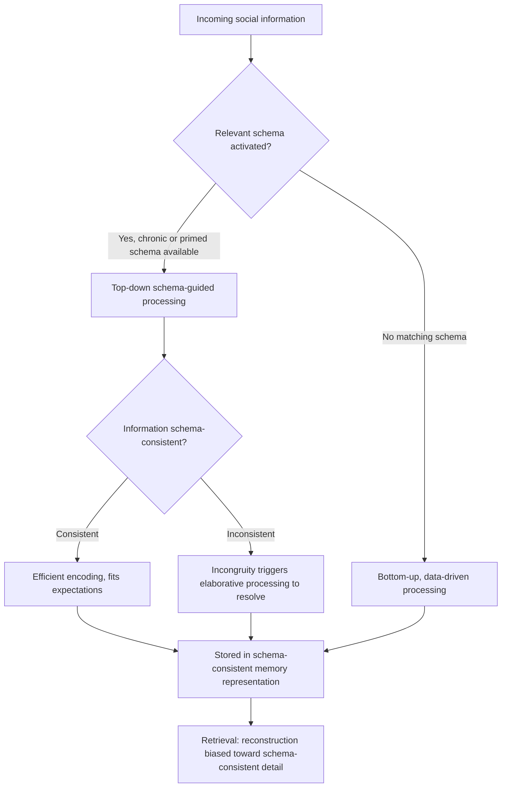

## Schemas and Scripts

### Overview

Schemas and scripts are foundational constructs in social cognition describing how people organize, store, and apply structured knowledge about the world to interpret new information efficiently. Schemas are general cognitive structures representing organized knowledge about a concept, person, group, role, or situation; scripts are a specialized subtype of schema representing expected sequences of events or behaviors in familiar situations. Both function to reduce cognitive load by allowing top-down, knowledge-driven processing rather than requiring every stimulus to be interpreted entirely from bottom-up perceptual input.

### Theoretical Origins

**Bartlett's foundational work**

Frederic Bartlett (1932) introduced the concept of schema in cognitive psychology through his "War of the Ghosts" story-recall studies, demonstrating that people's memory for narrative material was systematically distorted toward culturally familiar patterns — participants unconsciously altered unfamiliar story elements to fit expected structures, illustrating that memory is **reconstructive** rather than a literal recording, guided by pre-existing knowledge structures.

**Cognitive and social-cognitive elaboration**

Piaget's developmental theory independently used "schema" to describe cognitive structures children use to organize and adapt to experience (assimilation and accommodation). Social cognition researchers in the 1970s–1980s (notably Susan Fiske, Shelley Taylor, and colleagues) imported and elaborated the schema construct specifically for social information processing, distinguishing multiple schema subtypes relevant to person perception, group perception, and social situations.

### Types of Schemas

| Schema Type | Description | Example |
| --- | --- | --- |
| **Person schemas** | Organized knowledge about a specific individual's traits and typical behavior | Knowledge structure for "my colleague, who is punctual and blunt" |
| **Role schemas** | Expectations associated with a social role or position | Expectations for "professor," "police officer," "parent" |
| **Self-schemas** | Organized knowledge structures about oneself, derived from past experience, guiding self-relevant information processing | A person with an "independent" self-schema processes independence-relevant information about themselves more efficiently |
| **Event schemas (scripts)** | Expected sequence of actions/events in a familiar situation | Restaurant script, job interview script |
| **Group/social schemas (stereotypes)** | Organized beliefs about the traits and behaviors of a social category's members | Occupational, national, or demographic stereotypes — a specific, socially consequential schema subtype |
| **Free/content-free schemas** | Frameworks lacking specific content, e.g., causal schemas used to infer why an event occurred | Covariation-based causal attribution structures |

### Functions of Schemas in Social Cognition

**Encoding**: schema-consistent information is often processed and encoded more efficiently (schema-consistent processing advantage), though under some conditions schema-**inconsistent** information receives more elaborative processing because it demands explanation (the "incongruity effect"), producing a more complex, non-monotonic relationship between schema-consistency and processing depth than a simple efficiency account alone would predict.

**Interpretation of ambiguous information**: schemas fill in gaps and resolve ambiguity by supplying default expectations — directly linking this topic to construct accessibility and priming research (see Priming Paradigms topic), since temporarily or chronically accessible schemas shape how ambiguous social behavior is interpreted.

**Memory**: schema-consistent information is generally better recalled than schema-irrelevant information, and memory errors tend to be systematically biased toward schema-consistent reconstruction — people often "remember" schema-typical details that were never actually presented (a documented form of memory distortion with direct relevance to eyewitness testimony research).

**Judgment and inference**: schemas support efficient (if sometimes inaccurate) inference beyond the information directly given, allowing rapid judgments about novel individuals or situations based on category membership or partial cues.

### Diagram: Schema-Guided Information Processing

### Scripts: Definition and Structure

Scripts, formalized by Schank and Abelson (1977) in their broader theory of scripts, plans, and goals, are event schemas specifying the expected temporal sequence of actions in a familiar, recurring situation.

**Classic example: the restaurant script**

1. Enter restaurant
2. Wait to be seated (or seat self)
3. Receive/review menu
4. Order food
5. Wait for food
6. Eat food
7. Receive bill
8. Pay bill
9. Leave

**Key structural properties of scripts**:

- **Ordered sequence**: unlike simpler schemas, scripts specify not just content but expected temporal/causal order
- **Role slots**: scripts specify actors in generic roles (customer, server) that can be filled by specific individuals in a given instance
- **Default/optional actions**: some script steps are near-universal (ordering food) while others are situationally variable (leaving a tip, requesting substitutions)
- **Script deviation detection**: unexpected deviations from an active script (e.g., a restaurant with no menu) are typically salient and demand additional processing, similar to schema-incongruity effects generally

### Schemas, Scripts, and Social Behavior

**Behavioral guidance**: scripts allow smooth, largely automatic behavioral execution in familiar social situations without requiring moment-to-moment conscious deliberation about each action — directly relevant to broader automaticity research in social cognition (see Priming Paradigms topic's discussion of automaticity).

**Cross-cultural variability**: scripts for ostensibly similar situations (greetings, dining, negotiation) can vary substantially across cultures, and script mismatches in intercultural contact are a documented source of miscommunication and awkwardness, since each party's automatic script-based expectations for the other's behavior may not align.

**Script violation and social evaluation**: unexpected departure from a socially expected script (e.g., a job interviewee behaving in an unscripted way) is often evaluated more negatively than script-consistent behavior would be, independent of the substantive merit of the deviation, since it demands additional attributional processing that frequently defaults toward dispositional (person-based) rather than situational explanation.

### Relationship to Stereotypes

Stereotypes function as a specific, socially consequential category of schema — organized (if often inaccurate or overgeneralized) knowledge structures about social groups that guide encoding, interpretation, and memory for group-relevant information in the same general manner described above for schemas broadly. This connects schema theory directly to intergroup cognition research: stereotype-consistent information about an out-group member may be processed more fluently and remembered more readily than stereotype-inconsistent information, contributing to stereotype maintenance even in the face of individually disconfirming evidence (subtyping — treating a stereotype-inconsistent individual as an "exception" rather than updating the broader group schema, is a well-documented mechanism by which stereotype-inconsistent information fails to produce broader schema change).

### Schema Change

Schemas are not entirely static; three theoretical models describe how schema-inconsistent information can, under some conditions, produce genuine schema revision rather than simple assimilation or subtyping:

- **Bookkeeping model**: schema changes gradually, incrementally, in response to the accumulation of many individually schema-inconsistent instances
- **Conversion model**: schema changes abruptly following exposure to a small number of highly salient, dramatically disconfirming instances
- **Subtyping model**: disconfirming instances are cognitively segregated into a new subcategory ("exception to the rule"), leaving the overall/superordinate schema largely unchanged — generally considered the most commonly observed pattern, and the mechanism most implicated in stereotype persistence despite individuating counter-evidence

### Example

**Example (Schema-driven interpretation ambiguity)**

*Scenario*: Two observers watch the same ambiguous interaction — one person raising their voice at another in an office setting.

- **Observer with an "aggressive coworker" person schema already activated** for the individual raising their voice interprets the behavior as consistent with a hostile disposition, encodes it as confirming evidence, and later recalls the interaction as more clearly aggressive than a neutral video recording would support
- **Observer with a "high-stress deadline situation" event schema activated** (e.g., having just learned the office is facing an urgent deadline) interprets the identical raised-voice behavior as a situationally understandable stress reaction, encodes it with less dispositional weight, and later recalls the interaction with more mitigating contextual detail

This illustrates how the **same objective stimulus**, filtered through different active schemas, produces systematically divergent encoding, interpretation, and downstream memory — a core mechanism connecting schema theory to person perception and attribution research.

### Related Topics

- Priming paradigms in research (construct accessibility and schema activation)
- Stereotypes as a schema subtype; stereotype maintenance and subtyping
- Attribution theory and dispositional vs. situational inference
- Person perception and impression formation
- Reconstructive memory and eyewitness testimony
- Automaticity in social cognition
- Cross-cultural variation in social scripts