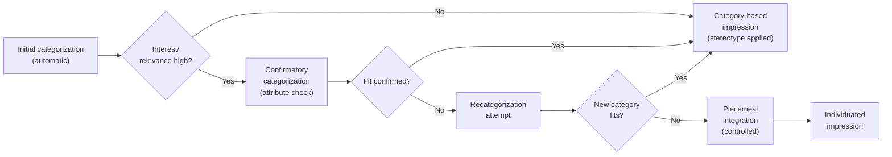
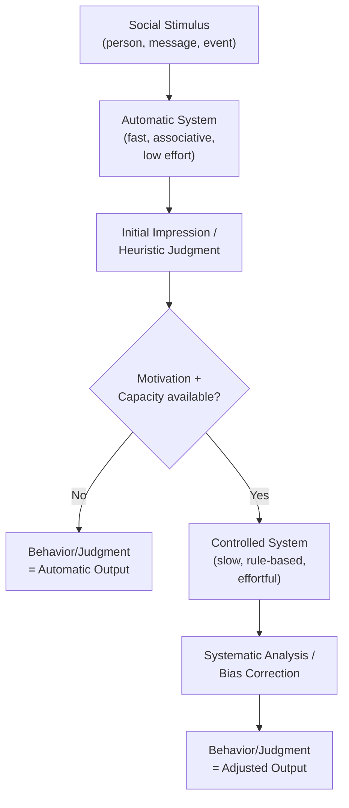

## Dual-Process Models: Automatic Versus Controlled Processing

### Overview

Dual-process theory posits that social cognition operates through two qualitatively distinct systems of information processing: an automatic system (often labeled System 1, associative, or heuristic processing) and a controlled system (System 2, rule-based, or systematic processing). This framework explains how people can form impressions, make judgments, and produce behavior both effortlessly and deliberately, depending on cognitive resources, motivation, and situational demands.

### Historical Development

- **Early roots**: William James (1890) distinguished associative and reasoned thought.
- **1970s–1980s**: Schneider and Shiffrin's (1977) automatic versus controlled processing distinction in attention research provided the cognitive-architecture foundation.
- **1980s dual-process models in social psychology**: Chaiken's Heuristic-Systematic Model (HSM, 1980) and Petty and Cacioppo's Elaboration Likelihood Model (ELM, 1986) applied the distinction to persuasion.
- **1990s consolidation**: Devine's (1989) work on automatic stereotype activation versus controlled suppression; Fiske and Neuberg's (1990) Continuum Model of impression formation.
- **2000s onward**: Kahneman's (2011) *Thinking, Fast and Slow* popularized System 1/System 2 terminology; Strack and Deutsch's (2004) Reflective-Impulsive Model formalized dual-process architecture for social behavior.

### Core Distinguishing Features

| Dimension | Automatic Processing | Controlled Processing |
| --- | --- | --- |
| Awareness | Often unconscious or unintentional | Conscious, intentional |
| Effort | Low cognitive load | High cognitive load |
| Speed | Fast | Slow |
| Efficiency | Runs alongside other tasks | Disrupted by concurrent tasks |
| Controllability | Difficult to stop once triggered | Can be initiated, modified, or halted |
| Capacity dependence | Operates under cognitive load | Requires available cognitive resources |
| Learning basis | Overlearned associations, schemas, stereotypes | Deliberate rule application, active reasoning |

[Inference] These four features (awareness, intentionality, efficiency, controllability) are often treated as a cluster rather than a strict all-or-none package — a process can be fast but still controllable, for example — a point raised critically by Bargh (1994) and later theorists who favor "processing features" over a binary system split.

### Major Theoretical Models

#### 1. Heuristic-Systematic Model (Chaiken, 1980)

Persuasion and judgment occur via two modes:

- **Heuristic processing**: Reliance on simple decision rules ("experts are usually right," "consensus implies correctness") requiring minimal effort.
- **Systematic processing**: Careful, effortful scrutiny of message content and argument quality.

The **sufficiency principle** governs mode selection: people process just enough to reach a satisfactory confidence level ("sufficiency threshold"). Low motivation or ability favors heuristic processing; high motivation and ability favor systematic processing. Both can operate concurrently (additive, attenuating, or biasing effects on each other).

#### 2. Elaboration Likelihood Model (Petty & Cacioppo, 1986)

Attitude change occurs via two routes:

- **Central route**: High elaboration; careful evaluation of argument quality; requires both motivation and ability. Produces attitudes that are durable, resistant to counterpersuasion, and predictive of behavior.
- **Peripheral route**: Low elaboration; reliance on peripheral cues (source attractiveness, message length, number of arguments). Produces attitudes that are less stable.

$$Attitude\ Change = f(Motivation \times Ability \times Elaboration)$$

#### 3. Continuum Model of Impression Formation (Fiske & Neuberg, 1990)

Impression formation ranges along a continuum from category-based to individuating processes:

Motivation (outcome dependency, accuracy goals) and cognitive capacity determine how far along the continuum a perceiver moves.

#### 4. Reflective-Impulsive Model (Strack & Deutsch, 2004)

Behavior results from the interplay of two systems:

- **Reflective system**: Generates behavioral decisions through knowledge about facts and values; uses syllogistic reasoning.
- **Impulsive system**: Generates behavior through associative links and motivational orientations (approach/avoidance) activated by spreading activation.

Both systems can independently produce behavioral schemata; the observed behavior reflects the operation (and potential conflict) of both, not the reflective system alone overriding the impulsive one. [Inference] This "synergistic" framing rather than an "override" framing is a distinguishing feature of RIM relative to some other dual-process accounts.

#### 5. Devine's (1989) Dissociation Model

- **Automatic stage**: Cultural stereotypes are activated upon exposure to a category cue, regardless of personal endorsement, given sufficient cultural knowledge of the stereotype.
- **Controlled stage**: Personal beliefs, motivation, and cognitive capacity determine whether the activated stereotype is suppressed and replaced with beliefs more consistent with personal, non-prejudiced standards.

This model underlies later work on prejudice control, such as Devine et al.'s (2002) distinction between low-prejudice people who successfully self-regulate versus those who merely comply externally.

### Cognitive Mechanisms Underlying Automatic Processing

- **Spreading activation**: Concepts in semantic networks activate associated concepts (e.g., priming "elderly" activates "slow," "forgetful").
- **Schema and script activation**: Pre-existing knowledge structures fill in missing information automatically.
- **Chronic accessibility**: Frequently and recently activated constructs (chronically accessible constructs, Higgins, 1996) are more likely to be automatically applied to ambiguous stimuli.
- **Implicit attitudes**: Evaluative associations activated without intention, often measured via the Implicit Association Test (IAT; Greenwald et al., 1998) or Affect Misattribution Procedure (AMP; Payne et al., 2005).

### Cognitive Mechanisms Underlying Controlled Processing

- **Working memory engagement**: Controlled processing draws on limited-capacity working memory resources (Baddeley's model).
- **Correction processes**: The Flexible Correction Model (Wegener & Petty, 1995) proposes that perceivers use naive theories about bias direction and magnitude to adjust judgments perceived as contaminated.
- **Self-regulation and inhibition**: Executive function resources (prefrontal cortex-mediated) are recruited to inhibit automatic responses, as in stereotype suppression or impulse control.
- **Ego depletion**: [Inference — contested] Baumeister et al.'s (1998) strength model proposed self-control draws on a limited, depletable resource; subsequent large-scale replication efforts (Hagger et al., 2016 registered replication report) failed to find the depletion effect reliably, so this mechanism is now considered empirically contested rather than well-established.

### Moderators of Automatic vs. Controlled Processing

1. **Cognitive load**: Divided attention, time pressure, or fatigue push processing toward automatic/heuristic modes (Gilbert, Pelham & Krull, 1988, on correspondence bias under load).
2. **Motivation**:
   - *Accuracy motivation*: Increases systematic processing.
   - *Outcome dependency*: Increases individuating, controlled processing (Fiske & Neuberg).
   - *Defense motivation*: Can increase biased systematic processing rather than reduce it.
3. **Need for Cognition (NFC)**: A stable individual difference in the tendency to engage in and enjoy effortful cognitive activity (Cacioppo & Petty, 1982); high-NFC individuals default more readily to systematic/central processing.
4. **Personal relevance**: Higher relevance increases elaboration (central/systematic route engagement).
5. **Mood**: Positive mood is associated with greater reliance on heuristics and schema-consistent processing; negative mood is associated with more systematic, detail-oriented processing [Inference — the affect-as-information mechanism proposed by Schwarz & Clore (1983) explaining this pattern is a theoretical account, not a universally confirmed causal mechanism].
6. **Time pressure**: Compresses available processing capacity, favoring automatic responses.

### Key Empirical Paradigms and Examples

**Example — Correspondence Bias Under Cognitive Load**

Gilbert, Pelham, and Krull (1988) had participants watch a videotaped woman displaying anxious behavior while discussing either anxiety-provoking or neutral topics. Participants under cognitive load (rehearsing a word list) attributed her anxious behavior to a dispositional trait ("she's an anxious person") even when they had situational information (topic was anxiety-provoking) that should have discounted the dispositional inference. Participants without load correctly used the situational information to adjust (correct) their attribution. This demonstrates that dispositional inference occurs relatively automatically (Stage 1: categorize behavior, Stage 2: characterize as trait), while situational correction (Stage 3) requires controlled resources.

**Example — Sequential Priming**

In a typical implicit stereotype study, a prime (e.g., a face representing a social category) is flashed briefly (subliminally or supraliminally), followed by a target word. Faster reaction times to stereotype-congruent targets (relative to incongruent targets) indicate automatic activation of category-linked associations, independent of the participant's explicit beliefs.

**Example — Persuasion Under High vs. Low Elaboration**

Petty, Cacioppo, and Goldman (1981) manipulated argument quality (strong/weak) and source expertise while varying personal relevance (high/low) of a message about comprehensive senior exams. Under high relevance, argument quality strongly influenced attitudes (central route engaged) while source expertise had little effect. Under low relevance, source expertise mattered more than argument quality (peripheral route dominant), illustrating ELM's core prediction.

### Neuroscience Correlates

[Inference] Dual-process distinctions are frequently mapped onto neural systems, though the mapping is an interpretive framework rather than a settled one-to-one correspondence:

- Automatic/affective processing is frequently associated with amygdala and ventral striatum activity.
- Controlled/regulatory processing is frequently associated with dorsolateral and ventromedial prefrontal cortex activity, particularly in tasks requiring inhibition of prepotent responses (e.g., Cunningham et al., 2004, on race-based amygdala/PFC activation patterns).

### Criticisms and Alternative Frameworks

- **False dichotomy critique**: Some researchers (e.g., Keren & Schul, 2009) argue the automatic/controlled distinction oversimplifies a multidimensional space of processing features that do not always cluster together.
- **Single-process alternatives**: Some theorists propose unified associative-computational models (e.g., connectionist models) that can produce "automatic-like" or "controlled-like" outputs from a single underlying architecture without requiring two distinct systems.
- **Default-interventionist vs. parallel-competitive models**: Within dual-process theorizing itself, there is disagreement about whether System 1 always fires first and System 2 intervenes only when needed (default-interventionist, e.g., Kahneman) versus both systems operating in parallel and competing for behavioral control (parallel-competitive, e.g., Strack & Deutsch's RIM).
- **Measurement concerns**: Process-dissociation procedures (Jacoby, 1991) and diffusion models attempt to separate automatic and controlled contributions statistically, but assumptions underlying these decompositions remain debated. [Unverified] The degree to which any single behavioral measure cleanly isolates one process from the other is not fully resolved in the literature.

### Applied Implications

- **Prejudice reduction interventions**: Devine et al.'s (2012) prejudice habit-breaking intervention trains people to recognize automatic bias and deploy controlled strategies (individuation, perspective-taking, counter-stereotypic imagery) to interrupt habitual responses.
- **Health communication and persuasion campaigns**: ELM/HSM inform whether campaigns should emphasize strong arguments (for high-involvement audiences) or credible/attractive sources (for low-involvement audiences).
- **Consumer judgment and decision-making**: Marketing leverages peripheral/heuristic cues (celebrity endorsement, packaging) when consumer involvement is low.
- **Legal and eyewitness contexts**: Cognitive load during eyewitness identification or juror decision-making can shift reliance toward heuristic judgments (e.g., relying on witness confidence as a credibility heuristic) rather than systematic evidence evaluation.

### Diagram: Integrated Dual-Process Flow

### Diagram: Processing Feature Space (svg_diagram)

<svg xmlns="http://www.w3.org/2000/svg" viewBox="0 0 640 380">
<text x="320" y="28" text-anchor="middle" font-size="18" font-weight="bold" fill="#222">Automatic vs. Controlled Processing (svg_diagram)</text>
<line x1="80" y1="330" x2="580" y2="330" stroke="#333" stroke-width="2" />
<line x1="80" y1="330" x2="80" y2="60" stroke="#333" stroke-width="2" />
<text x="330" y="360" text-anchor="middle" font-size="13" fill="#333">Cognitive Effort Required →</text>
<text x="35" y="200" text-anchor="middle" font-size="13" fill="#333" transform="rotate(-90 35,200)">Awareness / Intentionality →</text>
<circle cx="150" cy="290" r="55" fill="#a8d5f2" fill-opacity="0.6" stroke="#2b7fb8" stroke-width="2" />
<text x="150" y="285" text-anchor="middle" font-size="13" font-weight="bold" fill="#0a4a6e">Automatic</text>
<text x="150" y="303" text-anchor="middle" font-size="11" fill="#0a4a6e">Stereotyping,</text>
<text x="150" y="317" text-anchor="middle" font-size="11" fill="#0a4a6e">priming, habits</text>
<circle cx="480" cy="110" r="65" fill="#f2b8a8" fill-opacity="0.6" stroke="#b8502b" stroke-width="2" />
<text x="480" y="105" text-anchor="middle" font-size="13" font-weight="bold" fill="#6e230a">Controlled</text>
<text x="480" y="123" text-anchor="middle" font-size="11" fill="#6e230a">Systematic reasoning,</text>
<text x="480" y="137" text-anchor="middle" font-size="11" fill="#6e230a">deliberate judgment</text>
<circle cx="320" cy="210" r="50" fill="#c8e6c9" fill-opacity="0.6" stroke="#4a8c4e" stroke-width="2" />
<text x="320" y="205" text-anchor="middle" font-size="12" font-weight="bold" fill="#1f4a21">Mixed / Transitional</text>
<text x="320" y="222" text-anchor="middle" font-size="10" fill="#1f4a21">Heuristic under load,</text>
<text x="320" y="235" text-anchor="middle" font-size="10" fill="#1f4a21">partial correction</text>
</svg>

### Related Topics

- Implicit Association Test and other implicit measurement paradigms
- Attribution theory and the correspondence bias
- Stereotype activation, application, and suppression
- Cognitive load and its effects on social judgment
- Ego depletion and self-regulation debates
- Affect-as-information and mood-cognition interactions
- Persuasion: central versus peripheral routes to attitude change
- Prejudice habit-breaking interventions
- Working memory and executive function in social cognition
- Priming effects in social psychology