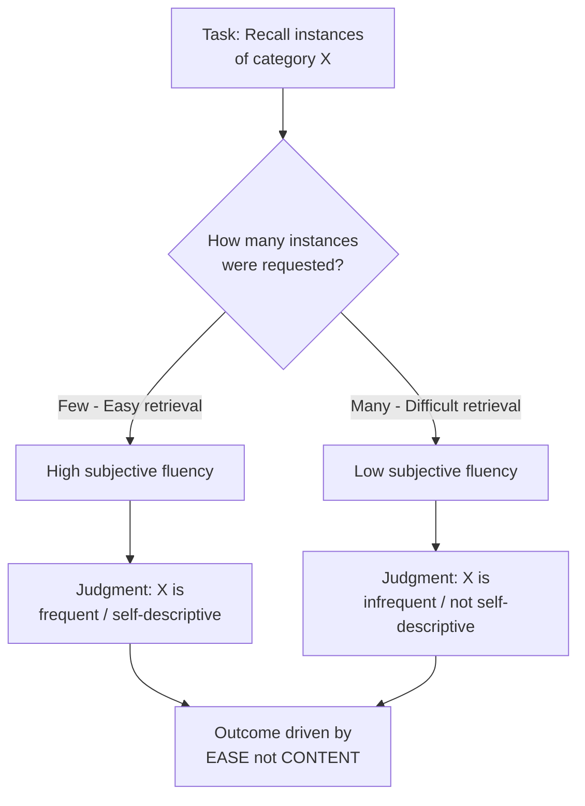

## Availability Heuristic

### Definition

The availability heuristic is a cognitive shortcut in which people judge the frequency, probability, or likelihood of an event based on the ease with which relevant instances or associations come to mind, rather than on actual statistical base rates (Tversky & Kahneman, 1973). Ease of retrieval is used as a proxy for actual frequency.

### Theoretical Origins

Introduced by Amos Tversky and Daniel Kahneman as part of their broader heuristics-and-biases research program (1970s), alongside the representativeness and anchoring-and-adjustment heuristics. The availability heuristic was originally framed as an adaptive shortcut: in most natural environments, frequent events genuinely are easier to recall than rare ones, so the heuristic is usually reasonably accurate. Systematic errors arise when ease of retrieval is dissociated from actual frequency.

### Core Mechanism

$$P(event)_{estimated} \propto Ease\ of\ Retrieval$$

Two distinct sub-processes have been identified in later research (Schwarz et al., 1991):

1. **Content-based availability**: Judgments based on the *number* or *content* of examples that come to mind.
2. **Experiential/metacognitive availability**: Judgments based on the subjective *ease* or *fluency* of retrieval itself, independent of how many examples are actually retrieved.

These two sub-processes can be experimentally dissociated and can even produce opposite effects, which is a key refinement to the original model.

### Classic Demonstration: The "Ease-of-Retrieval" Paradigm

**Example — Schwarz et al. (1991) Assertiveness Study**

Participants were asked to list either 6 or 12 examples of their own assertive behavior, then rate their own assertiveness.

- Participants asked to list **6** examples (easy task) rated themselves as **more assertive**.
- Participants asked to list **12** examples (difficult task) rated themselves as **less assertive**, despite having generated twice as many actual examples.

This counterintuitive result shows that the subjective *difficulty* of generating examples (metacognitive experience) overrode the *content* of what was generated. When retrieval feels effortful, people infer "if I'm struggling to think of examples, there mustn't be many," discounting the raw content in favor of the fluency signal.

### Classic Demonstration: Letter Frequency Judgment

**Example — Tversky & Kahneman (1973) "K" Study**

Participants judged whether the letter "K" appears more often as the first letter of English words or as the third letter. Most participants judged "K" as first letter to be more frequent, when in fact "K" appears roughly twice as often in the third position. This occurs because words are mentally organized/retrieved by their initial letter (e.g., via memory search strategies that key on onsets), making first-letter examples easier to generate — an artifact of retrieval structure, not actual letter frequency.

### Classic Demonstration: Risk Perception and Media Salience

**Example — Causes of Death Misestimation**

People systematically overestimate the frequency of dramatic, vivid, or heavily media-covered causes of death (tornadoes, homicide, plane crashes, shark attacks) and underestimate common but unremarkable causes (diabetes, stroke, asthma), because vivid events are more heavily reported and more memorable, inflating their subjective availability relative to their true base rates (Lichtenstein et al., 1978; Slovic et al., 1979).

### Factors That Increase Availability (and Bias)

| Factor | Mechanism | Example |
| --- | --- | --- |
| Recency | Recently encountered information is more accessible | Overestimating burglary risk right after hearing about a nearby break-in |
| Vividness/salience | Emotionally striking or sensory-rich events are easier to recall | Overestimating shark attack risk after watching a shark movie |
| Personal experience | Direct experience is more retrievable than statistics | Overestimating car accident risk after witnessing one |
| Media coverage/frequency of exposure | Repeated exposure increases retrieval fluency | Overestimating terrorism risk relative to its base rate |
| Imaginability | Ease of imagining a scenario mimics ease of recalling it | Overestimating the likelihood of a novel disaster after a vivid hypothetical is described |
| Distinctiveness | Unusual or bizarre events stand out in memory | Overestimating the frequency of rare diseases with dramatic symptoms |

### Related Biases Stemming from Availability

- **Illusory correlation**: Overestimating the association between two variables (e.g., a minority group and negative behavior) because co-occurrences of two distinctive events are jointly more memorable (Hamilton & Gifford, 1976).
- **Simulation heuristic**: A related heuristic (Kahneman & Tversky, 1982) where probability judgments are based on how easily a scenario can be mentally simulated or constructed, rather than retrieved from memory — relevant to counterfactual thinking ("it could have happened if only...").
- **False consensus effect**: People overestimate how common their own opinions/behaviors are, partly because their own behavior and like-minded others are more available in memory (Ross, Greene & House, 1977).
- **Hindsight bias**: Availability of the known outcome distorts recall of prior uncertainty.

### Availability Cascades

Kuran and Sunstein (1999) described an **availability cascade**: a self-reinforcing social process in which repeated media/public discussion of a risk increases its perceived availability, which increases public concern, which increases further media coverage, creating a feedback loop that can substantially distort collective risk perception independent of the underlying actual risk level. [Inference] This macro-level extension applies the individual-level cognitive heuristic to collective/social dynamics and is more speculative/interpretive than the tightly controlled lab paradigms above.

### Moderators and Boundary Conditions

1. **Attribution of difficulty**: If people can attribute retrieval difficulty to an external cause (e.g., "this task is just hard because of the font used," or mood, or fatigue) rather than to the content itself, the ease-of-retrieval effect is attenuated (Schwarz et al., 1991; Wänke, Bohner & Jurkowitsch, 1997 — the "used car" study).
2. **Processing motivation/expertise**: Experts relying on domain knowledge (content-based judgment) are less susceptible to the fluency-based version of the effect than novices in some paradigms, though not immune to content-based availability effects.
3. **Need for cognition**: Higher NFC individuals are somewhat more likely to scrutinize and discount misleading ease-of-retrieval cues.
4. **Processing goals**: When accuracy motivation is high and time/resources allow correction (cf. dual-process models), people can partially override availability-based judgments with base-rate information, though full correction is rare (base-rate neglect is itself a robust, separate bias).

### Distinguishing Availability from Related Heuristics

| Heuristic | Basis of Judgment |
| --- | --- |
| Availability | Ease of retrieving/imagining instances |
| Representativeness | Similarity to a prototype or category stereotype |
| Anchoring and adjustment | Insufficient adjustment from an initial reference value |
| Affect heuristic | Reliance on immediate emotional reaction (Slovic et al., 2002) |

[Inference] These heuristics are frequently discussed as conceptually distinct but are not always cleanly separable in a given judgment — a single decision can plausibly involve availability, affect, and representativeness simultaneously, and disentangling their independent contributions experimentally is nontrivial.

### Real-World and Applied Implications

- **Risk communication and public policy**: Disaster preparedness campaigns must account for the fact that low-probability, high-vividness risks (terrorism) tend to be overweighted relative to high-probability, low-vividness risks (heart disease), complicating resource allocation debates.
- **Medical diagnosis**: Physicians may over-diagnose conditions they have recently encountered or that were memorably discussed in training/rounds (availability bias in clinical judgment; Redelmeier, 2005 discusses related cognitive biases in medicine).
- **Legal/juror judgment**: Jurors may overweight vivid, easily imagined scenarios of a crime (e.g., a dramatically narrated version of events) over more mundane, statistically likely explanations.
- **Financial decision-making**: Investors often overweight recent, salient market events (a recent crash) in forecasting future risk, contributing to phenomena like recency-driven panic selling or bubble formation.
- **Self-assessment and consumer judgment**: Marketing and self-help exercises that ask people to generate reasons or examples can backfire if the requested number is too high, producing a paradoxical *decrease* in confidence or preference (relevant to survey design and persuasion campaign design).

### Methodological Note on Measuring Availability Effects

Researchers separate the two components experimentally by manipulating:

- **Number of items requested** (to vary ease of retrieval while holding actual content generation potential constant) — isolates the *experiential* route.
- **Content of items retrieved** (holding number/ease constant, varying qualitative content) — isolates the *content-based* route.

[Unverified] The precise boundary conditions under which one route dominates over the other in naturalistic (non-lab) settings remain an active area of study, and effect sizes reported across replications of the classic assertiveness paradigm have varied.

### Related Topics

- Representativeness heuristic
- Anchoring and adjustment heuristic
- Affect heuristic
- Illusory correlation and stereotype formation
- Base-rate neglect
- Hindsight bias
- Risk perception and psychometric paradigm (Slovic)
- Dual-process models (System 1 heuristic processing)
- Metacognitive experiences and processing fluency
- Availability cascades and media effects on public opinion