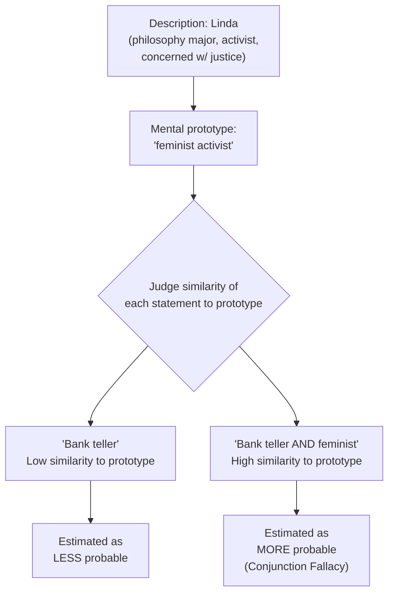

## Representativeness Heuristic

### Definition

The representativeness heuristic is a cognitive shortcut in which people judge the probability that an object, person, or event belongs to a category based on how closely it resembles (matches) the typical or prototypical features of that category, rather than on actual statistical considerations such as base rates, sample size, or regression to the mean (Kahneman & Tversky, 1972). Similarity substitutes for probability.

### Theoretical Origins

Developed by Amos Tversky and Daniel Kahneman as part of the heuristics-and-biases research program, formally introduced in "Subjective Probability: A Judgment of Representativeness" (1972) and elaborated in subsequent work throughout the 1970s–1980s. The heuristic is often described as reflecting a more general tendency to answer a hard question (What is the probability that A belongs to B?) by substituting an easier question (How similar is A to my mental representation of B?) — a mechanism later generalized by Kahneman (2003) as "attribute substitution."

### Core Mechanism

$$P(A \mid B)_{estimated} \propto Similarity(A, prototype_B)$$

Judgments are anchored to a mental prototype or stereotype of the category, and the perceived fit between the target and that prototype drives the probability estimate, often to the neglect of statistically relevant information.

### Classic Demonstration: The "Linda Problem" (Conjunction Fallacy)

**Example — Tversky & Kahneman (1983)**

Participants read a description of "Linda": 31 years old, single, outspoken, and very bright; majored in philosophy; concerned with discrimination and social justice; participated in anti-nuclear demonstrations. Participants then ranked the probability of various statements, including:

- (a) "Linda is a bank teller."
- (b) "Linda is a bank teller and is active in the feminist movement."

A majority of participants ranked (b) as *more* probable than (a), violating the conjunction rule of probability (the probability of two events co-occurring can never exceed the probability of either event alone: $P(A \cap B) \leq P(A)$). This occurs because the conjunction "bank teller + feminist" is more *representative* of the personality description than "bank teller" alone, even though it is logically less probable.

### Classic Demonstration: Base-Rate Neglect

**Example — Kahneman & Tversky (1973) "Engineer/Lawyer" Study**

Participants were told a description was randomly drawn from a pool of 100 individuals, described either as containing 70 engineers and 30 lawyers, or 30 engineers and 70 lawyers. Given a neutral or stereotype-consistent personality sketch (e.g., "Jack enjoys carpentry, sailing, and mathematical puzzles"), participants' probability judgments that the described person was an engineer barely differed between the two base-rate conditions — they relied almost entirely on how well the description matched their engineer/lawyer stereotype, largely ignoring the stated prior probabilities. When no individuating description was given at all, participants correctly used the base rates, showing that base-rate neglect specifically occurs when representativeness-triggering information is present and displaces the base rate rather than being combined with it via Bayesian updating.

$$P(H \mid D) = \frac{P(D \mid H)P(H)}{P(D)}$$

Correct Bayesian reasoning weights both the likelihood of the description given the hypothesis and the prior probability (base rate) of the hypothesis; representativeness-based judgment effectively sets $P(H)$ (the base rate) aside in favor of $P(D \mid H)$-like similarity judgments alone.

### Classic Demonstration: Insensitivity to Sample Size

**Example — The "Hospital Problem" (Kahneman & Tversky, 1972)**

Participants were told of a larger hospital (45 births/day) and a smaller hospital (15 births/day), and asked which hospital would record more days on which over 60% of babies born were boys. Statistically, the smaller hospital should show more such days, because smaller samples have higher variance around the true population proportion (50%). Most participants judged the two hospitals as equally likely (or misjudged the direction), because both scenarios were seen as equally "representative" of a chance process, ignoring the law of large numbers/sample-size effects on variability.

### Classic Demonstration: Gambler's Fallacy and Misperception of Randomness

The belief that a sequence like H-T-H-T-H-T is "more random" or "more likely" than H-H-H-T-T-T, or that a coin is "due" for tails after a run of heads, reflects representativeness: people expect even short local sequences to represent the properties of a truly random long-run process (local representativeness), when in fact each independent flip retains a 50/50 probability regardless of history.

### Classic Demonstration: Regression to the Mean Neglect

**Example — Flight Instructor Study (Kahneman & Tversky, 1973)**

Israeli flight instructors observed that trainees praised after an unusually good landing tended to perform worse on the next attempt, while trainees criticized after an unusually poor landing tended to perform better next time. Instructors concluded that punishment works better than praise. This is a statistical artifact of regression to the mean (extreme performances are partly due to chance/noise and tend to be followed by more average performances regardless of any intervention), but the representativeness heuristic — expecting outcomes to "represent" (be causally consistent with) the preceding feedback — obscures the underlying statistical explanation.

### Sub-Components and Related Errors

| Phenomenon | Description |
| --- | --- |
| Conjunction fallacy | Judging a conjunction of two events as more probable than one of its constituents |
| Base-rate neglect | Ignoring prior probability information in favor of individuating, stereotype-matching information |
| Insensitivity to sample size | Failing to account for the effect of sample size on the variability of outcomes |
| Misconceptions of chance | Expecting random sequences to "look random" locally (gambler's fallacy) |
| Insensitivity to predictability | Making confident predictions based on descriptions with low actual predictive validity, as long as they are internally representative/coherent |
| Illusion of validity | Unwarranted confidence in predictions due to a good fit between input and predicted outcome, even when the input has low actual diagnostic validity |
| Misconceptions of regression | Failing to anticipate or correctly explain the statistical phenomenon of regression to the mean |

### Boundary Conditions and Debiasing

1. **Explicit statistical training**: People trained in statistics show reduced (but not eliminated) susceptibility to base-rate neglect and the conjunction fallacy in some studies, though training often fails to transfer to novel, real-world-framed problems.
2. **Frequency framing**: Presenting problems in terms of natural frequencies ("100 out of 1,000 people...") rather than single-event probabilities ("there is a 10% chance...") substantially reduces conjunction fallacy and base-rate neglect rates (Gigerenzer & Hoffrage, 1995), suggesting the human cognitive system is better adapted to frequency formats than abstract probability formats. [Inference] This finding has been interpreted by some (Gigerenzer) as evidence that apparent "irrationality" is partly a format artifact rather than a deep reasoning flaw, a position that remains debated against the original heuristics-and-biases interpretation.
3. **Explicit relevance of base rates**: When base-rate information is made causally relevant (e.g., framed as reflecting an underlying causal mechanism rather than merely a statistical artifact of sampling), it is weighted more heavily (Ajzen, 1977).
4. **Accountability and motivation**: Increased accountability for judgment accuracy modestly reduces (but does not eliminate) reliance on representativeness in some studies.

### Distinguishing Representativeness from Related Heuristics

| Heuristic | Basis of Judgment | Example Error Produced |
| --- | --- | --- |
| Representativeness | Similarity to a prototype/category | Conjunction fallacy, base-rate neglect |
| Availability | Ease of retrieval from memory | Overestimating vivid/salient event frequency |
| Anchoring and adjustment | Insufficient adjustment from an initial value | Underadjusted numeric estimates |

[Inference] In practice, a single judgment task can implicate multiple heuristics simultaneously (e.g., the Linda problem could partly involve availability of vivid feminist-activist exemplars as well as pure similarity matching); the clean separations in textbook tables are useful for teaching but understate real-world overlap.

### Real-World and Applied Implications

- **Clinical and diagnostic judgment**: Clinicians may over-rely on how well a patient's presentation matches a prototypical case of a disorder, underweighting the base rate (prevalence) of that disorder in the relevant population, a documented contributor to diagnostic error.
- **Legal judgment and profiling**: Reliance on how well a suspect matches a stereotypical "criminal profile" can lead to base-rate neglect regarding the actual population of people fitting superficial descriptive features.
- **Financial forecasting**: Investors may judge a company as a "great investment" based on how well its narrative fits a prototype of a successful company (representativeness), while neglecting base rates of business failure or statistical regression in past performance (hot-hand-style fallacies in fund manager selection).
- **Personnel selection**: Hiring decisions based on how well a candidate's interview presentation matches a prototype of a "good employee," neglecting the generally low predictive validity of unstructured interviews relative to structured, statistically validated assessments.
- **Stereotyping and social categorization**: Representativeness is a core cognitive mechanism underlying social stereotyping — group membership judgments are made based on fit to a group prototype, often overriding base-rate or individuating information (link to social cognition and prejudice literatures).

### Relationship to Dual-Process Models

[Inference] Representativeness is typically classified as a System 1 (automatic, heuristic) process in dual-process frameworks; corrective, statistically informed reasoning (Bayesian updating, accounting for sample size) is classified as System 2 (controlled, systematic). Empirical debiasing results (e.g., frequency framing effects) suggest the boundary between "heuristic error" and "correct reasoning" is partly a function of how the problem is represented to the reasoner, not solely a fixed property of the underlying cognitive system.

### Related Topics

- Availability heuristic
- Anchoring and adjustment heuristic
- Conjunction fallacy and probability judgment
- Base-rate neglect and Bayesian reasoning
- Regression to the mean and its misinterpretation
- Illusion of validity
- Dual-process models: automatic versus controlled processing
- Stereotyping and social category-based judgment
- Frequency formats and natural sampling (Gigerenzer)
- Heuristics-and-biases research program (Kahneman & Tversky)