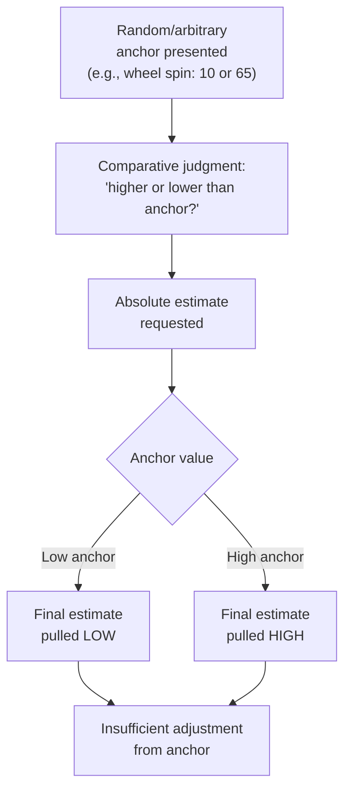

## Anchoring and Adjustment

### Definition

Anchoring and adjustment is a cognitive heuristic in which people form numerical or evaluative estimates by starting from an initial reference point (the "anchor") and then adjusting away from it to reach a final judgment — but the adjustment is typically insufficient, causing the final estimate to remain biased toward the original anchor (Tversky & Kahneman, 1974). The anchor can be self-generated, externally provided, and even entirely arbitrary or irrelevant to the judgment at hand.

### Theoretical Origins

Introduced by Amos Tversky and Daniel Kahneman in "Judgment under Uncertainty: Heuristics and Biases" (Science, 1974) as the third major heuristic alongside representativeness and availability. Originally framed as an insufficient-adjustment process — people find a plausible starting value, then move away from it, stopping too early because further adjustment feels effortful. Later research substantially revised and expanded this mechanistic account.

### Core Mechanism (Original Adjustment Account)

$$Final\ Estimate = Anchor + \Delta_{adjustment}$$

Where $\Delta_{adjustment}$ is systematically too small, leaving the final estimate closer to the anchor than warranted by the actual evidence.

### Classic Demonstration: The Wheel-of-Fortune Study

**Example — Tversky & Kahneman (1974)**

Participants spun a wheel rigged to stop at either 10 or 65, then were asked whether the percentage of African nations in the United Nations was higher or lower than that number, and finally to estimate the actual percentage. Median estimates were 25% for participants who saw the anchor 10, versus 45% for participants who saw the anchor 65 — despite the anchor being generated by an obviously random, irrelevant wheel spin. This demonstrated that anchoring effects occur even when the anchor is explicitly known to carry no informational value.

### Classic Demonstration: Sequential Multiplication Estimation

**Example — Tversky & Kahneman (1974)**

Participants given 5 seconds to estimate the product of $1 \times 2 \times 3 \times 4 \times 5 \times 6 \times 7 \times 8$ gave a median estimate of 512, while participants given the same numbers in descending order ($8 \times 7 \times 6 \times 5 \times 4 \times 3 \times 2 \times 1$) gave a median estimate of 2,250 (correct answer: 40,320). Both groups anchored on the product of the first few numbers computed mentally under time pressure, and the ascending sequence produced a smaller initial partial product, yielding a lower anchor and a lower final estimate.

### Two Distinct Mechanisms: Anchoring-and-Adjustment vs. Anchor-Consistent Activation

Subsequent research (particularly Epley & Gilovich, 2001, 2006; Mussweiler & Strack, 1999, 2000) established that anchoring effects arise from at least two distinguishable processes:

| Mechanism | Description | Typical Trigger |
| --- | --- | --- |
| **Insufficient adjustment** | Deliberate, effortful movement away from a self-generated anchor, stopped too early | Self-generated anchors (e.g., "I know the freezing point of water is 32°F, so...") |
| **Anchor-consistent selective accessibility** | The anchor value activates anchor-consistent information in memory, which is then used (often automatically) to construct the final judgment | Externally provided anchors (e.g., experimenter-given numbers) |

[Inference] This two-mechanism account is now generally treated as more accurate than the original single-process "adjustment" story, since the two routes produce different empirical signatures — for instance, insufficient adjustment is more effortful and more disrupted by cognitive load, while selective accessibility can operate with minimal effort and even outside awareness.

### Distinguishing Self-Generated vs. Externally Provided Anchors

**Example — Epley & Gilovich (2001)**

For self-generated anchors (e.g., estimating the boiling point of water on a mountain by starting from the known sea-level value of 212°F and adjusting downward for altitude), cognitive load and time pressure *increase* anchoring bias, consistent with adjustment being an effortful process that gets curtailed under load. For experimenter-provided anchors, cognitive load has comparatively little additional effect, consistent with the accessibility mechanism operating with lower effort.

### Subliminal and Incidental Anchoring

Anchoring effects have been demonstrated even when the anchor is presented outside conscious awareness or is entirely incidental to the judgment task (e.g., Wilson et al., 1996, showing effects from anchors participants explicitly rated as unhelpful or irrelevant; Critcher & Gilovich, 2008, on incidental environmental numbers such as a jersey number influencing unrelated estimates). [Inference] These findings suggest the phenomenon extends beyond a purely deliberate "adjustment" process into more purely associative/priming-like activation, aligning with the selective-accessibility account.

### Real-Estate Anchoring Studies

**Example — Northcraft & Neale (1987)**

Both amateur and professional real-estate agents were shown the same house and given a listing price that varied experimentally (anchor manipulation), then asked to appraise the property's value. Both groups' appraisals were significantly influenced by the arbitrary listing price anchor, despite agents' claims that they relied primarily on objective property characteristics and did not use the listing price in their reasoning — demonstrating that domain expertise does not eliminate anchoring susceptibility, and that people are often unaware of the anchor's influence on their own judgment.

### Moderators of Anchoring Effects

1. **Cognitive load**: Increases anchoring for self-generated/adjustment-based anchors; has weaker or inconsistent effects on accessibility-based anchoring from externally provided anchors.
2. **Expertise**: Reduces but does not eliminate anchoring (Northcraft & Neale, 1987); experts may show smaller absolute bias but remain measurably influenced.
3. **Anchor extremity/plausibility**: Extremely implausible anchors can sometimes produce *smaller* adjustment-based bias (because they trigger more deliberate rejection) but can still produce accessibility-based effects (Strack & Mussweiler, 1997), showing dissociation between the two mechanisms depending on plausibility.
4. **Incentives for accuracy**: Monetary incentives for accurate judgment modestly reduce anchoring in some studies but do not eliminate it (Wright & Anderson, 1989; results are mixed across paradigms).
5. **Warning about the anchoring effect**: Explicitly warning participants about anchoring bias produces limited reduction in effect size, and complete debiasing is rarely achieved.
6. **Mood**: Some evidence suggests positive mood is associated with more heuristic, less effortful adjustment (consistent with dual-process accounts of mood and processing style), though this moderator is less robustly established than cognitive load effects. [Unverified]

### Anchoring in Applied Domains

- **Negotiation**: The first offer in a negotiation often functions as a powerful anchor, disproportionately influencing the final settlement point (Galinsky & Mussweiler, 2001) — a widely cited applied extension of anchoring theory to bargaining behavior.
- **Judicial sentencing**: Prosecutorial sentencing demands (Englich, Mussweiler & Strack, 2006) have been shown to anchor judges' sentencing decisions even when the demand is presented as arbitrary (e.g., generated by a dice roll in experimental manipulations), raising practical concerns about anchoring in legal decision-making.
- **Consumer pricing**: "Original price" versus "sale price" displays, suggested retail prices, and initial price exposure all function as anchors shaping willingness-to-pay judgments (Ariely, Loewenstein & Prelec, 2003, on "coherent arbitrariness" showing that initial arbitrary anchors can durably shape subsequent valuations of unrelated goods).
- **Salary negotiation**: The first number mentioned in a salary discussion tends to anchor the final negotiated figure, a frequently cited practical implication in negotiation training and career advice literature. [Inference] While the underlying anchoring mechanism is well-supported, specific numeric claims about "how much" first offers shift outcomes in real-world salary negotiations vary by study and context and should be treated as illustrative rather than precise.
- **Financial forecasting and stock valuation**: Analysts' and investors' estimates of "fair value" can be anchored to a stock's recent historical price or a prior target price, potentially slowing appropriate updating in response to new information (a proposed contributor to underreaction phenomena in behavioral finance; [Inference] the precise causal contribution of anchoring versus other behavioral finance mechanisms in any given market episode is difficult to isolate empirically).

### Anchoring and the Conversational/Comparative Judgment Format

Mussweiler and Strack's **selective accessibility model** proposes that anchoring effects are amplified by the standard two-step experimental procedure (comparative judgment: "is X higher or lower than the anchor?", followed by absolute judgment: "what is X?"). The initial comparative question prompts a hypothesis-testing-like search for anchor-consistent evidence in memory, which then biases the subsequent absolute estimate. [Inference] This procedural detail suggests anchoring magnitude may partly be an artifact of common experimental designs, though anchoring effects have also been documented in single-judgment (non-comparative) paradigms, indicating the phenomenon is not solely a procedural artifact.

### Distinguishing Anchoring from Related Heuristics

| Heuristic | Basis of Judgment |
| --- | --- |
| Anchoring and adjustment | Insufficient movement away from an initial reference value, or activation of anchor-consistent information |
| Representativeness | Similarity to a category prototype |
| Availability | Ease of retrieving relevant instances from memory |

### Relationship to Dual-Process Models

[Inference] Anchoring is often situated within dual-process frameworks as involving both System 1 components (automatic, accessibility-driven anchor effects; effortless activation of anchor-consistent information) and System 2 components (deliberate, effortful adjustment from self-generated anchors). This makes anchoring somewhat unusual among the classic heuristics in that it does not map cleanly onto a single system, which is part of why the two-mechanism account (adjustment vs. selective accessibility) gained traction as a refinement of the original unified model.

### Real-World and Applied Implications (Summary)

- **Negotiation strategy**: Awareness of anchoring effects informs advice to make the first offer in negotiations where one has reasonable information, and to consciously counter-anchor against extreme opening offers from a counterpart.
- **Survey and questionnaire design**: Response scale endpoints and example values provided in survey instructions can anchor respondents' self-reports, a documented concern in survey methodology.
- **Policy and legal reform**: Awareness of judicial anchoring effects has informed some proposals for structured sentencing guidelines intended to reduce the influence of arbitrary anchors (e.g., prosecutorial demands) on outcomes.
- **Retail and pricing strategy**: Businesses deliberately set anchors (e.g., a high "manufacturer's suggested retail price") to shift consumer valuation of subsequent discounted prices.

### Related Topics

- Representativeness heuristic
- Availability heuristic
- Selective accessibility model (Mussweiler & Strack)
- Dual-process models: automatic versus controlled processing
- Framing effects and prospect theory
- Negotiation and first-offer effects
- Behavioral finance and investor judgment biases
- Heuristics-and-biases research program (Kahneman & Tversky)
- Priming and incidental environmental cues
- Coherent arbitrariness (Ariely, Loewenstein & Prelec)